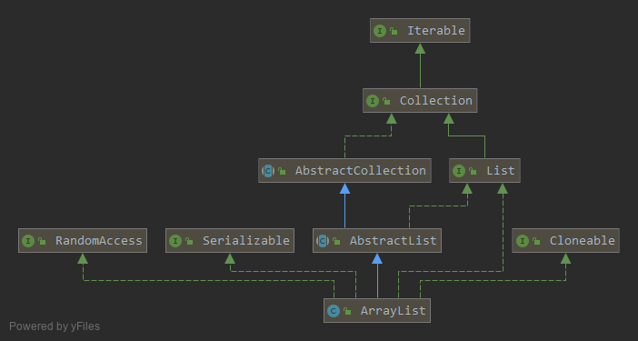
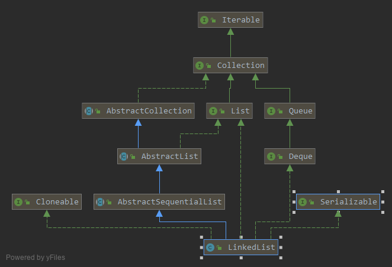
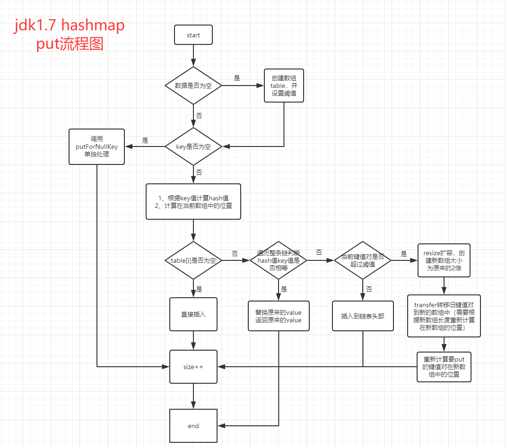
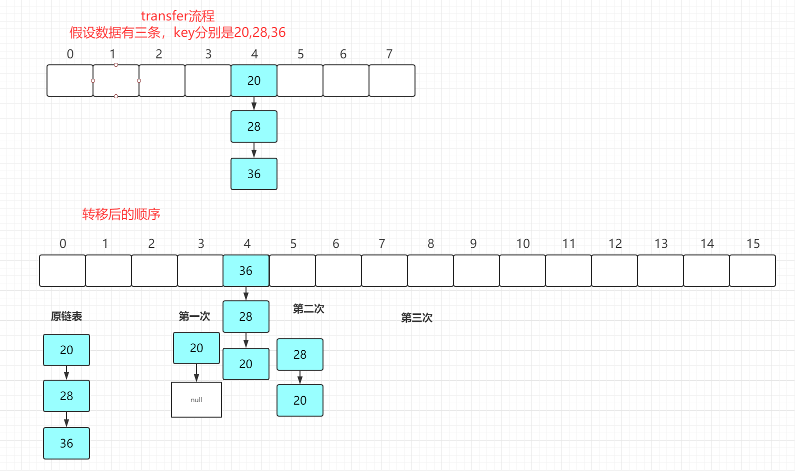
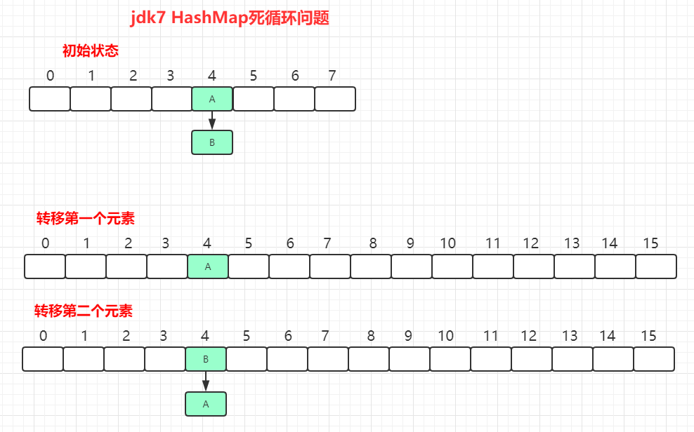
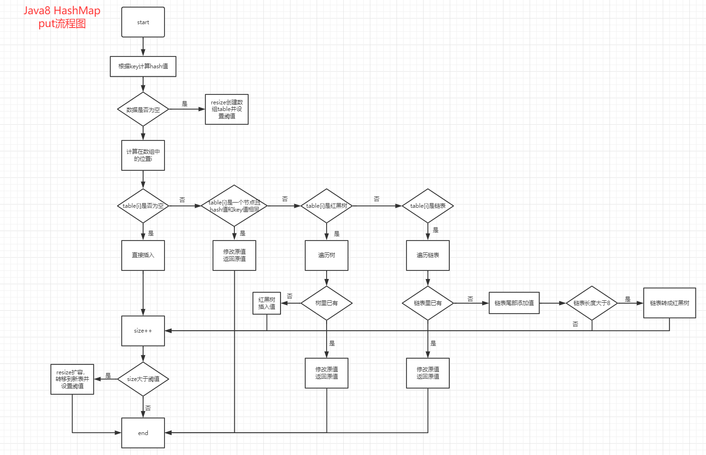
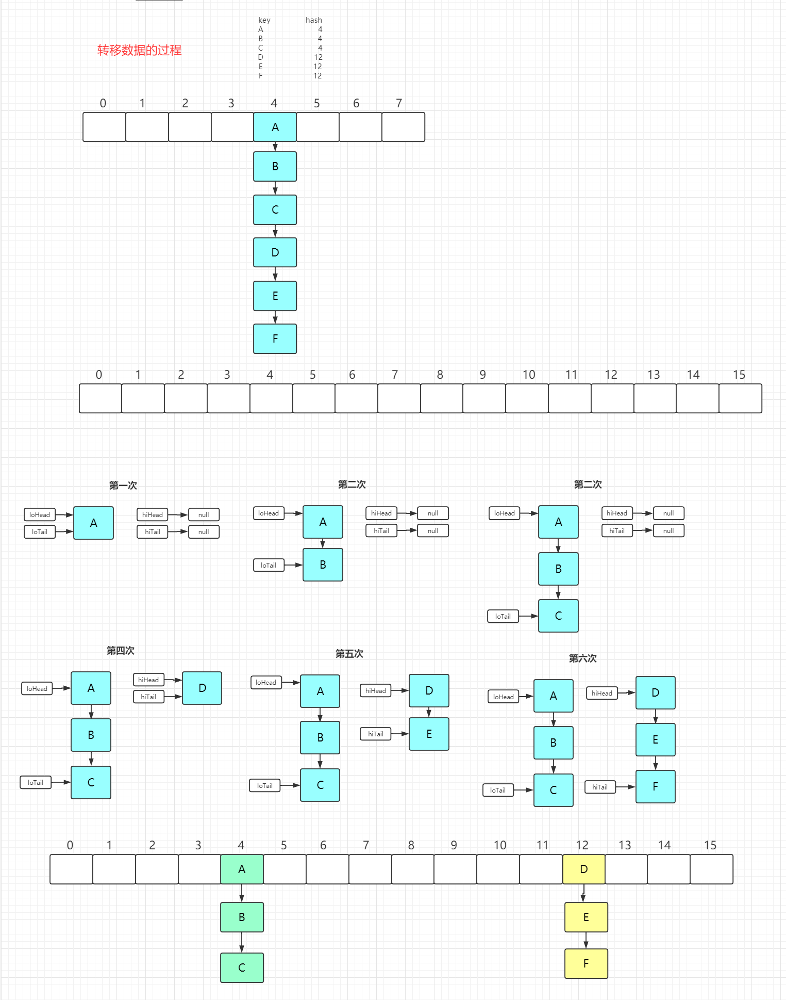
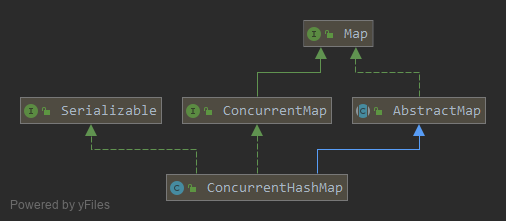
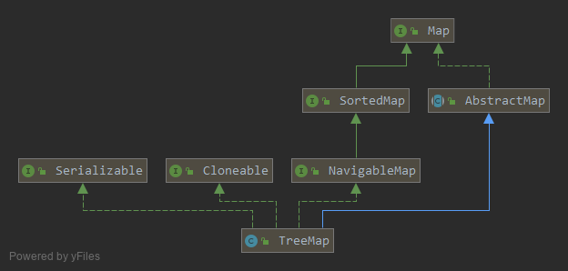
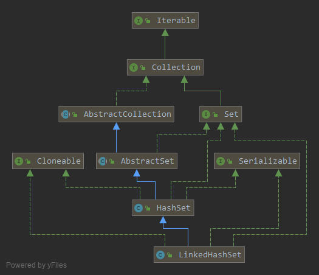

# java基础

## 特殊关键字解释

| 关键字                            | 描述                                                         |
| --------------------------------- | ------------------------------------------------------------ |
| default                           | 默认，1.用在switch语句中，表明一个默认的分支；2.接口的默认实现 |
| do                                | 用在do-while循环结构中                                       |
| const                             | 保留关键字，没有具体含义                                     |
| goto                              | 保留关键字，没有具体含义                                     |
| instanceof                        | 用来测试一个对象是否是指定类型的实例对象                     |
| native                            | 用来声明一个方法是由与计算机相关的语言（如C/C++/FORTRAN语言）实现的 |
| transient                         | 声明不用序列化的成员域                                       |
| volatile                          | 内存屏障：1.保证不同线程之间的可见性（引用类型除外）；2.禁止指令重排序 |
| <font color="red">strictfp</font> | <font color="red">strictfp 关键字可应用于类、接口或方法。使用 strictfp 关键字声明一个方法时，该方法中所有的float和double表达式都严格遵守FP-strict的限制，符合IEEE-754规范。当对一个类或接口使用 strictfp 关键字时，该类中的所有代码，包括嵌套类型中的初始设定值和代码，都将严格地进行计算。严格约束意味着所有表达式的结果都必须是 IEEE 754 算法对操作数预期的结果，以单精度和双精度格式表示。如果你想让你的浮点运算更加精确，而且不会因为不同的硬件平台所执行的结果不一致的话，可以用关键字strictfp。</font> |

## Lambda表达式中，常用的接口

### Supplier：没有输入，一个输出

### Consumer：一个输入，没有输出

### BiConsumer：两个输入，没有输出

### Function：一个输入，一个输出

### BiFunction：两个输入，一个输出

## java集合

### ArrayList

#### 类继承关系图



```java
// 用指定的初始容量构造一个空列表
public ArrayList(int initialCapacity) {
    if (initialCapacity > 0) {
        this.elementData = new Object[initialCapacity];
    } else if (initialCapacity == 0) {
        this.elementData = EMPTY_ELEMENTDATA;
    } else {
        throw new IllegalArgumentException("Illegal Capacity: "  initialCapacity);
    }
}
// 构造一个初始容量为10的空列表
public ArrayList() {
    this.elementData = DEFAULTCAPACITY_EMPTY_ELEMENTDATA;
}
// 返回初始化容量
private static int calculateCapacity(Object[] elementData, int minCapacity) {
    if (elementData == DEFAULTCAPACITY_EMPTY_ELEMENTDATA) {
        return Math.max(DEFAULT_CAPACITY, minCapacity);
    }
    return minCapacity;
}
```

#### 特点

1. 数据结构采用的是数组集合

2. 在不指定初始容量的时候，默认初始容量为10

3. 当数组长度不够时，会自动触发扩容（当数据的长度大于数组的长度时会自动触发扩容机制）：

   ```java
   //扩容方法
   private void grow(int minCapacity) {
       // overflow-conscious code
       int oldCapacity = elementData.length;
       //oldCapacity >> 1 右移运算符 原来长度的一半 再加上原长度
       int newCapacity = oldCapacity + (oldCapacity >> 1);
       if (newCapacity - minCapacity < 0)
           newCapacity = minCapacity;
       if (newCapacity - MAX_ARRAY_SIZE > 0)
           newCapacity = hugeCapacity(minCapacity);
       // minCapacity is usually close to size, so this is a win:
       elementData = Arrays.copyOf(elementData, newCapacity);
   }
   ```

   扩容是原来的数组长度的1.5倍，扩容之后就是把老数组的数据 copy 到新数组中。

4. 遍历删除时，应使用 listIterator() 迭代器进行，同时使用 iterator.remove() 方法进行删除。

### LinkedList

#### 类继承关系图



#### 特点

1. 基于链表的据结构，双向链表。
4. 会随着数据量的变化而变化。

### Vector

#### 类继承关系图


```java
// 构造一个新对象，指定初始化容量、容量增加的值（如果这个值大于0，则每次扩容这个数据量，否则扩容到原来的两倍）
public Vector(int initialCapacity, int capacityIncrement) {
    super();
    if (initialCapacity < 0)
        throw new IllegalArgumentException("Illegal Capacity: "+
                                           initialCapacity);
    this.elementData = new Object[initialCapacity];
    this.capacityIncrement = capacityIncrement;
}
// 构造一个新对象，指定初始化容量、容量增加的值默认为0（每次成倍的扩容）
public Vector(int initialCapacity) {
    this(initialCapacity, 0);
}
// 构造一个新对象，默认初始化容量：10；容量增加的值默认为0（每次成倍的扩容）
public Vector() {
    this(10);
}
// 构造包含传入集合的对象；由于成员变量capacityIncrement为int类型，所以默认值为0
public Vector(Collection<? extends E> c) {
    elementData = c.toArray();
    elementCount = elementData.length;
    // c.toArray might (incorrectly) not return Object[] (see 6260652)
    if (elementData.getClass() != Object[].class)
        elementData = Arrays.copyOf(elementData, elementCount, Object[].class);
}
```

#### 特点

1. 是线程安全的，与操作元素相关的方法都加上了锁，但是性能较低。

2. 在不指定初始容量的时候，默认初始容量为10。

3. 集合的本质依然是数组，当数组长度不够时，会自动触发扩容（当数据的长度大于数组的长度时会自动触发扩容机制）：

   ```java
   // 当capacityIncrement大于0的时候，新容量=oldCapacity+oldCapacity，故容量翻倍
   int newCapacity = oldCapacity + ((capacityIncrement > 0) ?
                                    capacityIncrement : oldCapacity);
   ```

   扩容是原来的数组长度的2倍，扩容之后就是把老数组的数据 copy 到新数组中。

### Stack

#### 类继承关系图


#### 特点

1. 从Vector继承而来，故拥有Vector的一切特性
3. pop() 会弹出栈顶元素并返回栈顶的值，
4. peek() 只是获取栈顶的值，但是并不会把元素从栈顶弹出来

### HashTable

#### 类继承关系图


```java
// 构造一个新对象，同时指定初始化容量和负载因子
public Hashtable(int initialCapacity, float loadFactor) {
    if (initialCapacity < 0)
        throw new IllegalArgumentException("Illegal Capacity: "+initialCapacity);
    if (loadFactor <= 0 || Float.isNaN(loadFactor))
        throw new IllegalArgumentException("Illegal Load: "+loadFactor);

    if (initialCapacity==0)
        initialCapacity = 1;
    this.loadFactor = loadFactor;
    table = new Entry<?,?>[initialCapacity];
    threshold = (int)Math.min(initialCapacity * loadFactor, MAX_ARRAY_SIZE + 1);
}
// 构造一个新对象，指定初始化容量，负载因子默认为：0.75
public Hashtable(int initialCapacity) {
    this(initialCapacity, 0.75f);
}
// 构造一个新对象，默认初始化容量为：11， 负载因子默认为：0.75
public Hashtable() {
    this(11, 0.75f);
}
//构造一个包含elements的集合，初始化容量为：集合长度*2 和 11之间的最大值，负载因子默认为：0.75
public Hashtable(Map<? extends K, ? extends V> t) {
    this(Math.max(2*t.size(), 11), 0.75f);
    putAll(t);
}
```

#### 特点

1. 数据结构是：数组+单项链表
2. 负载因子：默认0.75，也可以自己指定。当数组的长度 = 容量 * 负载因子的时候，就开始扩容操作。
3. 容量可以为任意整数，最小值为1
4. 是线程安全的，与操作元素相关的方法都加上了锁，但是性能较低。
5. key 和 value 都不许为空，若为空，则抛出空指针异常

### HashMap

#### 类继承关系图


```java
// 构造一个新对象，同时指定初始化容量和负载因子
public HashMap(int initialCapacity, float loadFactor) {
    if (initialCapacity < 0)
        throw new IllegalArgumentException("Illegal initial capacity: " +initialCapacity);
    if (initialCapacity > MAXIMUM_CAPACITY)
        initialCapacity = MAXIMUM_CAPACITY;
    if (loadFactor <= 0 || Float.isNaN(loadFactor))
        throw new IllegalArgumentException("Illegal load factor: " +loadFactor);
    this.loadFactor = loadFactor;
    this.threshold = tableSizeFor(initialCapacity);
}
// 构造一个新对象，指定初始化容量，负载因子默认为：0.75
public HashMap(int initialCapacity) {
    this(initialCapacity, DEFAULT_LOAD_FACTOR);
}
// 构造一个新对象，默认初始化容量为：16， 负载因子默认为：0.75
public HashMap() {
    this.loadFactor = DEFAULT_LOAD_FACTOR; // all other fields defaulted
}
// 构造一个新对象，与指定的Map相同的映射。负载因子默认为：0.75
public HashMap(Map<? extends K, ? extends V> m) {
    this.loadFactor = DEFAULT_LOAD_FACTOR;
    putMapEntries(m, false);
}
```

#### 特点

1. 初始默认容量为16
2. 负载因子默认0.75，也可以自己指定。当数组的长度 = 容量 * 负载因子的时候，就开始扩容操作，扩容到原来的2倍
3. 如果指定了初始容量，会自动转成与其最接近的2的n次幂，所以底层的数组长度时2的n次幂
4. 对key值进行复杂位运算，减少hash碰撞，使数据更加散列
5. 扩容之后涉及到元素的迁移：判断二进制位的前面那一位(因为每次扩容到原来的2倍，二进制只会增加1位)如果是0，则位置保持不变；如果是1，则移动到 原来在数组中的位置+原数组长度 的位置（容量为2的n次幂的第二个原因）

#### 1.7

8. 数据结构是：数组+单项链表

2. hash值计算

   ```java
   // 扰动函数 右移16位让高位参与运算，为了减少hash碰撞的几率
   final int hash(Object k) {
       int h = hashSeed;
       if (0 != h && k instanceof String) {
           return sun.misc.Hashing.stringHash32((String) k);
       }
       h ^= k.hashCode();
       // This function ensures that hashCodes that differ only by
       // constant multiples at each bit position have a bounded
       // number of collisions (approximately 8 at default load factor).
       h ^= (h >>> 20) ^ (h >>> 12);
       return h ^ (h >>> 7) ^ (h >>> 4);
   }
   ```
   
3. put流程

4. 数据迁移操作流程（transfer）：头插法

   ```java
       /**
        * Transfers all entries from current table to newTable.
        */
       void transfer(Entry[] newTable, boolean rehash) {
           int newCapacity = newTable.length;
           for (Entry<K,V> e : table) {
               while(null != e) {
                   Entry<K,V> next = e.next;
                   if (rehash) {
                       e.hash = null == e.key ? 0 : hash(e.key);
                   }
                   int i = indexFor(e.hash, newCapacity);
                   e.next = newTable[i];
                   newTable[i] = e;
                   e = next;
               }
           }
       }
   ```

   

5. 出现死循环的情况

#### 1.8

1. 数据结构是：数组+链表+红黑树

2. 增加一个链表数据长度的阀值：8；当链表的长度超过这个长度时(>=7)，数据结构转为红黑树（根据泊松分布计算得来的）；超过这个值时，红黑树的时间复杂度要比链表的时间复杂度要低很多

3. 转为红黑树后，树的最小容量为64

4. 链表里面存放的数据名称更改为Node，1.7叫Entry

5. hash值计算

   ```java
   // 扰动函数 右移16位让高位参与运算，为了减少hash碰撞的几率
   static final int hash(Object key) {
       int h;
       return (key == null) ? 0 : (h = key.hashCode()) ^ (h >>> 16);
   }
   ```

6. put流程

7. 数据迁移操作流程（transfer）：尾插法；尾插法比头插法更加稳定

   ```java
   final Node<K,V>[] resize() {
       Node<K,V>[] oldTab = table;
       int oldCap = (oldTab == null) ? 0 : oldTab.length;
       int oldThr = threshold;
       int newCap, newThr = 0;
       if (oldCap > 0) {
           if (oldCap >= MAXIMUM_CAPACITY) {
               threshold = Integer.MAX_VALUE;
               return oldTab;
           }
           else if ((newCap = oldCap << 1) < MAXIMUM_CAPACITY &&
                    oldCap >= DEFAULT_INITIAL_CAPACITY)
               newThr = oldThr << 1; // double threshold
       }
       else if (oldThr > 0) // initial capacity was placed in threshold
           newCap = oldThr;
       else {               // zero initial threshold signifies using defaults
           newCap = DEFAULT_INITIAL_CAPACITY;
           newThr = (int)(DEFAULT_LOAD_FACTOR * DEFAULT_INITIAL_CAPACITY);
       }
       if (newThr == 0) {
           float ft = (float)newCap * loadFactor;
           newThr = (newCap < MAXIMUM_CAPACITY && ft < (float)MAXIMUM_CAPACITY ?
                     (int)ft : Integer.MAX_VALUE);
       }
       threshold = newThr;
       @SuppressWarnings({"rawtypes","unchecked"})
       Node<K,V>[] newTab = (Node<K,V>[])new Node[newCap];
       table = newTab;
       if (oldTab != null) {
           for (int j = 0; j < oldCap; ++j) {
               Node<K,V> e;
               if ((e = oldTab[j]) != null) {
                   oldTab[j] = null;
                   if (e.next == null)
                       newTab[e.hash & (newCap - 1)] = e;
                   else if (e instanceof TreeNode)
                       ((TreeNode<K,V>)e).split(this, newTab, j, oldCap);
                   else { // preserve order
                       Node<K,V> loHead = null, loTail = null;
                       Node<K,V> hiHead = null, hiTail = null;
                       Node<K,V> next;
                       do {
                           next = e.next;
                           if ((e.hash & oldCap) == 0) {
                               if (loTail == null)
                                   loHead = e;
                               else
                                   loTail.next = e;
                               loTail = e;
                           }
                           else {
                               if (hiTail == null)
                                   hiHead = e;
                               else
                                   hiTail.next = e;
                               hiTail = e;
                           }
                       } while ((e = next) != null);
                       if (loTail != null) {
                           loTail.next = null;
                           newTab[j] = loHead;
                       }
                       if (hiTail != null) {
                           hiTail.next = null;
                           newTab[j + oldCap] = hiHead;
                       }
                   }
               }
           }
       }
       return newTab;
   }
   ```

   

8. 

### ConcurrentHashMap

#### 类继承关系图



```java
// 构造一个新对象，默认初始化容量为：16
public ConcurrentHashMap() {
}
// 构造一个新对象，指定初始化容量，不需要动态调整大小
public ConcurrentHashMap(int initialCapacity) {
    if (initialCapacity < 0)
        throw new IllegalArgumentException();
    int cap = ((initialCapacity >= (MAXIMUM_CAPACITY >>> 1)) ?
               MAXIMUM_CAPACITY :
               tableSizeFor(initialCapacity + (initialCapacity >>> 1) + 1));
    this.sizeCtl = cap;
}

    /**
     * Creates a new map with the same mappings as the given map.
     *
     * @param m the map
     */
    public ConcurrentHashMap(Map<? extends K, ? extends V> m) {
        this.sizeCtl = DEFAULT_CAPACITY;
        putAll(m);
    }
// 构造一个新对象，同时指定初始化容量和负载因子
public ConcurrentHashMap(int initialCapacity, float loadFactor) {
    this(initialCapacity, loadFactor, 1);
}
// 构造一个新对象，同时指定初始化容量、负载因子、并发线程数
public ConcurrentHashMap(int initialCapacity,
                         float loadFactor, int concurrencyLevel) {
    if (!(loadFactor > 0.0f) || initialCapacity < 0 || concurrencyLevel <= 0)
        throw new IllegalArgumentException();
    if (initialCapacity < concurrencyLevel)   // Use at least as many bins
        initialCapacity = concurrencyLevel;   // as estimated threads
    long size = (long)(1.0 + (long)initialCapacity / loadFactor);
    int cap = (size >= (long)MAXIMUM_CAPACITY) ?
        MAXIMUM_CAPACITY : tableSizeFor((int)size);
    this.sizeCtl = cap;
}
```

#### 特点

1. 同步性能更好，因为它仅仅根据同步级别对Map的一部分进行上锁
2. put流程

### TreeMap

#### 类继承关系图



```java
// 构造一个新的，空的树映射集合，使用key的字典序
public TreeMap() {
    comparator = null;
}
// 构造一个新的，空的树映射集合，同时指定key值的排序比较器。
public TreeMap(Comparator<? super K> comparator) {
    this.comparator = comparator;
}
// 构造了一个包含相同映射的新的树映射，使用key的字典序
public TreeMap(Map<? extends K, ? extends V> m) {
    comparator = null;
    putAll(m);
}
// 构造了一个包含相同映射的新的树映射，使用给定的排序比较器
public TreeMap(SortedMap<K, ? extends V> m) {
    comparator = m.comparator();
    try {
        buildFromSorted(m.size(), m.entrySet().iterator(), null, null);
    } catch (java.io.IOException cannotHappen) {
    } catch (ClassNotFoundException cannotHappen) {
    }
}
```

#### 特点

1. 必须是同一类型的数据（不能两种及以上的数据类型）

#### 1.7

1. 
2. 

#### 1.8

1. 默认的数据结构：基于 [`NavigableMap`](../../java/util/NavigableMap.html)实现红黑树
2. 

ps: 参考红黑树的算法实现

### LinkedHashMap

#### 类继承关系图


```java
// 构造一个新对象，同时指定初始化容量和负载因子
public LinkedHashMap(int initialCapacity, float loadFactor) {
    super(initialCapacity, loadFactor);
    accessOrder = false;
}
// 构造一个新对象，指定初始化容量，负载因子默认为：0.75
public LinkedHashMap(int initialCapacity) {
    super(initialCapacity);
    accessOrder = false;
}
// 构造一个新对象，默认初始化容量为：16， 负载因子默认为：0.75
public LinkedHashMap() {
    super();
    accessOrder = false;
}
// 构造一个新对象，与指定的Map相同的映射；负载因子默认为：0.75和 足以将映射保存在指定容器中的初始容量
public LinkedHashMap(Map<? extends K, ? extends V> m) {
    super();
    accessOrder = false;
    putMapEntries(m, false);
}
// 构造一个新对象，同时指定初始化容量、负载因子、插入的排序顺序标识（默认为fasle，表示要排序；true不排序）
    public LinkedHashMap(int initialCapacity, float loadFactor, boolean accessOrder) {
        super(initialCapacity, loadFactor);
        this.accessOrder = accessOrder;
    }
```

#### 特点

1. 继承HashMap，拥有HashMap的数据结构，
2. LinkedHashMap默认是按照插入的顺序。
3. 

### HashSet

#### 类继承关系图


```java
// 构造一个新对象，默认初始化容量为：16， 负载因子默认为：0.75
public HashSet() {
    map = new HashMap<>();
}
//构造一个包含elements的集合，初始化容量为：集合长度除以0.75 + 1 和 16之间的最大值，负载因子默认为：0.75
public HashSet(Collection<? extends E> c) {
    map = new HashMap<>(Math.max((int) (c.size()/.75f) + 1, 16));
    addAll(c);
}
// 构造一个新对象，同时指定初始化容量和负载因子
public HashSet(int initialCapacity, float loadFactor) {
    map = new HashMap<>(initialCapacity, loadFactor);
}
// 构造一个新对象，指定初始化容量，负载因子默认为：0.75
public HashSet(int initialCapacity) {
    map = new HashMap<>(initialCapacity);
}
```

#### 特点

1. 内部包含一个HashMap，使用HashMap的key保证不允许重复，且只能有一个空值。
2. 通过 hashCode 和 equals 对数据进行相同判定，如果相同就不存进去。
3. 如果放置对象的话，需要重写 hashCode 和 equals 方法，才能够保证属性相同时，只能存储一个。
4. hashCode 相同时，才会判断 eqals，如果 hashCode 不同时，不会调用equals。
5. hashCode 是为了判断放在索引（数组）的哪个位置。
6. 当使用比较器的时候，不会调用equals。

### TreeSet

#### 类继承关系图


```java
// 构造一个新的，空的树映射集合，使用key的字典序
public TreeSet() {
    this(new TreeMap<E,Object>());
}
// 构造一个新的，空的树映射集合，同时指定key值的排序比较器。
public TreeSet(Comparator<? super E> comparator) {
    this(new TreeMap<>(comparator));
}

// 构造了一个包含相同映射的新的树映射，使用key的字典序
public TreeSet(Collection<? extends E> c) {
    this();
    addAll(c);
}
// 构造了一个包含相同映射的新的树映射，使用给定的排序比较器
public TreeSet(SortedSet<E> s) {
    this(s.comparator());
    addAll(s);
}
```

#### 特点

1. 采用二叉树（红黑树）的存储结构，
2. 有序（排序后的升序），
3. 查询速度没有 hashset 快（hashset直接根据索引下标直接定位，treeset需要进行二叉树的查找）。
4. 如果是基本数据类型，会自动比较。
5. 如果是引用类型，需要实现 Comparable 排序比较器；或者传入一个Comparator比较器。
6. 如果外面传了一个比较器，类里面依然有比较器，会自动使用外部的比较器。

### LinkedHashSet

#### 类继承关系图



```java
// 构造一个新对象，同时指定初始化容量和负载因子
public LinkedHashSet(int initialCapacity, float loadFactor) {
    super(initialCapacity, loadFactor, true);
}
// 构造一个新对象，指定初始化容量，负载因子默认为：0.75
public LinkedHashSet(int initialCapacity) {
    super(initialCapacity, .75f, true);
}
// 构造一个新对象，默认初始化容量为：16， 负载因子默认为：0.75
public LinkedHashSet() {
    super(16, .75f, true);
}
//构造一个包含elements的集合，初始化容量为：集合长度*2 和 11之间的最大值，负载因子默认为：0.75
public LinkedHashSet(Collection<? extends E> c) {
    super(Math.max(2*c.size(), 11), .75f, true);
    addAll(c);
}
```

#### 特点

1. 继承hashset，拥有hashset的数据结构
2. 采用哈希表的存储结构

### Collections.synchronizedList

#### 类继承关系图


```java
//传入的集合
SynchronizedCollection(Collection<E> c) {
    this.c = Objects.requireNonNull(c);
    mutex = this;
}
//传入的集合，同步锁对象
SynchronizedCollection(Collection<E> c, Object mutex) {
    this.c = Objects.requireNonNull(c);
    this.mutex = Objects.requireNonNull(mutex);
}
```

#### 特点

1. 使用同步代码块，减少了锁影响的范围
2. listlterator方法并没有做同步处理，所以在遍历的时候，需要手动加锁，所以可以指定锁对象
3. SynchronizedList有很好的扩展和兼容功能, 可以将所有的List子类转成线程安全的类
4. 扩容机制与ArrayList一样

### Collections.synchronizedMap

### Collections.synchronizedSortedMap

### Collections.synchronizedSet

### Collections.synchronizedSortedSet

### Collections.synchronizedCollection
