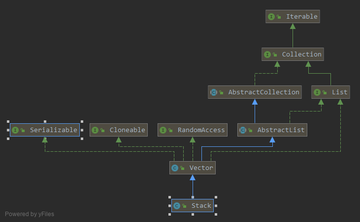
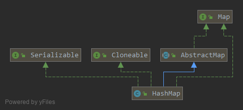
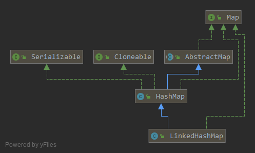
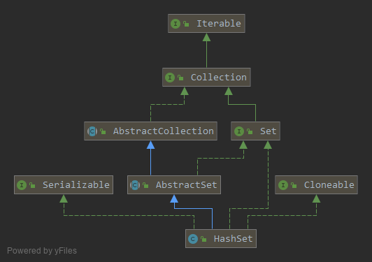
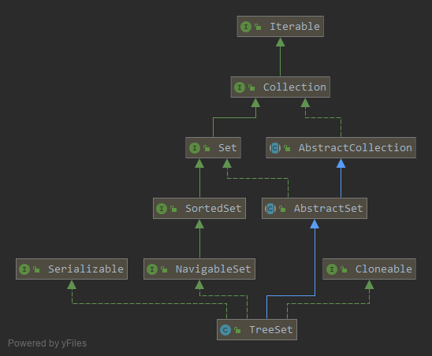

# java基础

## 特殊关键字解释

| 关键字                            | 描述                                                         |
| --------------------------------- | ------------------------------------------------------------ |
| default                           | 默认，1.用在switch语句中，表明一个默认的分支；2.接口的默认实现 |
| do                                | 用在do-while循环结构中                                       |
| const                             | 保留关键字，没有具体含义                                     |
| goto                              | 保留关键字，没有具体含义                                     |
| instanceof                        | 用来测试一个对象是否是指定类型的实例对象                     |
| native                            | 用来声明一个方法是由与计算机相关的语言（如C/C++/FORTRAN语言）实现的 |
| transient                         | 声明不用序列化的成员域                                       |
| volatile                          | 内存屏障：1.保证不同线程之间的可见性（引用类型除外）；2.禁止指令重排序 |
| <font color="red">strictfp</font> | <font color="red">strictfp 关键字可应用于类、接口或方法。使用 strictfp 关键字声明一个方法时，该方法中所有的float和double表达式都严格遵守FP-strict的限制，符合IEEE-754规范。当对一个类或接口使用 strictfp 关键字时，该类中的所有代码，包括嵌套类型中的初始设定值和代码，都将严格地进行计算。严格约束意味着所有表达式的结果都必须是 IEEE 754 算法对操作数预期的结果，以单精度和双精度格式表示。如果你想让你的浮点运算更加精确，而且不会因为不同的硬件平台所执行的结果不一致的话，可以用关键字strictfp。</font> |

## java集合

### ArrayList


```java
// 用指定的初始容量构造一个空列表
public ArrayList(int initialCapacity) {
    if (initialCapacity > 0) {
        this.elementData = new Object[initialCapacity];
    } else if (initialCapacity == 0) {
        this.elementData = EMPTY_ELEMENTDATA;
    } else {
        throw new IllegalArgumentException("Illegal Capacity: "  initialCapacity);
    }
}
// 构造一个初始容量为10的空列表
public ArrayList() {
    this.elementData = DEFAULTCAPACITY_EMPTY_ELEMENTDATA;
}
// 返回初始化容量
private static int calculateCapacity(Object[] elementData, int minCapacity) {
    if (elementData == DEFAULTCAPACITY_EMPTY_ELEMENTDATA) {
        return Math.max(DEFAULT_CAPACITY, minCapacity);
    }
    return minCapacity;
}
```

1. 数据结构采用的是数组集合

2. 在不指定初始容量的时候，默认初始容量为10

3. 当数组长度不够时，会自动触发扩容（当数据的长度大于数组的长度时会自动触发扩容机制）：

   ```java
   //扩容方法
   private void grow(int minCapacity) {
       // overflow-conscious code
       int oldCapacity = elementData.length;
       //oldCapacity >> 1 右移运算符 原来长度的一半 再加上原长度
       int newCapacity = oldCapacity + (oldCapacity >> 1);
       if (newCapacity - minCapacity < 0)
           newCapacity = minCapacity;
       if (newCapacity - MAX_ARRAY_SIZE > 0)
           newCapacity = hugeCapacity(minCapacity);
       // minCapacity is usually close to size, so this is a win:
       elementData = Arrays.copyOf(elementData, newCapacity);
   }
   ```

   扩容是原来的数组长度的1.5倍，扩容之后就是把老数组的数据 copy 到新数组中。

4. 遍历删除时，应使用 listIterator() 迭代器进行，同时使用 iterator.remove() 方法进行删除。

### LinkedList


1. 基于链表的数据结构，双向链表。
2. 对于随机访问get和set时，性能较低，因为要遍历指针，只能一个一个找。
3. 对于新增和删除操作 add 和 remove ，性能要高，不存在移动数据。
4. 不存在扩容一说，能够动态的随数据量的变化而变化。

### Vector


```java
// 构造一个新对象，指定初始化容量、容量增加的值（如果这个值大于0，则每次扩容这个数据量，否则扩容到原来的两倍）
public Vector(int initialCapacity, int capacityIncrement) {
    super();
    if (initialCapacity < 0)
        throw new IllegalArgumentException("Illegal Capacity: "+
                                           initialCapacity);
    this.elementData = new Object[initialCapacity];
    this.capacityIncrement = capacityIncrement;
}
// 构造一个新对象，指定初始化容量、容量增加的值默认为0（每次成倍的扩容）
public Vector(int initialCapacity) {
    this(initialCapacity, 0);
}
// 构造一个新对象，默认初始化容量：10；容量增加的值默认为0（每次成倍的扩容）
public Vector() {
    this(10);
}
// 构造包含传入集合的对象；由于成员变量capacityIncrement为int类型，所以默认值为0
public Vector(Collection<? extends E> c) {
    elementData = c.toArray();
    elementCount = elementData.length;
    // c.toArray might (incorrectly) not return Object[] (see 6260652)
    if (elementData.getClass() != Object[].class)
        elementData = Arrays.copyOf(elementData, elementCount, Object[].class);
}
```

1. 是线程安全的，与操作元素相关的方法都加上了锁，但是性能较低。

2. 在不指定初始容量的时候，默认初始容量为10。

3. 集合的本质依然是数组，当数组长度不够时，会自动触发扩容（当数据的长度大于数组的长度时会自动触发扩容机制）：

   ```java
   // 当capacityIncrement大于0的时候，新容量=oldCapacity+oldCapacity，故容量翻倍
   int newCapacity = oldCapacity + ((capacityIncrement > 0) ?
                                    capacityIncrement : oldCapacity);
   ```

   扩容是原来的数组长度的2倍，扩容之后就是把老数组的数据 copy 到新数组中。

### Stack



1. 从Vector继承而来，故拥有Vector的一切特定
2. 拥有栈的特点：后进先出。
3. pop() 会弹出栈顶元素并返回栈顶的值，
4. peek() 只是获取栈顶的值，但是并不会把元素从栈顶弹出来

### HashTable


```java
// 构造一个新对象，同时指定初始化容量和负载因子
public Hashtable(int initialCapacity, float loadFactor) {
    if (initialCapacity < 0)
        throw new IllegalArgumentException("Illegal Capacity: "+initialCapacity);
    if (loadFactor <= 0 || Float.isNaN(loadFactor))
        throw new IllegalArgumentException("Illegal Load: "+loadFactor);

    if (initialCapacity==0)
        initialCapacity = 1;
    this.loadFactor = loadFactor;
    table = new Entry<?,?>[initialCapacity];
    threshold = (int)Math.min(initialCapacity * loadFactor, MAX_ARRAY_SIZE + 1);
}
// 构造一个新对象，指定初始化容量，负载因子默认为：0.75
public Hashtable(int initialCapacity) {
    this(initialCapacity, 0.75f);
}
// 构造一个新对象，默认初始化容量为：11， 负载因子默认为：0.75
public Hashtable() {
    this(11, 0.75f);
}
//构造一个包含elements的集合，初始化容量为：集合长度*2 和 11之间的最大值，负载因子默认为：0.75
public Hashtable(Map<? extends K, ? extends V> t) {
    this(Math.max(2*t.size(), 11), 0.75f);
    putAll(t);
}
```

1. 是线程安全的，与操作元素相关的方法都加上了锁，但是性能较低。
2. 并不允许值和键为空，若为空，则抛出空指针异常
3. 为避免扩容带来的性能问题，建议指定合理容量
4. 容量可以为任意整数，最小值为1

### HashMap



```java
// 构造一个新对象，同时指定初始化容量和负载因子
public HashMap(int initialCapacity, float loadFactor) {
    if (initialCapacity < 0)
        throw new IllegalArgumentException("Illegal initial capacity: " +initialCapacity);
    if (initialCapacity > MAXIMUM_CAPACITY)
        initialCapacity = MAXIMUM_CAPACITY;
    if (loadFactor <= 0 || Float.isNaN(loadFactor))
        throw new IllegalArgumentException("Illegal load factor: " +loadFactor);
    this.loadFactor = loadFactor;
    this.threshold = tableSizeFor(initialCapacity);
}
// 构造一个新对象，指定初始化容量，负载因子默认为：0.75
public HashMap(int initialCapacity) {
    this(initialCapacity, DEFAULT_LOAD_FACTOR);
}
// 构造一个新对象，默认初始化容量为：16， 负载因子默认为：0.75
public HashMap() {
    this.loadFactor = DEFAULT_LOAD_FACTOR; // all other fields defaulted
}
// 构造一个新对象，与指定的Map相同的映射。负载因子默认为：0.75
public HashMap(Map<? extends K, ? extends V> m) {
    this.loadFactor = DEFAULT_LOAD_FACTOR;
    putMapEntries(m, false);
}
```

1. 基于哈希表(散列表)，实现Map接口的双列集合，数据结构是“链表散列”，也就是数组+链表
2. key唯一的value可以重复，允许存储null 键null 值，元素无序
3. 底层数组的长度总是2的n次方，这是HashMap在速度上的优化，不同的Key算得的index相同的几率较小，那么数据在数组上分布就比较均匀，也就是碰撞的几率比较小
4. HashMap不是线程安全的，因此如果在使用迭代器的过程中有其他线程修改了Map，那么将抛出ConcurrentModificationException，这就是所谓fail-fast策略
5. String、Integer这样的wrapper类作为HashMap的键是在适合不过了，而且String最为常用，因为String是不可变的，也是final的，而且已经重写了equals()和hashCode()方法了。其他的wrapper类也有这个特点。
6. 

### ConcurrentHashMap


```java
// 构造一个新对象，默认初始化容量为：16
public ConcurrentHashMap() {
}
// 构造一个新对象，指定初始化容量，不需要动态调整大小
public ConcurrentHashMap(int initialCapacity) {
    if (initialCapacity < 0)
        throw new IllegalArgumentException();
    int cap = ((initialCapacity >= (MAXIMUM_CAPACITY >>> 1)) ?
               MAXIMUM_CAPACITY :
               tableSizeFor(initialCapacity + (initialCapacity >>> 1) + 1));
    this.sizeCtl = cap;
}

    /**
     * Creates a new map with the same mappings as the given map.
     *
     * @param m the map
     */
    public ConcurrentHashMap(Map<? extends K, ? extends V> m) {
        this.sizeCtl = DEFAULT_CAPACITY;
        putAll(m);
    }
// 构造一个新对象，同时指定初始化容量和负载因子
public ConcurrentHashMap(int initialCapacity, float loadFactor) {
    this(initialCapacity, loadFactor, 1);
}
// 构造一个新对象，同时指定初始化容量、负载因子、并发线程数
public ConcurrentHashMap(int initialCapacity,
                         float loadFactor, int concurrencyLevel) {
    if (!(loadFactor > 0.0f) || initialCapacity < 0 || concurrencyLevel <= 0)
        throw new IllegalArgumentException();
    if (initialCapacity < concurrencyLevel)   // Use at least as many bins
        initialCapacity = concurrencyLevel;   // as estimated threads
    long size = (long)(1.0 + (long)initialCapacity / loadFactor);
    int cap = (size >= (long)MAXIMUM_CAPACITY) ?
        MAXIMUM_CAPACITY : tableSizeFor((int)size);
    this.sizeCtl = cap;
}
```

1. 
2. 同步性能更好，因为它仅仅根据同步级别对Map的一部分进行上锁
3. 

### TreeMap


```java
// 构造一个新的，空的树映射集合，使用key的字典序
public TreeMap() {
    comparator = null;
}
// 构造一个新的，空的树映射集合，同时指定key值的排序比较器。
public TreeMap(Comparator<? super K> comparator) {
    this.comparator = comparator;
}
// 构造了一个包含相同映射的新的树映射，使用key的字典序
public TreeMap(Map<? extends K, ? extends V> m) {
    comparator = null;
    putAll(m);
}
    /**
     * Constructs a new tree map containing the same mappings and
     * using the same ordering as the specified sorted map.  This
     * method runs in linear time.
     *
     * @param  m the sorted map whose mappings are to be placed in this map,
     *         and whose comparator is to be used to sort this map
     * @throws NullPointerException if the specified map is null
     */
    public TreeMap(SortedMap<K, ? extends V> m) {
        comparator = m.comparator();
        try {
            buildFromSorted(m.size(), m.entrySet().iterator(), null, null);
        } catch (java.io.IOException cannotHappen) {
        } catch (ClassNotFoundException cannotHappen) {
        }
    }
```

1. 默认的数据结构：基于 [`NavigableMap`](../../java/util/NavigableMap.html)实现红黑树
3. 按照默认的排序或者给定的排序规则使用红黑树的逻辑进行排序
3. 必须是同一类型的数据（不能两种及以上的数据类型）

ps: 参考红黑树的算法实现

### LinkedHashMap



```java
// 构造一个新对象，同时指定初始化容量和负载因子
public LinkedHashMap(int initialCapacity, float loadFactor) {
    super(initialCapacity, loadFactor);
    accessOrder = false;
}
// 构造一个新对象，指定初始化容量，负载因子默认为：0.75
public LinkedHashMap(int initialCapacity) {
    super(initialCapacity);
    accessOrder = false;
}
// 构造一个新对象，默认初始化容量为：16， 负载因子默认为：0.75
public LinkedHashMap() {
    super();
    accessOrder = false;
}
// 构造一个新对象，与指定的Map相同的映射；负载因子默认为：0.75和 足以将映射保存在指定容器中的初始容量
public LinkedHashMap(Map<? extends K, ? extends V> m) {
    super();
    accessOrder = false;
    putMapEntries(m, false);
}
// 构造一个新对象，同时指定初始化容量、负载因子、访问集合是否要求按顺序（默认为false）
    public LinkedHashMap(int initialCapacity, float loadFactor, boolean accessOrder) {
        super(initialCapacity, loadFactor);
        this.accessOrder = accessOrder;
    }
```

1. 继承HashMap，拥有HashMap的数据结构
2. 


### HashSet



```java
// 构造一个新对象，默认初始化容量为：16， 负载因子默认为：0.75
public HashSet() {
    map = new HashMap<>();
}
//构造一个包含elements的集合，初始化容量为：集合长度除以0.75 + 1 和 16之间的最大值，负载因子默认为：0.75
public HashSet(Collection<? extends E> c) {
    map = new HashMap<>(Math.max((int) (c.size()/.75f) + 1, 16));
    addAll(c);
}
// 构造一个新对象，同时指定初始化容量和负载因子
public HashSet(int initialCapacity, float loadFactor) {
    map = new HashMap<>(initialCapacity, loadFactor);
}
// 构造一个新对象，指定初始化容量，负载因子默认为：0.75
public HashSet(int initialCapacity) {
    map = new HashMap<>(initialCapacity);
}
```

1. 内部包含一个HashMap，使用HashMap的key保证不允许重复，且只能有一个空值。
2. 不对数据进行排序，通过 hashCode 和 equal 对数据进行相同判定，如果相同就不存进去。

### TreeSet



```java
// 构造一个新的，空的树映射集合，使用key的字典序
public TreeSet() {
    this(new TreeMap<E,Object>());
}
// 构造一个新的，空的树映射集合，同时指定key值的排序比较器。
public TreeSet(Comparator<? super E> comparator) {
    this(new TreeMap<>(comparator));
}

// 构造了一个包含相同映射的新的树映射，使用key的字典序
public TreeSet(Collection<? extends E> c) {
    this();
    addAll(c);
}

    /**
     * Constructs a new tree set containing the same elements and
     * using the same ordering as the specified sorted set.
     *
     * @param s sorted set whose elements will comprise the new set
     * @throws NullPointerException if the specified sorted set is null
     */
    public TreeSet(SortedSet<E> s) {
        this(s.comparator());
        addAll(s);
    }
```

1. 采用二叉树（红黑树）的存储结构，
2. 有序（排序后的升序），查询速度比list快

### LinkedHashSet


```java
// 构造一个新对象，同时指定初始化容量和负载因子
public LinkedHashSet(int initialCapacity, float loadFactor) {
    super(initialCapacity, loadFactor, true);
}
// 构造一个新对象，指定初始化容量，负载因子默认为：0.75
public LinkedHashSet(int initialCapacity) {
    super(initialCapacity, .75f, true);
}
// 构造一个新对象，默认初始化容量为：16， 负载因子默认为：0.75
public LinkedHashSet() {
    super(16, .75f, true);
}
//构造一个包含elements的集合，初始化容量为：集合长度*2 和 11之间的最大值，负载因子默认为：0.75
public LinkedHashSet(Collection<? extends E> c) {
    super(Math.max(2*c.size(), 11), .75f, true);
    addAll(c);
}
```

1. 继承hashset，拥有hashset的数据结构
2. 采用哈希表的存储结构


### Collections.synchronizedList


```java
//传入的集合
SynchronizedCollection(Collection<E> c) {
    this.c = Objects.requireNonNull(c);
    mutex = this;
}
//传入的集合，同步锁对象
SynchronizedCollection(Collection<E> c, Object mutex) {
    this.c = Objects.requireNonNull(c);
    this.mutex = Objects.requireNonNull(mutex);
}
```

1. 使用同步代码块，减少了锁影响的范围
2. listlterator方法并没有做同步处理，所以在遍历的时候，需要手动加锁，所以可以指定锁对象
3. SynchronizedList有很好的扩展和兼容功能, 可以将所有的List子类转成线程安全的类
4. 扩容机制与ArrayList一样

### Collections.synchronizedMap

### Collections.synchronizedSortedMap

### Collections.synchronizedSet

### Collections.synchronizedSortedSet

### Collections.synchronizedCollection
