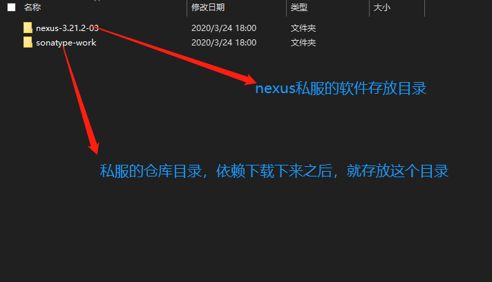
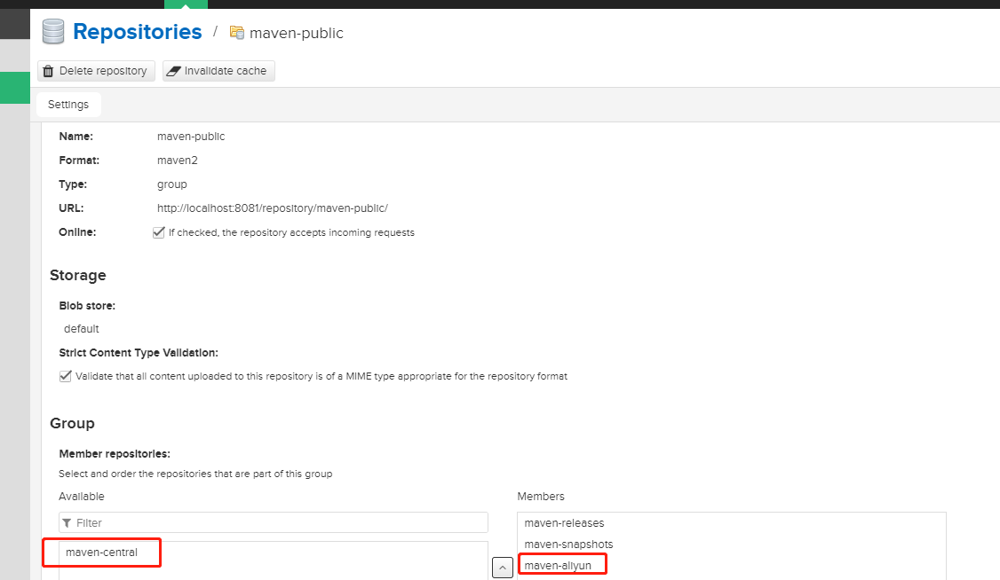
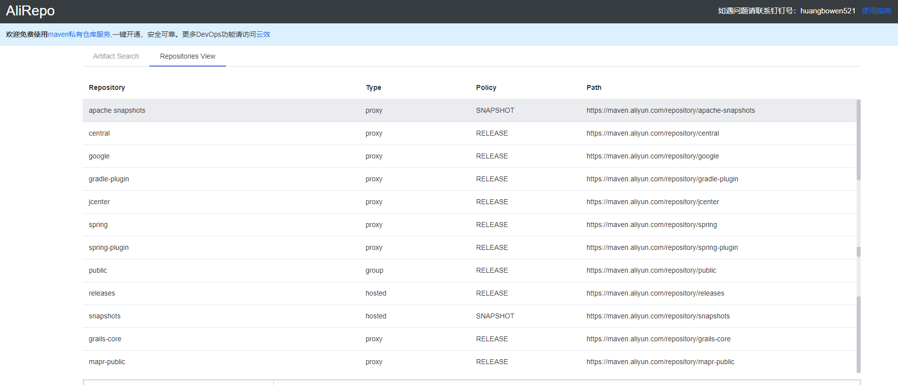
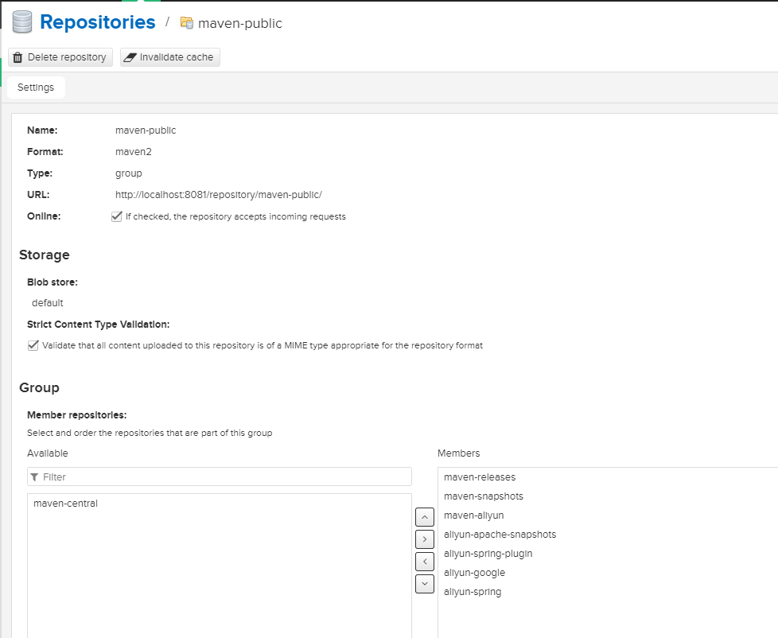

# Maven

## 下载地址

```http
https://help.sonatype.com/repomanager3/download/download-archives---repository-manager-3
```

## Maven的安装

1. 直接解压下载后的压缩包，

   

2. 找到 nexus-3.21.2-03\bin 路径下的 nexus.exe 文件

3. 打开cmd窗口，进入当前目录，执行命令：nexus.exe /install nexus（表示往windows下安装一个名叫nexus的服务）

4. 然后通过命令：nexus.exe /start nexus 把nexus服务起来

5. 访问地址：http://localhost:8081，成功出来页面，说明安装成功

可能会存在以下问题：

1. 如果服务一直安装不成功，尝试以命令行的方式启动cmd窗口，重复上述步骤
2. 如果当启动成功之后，访问：http://localhost:8081，如果页面一直刷不出来，建议多等一会儿，或者换个浏览器试试

## Nexus私服的默认密码问题

1. 从nexus3之后，就不再默认admin123了，而是动态密码，当服务启动成功之后，会在私服的数据目录发现下面的文件：

   ```
   sonatype-work/nexus3/admin.password
   ```

2. 用文本文件打开该文件，能看到初始密码。默认用户名为：admin。

3. 登录成功以后，会立即要求你更改密码，这是可以更改一个你认为好记的密码即可。

## Nexus仓库的介绍

### 仓库分为以下三种

#### hosted：本地仓库

​		本地存储。像官方仓库一样提供本地私库功能

#### proxy：代理仓库

​		提供代理其它仓库的类型

#### group：仓库组

​		组类型，能够组合多个仓库为一个地址提供服务

## Nexus仓库的使用

### 创建一个第三方仓库

​		一般存放一些，在中央仓库找不到的jar包类库，可以上传功能把jar包传到该仓库。一般情况下，启动nexus会自带一个三方库，新版本没有这个仓库，需要手动创建

### 创建用户和角色

​		根据自己的实际项目需要，创建一些角色和用户

我在这里创建两个用户：

1. releases用户，用来往 maven-releases 仓库发布jar的用户
2. snapshots用户，用来往 maven-snapshots 仓库发布jar包的用户

### maven-public

​		使用maven-public这个组仓库，代理其他的仓库，后续maven就可以使用这个组仓库对外提供服务

## Nexus仓库的配置

### 新增代理仓库：配置阿里云maven公共仓库的地址

```http
https://maven.aliyun.com/repository/public
```

### 配置Nexus公共仓库



​		把新增加的阿里云代理仓库，加入maven-public组中，把原maven-central中央仓库的代理仓库移除。国内使用aliyun代理仓库可以提高很快的下载速度。

### 正常情况下晚上以上配置就可以了

​		有些情况，只使用aliyun公共仓库地址，有好多jar包下载不下来，此时就需要新建其他代理仓库，用来代理。

### 阿里云官方提供的其他仓库地址



### 如有需要可以把以上仓库，新建为代理仓库，放在nexus中的maven-public组中

#### aliyun-apache-snapshots

```http
https://maven.aliyun.com/repository/apache-snapshots
```

#### aliyun-google

```http
https://maven.aliyun.com/repository/google
```

#### aliyun-spring

```http
https://maven.aliyun.com/repository/spring
```

#### aliyun-spring-plugin

```http
https://maven.aliyun.com/repository/spring-plugin
```

### 把新建的代理仓库加入maven-public组中



## Maven的配置

maven软件安装目录下的 conf/settings.xml 的配置

### localRepository：配置本地maven仓库地址

```xml
<!-- 默认为当前用户根目录下的 .m2/repository -->
<localRepository>/path/to/local/repo</localRepository>
```

### servers：配置nexus私服的用户

```xml
<server>
    <id>releases</id>
    <username>releases</username>
    <password>releases</password>
</server>
<server>
    <id>snapshots</id>
    <username>snapshots</username>
    <password>snapshots</password>
</server>
```

### mirrors：配置镜像地址

```xml
<mirror>
    <id>mirrorId</id>
    <mirrorOf>*</mirrorOf>
    <name>Human Readable Name for this Mirror.</name>
    <url>http://localhost:8081/repository/maven-public/</url>
</mirror>
```

### profiles：配置仓库

```xml
<profile>
    <id>jdk-1.8</id>
    <activation>
        <jdk>1.8</jdk>
    </activation>
    <repositories>
        <repository>
            <id>maven-public</id>
            <name>maven-public</name>
            <url>http://localhost:8081/repository/maven-public/</url>
            <layout>default</layout>
            <snapshotPolicy>always</snapshotPolicy>
        </repository>
    </repositories>
</profile>
```

## Maven发布jar包私服的配置

### settings.xml配置用户

```xml
<server>
    <id>releases</id>
    <username>admin</username>
    <password>密码自己设置</password>
</server>
<server>
    <id>snapshots</id>
    <username>admin</username>
    <password>密码自己设置</password>
</server>
```

### pom.xml发布私服仓库配置

```xml
<!-- 配置远程发布到私服，mvn deploy -->
<distributionManagement>
    <!-- 发布版私服仓库 默认的-->
    <repository>
        <id>releases</id>
        <name>releases</name>
        <url>http://localhost:8081/repository/maven-releases/</url>
    </repository>
    <!-- 快照版私服仓库 默认的-->
    <snapshotRepository>
        <id>snapshots</id>
        <name>snapshots</name>
        <url>http://localhost:8081/repository/maven-snapshots/</url>
    </snapshotRepository>
</distributionManagement>
```

### pom.xml发布插件配置

版本可以使用最新的

```xml
<plugin>
    <groupId>org.apache.maven.plugins</groupId>
    <artifactId>maven-deploy-plugin</artifactId>
    <version>2.8.2</version>
</plugin>
```
