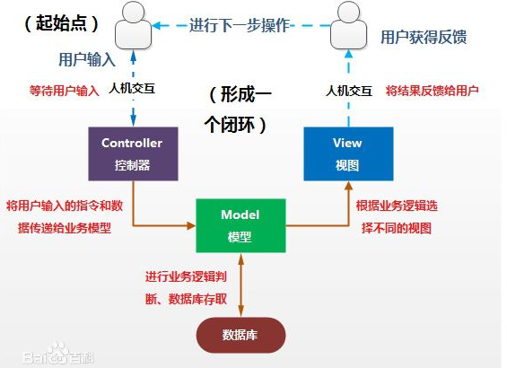
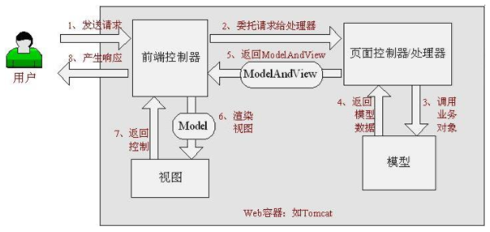
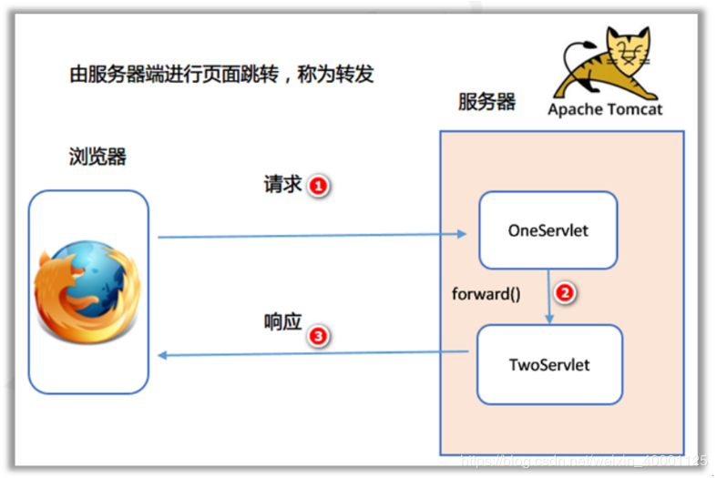
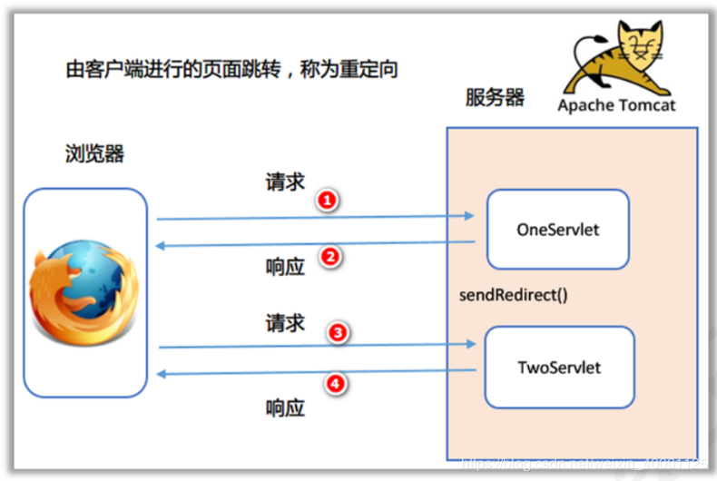
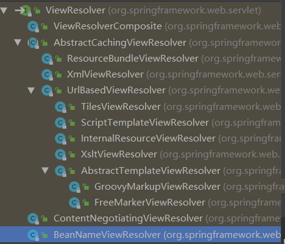
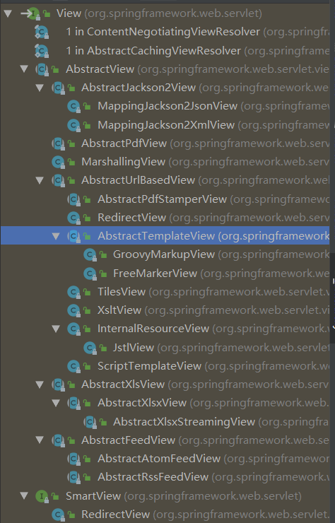
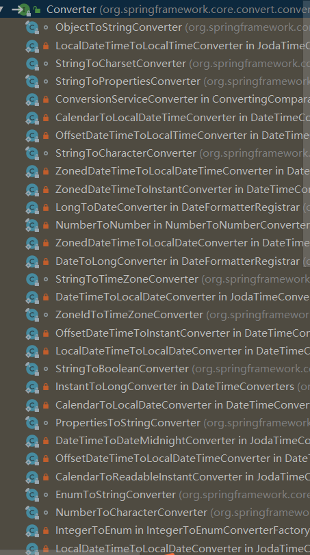
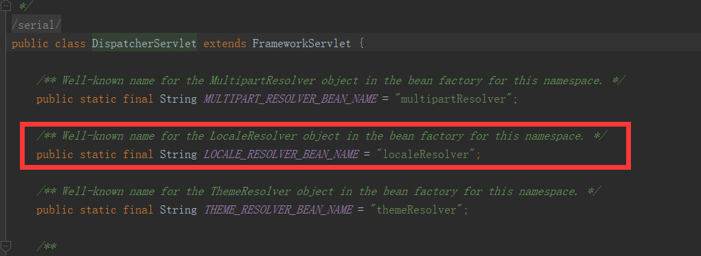
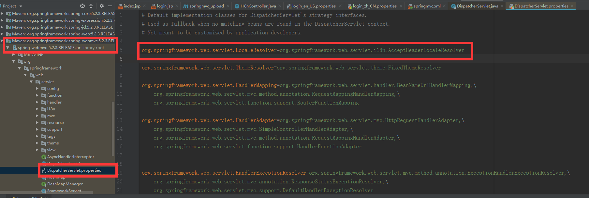
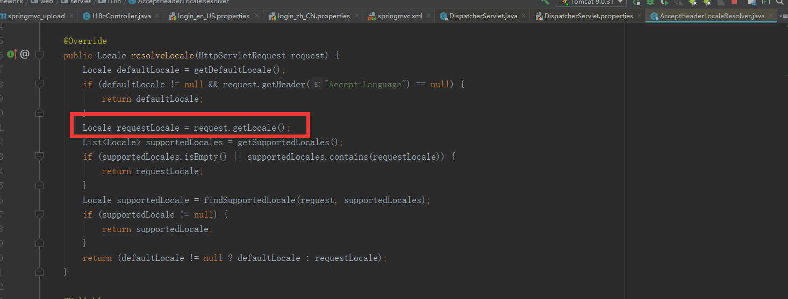

# SpringMVC简单介绍及使用

## 1. 什么是MVC？

​		MVC是模型(Model)、视图(View)、控制器(Controller)的简写，是一种软件设计规范。就是将业务逻辑、数据、显示分离的方法来组织代码。MVC主要作用是**降低了视图与业务逻辑间的双向偶合**。MVC不是一种设计模式，**MVC是一种架构模式**。当然不同的MVC存在差异。

​		**Model（模型）：**数据模型，提供要展示的数据，因此包含数据和行为，可以认为是领域模型或JavaBean组件（包含数据和行为），不过现在一般都分离开来：Value Object（数据Dao） 和 服务层（行为Service）。也就是模型提供了模型数据查询和模型数据的状态更新等功能，包括数据和业务。

​		**View（视图）：**负责进行模型的展示，一般就是我们见到的用户界面，客户想看到的东西。

​		**Controller（控制器）：**接收用户请求，委托给模型进行处理（状态改变），处理完毕后把返回的模型数据返回给视图，由视图负责展示。 也就是说控制器做了个调度员的工作。

​		其实在最早期的时候还有model1和model2的设计模型

**最典型的MVC就是JSP + servlet + javabean的模式。**



代码展示：

HelloServlet.java

```java
package com.mashibing.controller;

import javax.servlet.ServletException;
import javax.servlet.http.HttpServlet;
import javax.servlet.http.HttpServletRequest;
import javax.servlet.http.HttpServletResponse;
import java.io.IOException;

public class HelloServlet extends HttpServlet {
    protected void doPost(HttpServletRequest request, HttpServletResponse response) throws ServletException, IOException {
        String method = request.getParameter("method");
        if (method.equals("add")){
            request.getSession().setAttribute("msg","add");
        }else if(method.equals("sub")){
            request.getSession().setAttribute("msg","sub");
        }
        request.getRequestDispatcher("index.jsp").forward(request,response);
    }

    protected void doGet(HttpServletRequest request, HttpServletResponse response) throws ServletException, IOException {
        this.doPost(request, response);
    }
}
```

web.xml

```xml
<?xml version="1.0" encoding="UTF-8"?>
<web-app xmlns="http://xmlns.jcp.org/xml/ns/javaee"
         xmlns:xsi="http://www.w3.org/2001/XMLSchema-instance"
         xsi:schemaLocation="http://xmlns.jcp.org/xml/ns/javaee http://xmlns.jcp.org/xml/ns/javaee/web-app_4_0.xsd"
         version="4.0">

    <servlet>
        <servlet-name>HelloServlet</servlet-name>
        <servlet-class>com.mashibing.controller.HelloServlet</servlet-class>
    </servlet>
    <servlet-mapping>
        <servlet-name>HelloServlet</servlet-name>
        <url-pattern>/user</url-pattern>
    </servlet-mapping>
</web-app>
```

index.jsp

```jsp
<%@ page contentType="text/html;charset=UTF-8" language="java" %>
<html>
  <head>
    <title>$Title$</title>
  </head>
  <body>
  ${msg}
  </body>
</html>

```

输入网址：http://localhost:8080/servlet_demo_war_exploded/user?method=add

## 2. SpringMVC

### 1. SpringMVC的介绍

```txt
Spring Web MVC is the original web framework built on the Servlet API and has been included in the Spring Framework from the very beginning. The formal name, “Spring Web MVC,” comes from the name of its source module (spring-webmvc), but it is more commonly known as “Spring MVC”.
Spring Web MVC是构建在Servlet API上的原始Web框架，从一开始就包含在Spring Framework中。 正式名称 “Spring Web MVC,” 来自其源模块(spring-webmvc)的名称，但它通常被称为“Spring MVC”。
```

简而言之，springMVC是Spring框架的一部分，是基于java实现的一个轻量级web框架。

学习SpringMVC框架最核心的就是DispatcherServlet的设计，掌握好DispatcherServlet是掌握SpringMVC的核心关键。

### 2. SpringMVC的优点

1. 清晰的角色划分：控制器(controller)、验证器(validator)、命令对象(command obect)、表单对象(form object)、模型对象(model object)、Servlet分发器(DispatcherServlet)、处理器映射(handler mapping)、试图解析器(view resoler)等等。每一个角色都可以由一个专门的对象来实现。
2. 强大而直接的配置方式：将框架类和应用程序类都能作为JavaBean配置，支持跨多个context的引用，例如，在web控制器中对业务对象和验证器validator)的引用。
3. 可适配、非侵入：可以根据不同的应用场景，选择何事的控制器子类(simple型、command型、from型、wizard型、multi-action型或者自定义)，而不是一个单一控制器(比如Action/ActionForm)继承。
4. 可重用的业务代码：可以使用现有的业务对象作为命令或表单对象，而不需要去扩展某个特定框架的基类。
5. 可定制的绑定(binding)和验证(validation)：比如将类型不匹配作为应用级的验证错误，这可以保证错误的值。再比如本地化的日期和数字绑定等等。在其他某些框架中，你只能使用字符串表单对象，需要手动解析它并转换到业务对象。
6. 可定制的handler mapping和view resolution：Spring提供从最简单的URL映射，到复杂的、专用的定制策略。与某些web MVC框架强制开发人员使用单一特定技术相比，Spring显得更加灵活。
7. 灵活的model转换：在Springweb框架中，使用基于Map的键/值对来达到轻易的与各种视图技术集成。
8. 可定制的本地化和主题(theme)解析：支持在JSP中可选择地使用Spring标签库、支持JSTL、支持Velocity(不需要额外的中间层)等等。
9. 简单而强大的JSP标签库(Spring Tag Library)：支持包括诸如数据绑定和主题(theme)之类的许多功能。他提供在标记方面的最大灵活性。
10. JSP表单标签库：在Spring2.0中引入的表单标签库，使用在JSP编写表单更加容易。
11. Spring Bean的生命周期：可以被限制在当前的HTTp Request或者HTTp Session。准确的说，这并非Spring MVC框架本身特性，而应归属于Spring MVC使用的WebApplicationContext容器。

### 3. SpringMVC的实现原理

​		springmvc的mvc模式：



SpringMVC的具体执行流程：

​		当发起请求时被前置的控制器拦截到请求，根据请求参数生成代理请求，找到请求对应的实际控制器，控制器处理请求，创建数据模型，访问数据库，将模型响应给中心控制器，控制器使用模型与视图渲染视图结果，将结果返回给中心控制器，再将结果返回给请求者。


```
1、DispatcherServlet表示前置控制器，是整个SpringMVC的控制中心。用户发出请求，DispatcherServlet接收请求并拦截请求。
2、HandlerMapping为处理器映射。DispatcherServlet调用HandlerMapping,HandlerMapping根据请求url查找Handler。
3、返回处理器执行链，根据url查找控制器，并且将解析后的信息传递给DispatcherServlet
4、HandlerAdapter表示处理器适配器，其按照特定的规则去执行Handler。
5、执行handler找到具体的处理器
6、Controller将具体的执行信息返回给HandlerAdapter,如ModelAndView。
7、HandlerAdapter将视图逻辑名或模型传递给DispatcherServlet。
8、DispatcherServlet调用视图解析器(ViewResolver)来解析HandlerAdapter传递的逻辑视图名。
9、视图解析器将解析的逻辑视图名传给DispatcherServlet。
10、DispatcherServlet根据视图解析器解析的视图结果，调用具体的视图，进行试图渲染
11、将响应数据返回给客户端
```

## 3. 基于XML的Hello_SpringMVC

1、添加pom依赖

```xml
    <dependencies>
        <!-- https://mvnrepository.com/artifact/org.springframework/spring-context -->
        <dependency>
            <groupId>org.springframework</groupId>
            <artifactId>spring-context</artifactId>
            <version>5.2.3.RELEASE</version>
        </dependency>
        <!-- https://mvnrepository.com/artifact/org.springframework/spring-web -->
        <dependency>
            <groupId>org.springframework</groupId>
            <artifactId>spring-web</artifactId>
            <version>5.2.3.RELEASE</version>
        </dependency>
        <!-- https://mvnrepository.com/artifact/org.springframework/spring-webmvc -->
        <dependency>
            <groupId>org.springframework</groupId>
            <artifactId>spring-webmvc</artifactId>
            <version>5.2.3.RELEASE</version>
        </dependency>
    </dependencies>
```

2、编写web.xml文件

```xml
<?xml version="1.0" encoding="UTF-8"?>
<web-app xmlns="http://xmlns.jcp.org/xml/ns/javaee"
         xmlns:xsi="http://www.w3.org/2001/XMLSchema-instance"
         xsi:schemaLocation="http://xmlns.jcp.org/xml/ns/javaee http://xmlns.jcp.org/xml/ns/javaee/web-app_4_0.xsd"
         version="4.0">
    <!--配置DispatcherServlet-->
    <servlet>
        <servlet-name>springmvc</servlet-name>
        <servlet-class>org.springframework.web.servlet.DispatcherServlet</servlet-class>
        <!--关联springmvc的配置文件-->
        <init-param>
            <param-name>contextConfigLocation</param-name>
            <param-value>classpath:applicationContext.xml</param-value>
        </init-param>
    </servlet>
    <!--匹配servlet的请求，/标识匹配所有请求-->
    <servlet-mapping>
        <servlet-name>springmvc</servlet-name>
        <!--/*和/都是拦截所有请求，/会拦截的请求不包含*.jsp,而/*的范围更大，还会拦截*.jsp这些请求-->
        <url-pattern>/</url-pattern>
    </servlet-mapping>
</web-app>
```

3、编写springmvc需要的spring配置文件，applicationContext.xml

```xml
<?xml version="1.0" encoding="UTF-8"?>
<beans xmlns="http://www.springframework.org/schema/beans"
       xmlns:xsi="http://www.w3.org/2001/XMLSchema-instance"
       xsi:schemaLocation="http://www.springframework.org/schema/beans http://www.springframework.org/schema/beans/spring-beans.xsd">

    <!--处理映射器-->
    <bean class="org.springframework.web.servlet.handler.BeanNameUrlHandlerMapping"></bean>
    <!--处理器适配器-->
    <bean class="org.springframework.web.servlet.mvc.SimpleControllerHandlerAdapter"></bean>

    <!--视图解析器-->
    <bean id="internalResourceViewResolver" class="org.springframework.web.servlet.view.InternalResourceViewResolver">
        <!--配置前缀-->
        <property name="prefix" value="/WEB-INF/jsp/"></property>
        <!--配置后缀-->
        <property name="suffix" value=".jsp"></property>
    </bean>

    <bean id="/hello" class="com.mashibing.controller.HelloController"></bean>
</beans>
```

4、HelloController.java

```java
package com.mashibing.controller;


import org.springframework.web.servlet.ModelAndView;
import org.springframework.web.servlet.mvc.Controller;

import javax.servlet.http.HttpServletRequest;
import javax.servlet.http.HttpServletResponse;

public class HelloController implements Controller {
    public ModelAndView handleRequest(HttpServletRequest httpServletRequest, HttpServletResponse httpServletResponse) throws Exception {
        //创建模型和视图对象
        ModelAndView mv = new ModelAndView();
        //将需要的值传递到model中
        mv.addObject("msg","helloSpringMVC");
        //设置要跳转的视图，
        mv.setViewName("hello");
        return mv;
    }
}
```

5、创建hello.jsp页面

```jsp
<%--
  Created by IntelliJ IDEA.
  User: root
  Date: 2020/3/5
  Time: 20:25
  To change this template use File | Settings | File Templates.
--%>
<%@ page contentType="text/html;charset=UTF-8" language="java" %>
<html>
<head>
    <title>Title</title>
</head>
<body>
${msg}
</body>
</html>

```

6、配置tomcat，发送请求

http://localhost:8080/hello

## 4. 基于注解的Hello_SpringMVC

1、添加pom依赖

```xml
    <dependencies>
        <!-- https://mvnrepository.com/artifact/org.springframework/spring-context -->
        <dependency>
            <groupId>org.springframework</groupId>
            <artifactId>spring-context</artifactId>
            <version>5.2.3.RELEASE</version>
        </dependency>
        <!-- https://mvnrepository.com/artifact/org.springframework/spring-web -->
        <dependency>
            <groupId>org.springframework</groupId>
            <artifactId>spring-web</artifactId>
            <version>5.2.3.RELEASE</version>
        </dependency>
        <!-- https://mvnrepository.com/artifact/org.springframework/spring-webmvc -->
        <dependency>
            <groupId>org.springframework</groupId>
            <artifactId>spring-webmvc</artifactId>
            <version>5.2.3.RELEASE</version>
        </dependency>
    </dependencies>
```

2、编写web.xml文件

```xml
<?xml version="1.0" encoding="UTF-8"?>
<web-app xmlns="http://xmlns.jcp.org/xml/ns/javaee"
         xmlns:xsi="http://www.w3.org/2001/XMLSchema-instance"
         xsi:schemaLocation="http://xmlns.jcp.org/xml/ns/javaee http://xmlns.jcp.org/xml/ns/javaee/web-app_4_0.xsd"
         version="4.0">
    <!--配置DispatcherServlet-->
    <servlet>
        <servlet-name>springmvc</servlet-name>
        <servlet-class>org.springframework.web.servlet.DispatcherServlet</servlet-class>
        <!--
		关联springmvc的配置文件
		-->
        <init-param>
            <param-name>contextConfigLocation</param-name>
            <param-value>classpath:applicationContext.xml</param-value>
        </init-param>
    </servlet>
    <!--匹配servlet的请求，
    /：标识匹配所有请求，但是不会jsp页面
    /*：拦截所有请求，拦截jsp页面
    -->
    <servlet-mapping>
        <servlet-name>springmvc</servlet-name>
        <url-pattern>/</url-pattern>
    </servlet-mapping>
</web-app>
```

3、编写applicationContext.xml文件

```xml
<?xml version="1.0" encoding="UTF-8"?>
<beans xmlns="http://www.springframework.org/schema/beans"
       xmlns:xsi="http://www.w3.org/2001/XMLSchema-instance"
       xmlns:context="http://www.springframework.org/schema/context"
       xmlns:mvc="http://www.springframework.org/schema/mvc"
       xsi:schemaLocation="http://www.springframework.org/schema/beans http://www.springframework.org/schema/beans/spring-beans.xsd http://www.springframework.org/schema/context https://www.springframework.org/schema/context/spring-context.xsd http://www.springframework.org/schema/mvc https://www.springframework.org/schema/mvc/spring-mvc.xsd">

    <!--自动扫描包，由IOC容器进行控制管理-->
    <context:component-scan base-package="com.mashibing"></context:component-scan>
    <!-- 视图解析器 -->
    <bean class="org.springframework.web.servlet.view.InternalResourceViewResolver"
          id="internalResourceViewResolver">
        <!-- 前缀 -->
        <property name="prefix" value="/WEB-INF/jsp/" />
        <!-- 后缀 -->
        <property name="suffix" value=".jsp" />
    </bean>
</beans>
```

4、编写HelloController.java

```java
package com.mashibing.controller;

import org.springframework.stereotype.Controller;
import org.springframework.ui.Model;
import org.springframework.web.bind.annotation.RequestMapping;

@Controller
public class HelloController{
    /*
    * @RequestMapping就是用来标识此方法用来处理什么请求，其中的/可以取消
    * 取消后默认也是从当前项目的根目录开始查找，一般在编写的时候看个人习惯
    * 同时，@RequestMapping也可以用来加在类上，
    * */
    @RequestMapping("/hello")
    public String hello(Model model){
        model.addAttribute("msg","hello,SpringMVC");
        return "hello";
    }
}
```

5、编写hello.jsp

```jsp
<%@ page contentType="text/html;charset=UTF-8" language="java" %>
<html>
<head>
    <title>Title</title>
</head>
<body>
${msg}
</body>
</html>
```

6、输入请求http://localhost:8080/hello

## 5. 注意细节

### 1. springmvc_helloworld运行流程：

通过上述的代码，我们能够总结出具体的运行流程：

1. 客户端发送请求http://localhost:8080/hello
2. 由tomcat接受到对应的请求
3. SpringMVC的前端控制器DispatcherServlet接收到所有的请求
4. 查看请求地址和@RequestMapping注解的哪个匹配，来找到具体的类的处理方法
5. 前端控制器找到目标处理类和方法之后，执行目标方法
6. 方法执行完成之后会有一个返回值，SpringMVC会将这个返回值用视图解析器进行解析拼接成完整的页面地址
7. DispatcherServlet拿到页面地址之后，转发到具体的页面

### 2. springmvc的配置文件

web.xml

```xml
<?xml version="1.0" encoding="UTF-8"?>
<web-app xmlns="http://xmlns.jcp.org/xml/ns/javaee"
         xmlns:xsi="http://www.w3.org/2001/XMLSchema-instance"
         xsi:schemaLocation="http://xmlns.jcp.org/xml/ns/javaee http://xmlns.jcp.org/xml/ns/javaee/web-app_4_0.xsd"
         version="4.0">
    <!--配置DispatcherServlet-->
    <servlet>
        <servlet-name>springmvc</servlet-name>
        <servlet-class>org.springframework.web.servlet.DispatcherServlet</servlet-class>
        <!--
		关联springmvc的配置文件
		此配置文件的属性可以不添加，但是需要在WEB-INF的目录下创建 前端控制器名称-servlet.xml文件
		-->
        <init-param>
            <param-name>contextConfigLocation</param-name>
            <param-value>classpath:applicationContext.xml</param-value>
        </init-param>
    </servlet>
    <servlet-mapping>
        <servlet-name>springmvc</servlet-name>
        <url-pattern>/</url-pattern>
    </servlet-mapping>
</web-app>
```

### 3. DispatcherServlet的url-pattern

web.xml

```xml
<?xml version="1.0" encoding="UTF-8"?>
<web-app xmlns="http://xmlns.jcp.org/xml/ns/javaee"
         xmlns:xsi="http://www.w3.org/2001/XMLSchema-instance"
         xsi:schemaLocation="http://xmlns.jcp.org/xml/ns/javaee http://xmlns.jcp.org/xml/ns/javaee/web-app_4_0.xsd"
         version="4.0">
    <!--配置DispatcherServlet-->
    <servlet>
        <servlet-name>springmvc</servlet-name>
        <servlet-class>org.springframework.web.servlet.DispatcherServlet</servlet-class>
        <!--
		关联springmvc的配置文件
		此配置文件的属性可以不添加，但是需要在WEB-INF的目录下创建 前端控制器名称-servlet.xml文件
		-->
        <init-param>
            <param-name>contextConfigLocation</param-name>
            <param-value>classpath:applicationContext.xml</param-value>
        </init-param>
    </servlet>
    <!--匹配servlet的请求，
    /：标识匹配所有请求，但是不会jsp页面
    /*：拦截所有请求，拦截jsp页面

     但是需要注意的是，当配置成index.html的时候，会发现请求不到
     原因在于，tomcat下也有一个web.xml文件，所有的项目下web.xml文件都需要继承此web.xml
     在服务器的web.xml文件中有一个DefaultServlet用来处理静态资源，但是url-pattern是/
     而我们在自己的配置文件中如果添加了url-pattern=/会覆盖父类中的url-pattern，此时在请求的时候
     DispatcherServlet会去controller中做匹配，找不到则直接报404
     而在服务器的web.xml文件中包含了一个JspServlet的处理，所以不过拦截jsp请求
    -->
    <servlet-mapping>
        <servlet-name>springmvc</servlet-name>
        <url-pattern>/</url-pattern>
    </servlet-mapping>
</web-app>
```

### 4. @RequestMapping

​		@RequestMapping用来匹配客户端发送的请求，可以在方法上使用，也可以在类上使用。

​		方法：表示用来匹配要处理的请求

​		类上：表示为当前类的所有方法的请求地址添加一个前置路径，访问的时候必须要添加此路径

```java
package com.mashibing.controller;

import org.springframework.stereotype.Controller;
import org.springframework.ui.Model;
import org.springframework.web.bind.annotation.RequestMapping;

@Controller
@RequestMapping("/mashibing")
public class HelloController{

    /*
    * @RequestMapping就是用来标识此方法用来处理什么请求，其中的/可以取消
    * 取消后默认也是从当前项目的根目录开始查找，一般在编写的时候看个人习惯
    * 同时，@RequestMapping也可以用来加在类上，
    * */
    @RequestMapping("/hello")
    public String hello(Model model){
        model.addAttribute("msg","hello,SpringMVC");
        return "hello";
    }
}
```

​		**注意：在整个项目的不同方法上不能包含相同的@RequestMapping值**

​		除此以外，@RequestMapping注解还可以添加很多额外的属性值，用来精确匹配请求

```java
package com.mashibing.controller;

import org.springframework.stereotype.Controller;
import org.springframework.ui.Model;
import org.springframework.web.bind.annotation.RequestMapping;
import org.springframework.web.bind.annotation.RequestMethod;

@Controller
@RequestMapping("/mashibing")
public class HelloController{

    /*
    * @RequestMapping就是用来标识此方法用来处理什么请求，其中的/可以取消
    * 取消后默认也是从当前项目的根目录开始查找，一般在编写的时候看个人习惯
    * 同时，@RequestMapping也可以用来加在类上，
    * */
    @RequestMapping("/hello")
    public String hello(Model model){
        model.addAttribute("msg","hello,SpringMVC");
        return "hello";
    }

    /**
     * Request的其他属性值
     *  value:要匹配的请求
     *  method:限制发送请求的方式： POST GET
     *  params:表示请求要接受的参数,如果定义了这个属性，那么发送的时候必须要添加参数
     *         params有几种匹配规则
     *          1、直接写参数的名称，param1,param2
     *              params = {"username"}
     *          2、表示请求不能包含的参数，！param1
     *              params = {"!username"}
     *          3、表示请求中需要要包含的参数但是可以限制值 param1=values  param1!=value
     *              params = {"username=123","age"}
     *              params = {"username!=123","age"}
     *  headers:填写请求头信息
     *          chrome：User-Agent=Mozilla/5.0 (Windows NT 10.0; Win64; x64) AppleWebKit/537.36 (KHTML, like Gecko) Chrome/79.0.3945.79 Safari/537.36
     *          firefox:User-Agent=Mozilla/5.0 (Windows NT 10.0; Win64; x64; rv:73.0) Gecko/20100101 Firefox/73.0
     *
     *  consumers:只接受内容类型是哪种的请求，相当于指定Content-Type
     *  produces:返回的内容类型 Content-Type：text/html;charset=utf-8
     *
     * @return
     */
    @RequestMapping(value = "/hello2",method = RequestMethod.POST)
    public String hello2(){
        return "hello";
    }

    @RequestMapping(value = "/hello3",params = {"username!=123","age"})
    public String hello3(String username){
        System.out.println(username);
        return "hello";
    }

    @RequestMapping(value = "/hello4",headers = {"User-Agent=Mozilla/5.0 (Windows NT 10.0; Win64; x64; rv:73.0) Gecko/20100101 Firefox/73.0"})
    public String hello4(){
        return "hello";
    }
}

```

​		@RequestMapping还包含了很多复杂的匹配功能，提供了通配符的支持：

```java
package com.mashibing.controller;

import org.springframework.stereotype.Controller;
import org.springframework.ui.Model;
import org.springframework.web.bind.annotation.RequestMapping;
import org.springframework.web.bind.annotation.RequestMethod;

@Controller
@RequestMapping("/mashibing")
public class HelloController{

    /*
    * @RequestMapping就是用来标识此方法用来处理什么请求，其中的/可以取消
    * 取消后默认也是从当前项目的根目录开始查找，一般在编写的时候看个人习惯
    * 同时，@RequestMapping也可以用来加在类上，
    * */
    @RequestMapping("/hello")
    public String hello(Model model){
        model.addAttribute("msg","hello,SpringMVC");
        return "hello";
    }

    /**
     * Request的其他属性值
     *  value:要匹配的请求
     *  method:限制发送请求的方式： POST GET
     *  params:表示请求要接受的参数,如果定义了这个属性，那么发送的时候必须要添加参数
     *         params有几种匹配规则
     *          1、直接写参数的名称，param1,param2
     *              params = {"username"}
     *          2、表示请求不能包含的参数，！param1
     *              params = {"!username"}
     *          3、表示请求中需要要包含的参数但是可以限制值 param1=values  param1!=value
     *              params = {"username=123","age"}
     *              params = {"username!=123","age"}
     *  headers:填写请求头信息
     *          chrome：User-Agent=Mozilla/5.0 (Windows NT 10.0; Win64; x64) AppleWebKit/537.36 (KHTML, like Gecko) Chrome/79.0.3945.79 Safari/537.36
     *          firefox:User-Agent=Mozilla/5.0 (Windows NT 10.0; Win64; x64; rv:73.0) Gecko/20100101 Firefox/73.0
     *
     *  consumers:只接受内容类型是哪种的请求，相当于指定Content-Type
     *  produces:返回的内容类型 Content-Type：text/html;charset=utf-8
     *
     * @return
     */
    @RequestMapping(value = "/hello2",method = RequestMethod.POST)
    public String hello2(){
        return "hello";
    }

    @RequestMapping(value = "/hello3",params = {"username!=123","age"})
    public String hello3(String username){
        System.out.println(username);
        return "hello";
    }

    @RequestMapping(value = "/hello4",headers = {"User-Agent=Mozilla/5.0 (Windows NT 10.0; Win64; x64; rv:73.0) Gecko/20100101 Firefox/73.0"})
    public String hello4(){
        return "hello";
    }

    /**
     * @Request包含三种模糊匹配的方式，分别是：
     *  ？：能替代任意一个字符
     *  *: 能替代任意多个字符和一层路径
     *  **：能代替多层路径
     * @return
     */
    @RequestMapping(value = "/**/h*llo?")
    public String hello5(){
        System.out.println("hello5");
        return "hello";
    }
}

```

## 6. @PathVariable

如果需要在请求路径中的参数像作为参数应该怎么使用呢？可以使用@PathVariable注解，此注解就是提供了对占位符URL的支持，就是将URL中占位符参数绑定到控制器处理方法的参数中。

```java
package com.mashibing.controller;

import org.springframework.stereotype.Controller;
import org.springframework.ui.Model;
import org.springframework.web.bind.annotation.PathVariable;
import org.springframework.web.bind.annotation.RequestMapping;
import org.springframework.web.bind.annotation.RequestMethod;

@Controller
@RequestMapping("/mashibing")
public class HelloController{

    @RequestMapping(value = "/pathVariable/{name}")
    public String pathVariable(@PathVariable("name") String name){
        System.out.println(name);
        return "hello";
    }
}
```

## 7. REST

​		REST即表述性状态传递（英文：Representational State Transfer，简称REST）是Roy Fielding博士在2000年他的博士论文中提出来的一种[软件架构](https://baike.baidu.com/item/软件架构)风格。它是一种针对[网络应用](https://baike.baidu.com/item/网络应用/2196523)的设计和开发方式，可以降低开发的复杂性，提高系统的可伸缩性。

​		在三种主流的[Web服务](https://baike.baidu.com/item/Web服务)实现方案中，因为REST模式的Web服务与复杂的[SOAP](https://baike.baidu.com/item/SOAP/4684413)和[XML-RPC](https://baike.baidu.com/item/XML-RPC)对比来讲明显的更加简洁，越来越多的web服务开始采用REST风格设计和实现。例如，Amazon.com提供接近REST风格的Web服务进行图书查找；[雅虎](https://baike.baidu.com/item/雅虎/108276)提供的Web服务也是REST风格的。

​		REST,翻译过来叫做表现层状态转化，是目前最流行的一个互联网软件架构，它架构清晰，符合标准，易于理解，扩展方便。

​		**表现层（Representation）**：把资源具体呈现出来的形式，因此叫做表现层。

​		**资源（Resource）**：网络上的一个具体信息，文本，图片，音频，视频都可以称之为资源，如果想要访问到互联网上的某一个资源，那么就必须要使用一个URL来唯一性的获取改资源，也可以这么说，URL是每一个资源的唯一标识符。

​		**状态转化（State Transfer）**：当客户端发出一个请求的时候，就代表客户端跟服务端的一次交互过程，HTTP是一种无状态协议，即所有的状态都保存在服务器端，因此，客户端如果想要操作服务器，必须通过某些手段，让服务器的状态发生转化，而这种转化是建立在表现层的，这就是名字的由来（非人话）

​		人话：我们在获取资源的时候就是进行增删改查的操作，如果是原来的架构风格，需要发送四个请求，分别是：

​		查询：localhost:8080/query?id=1

​		增加：localhost:8080/insert

​		删除：localhost:8080/delete?id=1

​		更新：localhost:8080/update?id=1

​		按照此方式发送请求的时候比较麻烦，需要定义多种请求，而在HTTP协议中，有不同的发送请求的方式，分别是GET、POST、PUT、DELETE等，我们如果能让不同的请求方式表示不同的请求类型就可以简化我们的查询

​		GET：获取资源   			/book/1	

​		POST：新建资源			 /book

​		PUT：更新资源				/book/1

​		DELETE：删除资源		  /book/1

​		一切看起来都非常美好，但是大家需要注意了，我们在发送请求的时候只能发送post或者get，没有办法发送put和delete请求，那么应该如何处理呢？下面开始进入代码环节：

RestController.java

```java
package com.mashibing.controller;

import org.springframework.stereotype.Controller;
import org.springframework.web.bind.annotation.PathVariable;
import org.springframework.web.bind.annotation.RequestMapping;
import org.springframework.web.bind.annotation.RequestMethod;
import org.springframework.web.servlet.view.InternalResourceViewResolver;

@Controller
public class RestController {

    @RequestMapping(value = "/user",method = RequestMethod.POST)
    public String add(){
        System.out.println("添加");
        return "success";
    }

    @RequestMapping(value = "/user/{id}",method = RequestMethod.DELETE)
    public String delete(@PathVariable("id") Integer id){
        System.out.println("删除："+id);
        return "success";
    }

    @RequestMapping(value = "/user/{id}",method = RequestMethod.PUT)
    public String update(@PathVariable("id") Integer id){
        System.out.println("更新："+id);
        return "success";
    }

    @RequestMapping(value = "/user/{id}",method = RequestMethod.GET)
    public String query(@PathVariable("id") Integer id){
        System.out.println("查询："+id);
        return "success";
    }
}
```

web.xml

```xml
<?xml version="1.0" encoding="UTF-8"?>
<web-app xmlns="http://xmlns.jcp.org/xml/ns/javaee"
         xmlns:xsi="http://www.w3.org/2001/XMLSchema-instance"
         xsi:schemaLocation="http://xmlns.jcp.org/xml/ns/javaee http://xmlns.jcp.org/xml/ns/javaee/web-app_4_0.xsd"
         version="4.0">
    <!--配置DispatcherServlet-->
    <servlet>
        <servlet-name>springmvc</servlet-name>
        <servlet-class>org.springframework.web.servlet.DispatcherServlet</servlet-class>
        <!--
        关联springmvc的配置文件：
        此配置文件的属性可以不添加，但是需要在WEB-INF的目录下创建 前端控制器名称-servlet.xml文件
        -->

        <init-param>
            <param-name>contextConfigLocation</param-name>
            <param-value>classpath:springmvc-servlet.xml</param-value>
        </init-param>
    </servlet>
    <!--匹配servlet的请求，
    /：标识匹配所有请求，但是不会jsp页面
    /*：拦截所有请求，拦截jsp页面

     但是需要注意的是，当配置成index.html的时候，会发现请求不到
     原因在于，tomcat下也有一个web.xml文件，所有的项目下web.xml文件都需要继承此web.xml
     在服务器的web.xml文件中有一个DefaultServlet用来处理静态资源，但是url-pattern是/
     而我们在自己的配置文件中如果添加了url-pattern=/会覆盖父类中的url-pattern，此时在请求的时候
     DispatcherServlet会去controller中做匹配，找不到则直接报404
     而在服务器的web.xml文件中包含了一个JspServlet的处理，所以不过拦截jsp请求
    -->
    <servlet-mapping>
        <servlet-name>springmvc</servlet-name>
        <url-pattern>/</url-pattern>
    </servlet-mapping>
    <filter>
        <filter-name>hiddenFilter</filter-name>
        <filter-class>org.springframework.web.filter.HiddenHttpMethodFilter</filter-class>
    </filter>
    <filter-mapping>
        <filter-name>hiddenFilter</filter-name>
        <url-pattern>/*</url-pattern>
    </filter-mapping>
</web-app>
```

rest.jsp

```jsp
<%--
  Created by IntelliJ IDEA.
  User: root
  Date: 2020/3/6
  Time: 23:01
  To change this template use File | Settings | File Templates.
--%>
<%@ page contentType="text/html;charset=UTF-8" language="java" %>
<html>
<head>
    <title>Title</title>
</head>
<body>
    <form action="/user" method="post">
        <input type="submit" value="增加">
    </form>
    <form action="/user/1" method="post">
        <input name="_method" value="delete" type="hidden">
        <input type="submit" value="删除">
    </form>
    <form action="/user/1" method="post">
        <input name="_method" value="put" type="hidden">
        <input type="submit" value="修改">
    </form>
    <a href="/user/1">查询</a><br/>
</body>
</html>
```

success.jsp

```jsp
<%@ page contentType="text/html;charset=UTF-8" language="java" isErrorPage="true" %>
<html>
<head>
    <title>Title</title>
</head>
<body>
666
</body>
</html>
```

# SpringMVC的使用

## 1. SpringMVC的请求处理

### 1. SpringMVC对请求参数的处理

​		在之前的servlet中我们可以通过request.getParameter()来获取请求中的参数，但是在我们编写的SpringMVC的应用程序中，在具体请求的方法中并不包含request参数，那么我们应该如何获取请求中的参数呢？

​		需要使用以下几个注解：

​		@RequestParam：获取请求的参数

​		@RequestHeader：获取请求头信息

​		@CookieValue：获取cookie中的值

@RequestParam的基本使用

```java
package com.mashibing.controller;

import org.springframework.stereotype.Controller;
import org.springframework.web.bind.annotation.RequestMapping;
import org.springframework.web.bind.annotation.RequestParam;

@Controller
public class RequestController {

    /**
     * 如何获取SpringMVC中请求中的信息
     *  默认情况下，可以直接在方法的参数中填写跟请求一样的名称，此时会默认接受参数
     *      如果有值，直接赋值，如果没有，那么直接给空值
     *
     * @RequestParam:获取请求中的参数值,使用此注解之后，参数的名称不需要跟请求的名称一致，但是必须要写
     *      public String request(@RequestParam("user") String username){
     *
     *      此注解还包含三个参数：
     *      value:表示要获取的参数值
     *      required：表示此参数是否必须，默认是true，如果不写参数那么会报错，如果值为false，那么不写参数不会有任何错误
     *      defaultValue:如果在使用的时候没有传递参数，那么定义默认值即可
     *
     *
     * @param username
     * @return
     */
    @RequestMapping("/request")
    public String request(@RequestParam(value = "user",required = false,defaultValue = "hehe") String username){
        System.out.println(username);
        return "success";
    }
}

```

@RequestHeader的基本使用：

```java
package com.mashibing.controller;

import org.springframework.stereotype.Controller;
import org.springframework.web.bind.annotation.RequestHeader;
import org.springframework.web.bind.annotation.RequestMapping;
import org.springframework.web.bind.annotation.RequestParam;
import sun.management.resources.agent;

@Controller
public class RequestController {

    /**
     * 如果需要获取请求头信息该如何处理呢？
     *  可以使用@RequestHeader注解，
     *      public String header(@RequestHeader("User-Agent") String agent){
     *      相当于  request.getHeader("User-Agent")
     *
     *      如果要获取请求头中没有的信息，那么此时会报错，同样，此注解中也包含三个参数,跟@RequestParam一样
     *          value
     *          required
     *          defalutValue
     * @param agent
     * @return
     */
    @RequestMapping("/header")
    public String header(@RequestHeader("User-Agent") String agent){
        System.out.println(agent);
        return "success";
    }
}

```

@CookieValue的基本使用

```java
package com.mashibing.controller;

import org.springframework.stereotype.Controller;
import org.springframework.web.bind.annotation.CookieValue;
import org.springframework.web.bind.annotation.RequestHeader;
import org.springframework.web.bind.annotation.RequestMapping;
import org.springframework.web.bind.annotation.RequestParam;
import sun.management.resources.agent;

@Controller
public class RequestController {

    /**
     * 如果需要获取cookie信息该如何处理呢？
     *  可以使用@CookieValue注解，
     *      public String cookie(@CookieValue("JSESSIONID") String id){
     *      相当于
     *      Cookie[] cookies = request.getCookies();
     *      for(Cookie cookie : cookies){
     *          cookie.getValue();
     *      }
     *      如果要获取cookie中没有的信息，那么此时会报错，同样，此注解中也包含三个参数,跟@RequestParam一样
     *          value
     *          required
     *          defalutValue
     * @param id
     * @return
     */
    @RequestMapping("/cookie")
    public String cookie(@CookieValue("JSESSIONID") String id){
        System.out.println(id);
        return "success";
    }
}
```

​		如果请求中传递的是某一个对象的各个属性值，此时如何在控制器的方法中获取对象的各个属性值呢？

​		在SpringMVC的控制中，能直接完成对象的属性赋值操作，不需要人为干预。

User.java

```java
import java.util.Date;
import lombok.Data;
import lombok.experimental.Accessors;

@Data
@Accessors(chain = true)
public class User {
    
    private Integer id;
    private String name;
    private Integer age;
    private Date date;
    private Address address;
    
}
```

Address.java

```java
import lombok.Data;
import lombok.experimental.Accessors;

@Data
@Accessors(chain = true)
public class Address {

    private String province;
    private String city;
    private String town;

}
```

login.jsp

```jsp
<%--
  Created by IntelliJ IDEA.
  User: root
  Date: 2020/3/7
  Time: 0:11
  To change this template use File | Settings | File Templates.
--%>
<%@ page contentType="text/html;charset=UTF-8" language="java" %>
<html>
<head>
    <title>Title</title>
</head>
<body>
<form action="addUser" method="post">
    编号:<input type="text" name="id"/><br>
    姓名:<input type="text" name="name"/><br>
    年龄:<input type="text" name="age"/><br>
    日期:<input type="text" name="date"/><br>
    省份:<input type="text" name="address.province"/><br>
    城市:<input type="text" name="address.city"/><br>
    区域:<input type="text" name="address.town"/><br>
    <input type="submit" value="submit"/><br>
</form>
</body>
</html>
```

UserController.java

```java
package com.mashibing.controller;

import com.mashibing.bean.User;
import org.springframework.stereotype.Controller;
import org.springframework.web.bind.annotation.RequestMapping;

@Controller
public class UserController {

    @RequestMapping("/addUser")
    public String addUser(User user){
        System.out.println(user);
        return "success";
    }
}
```

### 2. 乱码问题的解决

​		我们在表单或者发送请求的时候，经常会遇到中文乱码的问题，那么如何解决乱码问题呢？

​		GET请求：在server.xml文件中，添加URIEncoding=“UTF-8”

​		POST请求：编写过滤器进行实现

```xml
<?xml version="1.0" encoding="UTF-8"?>
<web-app xmlns="http://xmlns.jcp.org/xml/ns/javaee"
         xmlns:xsi="http://www.w3.org/2001/XMLSchema-instance"
         xsi:schemaLocation="http://xmlns.jcp.org/xml/ns/javaee http://xmlns.jcp.org/xml/ns/javaee/web-app_4_0.xsd"
         version="4.0">
    <!--配置DispatcherServlet-->
    <servlet>
        <servlet-name>springmvc</servlet-name>
        <servlet-class>org.springframework.web.servlet.DispatcherServlet</servlet-class>
        <!--
        关联springmvc的配置文件：
        此配置文件的属性可以不添加，但是需要在WEB-INF的目录下创建 前端控制器名称-servlet.xml文件
        -->

        <init-param>
            <param-name>contextConfigLocation</param-name>
            <param-value>classpath:springmvc-servlet.xml</param-value>
        </init-param>
    </servlet>
    <!--匹配servlet的请求，
    /：标识匹配所有请求，但是不会jsp页面
    /*：拦截所有请求，拦截jsp页面

     但是需要注意的是，当配置成index.html的时候，会发现请求不到
     原因在于，tomcat下也有一个web.xml文件，所有的项目下web.xml文件都需要继承此web.xml
     在服务器的web.xml文件中有一个DefaultServlet用来处理静态资源，但是url-pattern是/
     而我们在自己的配置文件中如果添加了url-pattern=/会覆盖父类中的url-pattern，此时在请求的时候
     DispatcherServlet会去controller中做匹配，找不到则直接报404
     而在服务器的web.xml文件中包含了一个JspServlet的处理，所以不过拦截jsp请求
    -->
    <servlet-mapping>
        <servlet-name>springmvc</servlet-name>
        <url-pattern>/</url-pattern>
    </servlet-mapping>
    <filter>
        <filter-name>characterEncodingFilter</filter-name>
        <filter-class>org.springframework.web.filter.CharacterEncodingFilter</filter-class>
        <!--解决post请求乱码-->
        <init-param>
            <param-name>encoding</param-name>
            <param-value>UTF-8</param-value>
        </init-param>
        <!--解决响应乱码-->
        <init-param>
            <param-name>forceEncoding</param-name>
            <param-value>true</param-value>
        </init-param>
    </filter>
    <filter-mapping>
        <filter-name>characterEncodingFilter</filter-name>
        <url-pattern>/*</url-pattern>
    </filter-mapping>

</web-app>
```

**注意：如果配置了多个过滤器，那么字符编码过滤器一定要在最前面，否则失效。**

### 3. SpringMVC对原生API的支持

```java
package com.mashibing.controller;

import com.mashibing.bean.User;
import org.springframework.stereotype.Controller;
import org.springframework.web.bind.annotation.RequestMapping;

import javax.servlet.ServletInputStream;
import javax.servlet.ServletOutputStream;
import javax.servlet.http.HttpServletRequest;
import javax.servlet.http.HttpServletResponse;
import javax.servlet.http.HttpSession;
import java.io.BufferedReader;
import java.io.PrintWriter;

@Controller
public class UserController {

    @RequestMapping("/addUser")
    public String addUser(User user){
        System.out.println(user);
        return "success";
    }

    /**
     * SpringMVC也可以在参数上使用原生的Servlet API
     *
     *  HttpSession
     *  HttpServletRequest
     *  HttpServletResponse
     *
     *  java.security.Principal 安全协议相关
     *  Locale：国际化相关的区域信息对象
     *  InputStream:
     *      ServletInputStream inputStream = request.getInputStream();
     *  OutputStream:
     *      ServletOutputStream outputStream = response.getOutputStream();
     *  Reader:
     *      BufferedReader reader = request.getReader();
     *  Writer:
     *      PrintWriter writer = response.getWriter();
     * @param session
     * @param request
     * @param response
     * @return
     */
    @RequestMapping("api")
    public String api(HttpSession session, HttpServletRequest request, HttpServletResponse response){
        request.setAttribute("requestParam","request");
        session.setAttribute("sessionParam","session");
        return "success";
    }
}
```

### 4. 使用Model，Map，ModelMap传输数据到页面

​		在刚开始的helloworld项目中，我们传递了参数回到我们页面，但是后续的操作都只是接受用户的请求，那么在SpringMVC中除了可以使用原生servlet的对象传递数据之外，还有什么其他的方式呢？

​		可以在方法的参数上传入Model，ModelMap,Map类型，此时都能够将数据传送回页面

OutputController.java

```java
package com.mashibing.controller;

import org.springframework.stereotype.Controller;
import org.springframework.ui.Model;
import org.springframework.ui.ModelMap;
import org.springframework.web.bind.annotation.RequestMapping;

import java.util.Map;

@Controller
public class OutputController {

    @RequestMapping("output1")
    public String output1(Model model){
        model.addAttribute("msg","hello,Springmvc");
        return "output";
    }

    @RequestMapping("output2")
    public String output2(ModelMap model){
        model.addAttribute("msg","hello,Springmvc");
        return "output";
    }

    @RequestMapping("output3")
    public String output1(Map map){
        map.put("msg","hello,Springmvc");
        return "output";
    }
}
```

当使用此方式进行设置之后，会发现所有的参数值都设置到了request作用域中，那么这三个对象是什么关系呢？


### 5. 使用ModelAndView对象传输数据到页面

```java
package com.mashibing.controller;

import org.springframework.stereotype.Controller;
import org.springframework.web.bind.annotation.RequestMapping;
import org.springframework.web.servlet.ModelAndView;

@Controller
public class OutputController {

    @RequestMapping("mv")
    public ModelAndView mv(){
        ModelAndView mv = new ModelAndView();
        mv.setViewName("output");
        mv.addObject("msg","hello.modelAndView");
        return mv;
    }
}
```

​		发现当使用modelAndView对象的时候，返回值的类型也是此对象，可以将要跳转的页面设置成view的名称，来完成跳转的功能，同时数据也是放到request作用中。

### 6. 使用session传输数据到页面

@SessionAttribute：此注解可以表示，当向request作用域设置数据的时候同时也要向session中保存一份,此注解有两个参数，一个value（表示将哪些值设置到session中），另外一个type（表示按照类型来设置数据，一般不用，因为有可能会将很多数据都设置到session中，导致session异常）。

```java
@Controller
@SessionAttributes(value = "msg")
public class OutputController {

    @RequestMapping("output1")
    public String output1(Model model){
        model.addAttribute("msg","hello,Springmvc");
        System.out.println(model.getClass());
        return "output";
    }
}
```

### 7. 使用@ModelAttribute来获取请求中的数据

​		@ModelAttribute注解用于将方法的参数或者方法的返回值绑定到指定的模型属性上，并返回给web视图。首先来介绍一个业务场景，来帮助大家做理解，在实际工作中，有些时候我们在修改数据的时候可能只需要修改其中几个字段，而不是全部的属性字段都获取，那么当提交属性的时候，从form表单中获取的数据就有可能只包含了部分属性，此时再向数据库更新的时候，肯定会丢失属性，因为对象的封装是springmvc自动帮我们new的，所以此时需要先将从数据库获取的对象保存下来，当提交的时候不是new新的对象，而是在原来的对象上进行属性覆盖，此时就需要使用@ModelAttribute注解。

User.java

```java
import lombok.Data;
import lombok.experimental.Accessors;

@Data
@Accessors(chain = true)
public class User {

    private Integer id;
    private String name;
    private String password;
    private Integer age;
    
}
```

UserController.java

```java
package com.mashibing.controller;

import com.mashibing.bean.User;
import org.springframework.stereotype.Controller;
import org.springframework.ui.Model;
import org.springframework.web.bind.annotation.ModelAttribute;
import org.springframework.web.bind.annotation.RequestMapping;

@Controller
public class UserController {

    Object o1 = null;
    Object o2 = null;
    Object o3 = null;

    @RequestMapping("update")
    public String update(@ModelAttribute("user") User user,Model model){
        System.out.println(user);
        o2 = model;
        //可以看到所有的model都是同一个对象
        System.out.println(o1==o2);
        //可以看到存储的user对象也是同一个
        System.out.println(user == o3);
        return "output";
    }

    @ModelAttribute
    public void MyModelAttribute(Model model){
        o1 = model;
        User user = new User();
        user.setId(1);
        user.setName("张三");
        user.setAge(12);
        user.setPassword("123");
        model.addAttribute("user",user);
        System.out.println("modelAttribute:"+user);
        o3 = user;
    }
}
```

index.jsp

```jsp
<%--
  Created by IntelliJ IDEA.
  User: root
  Date: 2020/3/11
  Time: 13:45
  To change this template use File | Settings | File Templates.
--%>
<%@ page contentType="text/html;charset=UTF-8" language="java" %>
<html>
  <head>
    <title>$Title$</title>
  </head>
  <body>
  <form action="update" method="post">
    <input type="hidden" value="1" name="id">
    姓名：张三<br>
    密码：<input type="text" name="password"><br>
    年龄：<input type="text" name="age"><br>
    <input type="submit" value="提交">
  </form>
  </body>
</html>

```

其实在使用的时候可以简化写法，也就是说，在方法的参数上不加@ModelAttribute也不会有问题

```java
    @RequestMapping("update")
    public String update(User user,Model model){
        System.out.println(user);
        o2 = model;
        //可以看到所有的model都是同一个对象
        System.out.println(o1==o2);
        //可以看到存储的user对象也是同一个
        System.out.println(user == o3);
        return "output";
    }
```

如果添加的@ModelAttribute（“”）属性的值不对，那么也是获取不到值的。同时可以添加@SessionAttributes属性，但是注意，如果没有设置值的话，会报错

```java
package com.mashibing.controller;

import com.mashibing.bean.User;
import org.springframework.stereotype.Controller;
import org.springframework.ui.Model;
import org.springframework.web.bind.annotation.ModelAttribute;
import org.springframework.web.bind.annotation.RequestMapping;
import org.springframework.web.bind.annotation.SessionAttributes;

@Controller
@SessionAttributes("u")
public class UserController {

    Object o1 = null;
    Object o2 = null;
    Object o3 = null;

    @RequestMapping("update")
    public String update(@ModelAttribute("u") User user,Model model){
        System.out.println(user);
        o2 = model;
        //可以看到所有的model都是同一个对象
        System.out.println(o1==o2);
        //可以看到存储的user对象也是同一个
        System.out.println(user == o3);
        return "output";
    }

    @ModelAttribute
    public void MyModelAttribute(Model model){
        o1 = model;
        User user = new User();
        user.setId(1);
        user.setName("张三");
        user.setAge(12);
        user.setPassword("123");
        model.addAttribute("user",user);
        System.out.println("modelAttribute:"+user);
        o3 = user;
    }
}

```

注意：ModelAttribute除了可以使用设置值到model中之外，还可以利用返回值。

```java
package com.mashibing.controller;

import com.mashibing.bean.User;
import org.springframework.stereotype.Controller;
import org.springframework.ui.Model;
import org.springframework.web.bind.annotation.ModelAttribute;
import org.springframework.web.bind.annotation.RequestMapping;
import org.springframework.web.bind.annotation.SessionAttributes;

@Controller
public class UserController {

    Object o1 = null;
    Object o2 = null;
    Object o3 = null;

    @RequestMapping("update")
    public String update(@ModelAttribute("u") User user,Model model){
        System.out.println(user);
        o2 = model;
        //可以看到所有的model都是同一个对象
        System.out.println(o1==o2);
        //可以看到存储的user对象也是同一个
        System.out.println(user == o3);
        return "output";
    }

    @ModelAttribute("u")
    public User MyModelAttribute(Model model){
        o1 = model;
        User user = new User();
        user.setId(1);
        user.setName("张三");
        user.setAge(12);
        user.setPassword("123");
//        model.addAttribute("user",user);
        System.out.println("modelAttribute:"+user);
        o3 = user;
        return user;
    }
}

```

总结：通过刚刚的给参数赋值，大家应该能够发现，当给方法中的参数设置值的时候，如果添加了@ModelAttribute注解，那么在查找值的时候，是遵循以下方式：

1、方法的参数使用参数的类型首字母小写，或者使用@ModelAttribute("")的值

2、先看之前是否在model中设置过该属性值，如果设置过就直接获取

3、看@SessionAttributes注解标注类中的方法是否给session中赋值，如果有的话，也是直接获取，没有报异常

### 8. 使用forward实现页面转发

​		在发送请求的时候，可以通过forward:来实现转发的功能：

```java
package com.mashibing.controller;

import org.springframework.stereotype.Controller;
import org.springframework.web.bind.annotation.RequestMapping;

@Controller
public class ForWardController {

    /**
     * 当使用转发的时候可以添加前缀forward:index.jsp,此时是不会经过视图解析器的，所以要添加完整的名称
     *
     * forward:也可以由一个请求跳转到另外一个请求
     *
     * @return
     */
    @RequestMapping("/forward01")
    public String forward(){
        System.out.println("1");
        return "forward:/index.jsp";
    }


    @RequestMapping("/forward02")
    public String forward2(){
        System.out.println("2");
        return "forward:/forward01";
    }
}
```

### 9. 使用redirect来实现重定向

```java
package com.mashibing.controller;

import org.springframework.stereotype.Controller;
import org.springframework.web.bind.annotation.RequestMapping;

@Controller
public class RedirectController {


    /**
     * redirect :重定向的路径
     *      相当于 response.sendRedirect("index.jsp")
     *      跟视图解析器无关
     * @return
     */
    @RequestMapping("redirect")
    public String redirect(){
        System.out.println("redirect");
        return "redirect:/index.jsp";
    }

    @RequestMapping("/redirect2")
    public String redirect2(){
        System.out.println("redirect2");
        return "redirect:/redirect";
    }
}

```

在javaweb的时候大家应该都接触过重定向和转发的区别，下面再详细说一下：

转发：

​		由服务器的页面进行跳转，不需要客户端重新发送请求：

​		特点如下：

​		1、地址栏的请求不会发生变化，显示的还是第一次请求的地址

​		2、请求的次数，有且仅有一次请求

​		3、请求域中的数据不会丢失

​		4、根目录：localhost:8080/项目地址/,包含了项目的访问地址



重定向：

​		在浏览器端进行页面的跳转，需要发送两次请求（第一次是人为的，第二次是自动的）

​		特点如下：

​		1、地址栏的地址发生变化，显示最新发送请求的地址

​		2、请求次数：2次

​		3、请求域中的数据会丢失，因为是不同的请求

​		4、根目录：localhost:8080/  不包含项目的名称



​	对比：

| **区别**         | **转发forward()**  | **重定向sendRedirect()** |
| ---------------- | ------------------ | ------------------------ |
| **根目录**       | 包含项目访问地址   | 没有项目访问地址         |
| **地址栏**       | 不会发生变化       | 会发生变化               |
| **哪里跳转**     | 服务器端进行的跳转 | 浏览器端进行的跳转       |
| **请求域中数据** | 不会丢失           | 会丢失                   |

### 10. 静态资源的访问

​		当页面中包含静态资源的时候我们能够正确的获取到吗？

hello.jsp

```jsp
<%@ page contentType="text/html;charset=UTF-8" language="java" %>
<%
    pageContext.setAttribute("ctx",request.getContextPath());
%>
<html>
<head>
    <title>Title</title>
</head>
<body>
hello springmvc

</body>
</html>
```

​		此时大家发现我们请求的图片根本访问不到，根据查看发现路径是没有问题的，那么为什么会找不到静态资源呢？


​		大家发现此时是找不到对应的mapping映射的，此时是因为DispatcherServlet会拦截所有的请求，而此时我们没有对应图片的请求处理方法，所以此时报错了，想要解决的话非常简单，只需要添加一个配置即可

```xml
<!--
此配置表示  我们自己配置的请求由controller来处理，但是不能请求的处理交由tomcat来处理
静态资源可以访问，但是动态请求无法访问
-->
<mvc:default-servlet-handler/>
```

​		但是加上此配置之后，大家又发现此时除了静态资源无法访问之外，我们正常的请求也无法获取了，因此还需要再添加另外的配置：

```xml
<!--保证静态资源和动态请求都能够访问-->
<mvc:annotation-driven/>
```

## 2. 自定义视图解析器

​		我们在之前的操作中已经用了SpringMVC中提供的视图解析器，那么如果我们需要实现自己的视图解析器该如何操作呢？





MyViewController.java

```java
package com.mashibing.controller;

import org.springframework.stereotype.Controller;
import org.springframework.ui.Model;
import org.springframework.web.bind.annotation.RequestMapping;

@Controller
public class MyViewController {

    @RequestMapping("/myview")
    public String myView(Model model){
        model.addAttribute("msb","马士兵");
        return "msb:/index";
    }
}
```

MyViewResolver.java

```java
package com.mashibing.view;

import org.springframework.core.Ordered;
import org.springframework.web.servlet.View;
import org.springframework.web.servlet.ViewResolver;

import java.util.Locale;

public class MyViewResolver implements ViewResolver, Ordered {
    private int order = 0;
    public View resolveViewName(String viewName, Locale locale) throws Exception {

        //如果前缀是msb:开头的就进行解析
        if (viewName.startsWith("msb:")){
            System.out.println("msb:");
            return new MyView();
        }else{
            //如果不是，则直接返回null
            return null;
        }
    }

    public int getOrder() {
        return this.order;
    }

    public void setOrder(Integer order) {
        this.order = order;
    }
}

```

MyView.java

```java
package com.mashibing.view;

import org.springframework.core.Ordered;
import org.springframework.web.servlet.View;

import javax.servlet.http.HttpServletRequest;
import javax.servlet.http.HttpServletResponse;
import java.util.Map;

public class MyView implements View {

    public void render(Map<String, ?> model, HttpServletRequest request, HttpServletResponse response) throws Exception {
        System.out.println("保存的对象是："+model);
        response.setContentType("text/html");
        response.getWriter().write("欢迎加入马士兵教育");
    }

    /**
     * 返回数据内容的类型
     * @return
     */
    public String getContentType() {
        return "text/html";
    }
}
```

springmvc.xml

```xml
<?xml version="1.0" encoding="UTF-8"?>
<beans xmlns="http://www.springframework.org/schema/beans"
       xmlns:xsi="http://www.w3.org/2001/XMLSchema-instance"
       xmlns:context="http://www.springframework.org/schema/context"
       xsi:schemaLocation="http://www.springframework.org/schema/beans http://www.springframework.org/schema/beans/spring-beans.xsd http://www.springframework.org/schema/context https://www.springframework.org/schema/context/spring-context.xsd">

    <context:component-scan base-package="com.mashibing"></context:component-scan>
    <bean class="org.springframework.web.servlet.view.InternalResourceViewResolver">
        <property name="prefix" value="/WEB-INF/page/"></property>
        <property name="suffix" value=".jsp"></property>
    </bean>
    <bean class="com.mashibing.view.MyViewResolver">
        <property name="order" value="1"></property>
    </bean>
</beans>
```

## 3. 自定义类型转换器

​		在日常的企业开发需求中，我们输入文本框的内容全部都是字符串类型，但是在后端处理的时候我们可以用其他基本类型来接受数据，也可以使用实体类来接受参数，这个是怎么完成的呢？就是通过SpringMVC提供的类型转换器，SpringMVC内部提供了非常丰富的类型转换器的支持，但是有些情况下有可能难以满足我们的需求，因此需要我们自己实现，如下：



User.java

```java
@Data
@Accessors(chain = true)
public class User {

    private Integer id;
    private String name;
    private Integer age;
    private String gender;
    private Date date;
    private Address address;

}
```

MyConverter.java

```java
package com.mashibing.converter;

import com.mashibing.bean.User;
import org.springframework.core.convert.converter.Converter;
import org.springframework.stereotype.Component;

@Component
public class MyConverter implements Converter<String, User> {
    public User convert(String source) {
        User user = null;
        String[] split = source.split("-");
        if (source!=null && split.length==4){
            user = new User();
            user.setId(Integer.parseInt(split[0]));
            user.setName(split[1]);
            user.setAge(Integer.parseInt(split[2]));
            user.setGender(split[3]);
        }
        return user;
    }
}
```

UserController.java

```java
package com.mashibing.controller;

import com.mashibing.bean.User;
import org.springframework.stereotype.Controller;
import org.springframework.ui.Model;
import org.springframework.web.bind.annotation.RequestMapping;

@Controller
public class UserController {

    @RequestMapping("/user")
    public String add(User user, Model model){
        System.out.println(user);
        model.addAttribute("user","user");
        return "success";
    }
}
```

success.jsp

```jsp
<%--
  Created by IntelliJ IDEA.
  User: root
  Date: 2020/3/12
  Time: 21:36
  To change this template use File | Settings | File Templates.
--%>
<%@ page contentType="text/html;charset=UTF-8" language="java" %>
<html>
<head>
    <title>Title</title>
</head>
<body>
${requestScope.user}
</body>
</html>

```

springmvc.xml

```xml
<?xml version="1.0" encoding="UTF-8"?>
<beans xmlns="http://www.springframework.org/schema/beans"
       xmlns:xsi="http://www.w3.org/2001/XMLSchema-instance"
       xmlns:context="http://www.springframework.org/schema/context"
       xmlns:mvc="http://www.springframework.org/schema/mvc"

       xsi:schemaLocation="http://www.springframework.org/schema/beans
       http://www.springframework.org/schema/beans/spring-beans.xsd
       http://www.springframework.org/schema/context
       https://www.springframework.org/schema/context/spring-context.xsd http://www.springframework.org/schema/mvc https://www.springframework.org/schema/mvc/spring-mvc.xsd">

    <context:component-scan base-package="com.mashibing"></context:component-scan>
    <bean class="org.springframework.web.servlet.view.InternalResourceViewResolver">
        <property name="prefix" value="/WEB-INF/page/"></property>
        <property name="suffix" value=".jsp"></property>
    </bean>
    <bean class="com.mashibing.view.MyViewResolver">
        <property name="order" value="1"></property>
    </bean>
    <mvc:annotation-driven conversion-service="conversionService"></mvc:annotation-driven>
    <bean id="conversionService" class="org.springframework.context.support.ConversionServiceFactoryBean">
        <property name="converters">
            <set>
                <ref bean="myConverter"></ref>
            </set>
        </property>
    </bean>
</beans>
```

## 4. 自定义日期格式化转换器

​		有时候我们经常需要在页面添加日期等相关信息，此时需要制定日期格式化转换器，此操作非常简单：只需要在单独的属性上添加@DateTimeFormat注解即可，制定对应的格式

User.java

```java
package com.mashibing.bean;

import org.springframework.format.annotation.DateTimeFormat;

import java.util.Date;

public class User {

    private Integer id;
    private String name;
    private Integer age;
    private String gender;
    @DateTimeFormat(pattern = "yyyy-MM-dd")
    private Date birth;

    public User() {
    }

    public Integer getId() {
        return id;
    }

    public void setId(Integer id) {
        this.id = id;
    }

    public String getName() {
        return name;
    }

    public void setName(String name) {
        this.name = name;
    }

    public Integer getAge() {
        return age;
    }

    public void setAge(Integer age) {
        this.age = age;
    }

    public String getGender() {
        return gender;
    }

    public void setGender(String gender) {
        this.gender = gender;
    }

    public Date getBirth() {
        return birth;
    }

    public void setBirth(Date birth) {
        this.birth = birth;
    }

    @Override
    public String toString() {
        return "User{" +
                "id=" + id +
                ", name='" + name + '\'' +
                ", age=" + age +
                ", gender='" + gender + '\'' +
                ", birth=" + birth +
                '}';
    }
}
```

index.jsp

```jsp
<%@ page contentType="text/html;charset=UTF-8" language="java" %>
<html>
  <head>
    <title>$Title$</title>
  </head>
  <body>
<form action="dateConvertion" method="post">
  编号：<input type="text" name="id"><br>
  姓名：<input type="text" name="name"><br>
  年龄：<input type="text" name="age"><br>
  性别：<input type="text" name="gender"><br>
  日期：<input type="text" name="birth"><br>
  <input type="submit" value="提交">
</form>
  </body>
</html>

```

DateConvertionController.java

```java
package com.mashibing.controller;

import com.mashibing.bean.User;
import org.springframework.stereotype.Controller;
import org.springframework.web.bind.annotation.RequestMapping;

@Controller
public class DateConvertionController {

    @RequestMapping("dateConvertion")
    public String dateConvertion(User user){
        System.out.println(user);
        return "hello";
    }
}
```

springmvc.xml

```xml
<?xml version="1.0" encoding="UTF-8"?>
<beans xmlns="http://www.springframework.org/schema/beans"
       xmlns:xsi="http://www.w3.org/2001/XMLSchema-instance"
       xmlns:context="http://www.springframework.org/schema/context"
       xmlns:mvc="http://www.springframework.org/schema/mvc"

       xsi:schemaLocation="http://www.springframework.org/schema/beans
       http://www.springframework.org/schema/beans/spring-beans.xsd
       http://www.springframework.org/schema/context
       https://www.springframework.org/schema/context/spring-context.xsd http://www.springframework.org/schema/mvc https://www.springframework.org/schema/mvc/spring-mvc.xsd">

    <context:component-scan base-package="com.mashibing"></context:component-scan>
    <bean class="org.springframework.web.servlet.view.InternalResourceViewResolver">
        <property name="prefix" value="/WEB-INF/page/"></property>
        <property name="suffix" value=".jsp"></property>
    </bean>
    <bean class="com.mashibing.view.MyViewResolver">
        <property name="order" value="1"></property>
    </bean>
    <!--此配置表示  我们自己配置的请求由controller来处理，但是不能请求的处理交由tomcat来处理
    静态资源可以访问，但是动态请求无法访问
    -->
    <mvc:default-servlet-handler/>
    <!--保证静态资源和动态请求都能够访问-->
    <mvc:annotation-driven></mvc:annotation-driven>
</beans>
```

​		此时运行发现是没有问题的，但是需要注意的是，如果同时配置了自定义类型转换器之后，那么日期格式转化是有问题的。

springmvc.xml

```xml
<?xml version="1.0" encoding="UTF-8"?>
<beans xmlns="http://www.springframework.org/schema/beans"
       xmlns:xsi="http://www.w3.org/2001/XMLSchema-instance"
       xmlns:context="http://www.springframework.org/schema/context"
       xmlns:mvc="http://www.springframework.org/schema/mvc"

       xsi:schemaLocation="http://www.springframework.org/schema/beans
       http://www.springframework.org/schema/beans/spring-beans.xsd
       http://www.springframework.org/schema/context
       https://www.springframework.org/schema/context/spring-context.xsd http://www.springframework.org/schema/mvc https://www.springframework.org/schema/mvc/spring-mvc.xsd">

    <context:component-scan base-package="com.mashibing"></context:component-scan>
    <bean class="org.springframework.web.servlet.view.InternalResourceViewResolver">
        <property name="prefix" value="/WEB-INF/page/"></property>
        <property name="suffix" value=".jsp"></property>
    </bean>
    <bean class="com.mashibing.view.MyViewResolver">
        <property name="order" value="1"></property>
    </bean>
    <!--此配置表示  我们自己配置的请求由controller来处理，但是不能请求的处理交由tomcat来处理
    静态资源可以访问，但是动态请求无法访问
    -->
    <mvc:default-servlet-handler/>
    <!--保证静态资源和动态请求都能够访问-->
    <mvc:annotation-driven conversion-service="conversionService"></mvc:annotation-driven>
    <bean id="conversionService" class="org.springframework.context.support.ConversionServiceFactoryBean">
        <property name="converters">
            <set>
                <ref bean="myConverter"></ref>
            </set>
        </property>
    </bean>
</beans>
```

​		原因就在于ConversionServiceFactoryBean对象中有且仅有一个属性converters，此时可以使用另外一个类来做替换FormattingConversionServiceFactoryBean

springmvc.xml

```xml
<?xml version="1.0" encoding="UTF-8"?>
<beans xmlns="http://www.springframework.org/schema/beans"
       xmlns:xsi="http://www.w3.org/2001/XMLSchema-instance"
       xmlns:context="http://www.springframework.org/schema/context"
       xmlns:mvc="http://www.springframework.org/schema/mvc"

       xsi:schemaLocation="http://www.springframework.org/schema/beans
       http://www.springframework.org/schema/beans/spring-beans.xsd
       http://www.springframework.org/schema/context
       https://www.springframework.org/schema/context/spring-context.xsd http://www.springframework.org/schema/mvc https://www.springframework.org/schema/mvc/spring-mvc.xsd">

    <context:component-scan base-package="com.mashibing"></context:component-scan>
    <bean class="org.springframework.web.servlet.view.InternalResourceViewResolver">
        <property name="prefix" value="/WEB-INF/page/"></property>
        <property name="suffix" value=".jsp"></property>
    </bean>
    <bean class="com.mashibing.view.MyViewResolver">
        <property name="order" value="1"></property>
    </bean>
    <!--此配置表示  我们自己配置的请求由controller来处理，但是不能请求的处理交由tomcat来处理
    静态资源可以访问，但是动态请求无法访问
    -->
    <mvc:default-servlet-handler/>
    <!--保证静态资源和动态请求都能够访问-->
<!--    <mvc:annotation-driven></mvc:annotation-driven>-->
    <mvc:annotation-driven conversion-service="conversionService"></mvc:annotation-driven>
    <bean id="conversionService" class="org.springframework.format.support.FormattingConversionServiceFactoryBean">
        <property name="converters">
            <set>
                <ref bean="myConverter"></ref>
            </set>
        </property>
    </bean>
</beans>
```

## 5. 数据校验

​		一般情况下我们会在前端页面实现数据的校验，但是大家需要注意的是前端校验会存在数据的不安全问题，因此一般情况下我们都会使用前端校验+后端校验的方式，这样的话既能够满足用户的体验度，同时也能保证数据的安全，下面来说一下在springmvc中如何进行后端数据校验。

​		JSR303是 Java 为 Bean 数据合法性校验提供的标准框架，它已经包含在 JavaEE 6.0 中 。JSR 303 (Java Specification Requests意思是Java 规范提案)通过**在** **Bean** **属性上标注**类似于 @NotNull、@Max 等标准的注解指定校验规则，并通过标准的验证接口对 Bean 进行验证。

JSR303:


Hibernate Validator 扩展注解:


​		spring中拥有自己的数据校验框架，同时支持JSR303标准的校验框架，可以在通过添加注解的方式进行数据校验。在spring中本身没有提供JSR303的实现，需要导入依赖的包。

pom.xml

```xml
<?xml version="1.0" encoding="UTF-8"?>
<project xmlns="http://maven.apache.org/POM/4.0.0"
         xmlns:xsi="http://www.w3.org/2001/XMLSchema-instance"
         xsi:schemaLocation="http://maven.apache.org/POM/4.0.0 http://maven.apache.org/xsd/maven-4.0.0.xsd">
    <modelVersion>4.0.0</modelVersion>

    <groupId>com.mashibing</groupId>
    <artifactId>springmvc_viewResolver</artifactId>
    <version>1.0-SNAPSHOT</version>

    <dependencies>
        <!-- https://mvnrepository.com/artifact/org.springframework/spring-context -->
        <dependency>
            <groupId>org.springframework</groupId>
            <artifactId>spring-context</artifactId>
            <version>5.2.3.RELEASE</version>
        </dependency>
        <!-- https://mvnrepository.com/artifact/org.springframework/spring-web -->
        <dependency>
            <groupId>org.springframework</groupId>
            <artifactId>spring-web</artifactId>
            <version>5.2.3.RELEASE</version>
        </dependency>
        <!-- https://mvnrepository.com/artifact/org.springframework/spring-webmvc -->
        <dependency>
            <groupId>org.springframework</groupId>
            <artifactId>spring-webmvc</artifactId>
            <version>5.2.3.RELEASE</version>
        </dependency>
        <dependency>
            <groupId>javax.servlet</groupId>
            <artifactId>servlet-api</artifactId>
            <version>2.5</version>
            <scope>provided</scope>
        </dependency>
        <dependency>
            <groupId>javax.servlet</groupId>
            <artifactId>jsp-api</artifactId>
            <version>2.0</version>
            <scope>provided</scope>
        </dependency>
        <dependency>
            <groupId>org.hibernate</groupId>
            <artifactId>hibernate-validator</artifactId>
            <version>5.1.0.Final</version>
        </dependency>

    </dependencies>
</project>
```

index.jsp

```jsp
<%--
  Created by IntelliJ IDEA.
  User: root
  Date: 2020/3/12
  Time: 15:23
  To change this template use File | Settings | File Templates.
--%>
<%@ page contentType="text/html;charset=UTF-8" language="java" %>
<html>
  <head>
    <title>$Title$</title>
  </head>
  <body>
<form action="dataValidate" method="post">
  编号：<input type="text" name="id"><br>
  姓名：<input type="text" name="name"><br>
  年龄：<input type="text" name="age"><br>
  性别：<input type="text" name="gender"><br>
  日期：<input type="text" name="birth"><br>
  邮箱：<input type="text" name="email"><br>
  <input type="submit" value="提交">
</form>
  </body>
</html>

```

DataValidateController.java

```java
package com.mashibing.controller;

import com.mashibing.bean.User;
import org.springframework.stereotype.Controller;
import org.springframework.validation.BindingResult;
import org.springframework.web.bind.annotation.RequestMapping;

import javax.validation.Valid;


@Controller
public class DataValidateController {
    @RequestMapping("/dataValidate")
    public String validate(@Valid User user, BindingResult bindingResult) {
        System.out.println(user);
        if (bindingResult.hasErrors()) {
            System.out.println("验证失败");
            return "redirect:/index.jsp";
        } else {
            System.out.println("验证成功");
            return "hello";
        }
    }
}
```

User.java

```java
package com.mashibing.bean;

import org.hibernate.validator.constraints.Email;
import org.hibernate.validator.constraints.Length;
import org.springframework.format.annotation.DateTimeFormat;
import javax.validation.constraints.NotNull;
import javax.validation.constraints.Past;
import java.util.Date;

public class User {

    private Integer id;
    @NotNull
    @Length(min = 5,max = 10)
    private String name;
    private Integer age;
    private String gender;
    @Past
    @DateTimeFormat(pattern = "yyyy-MM-dd")
    private Date birth;
    @Email
    private String email;

    public User() {
    }

    public Integer getId() {
        return id;
    }

    public void setId(Integer id) {
        this.id = id;
    }

    public String getName() {
        return name;
    }

    public void setName(String name) {
        this.name = name;
    }

    public Integer getAge() {
        return age;
    }

    public void setAge(Integer age) {
        this.age = age;
    }

    public String getGender() {
        return gender;
    }

    public void setGender(String gender) {
        this.gender = gender;
    }

    public Date getBirth() {
        return birth;
    }

    public void setBirth(Date birth) {
        this.birth = birth;
    }

    public String getEmail() {
        return email;
    }

    public void setEmail(String email) {
        this.email = email;
    }

    @Override
    public String toString() {
        return "User{" +
                "id=" + id +
                ", name='" + name + '\'' +
                ", age=" + age +
                ", gender='" + gender + '\'' +
                ", birth=" + birth +
                ", email='" + email + '\'' +
                '}';
    }
}
```

此时大家发现在报错的地方无法出现错误提示，可以换另外一种方式：

index.jsp

```jsp
<%@ page contentType="text/html;charset=UTF-8" language="java" %>
<html>
  <head>
    <title>$Title$</title>
  </head>
  <body>
<a href="add">添加用户</a>

  </body>
</html>

```

add.jsp

```jsp
<%@ taglib prefix="form" uri="http://www.springframework.org/tags/form" %>
<%@ page contentType="text/html;charset=UTF-8" language="java" %>
<html>
<head>
    <title>$Title$</title>
</head>
<body>
<form:form action="dataValidate"  modelAttribute="user" method="post">
    id:<form:input path="id"></form:input><form:errors path="id"></form:errors> <br/>
    name:<form:input path="name"></form:input><form:errors path="name"></form:errors><br/>
    age:<form:input path="age"></form:input><form:errors path="age"></form:errors><br/>
    gender:<form:input path="gender"></form:input><form:errors path="gender"></form:errors><br/>
    birth:<form:input path="birth"></form:input><form:errors path="birth"></form:errors><br/>
    email:<form:input path="email"></form:input><form:errors path="email"></form:errors><br/>
    <input type="submit" value="submit">
</form:form>
</body>
</html>

```

DataValidateController.java

```java
package com.mashibing.controller;

import com.mashibing.bean.User;
import org.springframework.stereotype.Controller;
import org.springframework.ui.Model;
import org.springframework.validation.BindingResult;
import org.springframework.web.bind.annotation.RequestMapping;

import javax.validation.Valid;


@Controller
public class DataValidateController {
    @RequestMapping("/dataValidate")
    public String validate(@Valid User user, BindingResult bindingResult, Model model) {
        System.out.println(user);
        if (bindingResult.hasErrors()) {
            System.out.println("验证失败");
            return "add";
        } else {
            System.out.println("验证成功");
            return "hello";
        }
    }

    @RequestMapping("add")
    public String add(Model model){
        model.addAttribute("user",new User(1,"zhangsan",12,"女",null,"1234@qq.com"));
        return "add";
    }
}
```

web.xml

```xml
<?xml version="1.0" encoding="UTF-8"?>
<web-app xmlns="http://xmlns.jcp.org/xml/ns/javaee"
         xmlns:xsi="http://www.w3.org/2001/XMLSchema-instance"
         xsi:schemaLocation="http://xmlns.jcp.org/xml/ns/javaee http://xmlns.jcp.org/xml/ns/javaee/web-app_4_0.xsd"
         version="4.0">
    <listener>
        <listener-class>org.springframework.web.context.ContextLoaderListener</listener-class>
    </listener>
    <context-param>
        <param-name>contextConfigLocation</param-name>
        <param-value>classpath:springmvc.xml</param-value>
    </context-param>
    <servlet>
        <servlet-name>springmvc</servlet-name>
        <servlet-class>org.springframework.web.servlet.DispatcherServlet</servlet-class>
        <init-param>
            <param-name>contextConfigLocation</param-name>
            <param-value>classpath:springmvc.xml</param-value>
        </init-param>
        
    </servlet>
    <servlet-mapping>
        <servlet-name>springmvc</servlet-name>
        <url-pattern>/</url-pattern>
    </servlet-mapping>
    <filter>
        <filter-name>encoding</filter-name>
        <filter-class>org.springframework.web.filter.CharacterEncodingFilter</filter-class>
        <init-param>
            <param-name>encoding</param-name>
            <param-value>UTF-8</param-value>
        </init-param>
        <init-param>
            <param-name>forceEncoding</param-name>
            <param-value>true</param-value>
        </init-param>
    </filter>
    <filter-mapping>
        <filter-name>encoding</filter-name>
        <url-pattern>/*</url-pattern>
    </filter-mapping>
</web-app>
```

原生的表单如何获取错误信息：

DataValidateController.java

```java
package com.mashibing.controller;

import com.mashibing.bean.User;
import org.springframework.stereotype.Controller;
import org.springframework.ui.Model;
import org.springframework.validation.BindingResult;
import org.springframework.validation.FieldError;
import org.springframework.web.bind.annotation.RequestMapping;

import javax.validation.Valid;
import java.util.HashMap;
import java.util.List;
import java.util.Map;


@Controller
public class DataValidateController {
    @RequestMapping("/dataValidate")
    public String validate(@Valid User user, BindingResult bindingResult, Model model) {
        System.out.println(user);
        Map<String,Object> errorsMap = new HashMap<String, Object>();
        if (bindingResult.hasErrors()) {
            System.out.println("验证失败");
            List<FieldError> fieldErrors = bindingResult.getFieldErrors();
            for (FieldError fieldError : fieldErrors) {
                System.out.println(fieldError.getDefaultMessage());
                System.out.println(fieldError.getField());
                errorsMap.put(fieldError.getField(),fieldError.getDefaultMessage());
            }
            model.addAttribute("errorInfo",errorsMap);
            return "add";
        } else {
            System.out.println("验证成功");
            return "hello";
        }
    }

    @RequestMapping("add")
    public String add(Model model){
        model.addAttribute("user",new User(1,"zhangsan",12,"女",null,"1234@qq.com"));
        return "add";
    }
}
```

add.jsp

```jsp
<%@ taglib prefix="form" uri="http://www.springframework.org/tags/form" %>
<%@ page contentType="text/html;charset=UTF-8" language="java" %>
<html>
<head>
    <title>$Title$</title>
</head>
<body>
<form:form action="dataValidate"  modelAttribute="user" method="post">
    编号:<form:input path="id"></form:input><form:errors path="id"></form:errors>--->${errorInfo.id} <br/>
    姓名:<form:input path="name"></form:input><form:errors path="name"></form:errors>--->${errorInfo.name}<br/>
    年龄:<form:input path="age"></form:input><form:errors path="age"></form:errors>--->${errorInfo.age}<br/>
    性别:<form:input path="gender"></form:input><form:errors path="gender"></form:errors>--->${errorInfo.gender}<br/>
    生日:<form:input path="birth"></form:input><form:errors path="birth"></form:errors>--->${errorInfobirth}<br/>
    邮箱:<form:input path="email"></form:input><form:errors path="email"></form:errors>--->${errorInfo.email}<br/>
    <input type="submit" value="submit">
</form:form>
</body>
</html>
```

# SpringMVC的使用

## 1. SpringMVC的返回JSON数据

​		到目前为止我们编写的所有Controller的方法的返回值都是String类型，但是大家应该都知道，我们有时候数据传递特别是在ajax中，我们返回的数据经常需要使用json，那么如何来保证返回的数据的是json格式呢？使用@ResponseBody注解

pom.xml

```xml
<?xml version="1.0" encoding="UTF-8"?>
<project xmlns="http://maven.apache.org/POM/4.0.0"
         xmlns:xsi="http://www.w3.org/2001/XMLSchema-instance"
         xsi:schemaLocation="http://maven.apache.org/POM/4.0.0 http://maven.apache.org/xsd/maven-4.0.0.xsd">
    <modelVersion>4.0.0</modelVersion>

    <groupId>com.mashibing</groupId>
    <artifactId>springmv_ajax</artifactId>
    <version>1.0-SNAPSHOT</version>
    <dependencies>
        <!-- https://mvnrepository.com/artifact/org.springframework/spring-context -->
        <dependency>
            <groupId>org.springframework</groupId>
            <artifactId>spring-context</artifactId>
            <version>5.2.3.RELEASE</version>
        </dependency>
        <!-- https://mvnrepository.com/artifact/org.springframework/spring-web -->
        <dependency>
            <groupId>org.springframework</groupId>
            <artifactId>spring-web</artifactId>
            <version>5.2.3.RELEASE</version>
        </dependency>
        <!-- https://mvnrepository.com/artifact/org.springframework/spring-webmvc -->
        <dependency>
            <groupId>org.springframework</groupId>
            <artifactId>spring-webmvc</artifactId>
            <version>5.2.3.RELEASE</version>
        </dependency>
        <dependency>
            <groupId>javax.servlet</groupId>
            <artifactId>servlet-api</artifactId>
            <version>2.5</version>
            <scope>provided</scope>
        </dependency>
        <dependency>
            <groupId>javax.servlet</groupId>
            <artifactId>jsp-api</artifactId>
            <version>2.0</version>
            <scope>provided</scope>
        </dependency>
        <!-- https://mvnrepository.com/artifact/com.fasterxml.jackson.core/jackson-core -->
        <dependency>
            <groupId>com.fasterxml.jackson.core</groupId>
            <artifactId>jackson-core</artifactId>
            <version>2.10.3</version>
        </dependency>
        <!-- https://mvnrepository.com/artifact/com.fasterxml.jackson.core/jackson-databind -->
        <dependency>
            <groupId>com.fasterxml.jackson.core</groupId>
            <artifactId>jackson-databind</artifactId>
            <version>2.10.3</version>
        </dependency>
        <!-- https://mvnrepository.com/artifact/com.fasterxml.jackson.core/jackson-annotations -->
        <dependency>
            <groupId>com.fasterxml.jackson.core</groupId>
            <artifactId>jackson-annotations</artifactId>
            <version>2.10.3</version>
        </dependency>
    </dependencies>
</project>
```

springmvc.xml

```xml
<?xml version="1.0" encoding="UTF-8"?>
<beans xmlns="http://www.springframework.org/schema/beans"
       xmlns:xsi="http://www.w3.org/2001/XMLSchema-instance"
       xmlns:context="http://www.springframework.org/schema/context"
       xmlns:mvc="http://www.springframework.org/schema/mvc"

       xsi:schemaLocation="http://www.springframework.org/schema/beans http://www.springframework.org/schema/beans/spring-beans.xsd http://www.springframework.org/schema/context https://www.springframework.org/schema/context/spring-context.xsd http://www.springframework.org/schema/mvc https://www.springframework.org/schema/mvc/spring-mvc.xsd">

    <context:component-scan base-package="com.mashibing"></context:component-scan>

    <bean class="org.springframework.web.servlet.view.InternalResourceViewResolver">
        <property name="prefix" value="/WEB-INF/page/"></property>
        <property name="suffix" value=".jsp"></property>
    </bean>
    <mvc:default-servlet-handler></mvc:default-servlet-handler>
    <mvc:annotation-driven></mvc:annotation-driven>
</beans>
```

JsonController.java

```java
package com.mashibing.controller;

import com.mashibing.bean.User;
import org.springframework.stereotype.Controller;
import org.springframework.web.bind.annotation.RequestMapping;
import org.springframework.web.bind.annotation.ResponseBody;

import java.util.ArrayList;
import java.util.Date;
import java.util.List;

@Controller
public class JsonController {

    @ResponseBody
    @RequestMapping("/json")
    public List<User> json(){
        List<User> list = new ArrayList<User>();
        list.add(new User(1,"zhangsan",12,"男",new Date(),"1234@qq.com"));
        list.add(new User(2,"zhangsan2",12,"男",new Date(),"1234@qq.com"));
        list.add(new User(3,"zhangsan3",12,"男",new Date(),"1234@qq.com"));
        return list;
    }
}
```

User.java

```java
package com.mashibing.bean;

import com.fasterxml.jackson.annotation.JsonFormat;
import com.fasterxml.jackson.annotation.JsonIgnore;

import java.util.Date;

public class User {

    private Integer id;
    private String name;
    private Integer age;
    private String gender;
    @JsonFormat( pattern = "yyyy-MM-dd")
    private Date birth;
    @JsonIgnore
    private String email;

    public User() {
    }

    public User(Integer id, String name, Integer age, String gender, Date birth, String email) {
        this.id = id;
        this.name = name;
        this.age = age;
        this.gender = gender;
        this.birth = birth;
        this.email = email;
    }

    public Integer getId() {
        return id;
    }

    public void setId(Integer id) {
        this.id = id;
    }

    public String getName() {
        return name;
    }

    public void setName(String name) {
        this.name = name;
    }

    public Integer getAge() {
        return age;
    }

    public void setAge(Integer age) {
        this.age = age;
    }

    public String getGender() {
        return gender;
    }

    public void setGender(String gender) {
        this.gender = gender;
    }

    public Date getBirth() {
        return birth;
    }

    public void setBirth(Date birth) {
        this.birth = birth;
    }

    public String getEmail() {
        return email;
    }

    public void setEmail(String email) {
        this.email = email;
    }

    @Override
    public String toString() {
        return "User{" +
                "id=" + id +
                ", name='" + name + '\'' +
                ", age=" + age +
                ", gender='" + gender + '\'' +
                ", birth=" + birth +
                ", email='" + email + '\'' +
                '}';
    }
}
```

同时@ResponseBody可以直接将返回的字符串数据作为响应内容

```java
package com.mashibing.controller;

import com.mashibing.bean.User;
import org.springframework.http.HttpEntity;
import org.springframework.stereotype.Controller;
import org.springframework.web.bind.annotation.RequestBody;
import org.springframework.web.bind.annotation.RequestMapping;
import org.springframework.web.bind.annotation.ResponseBody;

@Controller
public class OtherController {
    @ResponseBody
    @RequestMapping("/testResponseBody")
    public String testResponseBody(){
        return "<h1>success</h1>";
    }
}
```

## 2. 发送ajax请求获取json数据

ajax.jsp

```jsp
<%@ page import="java.util.Date" %>
<%@ page contentType="text/html;charset=UTF-8" language="java" %>
<html>
<head>
    <title>Title</title>
    <script type="text/javascript" src="script/jquery-1.9.1.min.js"></script>
</head>
<%
    pageContext.setAttribute("ctp",request.getContextPath());
%>
<body>
<%=new Date()%>
<a href="${ctp}/json">获取用户信息</a>
<div>

</div>
<script type="text/javascript">
    $("a:first").click(function () {
        $.ajax({
            url:"${ctp}/json",
            type:"GET",
            success:function (data) {
                console.log(data)
                $.each(data,function() {
                    var user = this.id+"--"+this.name+"--"+this.age+"--"+this.gender+"--"+this.birth+"--"+this.email;
                    $("div").append(user+'<br/>');
                })
            }
        });
        return false;
    });
</script>
</body>
</html>
```

## 3. 使用@RequestBody获取请求体信息

testOther.jsp

```jsp
<%--
  Created by IntelliJ IDEA.
  User: root
  Date: 2020/3/13
  Time: 15:04
  To change this template use File | Settings | File Templates.
--%>
<%@ page contentType="text/html;charset=UTF-8" language="java" %>
<html>
<%
    pageContext.setAttribute("ctp",request.getContextPath());
%>
<head>
    <title>Title</title>
</head>
<body>
<form action="${ctp}/testRequestBody" method="post" enctype="multipart/form-data">
    <input name="username" value="zhangsan"><br>
    <input name="password" value="123456"><br>
    <input type="file" name="file" ><br>
    <input type="submit"><br>
</form>
</body>
</html>
```

OtherController.java

```java
package com.mashibing.controller;

import org.springframework.stereotype.Controller;
import org.springframework.web.bind.annotation.RequestBody;
import org.springframework.web.bind.annotation.RequestMapping;

@Controller
public class OtherController {

    @RequestMapping("/testRequestBody")
    public String testRequestBody(@RequestBody String body){
        System.out.println("请求体："+body);
        return "success";
    }
}
```

同时@RequestBody能够接受json格式的请求数据：

testOther.jsp

```jsp
<%--
  Created by IntelliJ IDEA.
  User: root
  Date: 2020/3/13
  Time: 15:04
  To change this template use File | Settings | File Templates.
--%>
<%@ page contentType="text/html;charset=UTF-8" language="java" %>
<script type="text/javascript" src="script/jquery-1.9.1.min.js"></script>
<html>
<%
    pageContext.setAttribute("ctp",request.getContextPath());
%>
<head>
    <title>Title</title>
</head>
<body>
<form action="${ctp}/testRequestBody" method="post" enctype="multipart/form-data">
    <input name="username" value="zhangsan"><br>
    <input name="password" value="123456"><br>
    <input type="file" name="file" ><br>
    <input type="submit"><br>
</form>
<hr/>
<a href="${ctp}/testRequestJson">发送json数据</a>
<script type="text/javascript">
    $("a:first").click(function () {
        var user = {id:"1",name:"zhangsan",age:"12",gender:"男",birth:"2020-3-13",email:"123@qq.com"};
        var userJson = JSON.stringify(user);
       $.ajax({
           url:"${ctp}/testRequestJson",
           type:"POST",
           data:userJson,
           contentType:"application/json",
           success:function (data) {
               alert(data);
           }
       });
       return false;
    });
</script>
</body>
</html>
```

OtherController.java

```java
package com.mashibing.controller;

import com.mashibing.bean.User;
import org.springframework.stereotype.Controller;
import org.springframework.web.bind.annotation.RequestBody;
import org.springframework.web.bind.annotation.RequestMapping;

@Controller
public class OtherController {

    @RequestMapping("/testRequestBody")
    public String testRequestBody(@RequestBody String body){
        System.out.println("请求体："+body);
        return "success";
    }

    @RequestMapping("/testRequestJson")
    public String testRequestBody(@RequestBody User user){
        System.out.println("对象："+user);
        return "success";
    }
}
```

在接受请求的时候还可以使用HttpEntity对象，用来接受参数，可以获取请求头信息。

```java
package com.mashibing.controller;

import com.mashibing.bean.User;
import org.springframework.http.HttpEntity;
import org.springframework.stereotype.Controller;
import org.springframework.web.bind.annotation.RequestBody;
import org.springframework.web.bind.annotation.RequestMapping;
import org.springframework.web.bind.annotation.ResponseBody;

@Controller
public class OtherController {

    @RequestMapping("/testHttpEntity")
    public String testRequestBody(HttpEntity<String> httpEntity){
        System.out.println(httpEntity);
        return "success";
    }
}

```

## 4. 使用RespsonseEntity可以用来定制响应内容

```java
package com.mashibing.controller;

import com.mashibing.bean.User;
import org.springframework.http.HttpEntity;
import org.springframework.http.HttpHeaders;
import org.springframework.http.HttpStatus;
import org.springframework.http.ResponseEntity;
import org.springframework.stereotype.Controller;
import org.springframework.util.MultiValueMap;
import org.springframework.web.bind.annotation.RequestBody;
import org.springframework.web.bind.annotation.RequestMapping;
import org.springframework.web.bind.annotation.ResponseBody;

@Controller
public class OtherController {

    @RequestMapping("/testResponseEntity")
    public ResponseEntity<String> testResponseEntity(){

        String body = "<h1>hello</h1>";
        MultiValueMap<String,String> header = new HttpHeaders();
        header.add("Set-Cookie","name=zhangsan");
        return  new ResponseEntity<String>(body,header, HttpStatus.OK);
    }
}
```

## 5. 文件下载

```java
package com.mashibing.controller;

import com.mashibing.bean.User;
import org.springframework.http.HttpEntity;
import org.springframework.http.HttpHeaders;
import org.springframework.http.HttpStatus;
import org.springframework.http.ResponseEntity;
import org.springframework.stereotype.Controller;
import org.springframework.util.MultiValueMap;
import org.springframework.web.bind.annotation.RequestBody;
import org.springframework.web.bind.annotation.RequestMapping;
import org.springframework.web.bind.annotation.ResponseBody;

import javax.servlet.ServletContext;
import javax.servlet.http.HttpServletRequest;
import java.io.FileInputStream;
import java.io.FileNotFoundException;

@Controller
public class OtherController {

    @RequestMapping("/download")
    public ResponseEntity<byte[]> download(HttpServletRequest request) throws Exception {
        //获取要下载文件的路径及输入流对象
        ServletContext servletContext = request.getServletContext();
        String realPath = servletContext.getRealPath("/script/jquery-1.9.1.min.js");
        FileInputStream fileInputStream = new FileInputStream(realPath);

        byte[] bytes = new byte[fileInputStream.available()];
        fileInputStream.read(bytes);
        fileInputStream.close();
        //将要下载文件内容返回
        HttpHeaders httpHeaders = new HttpHeaders();
        httpHeaders.set("Content-Disposition","attachment;filename=jquery-1.9.1.min.js");
        return  new ResponseEntity<byte[]>(bytes,httpHeaders,HttpStatus.OK);
    }
}

```

## 6. 文件上传

​		Spring MVC 为文件上传提供了直接的支持，这种支持是通过即插即用的 **MultipartResolver** 实现的。Spring 用 **Jakarta Commons FileUpload** 技术实现了一个 MultipartResolver 实现类：**CommonsMultipartResovler**  

​		Spring MVC 上下文中默认没有装配 MultipartResovler，因此默认情况下不能处理文件的上传工作，如果想使用 Spring 的文件上传功能，需现在上下文中配置 MultipartResolver。

pom.xml

```xml
<?xml version="1.0" encoding="UTF-8"?>
<project xmlns="http://maven.apache.org/POM/4.0.0"
         xmlns:xsi="http://www.w3.org/2001/XMLSchema-instance"
         xsi:schemaLocation="http://maven.apache.org/POM/4.0.0 http://maven.apache.org/xsd/maven-4.0.0.xsd">
    <modelVersion>4.0.0</modelVersion>

    <groupId>com.mashibing</groupId>
    <artifactId>springmvc_upload</artifactId>
    <version>1.0-SNAPSHOT</version>

    <dependencies>
        <!-- https://mvnrepository.com/artifact/org.springframework/spring-context -->
        <dependency>
            <groupId>org.springframework</groupId>
            <artifactId>spring-context</artifactId>
            <version>5.2.3.RELEASE</version>
        </dependency>
        <!-- https://mvnrepository.com/artifact/org.springframework/spring-web -->
        <dependency>
            <groupId>org.springframework</groupId>
            <artifactId>spring-web</artifactId>
            <version>5.2.3.RELEASE</version>
        </dependency>
        <!-- https://mvnrepository.com/artifact/org.springframework/spring-webmvc -->
        <dependency>
            <groupId>org.springframework</groupId>
            <artifactId>spring-webmvc</artifactId>
            <version>5.2.3.RELEASE</version>
        </dependency>
        <!-- https://mvnrepository.com/artifact/javax.servlet/javax.servlet-api -->
        <dependency>
            <groupId>javax.servlet</groupId>
            <artifactId>javax.servlet-api</artifactId>
            <version>4.0.1</version>
            <scope>provided</scope>
        </dependency>

        <dependency>
            <groupId>javax.servlet</groupId>
            <artifactId>jsp-api</artifactId>
            <version>2.0</version>
            <scope>provided</scope>
        </dependency>
        <!-- https://mvnrepository.com/artifact/com.fasterxml.jackson.core/jackson-core -->
        <dependency>
            <groupId>com.fasterxml.jackson.core</groupId>
            <artifactId>jackson-core</artifactId>
            <version>2.10.3</version>
        </dependency>
        <!-- https://mvnrepository.com/artifact/com.fasterxml.jackson.core/jackson-databind -->
        <dependency>
            <groupId>com.fasterxml.jackson.core</groupId>
            <artifactId>jackson-databind</artifactId>
            <version>2.10.3</version>
        </dependency>
        <!-- https://mvnrepository.com/artifact/com.fasterxml.jackson.core/jackson-annotations -->
        <dependency>
            <groupId>com.fasterxml.jackson.core</groupId>
            <artifactId>jackson-annotations</artifactId>
            <version>2.10.3</version>
        </dependency>
        <!-- https://mvnrepository.com/artifact/commons-io/commons-io -->
        <dependency>
            <groupId>commons-io</groupId>
            <artifactId>commons-io</artifactId>
            <version>2.6</version>
        </dependency>
        <!-- https://mvnrepository.com/artifact/commons-fileupload/commons-fileupload -->
        <dependency>
            <groupId>commons-fileupload</groupId>
            <artifactId>commons-fileupload</artifactId>
            <version>1.4</version>
        </dependency>
    </dependencies>
</project>
```

web.xml

```xml
<?xml version="1.0" encoding="UTF-8"?>
<web-app xmlns="http://xmlns.jcp.org/xml/ns/javaee"
         xmlns:xsi="http://www.w3.org/2001/XMLSchema-instance"
         xsi:schemaLocation="http://xmlns.jcp.org/xml/ns/javaee http://xmlns.jcp.org/xml/ns/javaee/web-app_4_0.xsd"
         version="4.0">

    <servlet>
        <servlet-name>springmvc</servlet-name>
        <servlet-class>org.springframework.web.servlet.DispatcherServlet</servlet-class>
        <init-param>
            <param-name>contextConfigLocation</param-name>
            <param-value>classpath:springmvc.xml</param-value>
        </init-param>
    </servlet>
    <servlet-mapping>
        <servlet-name>springmvc</servlet-name>
        <url-pattern>/</url-pattern>
    </servlet-mapping>
    <filter>
        <filter-name>encoding</filter-name>
        <filter-class>org.springframework.web.filter.CharacterEncodingFilter</filter-class>
        <init-param>
            <param-name>encoding</param-name>
            <param-value>UTF-8</param-value>
        </init-param>
        <init-param>
            <param-name>forceEncoding</param-name>
            <param-value>true</param-value>
        </init-param>
    </filter>
    <filter-mapping>
        <filter-name>encoding</filter-name>
        <url-pattern>/*</url-pattern>
    </filter-mapping>
</web-app>
```

springmvc.xml

```xml
<?xml version="1.0" encoding="UTF-8"?>
<beans xmlns="http://www.springframework.org/schema/beans"
       xmlns:xsi="http://www.w3.org/2001/XMLSchema-instance"
       xmlns:context="http://www.springframework.org/schema/context"
       xmlns:mvc="http://www.springframework.org/schema/mvc"

       xsi:schemaLocation="http://www.springframework.org/schema/beans http://www.springframework.org/schema/beans/spring-beans.xsd http://www.springframework.org/schema/context https://www.springframework.org/schema/context/spring-context.xsd http://www.springframework.org/schema/mvc https://www.springframework.org/schema/mvc/spring-mvc.xsd">
    <mvc:default-servlet-handler></mvc:default-servlet-handler>
    <mvc:annotation-driven></mvc:annotation-driven>
    <context:component-scan base-package="com.mashibing"></context:component-scan>

    <bean class="org.springframework.web.servlet.view.InternalResourceViewResolver">
        <property name="prefix" value="/WEB-INF/page/"></property>
        <property name="suffix" value=".jsp"></property>
    </bean>

    <bean id="multipartResolver" class="org.springframework.web.multipart.commons.CommonsMultipartResolver">
        <property name="defaultEncoding" value="UTF-8"></property>
        <property name="maxUploadSize" value="1024000"></property>
    </bean>
</beans>
```

index.jsp

```jsp
<%--
  Created by IntelliJ IDEA.
  User: root
  Date: 2020/3/13
  Time: 17:00
  To change this template use File | Settings | File Templates.
--%>
<%@ page contentType="text/html;charset=UTF-8" language="java" %>
<html>
  <head>
    <title>$Title$</title>
  </head>
  <body>
  <form action="testUpload" method="post" enctype="multipart/form-data">
    文件: <input type="file" name="file"/><br><br>
    描述: <input type="text" name="desc"/><br><br>
    <input type="submit" value="提交"/>
  </form>
  </body>
</html>

```

UploadHandler.java

```java
package com.mashibing.controller;

import org.springframework.stereotype.Controller;
import org.springframework.web.bind.annotation.RequestMapping;
import org.springframework.web.bind.annotation.RequestMethod;
import org.springframework.web.bind.annotation.RequestParam;
import org.springframework.web.multipart.MultipartFile;

import java.io.File;
import java.io.IOException;
import java.io.InputStream;

@Controller
public class UploadHandler {

    @RequestMapping(value = "/testUpload", method = RequestMethod.POST)
    public String testUpload(@RequestParam(value = "desc", required = false) String desc, @RequestParam("file") MultipartFile multipartFile) throws IOException {
        System.out.println("desc : " + desc);
        System.out.println("OriginalFilename : " + multipartFile.getOriginalFilename());
        multipartFile.transferTo(new File("D:\\file\\"+multipartFile.getOriginalFilename()));

        return "success"; //增加成功页面: /views/success.jsp
    }
}
```

success.jsp

```jsp
<%--
  Created by IntelliJ IDEA.
  User: root
  Date: 2020/3/13
  Time: 17:03
  To change this template use File | Settings | File Templates.
--%>
<%@ page contentType="text/html;charset=UTF-8" language="java" %>
<html>
<head>
    <title>Title</title>
</head>
<body>
success
</body>
</html>

```

如果是多文件上传，那么又改如何处理呢？

index.jsp

```jsp
<%--
  Created by IntelliJ IDEA.
  User: root
  Date: 2020/3/13
  Time: 17:00
  To change this template use File | Settings | File Templates.
--%>
<%@ page contentType="text/html;charset=UTF-8" language="java" %>
<html>
  <head>
    <title>$Title$</title>
  </head>
  <body>
  <form action="testUpload" method="post" enctype="multipart/form-data">
    文件: <input type="file" name="file"/><br><br>
    文件: <input type="file" name="file"/><br><br>
    文件: <input type="file" name="file"/><br><br>
    描述: <input type="text" name="desc"/><br><br>
    <input type="submit" value="提交"/>
  </form>
  </body>
</html>

```

UploadHandler.java

```java
package com.mashibing.controller;

import org.springframework.stereotype.Controller;
import org.springframework.web.bind.annotation.RequestMapping;
import org.springframework.web.bind.annotation.RequestMethod;
import org.springframework.web.bind.annotation.RequestParam;
import org.springframework.web.multipart.MultipartFile;

import java.io.File;
import java.io.IOException;
import java.io.InputStream;

@Controller
public class UploadHandler {

    @RequestMapping(value = "/testUpload", method = RequestMethod.POST)
    public String testUpload(@RequestParam(value = "desc", required = false) String desc, @RequestParam("file") MultipartFile[] multipartFile) throws IOException {
        System.out.println("desc : " + desc);
        for (MultipartFile file : multipartFile) {
            if (!file.isEmpty()) {
                System.out.println("OriginalFilename : " + file.getOriginalFilename());
                file.transferTo(new File("D:\\file\\" + file.getOriginalFilename()));
            }
        }

        return "success"; //增加成功页面: /views/success.jsp
    }
}
```

## 7. Springmvc拦截器

​		SpringMVC提供了拦截器机制，允许运行目标方法之前进行一些拦截工作或者目标方法运行之后进行一下其他相关的处理。自定义的拦截器必须实现**HandlerInterceptor**接口。

 

​		**preHandle**()：这个方法在业务处理器处理请求之前被调用，在该方法中对用户请求 request 进行处理。如果程序员决定该拦截器对请求进行拦截处理后还要调用其他的拦截器，或者是业务处理器去进行处理，则返回true；如果程序员决定不需要再调用其他的组件去处理请求，则返回false

​		**postHandle**()：这个方法在业务处理器处理完请求后，但是DispatcherServlet 向客户端返回响应前被调用，在该方法中对用户请求request进行处理。

​		**afterCompletion**()：这个方法在DispatcherServlet完全处理完请求后被调用，可以在该方法中进行一些资源清理的操作。

### 1. 自定义第一个拦截器

MyFirstInterceptor.java

```java
package com.mashibing.interceptor;


import org.springframework.web.servlet.HandlerInterceptor;
import org.springframework.web.servlet.ModelAndView;

import javax.servlet.http.HttpServletRequest;
import javax.servlet.http.HttpServletResponse;

public class MyFirstInterceptor implements HandlerInterceptor {
    public boolean preHandle(HttpServletRequest request, HttpServletResponse response, Object handler) throws Exception {
        System.out.println(this.getClass().getName()+"------->preHandle");
        return true;
    }

    public void postHandle(HttpServletRequest request, HttpServletResponse response, Object handler, ModelAndView modelAndView) throws Exception {
        System.out.println(this.getClass().getName()+"------->postHandle");
    }

    public void afterCompletion(HttpServletRequest request, HttpServletResponse response, Object handler, Exception ex) throws Exception {
        System.out.println(this.getClass().getName()+"------->afterCompletion");
    }
}

```

TestInterceptorController.java

```java
package com.mashibing.controller;

import org.springframework.stereotype.Controller;
import org.springframework.web.bind.annotation.RequestMapping;

@Controller
public class TestInterceptorController {

    @RequestMapping("test01")
    public String test01(){
        System.out.println("test01");
        return "success";
    }
}
```

springmvc.xml

```xml
<?xml version="1.0" encoding="UTF-8"?>
<beans xmlns="http://www.springframework.org/schema/beans"
       xmlns:xsi="http://www.w3.org/2001/XMLSchema-instance"
       xmlns:context="http://www.springframework.org/schema/context"
       xmlns:mvc="http://www.springframework.org/schema/mvc"

       xsi:schemaLocation="http://www.springframework.org/schema/beans http://www.springframework.org/schema/beans/spring-beans.xsd http://www.springframework.org/schema/context https://www.springframework.org/schema/context/spring-context.xsd http://www.springframework.org/schema/mvc https://www.springframework.org/schema/mvc/spring-mvc.xsd">
    <mvc:default-servlet-handler></mvc:default-servlet-handler>
    <mvc:annotation-driven></mvc:annotation-driven>
    <context:component-scan base-package="com.mashibing"></context:component-scan>

    <bean class="org.springframework.web.servlet.view.InternalResourceViewResolver">
        <property name="prefix" value="/WEB-INF/page/"></property>
        <property name="suffix" value=".jsp"></property>
    </bean>
    <mvc:interceptors>
        <bean class="com.mashibing.interceptor.MyFirstInterceptor"></bean>
    </mvc:interceptors>
</beans>
```

success.jsp

```jsp
<%@ page contentType="text/html;charset=UTF-8" language="java" %>
<html>
<head>
    <title>Title</title>
</head>
<body>
<% System.out.println("success.jsp");%>
success
</body>
</html>

```

​		通过运行结果能够发现拦截器的执行顺序如下：


​		可以看到先执行拦截器的preHandle方法----》执行目标方法----》执行拦截器的postHandle方法----》执行页面跳转----》执行拦截器的afterCompletion方法

​		在配置拦截器的时候有两个需要注意的点：

​		1、如果prehandle方法返回值 为false，那么意味着不放行，那么就会造成后续的所有操作都中断

​		2、如果执行到方法中出现异常，那么后续流程不会处理但是afterCompletion方法会执行

### 2. 定义多个拦截器

​		再添加另外一个拦截器

MySecondInterceptor.java

```java
package com.mashibing.interceptor;


import org.springframework.web.servlet.HandlerInterceptor;
import org.springframework.web.servlet.ModelAndView;

import javax.servlet.http.HttpServletRequest;
import javax.servlet.http.HttpServletResponse;

public class MySecondInterceptor implements HandlerInterceptor {
    public boolean preHandle(HttpServletRequest request, HttpServletResponse response, Object handler) throws Exception {
        System.out.println(this.getClass().getName()+"------->preHandle");
        return true;
    }

    public void postHandle(HttpServletRequest request, HttpServletResponse response, Object handler, ModelAndView modelAndView) throws Exception {
        System.out.println(this.getClass().getName()+"------->postHandle");
    }

    public void afterCompletion(HttpServletRequest request, HttpServletResponse response, Object handler, Exception ex) throws Exception {
        System.out.println(this.getClass().getName()+"------->afterCompletion");
    }
}

```

看到如下执行顺序：


调整两个拦截器的配置顺序：


大家可以看到对应的效果，谁先执行取决于配置的顺序。

​		拦截器的preHandle是按照顺序执行的

​		拦截器的postHandle是按照逆序执行的

​		拦截器的afterCompletion是按照逆序执行的

​		如果执行的时候核心的业务代码出问题了，那么已经通过的拦截器的afterCompletion会接着执行。

## 8. 拦截器跟过滤器的区别

​		1、过滤器是基于函数回调的，而拦截器是基于java反射的

​		2、过滤器依赖于servlet容器，而拦截器不依赖与Servlet容器

​		3、连接器几乎对所有的请求都起作用和，而拦截器只能对action请求起作用

​		4、拦截器可以访问action的上下文，而过滤器不可以

​		5、在action的生命周期中，拦截器可以多次调用，而过滤器只能在容器初始化的时候调用一次


## 9. SpringMVC的国际化操作

​		在日常工作中，如果你的网站需要给不同语言地区的人进行查看，此时就需要使用国际化的基本操作，springmvc的国际化操作比较容易。

index.jsp

```jsp
<%--
  Created by IntelliJ IDEA.
  User: root
  Date: 2020/3/13
  Time: 17:00
  To change this template use File | Settings | File Templates.
--%>
<%@ page contentType="text/html;charset=UTF-8" language="java" %>
<html>
  <head>
    <title>$Title$</title>
  </head>
  <body>
  <a href="i18n">国际化页面登录</a>
  </body>
</html>

```

login.jsp

```jsp
<%@ page contentType="text/html;charset=UTF-8" language="java" %>
<%@ taglib prefix="fmt" uri="http://java.sun.com/jsp/jstl/fmt"%>
<html>
<head>
    <title>Title</title>
</head>
<body>
<h1><fmt:message key="welcomeinfo"/></h1>
<form action="login" method="post" >
    <fmt:message key="username"/>: <input type="text" name="username"/><br><br>
    <fmt:message key="password"/>: <input type="password" name="password"/><br><br>
    <input type="submit" value="<fmt:message key="loginBtn"/>"/>
</form>
</body>
</html>
```

I18nController.java

```java
package com.mashibing.controller;

import org.springframework.stereotype.Controller;
import org.springframework.web.bind.annotation.RequestMapping;

@Controller
public class I18nController {

    @RequestMapping("i18n")
    public String i18n(){
        return "login";
    }
}
```

login_en_US.properties

```properties
welcomeinfo=welcome to mashibing.com
username=USERNAME
password=PASSWORD
loginBtn=LOGIN
```

login_zh_CN.properties

```pro
welcomeinfo=欢迎进入马士兵教育
username=用户名
password=密码
loginBtn=登录
```

springmvc.xml

```xml
<?xml version="1.0" encoding="UTF-8"?>
<beans xmlns="http://www.springframework.org/schema/beans"
       xmlns:xsi="http://www.w3.org/2001/XMLSchema-instance"
       xmlns:context="http://www.springframework.org/schema/context"
       xmlns:mvc="http://www.springframework.org/schema/mvc"

       xsi:schemaLocation="http://www.springframework.org/schema/beans http://www.springframework.org/schema/beans/spring-beans.xsd http://www.springframework.org/schema/context https://www.springframework.org/schema/context/spring-context.xsd http://www.springframework.org/schema/mvc https://www.springframework.org/schema/mvc/spring-mvc.xsd">
    <mvc:default-servlet-handler></mvc:default-servlet-handler>
    <mvc:annotation-driven></mvc:annotation-driven>
    <context:component-scan base-package="com.mashibing"></context:component-scan>

    <bean class="org.springframework.web.servlet.view.InternalResourceViewResolver">
        <property name="prefix" value="/WEB-INF/page/"></property>
        <property name="suffix" value=".jsp"></property>
    </bean>
    <bean id="messageSource" class="org.springframework.context.support.ResourceBundleMessageSource">
        <property name="basename" value="login"></property>
    </bean>
</beans>
```

​		其实SpringMVC中国际化的处理非常简单，就是按照浏览器所带来的语言信息决定的。

```java
Locale locale = request.getLocale();//获取浏览器的区域信息
```

在DispatcherServlet中会包含一个组件，用来专门获取区域信息






通过图片能够发现，默认调用的是org.springframework.web.servlet.i18n.AcceptHeaderLocaleResolver类



在程序中可以获取Locale的相关信息：

```java
package com.mashibing.controller;

import org.springframework.beans.factory.annotation.Autowired;
import org.springframework.context.MessageSource;
import org.springframework.stereotype.Controller;
import org.springframework.web.bind.annotation.RequestMapping;

import java.util.Locale;

@Controller
public class I18nController {

    @Autowired
    private MessageSource messageSource;

    @RequestMapping("i18n")
    public String i18n(Locale locale){
        System.out.println(locale);
        String username = messageSource.getMessage("username", null, locale);
        System.out.println(username);
        return "login";
    }
}
```

## 10. 通过超链接来切换国际化

login.jsp

```jsp
<%@ page contentType="text/html;charset=UTF-8" language="java" %>
<%@ taglib prefix="fmt" uri="http://java.sun.com/jsp/jstl/fmt"%>
<html>
<head>
    <title>Title</title>
</head>
<body>
<h1><fmt:message key="welcomeinfo"/></h1>
<form action="login" method="post" >
    <fmt:message key="username"/>: <input type="text" name="username"/><br><br>
    <fmt:message key="password"/>: <input type="password" name="password"/><br><br>
    <input type="submit" value="<fmt:message key="loginBtn"/>"/>
    <a href="i18n?locale=zh_CN">中文</a><a href="i18n?locale=en_US">英文</a>
</form>
</body>
</html>

```

MyLocaleResolver.java

```java
package com.mashibing;

import org.springframework.web.servlet.LocaleResolver;

import javax.servlet.http.HttpServletRequest;
import javax.servlet.http.HttpServletResponse;
import java.util.Locale;

public class MyLocaleResolver implements LocaleResolver {
    /**
     * 解析并返回locale
     * @param request
     * @return
     */
    @Override
    public Locale resolveLocale(HttpServletRequest request) {
        Locale locale = null;
        String localeStr = request.getParameter("locale");
        if(localeStr!=null && ! "".equals(localeStr)){
            locale = new Locale(localeStr.split("_")[0],localeStr.split("_")[1]);
        }else{
            locale = request.getLocale();
        }
        return locale;
    }

    /**
     * 不支持设置locale的信息
     * @param request
     * @param response
     * @param locale
     */
    @Override
    public void setLocale(HttpServletRequest request, HttpServletResponse response, Locale locale) {
        throw new UnsupportedOperationException(
                "Cannot change HTTP accept header - use a different locale resolution strategy");
    }
}
```

springmvc.xml

```xml
<?xml version="1.0" encoding="UTF-8"?>
<beans xmlns="http://www.springframework.org/schema/beans"
       xmlns:xsi="http://www.w3.org/2001/XMLSchema-instance"
       xmlns:context="http://www.springframework.org/schema/context"
       xmlns:mvc="http://www.springframework.org/schema/mvc"

       xsi:schemaLocation="http://www.springframework.org/schema/beans http://www.springframework.org/schema/beans/spring-beans.xsd http://www.springframework.org/schema/context https://www.springframework.org/schema/context/spring-context.xsd http://www.springframework.org/schema/mvc https://www.springframework.org/schema/mvc/spring-mvc.xsd">
<mvc:default-servlet-handler></mvc:default-servlet-handler>
<mvc:annotation-driven></mvc:annotation-driven>
<context:component-scan base-package="com.mashibing"></context:component-scan>

<bean class="org.springframework.web.servlet.view.InternalResourceViewResolver">
    <property name="prefix" value="/WEB-INF/page/"></property>
    <property name="suffix" value=".jsp"></property>
</bean>
<bean id="messageSource" class="org.springframework.context.support.ResourceBundleMessageSource">
    <property name="basename" value="login"></property>
</bean>
    <!--配置区域信息解析器-->
    <bean id="localeResolver" class="com.mashibing.MyLocaleResolver"></bean>
</beans>
```

除了可以自定义区域信息解析器之外，我们还可以使用SpringMVC中自带的SessionLocaleResolver:

I18nController.java

```java
package com.mashibing.controller;

import org.springframework.beans.factory.annotation.Autowired;
import org.springframework.context.MessageSource;
import org.springframework.stereotype.Controller;
import org.springframework.web.bind.annotation.RequestMapping;
import org.springframework.web.bind.annotation.RequestParam;
import org.springframework.web.servlet.i18n.SessionLocaleResolver;

import javax.servlet.http.HttpSession;
import java.util.Locale;

@Controller
public class I18nController {

    @Autowired
    private MessageSource messageSource;

    @RequestMapping("i18n")
    public String i18n(@RequestParam(value = "locale",defaultValue = "zh_CN") String localeStr,Locale locale, HttpSession session){

        Locale l = null;
        if(localeStr!=null && ! "".equals(localeStr)){
            l = new Locale(localeStr.split("_")[0],localeStr.split("_")[1]);
        }else{
            l = locale;
        }
        session.setAttribute(SessionLocaleResolver.class.getName() + ".LOCALE",l);
        return "login";
    }
}
```

springmvc.xml

```xml
<?xml version="1.0" encoding="UTF-8"?>
<beans xmlns="http://www.springframework.org/schema/beans"
       xmlns:xsi="http://www.w3.org/2001/XMLSchema-instance"
       xmlns:context="http://www.springframework.org/schema/context"
       xmlns:mvc="http://www.springframework.org/schema/mvc"

       xsi:schemaLocation="http://www.springframework.org/schema/beans http://www.springframework.org/schema/beans/spring-beans.xsd http://www.springframework.org/schema/context https://www.springframework.org/schema/context/spring-context.xsd http://www.springframework.org/schema/mvc https://www.springframework.org/schema/mvc/spring-mvc.xsd">
<mvc:default-servlet-handler></mvc:default-servlet-handler>
<mvc:annotation-driven></mvc:annotation-driven>
<context:component-scan base-package="com.mashibing"></context:component-scan>

<bean class="org.springframework.web.servlet.view.InternalResourceViewResolver">
    <property name="prefix" value="/WEB-INF/page/"></property>
    <property name="suffix" value=".jsp"></property>
</bean>
<bean id="messageSource" class="org.springframework.context.support.ResourceBundleMessageSource">
    <property name="basename" value="login"></property>
</bean>
    <!--配置区域信息解析器-->
<!--    <bean id="localeResolver" class="com.mashibing.MyLocaleResolver"></bean>-->
    <bean id="localeResolver" class="org.springframework.web.servlet.i18n.SessionLocaleResolver"></bean>
</beans>
```

使用LocaleChangeInterceptor来实现国际化：

springmvc.xml

```xml
<?xml version="1.0" encoding="UTF-8"?>
<beans xmlns="http://www.springframework.org/schema/beans"
       xmlns:xsi="http://www.w3.org/2001/XMLSchema-instance"
       xmlns:context="http://www.springframework.org/schema/context"
       xmlns:mvc="http://www.springframework.org/schema/mvc"

       xsi:schemaLocation="http://www.springframework.org/schema/beans http://www.springframework.org/schema/beans/spring-beans.xsd http://www.springframework.org/schema/context https://www.springframework.org/schema/context/spring-context.xsd http://www.springframework.org/schema/mvc https://www.springframework.org/schema/mvc/spring-mvc.xsd">
<mvc:default-servlet-handler></mvc:default-servlet-handler>
<mvc:annotation-driven></mvc:annotation-driven>
<context:component-scan base-package="com.mashibing"></context:component-scan>

<bean class="org.springframework.web.servlet.view.InternalResourceViewResolver">
    <property name="prefix" value="/WEB-INF/page/"></property>
    <property name="suffix" value=".jsp"></property>
</bean>

<!--    <bean id="multipartResolver" class="org.springframework.web.multipart.commons.CommonsMultipartResolver">-->
<!--        <property name="defaultEncoding" value="UTF-8"></property>-->
<!--        <property name="maxUploadSize" value="1024000"></property>-->
<!--    </bean>-->
<!--    <mvc:interceptors>-->
<!--        <bean class="com.mashibing.interceptor.MySecondInterceptor"></bean>-->
<!--        <bean class="com.mashibing.interceptor.MyFirstInterceptor"></bean>-->
<!--    </mvc:interceptors>-->
<bean id="messageSource" class="org.springframework.context.support.ResourceBundleMessageSource">
    <property name="basename" value="login"></property>
</bean>
<!--配置区域信息解析器-->
<!--    <bean id="localeResolver" class="com.mashibing.MyLocaleResolver"></bean>-->
<bean id="localeResolver" class="org.springframework.web.servlet.i18n.SessionLocaleResolver"></bean>
    <mvc:interceptors>
        <bean class="org.springframework.web.servlet.i18n.LocaleChangeInterceptor"></bean>
    </mvc:interceptors>
</beans>
```

I18nController.java

```java
package com.mashibing.controller;

import org.springframework.beans.factory.annotation.Autowired;
import org.springframework.context.MessageSource;
import org.springframework.stereotype.Controller;
import org.springframework.web.bind.annotation.RequestMapping;
import org.springframework.web.bind.annotation.RequestParam;
import org.springframework.web.servlet.i18n.SessionLocaleResolver;

import javax.servlet.http.HttpSession;
import java.util.Locale;

@Controller
public class I18nController {

    @Autowired
    private MessageSource messageSource;

    @RequestMapping("i18n")
    public String i18n(@RequestParam(value = "locale",defaultValue = "zh_CN") String localeStr,Locale locale, HttpSession session){

//        Locale l = null;
//        if(localeStr!=null && ! "".equals(localeStr)){
//            l = new Locale(localeStr.split("_")[0],localeStr.split("_")[1]);
//        }else{
//            l = locale;
//        }
//        session.setAttribute(SessionLocaleResolver.class.getName() + ".LOCALE",l);
        return "login";
    }
}
```

## 11. SpringMVC异常处理机制

​		在SpringMVC中拥有一套非常强大的异常处理机制，SpringMVC通过HandlerExceptionResolver处理程序的异常，包括请求映射，数据绑定以及目标方法的执行时发生的异常。


在容器启动好，进入DispatcherServlet之后，会对HandlerExceptionResolver进行初始化操作：


会默认的从DispatcherServlet.properties中找到对应的异常处理类：

```properties
#默认的处理类
org.springframework.web.servlet.HandlerExceptionResolver=
#处理@ExceptionHandler
org.springframework.web.servlet.mvc.method.annotation.ExceptionHandlerExceptionResolver,\
#处理@ResponseStatus，给自定义异常使用
org.springframework.web.servlet.mvc.annotation.ResponseStatusExceptionResolver,\
#判断是否是SpringMVC自带异常
org.springframework.web.servlet.mvc.support.DefaultHandlerExceptionResolver
```

自己定义异常处理方式：

index.jsp

```jsp
<%@ page contentType="text/html;charset=UTF-8" language="java" %>
<html>
  <head>
    <title>$Title$</title>
  </head>
  <body>
<a href="exception1">自己处理异常</a>
  </body>
</html>
```

ExceptionController.java

```java
package com.mashibing.controller;

import org.springframework.stereotype.Controller;
import org.springframework.web.bind.annotation.ExceptionHandler;
import org.springframework.web.bind.annotation.RequestMapping;
import org.springframework.web.servlet.ModelAndView;

import javax.jws.WebParam;

@Controller
public class ExceptionController {

    @RequestMapping("exception1")
    public String exception(){
        System.out.println("exception.......");
        System.out.println(10/0);
        return "success";
    }

    @ExceptionHandler(value = {ArithmeticException.class})
    public ModelAndView handlerException(Exception exception){
        ModelAndView mv = new ModelAndView();
        mv.setViewName("error");
        mv.addObject("ex",exception);
        return mv;
    }
}
```

error.jsp

```jsp
<%@ page contentType="text/html;charset=UTF-8" language="java" %>
<html>
<head>
    <title>Title</title>
</head>
<body>
我的出错页面：
错误信息：${ex}
</body>
</html>
```

​		在一个类中可能会包含多个异常的处理方法，在不同的方法上可以使用不同范围的异常，在查找的时候会优先调用范围小的异常处理；

```java
package com.mashibing.controller;

import org.springframework.stereotype.Controller;
import org.springframework.web.bind.annotation.ExceptionHandler;
import org.springframework.web.bind.annotation.RequestMapping;
import org.springframework.web.servlet.ModelAndView;

import javax.jws.WebParam;

@Controller
public class ExceptionController {

    @RequestMapping("exception1")
    public String exception(){
        System.out.println("exception.......");
        System.out.println(10/0);
        return "success";
    }

    @ExceptionHandler(value = {ArithmeticException.class})
    public ModelAndView handlerException1(Exception exception){
        System.out.println("handlerException1........");
        ModelAndView mv = new ModelAndView();
        mv.setViewName("error");
        mv.addObject("ex",exception);
        return mv;
    }

    @ExceptionHandler(value = {Exception.class})
    public ModelAndView handlerException2(Exception exception){
        System.out.println("handlerException2........");
        ModelAndView mv = new ModelAndView();
        mv.setViewName("error");
        mv.addObject("ex",exception);
        return mv;
    }
}
```

​		在不同的类中可能会包含不同的异常处理，因此我们需要定义一个全局的异常控制器,使用@ControllerAdvice注解标注，如果本类跟全局都有相关异常的处理，那么会优先使用本类的。

```java
package com.mashibing.controller;

import org.springframework.web.bind.annotation.ControllerAdvice;
import org.springframework.web.bind.annotation.ExceptionHandler;
import org.springframework.web.servlet.ModelAndView;

@ControllerAdvice
public class MyGlobalExceptionHandler {
    @ExceptionHandler(value = {ArithmeticException.class})
    public ModelAndView handlerException1(Exception exception){
        System.out.println("handlerException1........");
        ModelAndView mv = new ModelAndView();
        mv.setViewName("error");
        mv.addObject("ex",exception);
        return mv;
    }
}
```

@ResponseStatus的使用：

​		@ResponseStatus可以标注到方法上，但是标注在方法之后可能导致该方法无法被访问，因此更多的是在自定义类上

```java
package com.mashibing.controller;

import org.springframework.http.HttpStatus;
import org.springframework.stereotype.Controller;
import org.springframework.web.bind.annotation.ExceptionHandler;
import org.springframework.web.bind.annotation.RequestMapping;
import org.springframework.web.bind.annotation.ResponseStatus;
import org.springframework.web.servlet.ModelAndView;

import javax.jws.WebParam;

@Controller
public class ExceptionController {

    @ResponseStatus(reason = "不知道什么原因，反正错误",value = HttpStatus.NOT_ACCEPTABLE)
    @RequestMapping("exception1")
    public String exception(){
        System.out.println("exception.......");
        return "success";
    }
}
```

​		@ResponseStatus作用在类上

UserNameException.java

```java
package com.mashibing.controller;

import org.springframework.http.HttpStatus;
import org.springframework.web.bind.annotation.ResponseStatus;

@ResponseStatus(reason = "名字不是admin",value = HttpStatus.NOT_ACCEPTABLE)
public class UserNameException extends RuntimeException {
}
```

ExceptionController.java

```java
package com.mashibing.controller;

import org.springframework.http.HttpStatus;
import org.springframework.stereotype.Controller;
import org.springframework.web.bind.annotation.ExceptionHandler;
import org.springframework.web.bind.annotation.RequestMapping;
import org.springframework.web.bind.annotation.ResponseStatus;
import org.springframework.web.servlet.ModelAndView;

import javax.jws.WebParam;

@Controller
public class ExceptionController {
    @RequestMapping("exception1")
    public String exception(){
        System.out.println("exception.......");
        return "success";
    }
    @RequestMapping("exception2")
    public String exception2(String username){
        System.out.println("exception2222.......");
        if ("admin".equals(username)){
            return "success";
        }else{
            throw new UserNameException();
        }
    }
}
```

springmvc自定义的异常：

index.jsp

```jsp
<%--
  Created by IntelliJ IDEA.
  User: root
  Date: 2020/3/13
  Time: 17:00
  To change this template use File | Settings | File Templates.
--%>
<%@ page contentType="text/html;charset=UTF-8" language="java" %>
<html>
  <head>
    <title>$Title$</title>
  </head>
  <body>
<a href="exception1">自己处理异常</a>
<a href="exception2?username=zhangsan">自定义异常处理</a>
<a href="exception3">Springmvc自己异常处理</a>
  </body>
</html>
```

ExceptionController.java

```java
package com.mashibing.controller;

import org.springframework.http.HttpStatus;
import org.springframework.stereotype.Controller;
import org.springframework.web.bind.annotation.ExceptionHandler;
import org.springframework.web.bind.annotation.RequestMapping;
import org.springframework.web.bind.annotation.RequestMethod;
import org.springframework.web.bind.annotation.ResponseStatus;
import org.springframework.web.servlet.ModelAndView;

import javax.jws.WebParam;

@Controller
public class ExceptionController {

    @RequestMapping("exception1")
    public String exception(){
        System.out.println("exception.......");
        return "success";
    }
    @RequestMapping("exception2")
    public String exception2(String username){
        System.out.println("exception2222.......");
        if ("admin".equals(username)){
            return "success";
        }else{
            throw new UserNameException();
        }
    }

    @RequestMapping(value = "exception3",method = RequestMethod.POST)
    public String exception3(String username){
        System.out.println("exception3.......");
            return "success";
    }
}
```