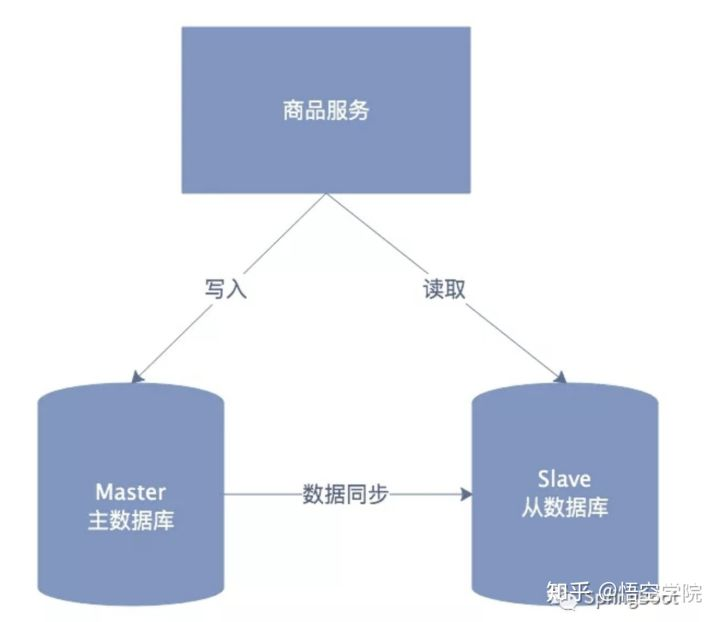
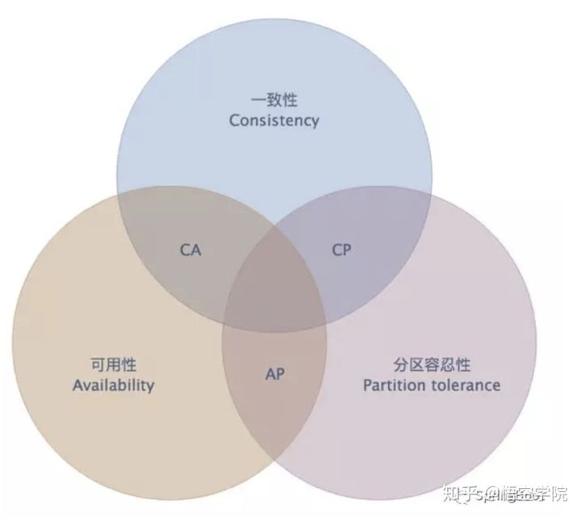

# 事务

## 事务的基本概念

就是一个**程序执行单元，里面的操作要么全部执行成功，要么全部执行失败**，不允许只成功一半另外一半执行失败的事情发生。例如一段事务代码做了两次数据库更新操作，那么这两次数据库操作要么全部执行成功，要么全部回滚。

## 事务的基本特性

我们知道**事务有4个非常重要的特性**，即我们常说的（**ACID**）

### Atomicity（原子性）

事务是一个不可分割的整体，所有操作要么全做，要么全不做；只要事务中有一个操作出错，回滚到事务开始前的状态的话，那么之前已经执行的所有操作都是无效的，都应该回滚到开始前的状态。

### Consistency（一致性）

事务执行前后，数据从一个状态到另一个状态必须是一致的，比如A向B转账（A、B的总金额就是一个**一致性状态**），不可能出现A扣了钱，B却没收到的情况发生。

### Isolation（隔离性）

多个并发事务之间相互隔离，不能互相干扰。关于事务的隔离性，可能不是特别好理解，这里的并发事务是指两个事务操作了同一份数据的情况；而对于并发事务操作同一份数据的隔离性问题，则是要求不能出现**脏读、幻读**的情况，即事务A不能读取事务B还没有提交的数据，或者在事务A读取数据进行更新操作时，不允许事务B率先更新掉这条数据。而为了解决这个问题，常用的手段就是加锁了，对于数据库来说就是通过数据库的相关锁机制来保证。

### Durablity（持久性）

事务完成后，对数据库的更改是永久保存的，不能回滚。

## 什么是分布式事务

其实分布式事务从实质上看与数据库事务的概念是一致的，既然是事务也就需要满足事务的基本特性（ACID），只是**分布式事务相对于本地事务而言其表现形式有很大的不同**。举个例子，在一个JVM进程中如果需要同时操作数据库的多条记录，而这些操作需要在一个事务中，那么我们可以通过数据库提供的事务机制（一般是数据库锁）来实现。

而随着这个**JVM进程（应用）被拆分成了微服务架构**，原本一个本地逻辑执行单元被拆分到了多个独立的微服务中，这些微服务又分别操作不同的数据库和表，服务之间通过网络调用。

分布式事务是为了解决微服务架构（形式都是分布式系统）中不同节点之间的数据一致性问题。**这个一致性问题本质上解决的也是传统事务需要解决的问题，**即一个请求在多个微服务调用链中，所有服务的数据处理要么全部成功，要么全部回滚。**当然分布式事务问题的形式可能与传统事务会有比较大的差异，**但是问题本质是一致的，都是要求解决数据的一致性问题。

## 分布式事务的基本原则

CAP是Consistency、Avaliability、Partitiontolerance三个词语的缩写，分别表示一致性、可用性、分区容忍性。

为了方便对CAP理论的理解，我们结合电商系统中的一些业务场景来理解CAP，如下图，是商品信息管理的执行流程：

**执行流程如下：**

1. 商品请求主数据库写入商品信息（添加商品、修改商品、删除商品）；
2. 主数据库向商品服务响应写入成功；
3. 商品服务请求从数据库读取商品信息；

### C - 一致性

一致性是写操作后的读操作可以读取到最新的数据状态，当数据分布在多个节点时，从任意节点读取到的数据都是最新的状态。

上图中，商品信息的读写要满足一致性就是要实现如下目标：

1. 商品服务写入主数据库成功，则向从数据库查询新数据也成功。
2. 商品服务写入主数据库失败，则向从数据库查询新数据也失败。

#### 如何实现一致性？

1. 写入主数据库后要将数据同步到从数据库。
2. 写入主数据库后，在向从数据库同步期间要将从数据库锁定，待同步完成后再释放锁，以免在新数据库写入成功后，向从数据库查询到旧的数据。

#### 分布式一致性的特点：

1. 由于存在数据同步的过程，写操作的相应会有一定延迟。
2. 为了保证数据一致性会对资源暂时锁定，待数据同步完成释放锁定资源。
3. 如果请求数据同步失败的节点则会返回错误信息，一定不会返回旧信息。

### A  - 可用性

可用性是指任何事务操作都可以得到相应结果，且不会出现响应超时或响应错误。

上图中，商品信息的读取要满足可用性就是要实现如下目标：

1. 从数据库接收到查询的请求则立即能够响应数据查询结果。
2. 从数据库查询不允许出现响应超时或者响应错误。

#### 如何实现可用性？

1. 写入主数据库要将数据同步到从数据库。
2. 由于要保证从数据库的可用性，不可将从数据库中的资源锁定。
3. 即时数据还没有同步过来，从数据库也要返回要查询的数据，哪怕是旧数据，如果连旧数据也没有则可以按照约定返回一个默认信息，但不能返回错误或响应超时。

#### 分布式系统可用性的特点：

1. 所有请求都有响应，且不会出现响应超时或者响应错误。

### P - 分区容错性

通常分布式系统的各个节点部署在不同的子网，这就是网络分区，不可避免的会出现由于网络问题而导致节点之间通信失败，此时仍可对外提供服务，这叫分区容忍性。

上图中，商品信息读写要满足分区容忍性就是要实现如下目标：

1. 主数据向从数据库同步数据失败不影响读写操作。
2. 一个节点挂掉不影响另一个节点对外提供服务。

#### 如何实现分区容忍性？

1. 尽量使用异步取代同步操作，例如使用异步方式将数据从主数据库同步到从数据库，这样节点之间有效的实现松耦合。
2. 添加从数据库节点，其中一个节点挂掉其它节点提供服务。

#### 分布式分区容忍性的特点：

1. 分区容忍性是分布式系统具备的基本能力。

### CAP组合方式

分区容忍的含义：

1. 主数据库通过网络向从数据库同步数据，可以认为主从数据库部署在不同的分区上，通过网络进行交互。
2. 当主数据库和从数据库之间的网络出现问题不影响主数据库和从数据库对外提供服务。
3. 其一个节点挂掉不影响另一个节点对外提供服务。

#### 组合分析

如果要实现C则必须保证数据一致性，在数据同步的时候为防止向从数据库查询的不一致则需要从数据库锁定，待完成同步之后解锁，如果同步失败从数据库要返回错误信息或超时信息。

如果要实现A则必须保证数据可用性，不管任何时候都可以向从数据库进行查询数据，并且不能够返回错误信息或者超时信息

通过分析在满足P的前提下，C和A存在矛盾。

#### CA组合

CA组合就是保证一致性和可用性，放弃分区容忍性，即不进行分区，不考虑由于网络不通或节点挂掉的问题。那么系统将不是一个标准的分布式系统，我们最常用的关系型数据库就满足了CA。

#### CP组合

CP组合就是保证一致性和分区容忍性，放弃可用性。Zookerper就是追求强一致性，放弃了可用性，还有跨行转账，一次转账请求要等待双方银行系统都完成整个事务才能完成。

#### AP组合

AP组合就是保证可用性和分区容忍性，放弃一致性。这是分布式系统设计时的选择。

#### 总结

CAP是一个已经证实的理论：一个分布式系统做多只能满足CAP中的两项，为达到良好的响应性能来提高用户体验，因此一般会做出如下选择：**保证A和P，舍弃C强一致性，保证最终一致性**。

## 基于XA协议的分布式事务

### 两阶段提交（2PC）

### 三阶段提交（3PC）

## 补偿事务（TCC）

## 消息队列MQ事务

