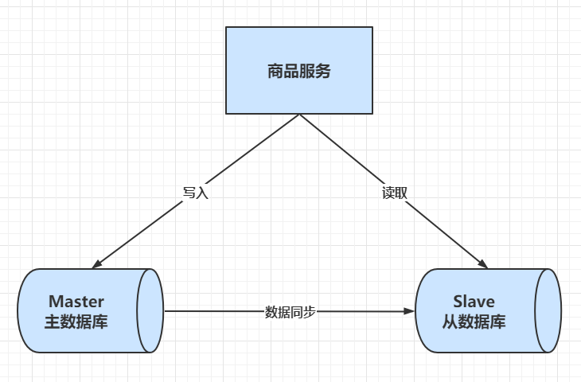
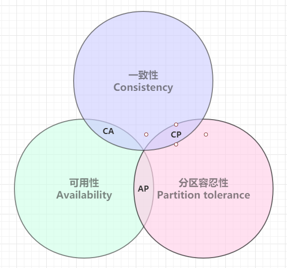
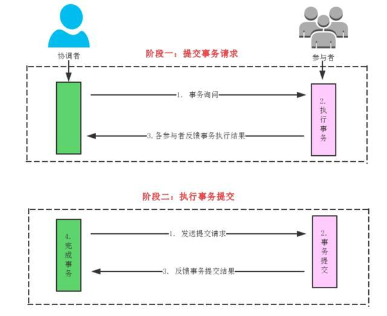
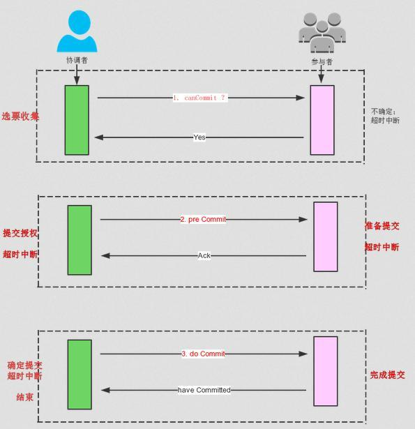

# 事务

## 事务的基本概念

就是一个**程序执行单元，里面的操作要么全部执行成功，要么全部执行失败**，不允许只成功一半另外一半执行失败的事情发生。例如一段事务代码做了两次数据库更新操作，那么这两次数据库操作要么全部执行成功，要么全部回滚。

## 事务的基本特性

我们知道**事务有4个非常重要的特性**，即我们常说的（**ACID**）

### Atomicity（原子性）

事务是一个不可分割的整体，所有操作要么全做，要么全不做；只要事务中有一个操作出错，回滚到事务开始前的状态的话，那么之前已经执行的所有操作都是无效的，都应该回滚到开始前的状态。

### Consistency（一致性）

事务执行前后，数据从一个状态到另一个状态必须是一致的，比如A向B转账（A、B的总金额就是一个**一致性状态**），不可能出现A扣了钱，B却没收到的情况发生。

### Isolation（隔离性）

多个并发事务之间相互隔离，不能互相干扰。关于事务的隔离性，可能不是特别好理解，这里的并发事务是指两个事务操作了同一份数据的情况；而对于并发事务操作同一份数据的隔离性问题，则是要求不能出现**脏读、幻读**的情况，即事务A不能读取事务B还没有提交的数据，或者在事务A读取数据进行更新操作时，不允许事务B率先更新掉这条数据。而为了解决这个问题，常用的手段就是加锁了，对于数据库来说就是通过数据库的相关锁机制来保证。

### Durablity（持久性）

事务完成后，对数据库的更改是永久保存的，不能回滚。

## 什么是分布式事务

其实分布式事务从实质上看与数据库事务的概念是一致的，既然是事务也就需要满足事务的基本特性（ACID），只是**分布式事务相对于本地事务而言其表现形式有很大的不同**。举个例子，在一个JVM进程中如果需要同时操作数据库的多条记录，而这些操作需要在一个事务中，那么我们可以通过数据库提供的事务机制（一般是数据库锁）来实现。

而随着这个**JVM进程（应用）被拆分成了微服务架构**，原本一个本地逻辑执行单元被拆分到了多个独立的微服务中，这些微服务又分别操作不同的数据库和表，服务之间通过网络调用。

分布式事务是为了解决微服务架构（形式都是分布式系统）中不同节点之间的数据一致性问题。**这个一致性问题本质上解决的也是传统事务需要解决的问题，**即一个请求在多个微服务调用链中，所有服务的数据处理要么全部成功，要么全部回滚。**当然分布式事务问题的形式可能与传统事务会有比较大的差异，**但是问题本质是一致的，都是要求解决数据的一致性问题。

## 分布式事务的基本原则

CAP是Consistency、Avaliability、Partitiontolerance三个词语的缩写，分别表示一致性、可用性、分区容忍性，CAP理论：一个分布式系统最多只能同时满足一致性（Consistency）、可用性（Availability）和分区容错性（Partition tolerance）这三项中的两项。

为了方便对CAP理论的理解，我们结合电商系统中的一些业务场景来理解CAP，如下图，是商品信息管理的执行流程：

**执行流程如下：**

1. 商品请求主数据库写入商品信息（添加商品、修改商品、删除商品）；
2. 主数据库向商品服务响应写入成功；
3. 商品服务请求从数据库读取商品信息；

### C - 一致性

一致性是写操作后的读操作可以读取到最新的数据状态，当数据分布在多个节点时，从任意节点读取到的数据都是最新的状态。

上图中，商品信息的读写要满足一致性就是要实现如下目标：

1. 商品服务写入主数据库成功，则向从数据库查询新数据也成功。
2. 商品服务写入主数据库失败，则向从数据库查询新数据也失败。

#### 如何实现一致性？

1. 写入主数据库后要将数据同步到从数据库。
2. 写入主数据库后，在向从数据库同步期间要将从数据库锁定，待同步完成后再释放锁，以免在新数据库写入成功后，向从数据库查询到旧的数据。

#### 分布式一致性的特点：

1. 由于存在数据同步的过程，写操作的相应会有一定延迟。
2. 为了保证数据一致性会对资源暂时锁定，待数据同步完成释放锁定资源。
3. 如果请求数据同步失败的节点则会返回错误信息，一定不会返回旧信息。

#### 一致性的不同策略

从客户端角度，多进程并发访问时，更新过的数据在不同进程如何获取的不同策略，决定了不同的一致性：

1. 强一致性：对于关系型数据库，要求更新过的数据能被后续的访问都能看到。
2. 弱一致性：能容忍后续的部分或者全部访问不到。
3. 最终一致性：经过一段时间后要求能访问到更新后的数据。

> CAP中说，不可能同时满足的这个一致性指的是强一致性。

### A  - 可用性

可用性是指任何事务操作都可以得到相应结果，且不会出现响应超时或响应错误。

上图中，商品信息的读取要满足可用性就是要实现如下目标：

1. 从数据库接收到查询的请求则立即能够响应数据查询结果。
2. 从数据库查询不允许出现响应超时或者响应错误。

#### 如何实现可用性？

1. 写入主数据库要将数据同步到从数据库。
2. 由于要保证从数据库的可用性，不可将从数据库中的资源锁定。
3. 即时数据还没有同步过来，从数据库也要返回要查询的数据，哪怕是旧数据，如果连旧数据也没有则可以按照约定返回一个默认信息，但不能返回错误或响应超时。

#### 分布式系统可用性的特点：

1. 所有请求都有响应，且不会出现响应超时或者响应错误。

### P - 分区容错性

通常分布式系统的各个节点部署在不同的子网，这就是网络分区，不可避免的会出现由于网络问题而导致节点之间通信失败，此时仍可对外提供服务，这叫分区容忍性。

上图中，商品信息读写要满足分区容忍性就是要实现如下目标：

1. 主数据向从数据库同步数据失败不影响读写操作。
2. 一个节点挂掉不影响另一个节点对外提供服务。

#### 如何实现分区容忍性？

1. 尽量使用异步取代同步操作，例如使用异步方式将数据从主数据库同步到从数据库，这样节点之间有效的实现松耦合。
2. 添加从数据库节点，其中一个节点挂掉其它节点提供服务。

#### 分布式分区容忍性的特点：

1. 分区容忍性是分布式系统具备的基本能力。

### CAP组合方式

分区容忍的含义：

1. 主数据库通过网络向从数据库同步数据，可以认为主从数据库部署在不同的分区上，通过网络进行交互。
2. 当主数据库和从数据库之间的网络出现问题不影响主数据库和从数据库对外提供服务。
3. 其一个节点挂掉不影响另一个节点对外提供服务。

#### 组合分析

如果要实现C则必须保证数据一致性，在数据同步的时候为防止向从数据库查询的不一致则需要从数据库锁定，待完成同步之后解锁，如果同步失败从数据库要返回错误信息或超时信息。

如果要实现A则必须保证数据可用性，不管任何时候都可以向从数据库进行查询数据，并且不能够返回错误信息或者超时信息

通过分析在满足P的前提下，C和A存在矛盾。

#### CA组合

CA组合就是保证一致性和可用性，放弃分区容忍性，即不进行分区，不考虑由于网络不通或节点挂掉的问题。那么系统将不是一个标准的分布式系统，我们最常用的关系型数据库就满足了CA。

#### CP组合

CP组合就是保证一致性和分区容忍性，放弃可用性。Zookerper就是追求强一致性，放弃了可用性，还有跨行转账，一次转账请求要等待双方银行系统都完成整个事务才能完成。

#### AP组合

AP组合就是保证可用性和分区容忍性，放弃一致性。这是分布式系统设计时的选择。

#### 总结

CAP是一个已经证实的理论：一个分布式系统做多只能满足CAP中的两项。

## 基于XA协议的分布式事务

> 有一个事务协调者（事务管理的中心节点），所有的事务参与者都要给他发送消息。提交还是回滚，都是由这个协调者发出的。

### 两阶段提交（2PC）

参与者（所有节点RM）将操作成败通知协调者(事务管理器TM)，再由协调者根据所有参与者的反馈情报决定各参与者是否要提交操作还是中止操作。

#### 第一阶段：准备阶段(投票阶段)

事务协调者(事务管理器)给每个参与者(资源管理器)发送Prepare消息，每个参与者要么直接返回失败(如权限验证失败)，要么在本地执行事务，写本地的redo和undo日志，但不提交，到达一种“万事俱备，只欠东风”的状态。

可以进一步将准备阶段分为以下三个步骤：

1. 协调者节点向所有参与者节点询问是否可以执行提交操作(vote)，并开始等待各参与者节点的响应。
2. 参与者节点执行询问发起为止的所有事务操作，并将Undo信息和Redo信息写入日志。（注意：若成功这里其实每个参与者已经执行了事务操作）
3. 各参与者节点响应协调者节点发起的询问。如果参与者节点的事务操作实际执行成功，则它返回一个”同意”消息；如果参与者节点的事务操作实际执行失败，则它返回一个”中止”消息。

#### 第二阶段：提交阶段（执行阶段）

如果协调者收到了参与者的失败消息或者超时，直接给每个参与者发送回滚(Rollback)消息；否则，发送提交(Commit)消息；参与者根据协调者的指令执行提交或者回滚操作，释放所有事务处理过程中使用的锁资源。(注意：必须在最后阶段释放锁资源)

接下来分两种情况分别讨论提交阶段的过程。

1. 当协调者节点从所有参与者节点获得的相应消息都为”同意”时：
   1. 协调者节点向所有参与者节点发出”正式提交(commit)”的请求。
   2. 参与者节点正式完成操作，并释放在整个事务期间内占用的资源。
   3. 参与者节点向协调者节点发送”完成”消息。
   4. 协调者节点受到所有参与者节点反馈的”完成”消息后，完成事务。
2. 如果任一参与者节点在第一阶段返回的响应消息为”中止”，或者 协调者节点在第一阶段的询问超时之前无法获取所有参与者节点的响应消息时：
   1. 协调者节点向所有参与者节点发出”回滚操作(rollback)”的请求。
   2. 参与者节点利用之前写入的Undo信息执行回滚，并释放在整个事务期间内占用的资源。
   3. 参与者节点向协调者节点发送”回滚完成”消息。
   4. 协调者节点受到所有参与者节点反馈的”回滚完成”消息后，取消事务。

> 不管最后结果如何，第二阶段都会结束当前事务，释放锁资源。

#### 存在的问题：

1. 同步阻塞问题。执行过程中，所有参与节点都是事务阻塞型的。当参与者占有公共资源时，其他第三方节点访问公共资源不得不处于阻塞状态。
2. 单点故障。由于协调者的重要性，一旦协调者发生故障。参与者会一直阻塞下去。尤其在第二阶段，协调者发生故障，那么所有的参与者还都处于锁定事务资源的状态中，而无法继续完成事务操作。（如果是协调者挂掉，可以重新选举一个协调者，但是无法解决因为协调者宕机导致的参与者处于阻塞状态的问题）
3. 数据不一致。在二阶段提交的阶段二中，当协调者向参与者发送commit请求之后，发生了局部网络异常或者在发送commit请求过程中协调者发生了故障，这回导致只有一部分参与者接受到了commit请求。而在这部分参与者接到commit请求之后就会执行commit操作。但是其他部分未接到commit请求的机器则无法执行事务提交。于是整个分布式系统便出现了数据部一致性的现象。
4. 二阶段无法解决的问题：协调者再发出commit消息之后宕机，而唯一接收到这条消息的参与者同时也宕机了。那么即使协调者通过选举协议产生了新的协调者，这条事务的状态也是不确定的，没人知道事务是否被已经提交。

### 三阶段提交（3PC）

三阶段提交（3PC），也叫三阶段提交协议（Three-phase commit protocol），是二阶段提交（2PC）的改进版本。与两阶段提交不同的是，三阶段提交有两个改动点：

1. 引入超时机制。同时在协调者和参与者中都引入超时机制。
2. 在第一阶段和第二阶段中插入一个准备阶段。保证了在最后提交阶段之前各参与节点的状态是一致的。

> 也就是说，除了引入超时机制之外，3PC把2PC的准备阶段再次一分为二，这样三阶段提交就有`CanCommit`、`PreCommit`、`DoCommit`三个阶段。

#### 第一阶段：CanCommit

协调者向参与者发送commit请求，参与者如果可以提交就返回Yes响应，否则返回No响应。

1. **事务询问** 协调者向参与者发送CanCommit请求。询问是否可以执行事务提交操作。然后开始等待参与者的响应。
2. **响应反馈** 参与者接到CanCommit请求之后，正常情况下，如果其自身认为可以顺利执行事务，则返回Yes响应，并进入预备状态。否则反馈No

#### 第二阶段：PreCommit

协调者根据参与者的反应情况来决定是否可以记性事务的PreCommit操作。根据响应情况，有以下两种可能。

1. 假如协调者从所有的参与者获得的反馈都是Yes响应，那么就会执行事务的预执行
   1. **发送预提交请求** 协调者向参与者发送PreCommit请求，并进入Prepared阶段。
   2. **事务预提交** 参与者接收到PreCommit请求后，会执行事务操作，并将undo和redo信息记录到事务日志中。
   3. **响应反馈** 如果参与者成功的执行了事务操作，则返回ACK响应，同时开始等待最终指令。
2. 假如有任何一个参与者向协调者发送了No响应，或者等待超时之后，协调者都没有接到参与者的响应，那么就执行事务的中断
   1. **发送中断请求** 协调者向所有参与者发送abort请求。
   2. **中断事务** 参与者收到来自协调者的abort请求之后（或超时之后，仍未收到协调者的请求），执行事务的中断。

#### 第三阶段：doCommit

该阶段进行真正的事务提交，也可以分为以下两种情况。

1. 执行提交
   1. **发送提交请求** 协调接收到参与者发送的ACK响应，那么他将从预提交状态进入到提交状态。并向所有参与者发送doCommit请求。
   2. **事务提交** 参与者接收到doCommit请求之后，执行正式的事务提交。并在完成事务提交之后释放所有事务资源。
   3. **响应反馈** 事务提交完之后，向协调者发送Ack响应。
   4. **完成事务** 协调者接收到所有参与者的ack响应之后，完成事务。
2. 中断事务：协调者没有接收到参与者发送的ACK响应（可能是接受者发送的不是ACK响应，也可能响应超时），那么就会执行中断事务。
   1. **发送中断请求** 协调者向所有参与者发送abort请求
   2. **事务回滚** 参与者接收到abort请求之后，利用其在阶段二记录的undo信息来执行事务的回滚操作，并在完成回滚之后释放所有的事务资源。
   3. **反馈结果** 参与者完成事务回滚之后，向协调者发送ACK消息
   4. **中断事务** 协调者接收到参与者反馈的ACK消息之后，执行事务的中断。

> 在 doCommit 阶段，如果参与者无法及时接收到来自协调者的doCommit或者rebort请求时，会在等待超时之后，会继续进行事务的提交。（其实这个应该是基于概率来决定的，当进入第三阶段时，说明参与者在第二阶段已经收到了PreCommit请求，那么协调者产生PreCommit请求的前提条件是他在第二阶段开始之前，收到所有参与者的CanCommit响应都是Yes。（一旦参与者收到了PreCommit，意味他知道大家其实都同意修改了）所以，一句话概括就是，当进入第三阶段时，由于网络超时等原因，虽然参与者没有收到commit或者abort响应，但是他有理由相信：成功提交的几率很大。 ）

#### 存在问题：一致性问题。

相对于2PC，3PC主要解决的单点故障问题，并减少阻塞，因为一旦参与者无法及时收到来自协调者的信息之后，他会默认执行commit。而不会一直持有事务资源并处于阻塞状态。但是这种机制也会导致数据一致性问题，因为，由于网络原因，协调者发送的abort响应没有及时被参与者接收到，那么参与者在等待超时之后执行了commit操作。这样就和其他接到abort命令并执行回滚的参与者之间存在数据不一致的情况。

## 补偿事务（TCC）

> 事务依次执行，如果发现有失败的，把前面执行成功的任务进行回滚。（需要记录一个事务执行链，没有中心的概念）。

TCC 事务机制相比于上面介绍的 XA，解决了如下几个缺点：

1. 解决了协调者单点，由主业务方发起并完成这个业务活动。业务活动管理器也变成多点，引入集群。
2. 同步阻塞：引入超时，超时后进行补偿，并且不会锁定整个资源，将资源转换为业务逻辑形式，粒度变小。
3. 数据一致性，有了补偿机制之后，由业务活动管理器控制一致性。

TCC 的步骤：

1. Try 阶段：尝试执行，完成所有业务检查（一致性），预留必需业务资源（准隔离性）。
2. Confirm 阶段：确认真正执行业务，不作任何业务检查，只使用 Try 阶段预留的业务资源，Confirm 操作满足幂等性。要求具备幂等设计，Confirm 失败后需要进行重试。
3. Cancel 阶段：取消执行，释放 Try 阶段预留的业务资源，Cancel 操作满足幂等性。Cancel 阶段的异常和 Confirm 阶段异常处理方案基本上一致。

**举例说明：如果你用 100 元买了一瓶水**

1. Try 阶段：你需要向你的钱包检查是否够 100 元并锁住这 100 元，水也是一样的。
2. 如果有一个失败，则进行 Cancel(释放这 100 元和这一瓶水)，如果 Cancel 失败不论什么失败都进行重试 Cancel，所以需要保持幂等。
3. 如果都成功，则进行 Confirm，确认这 100 元被扣，和这一瓶水被卖，如果 Confirm 失败无论什么失败则重试(会依靠活动日志进行重试)。

**TCC 适合的场景：**

1. 强隔离性，严格一致性要求的活动业务。
2. 执行时间较短的业务。

## 消息队列MQ事务

