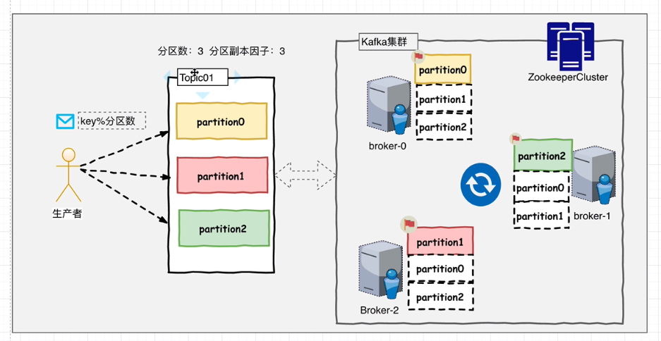
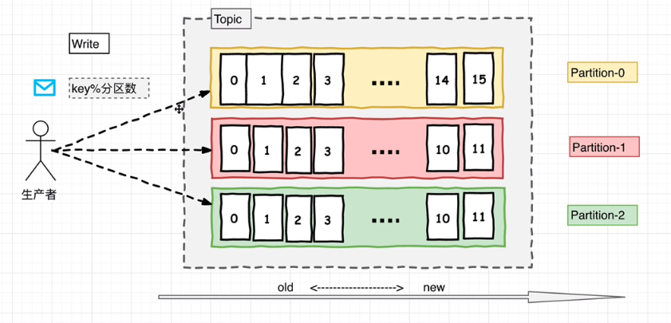
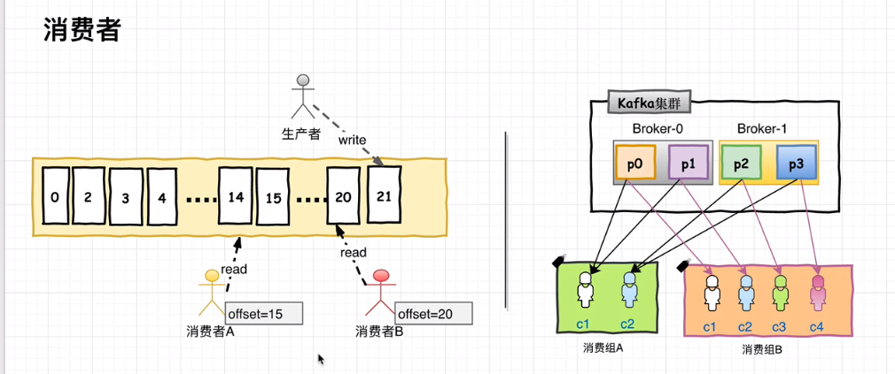
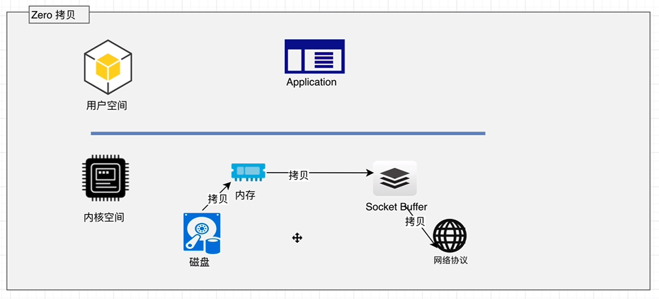
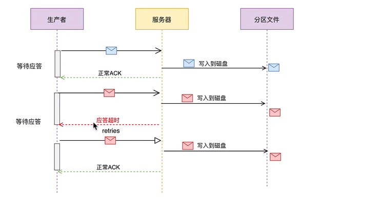
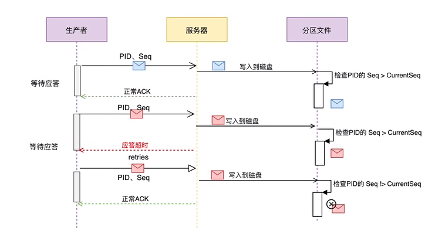
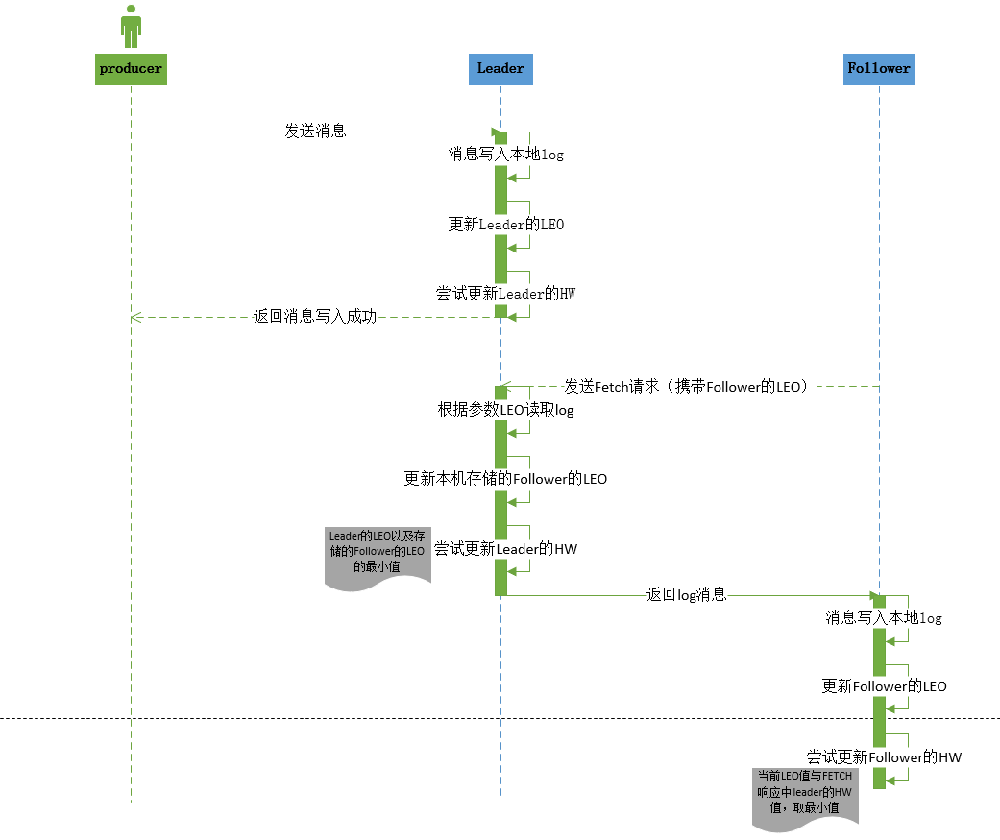
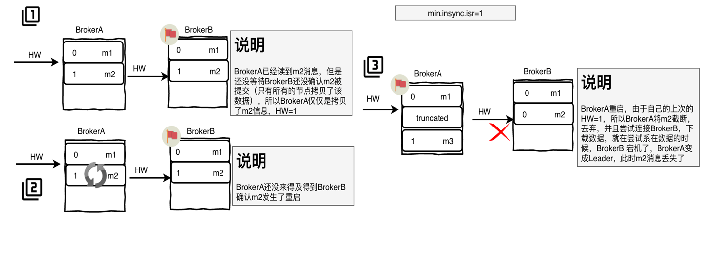
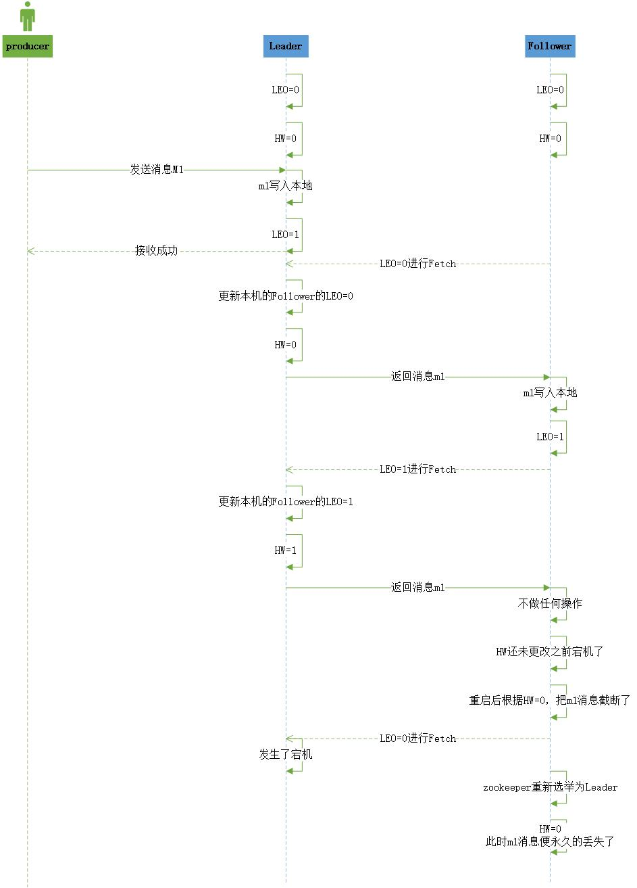
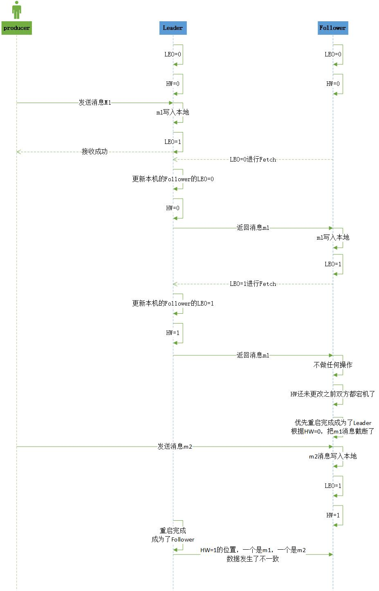

# Kafka

## Kafka介绍

​		Kafka是由Apache软件基金会开发的一个开源流处理平台，由Scala和Java编写。Kafka是一种高吞吐量的分布式发布订阅消息系统，它可以收集并处理用户在网站中的所有动作流数据以及物联网设备的采样信息。

​		该平台提供了消息的订阅与发布的消息队列，一般用作系统间**解耦**、**异步通信**、**削峰填谷**等作用。同时Kafka又提供了Kafka streaming插件包实现了实时在线流处理。相比较一些专业的流处理框架不同，Kafka Streaming计算是运行在应用端，具有简单、入门要求低、部署方便等优点。

> 当A需要调用B的时候，B在某些情况下可能存在不可用的情况，此时就会影响A业务的正常处理。所以此时A可以把需要B处理的消息推动Kafka中后，然后就立即返回（不会影响A业务本身），然后B通过Kafka获取要处理的消息进行处理。

## 消息队列的分类

### 至多一次

​		消息生产者将数据写入消息系统，然后由消费者负责去拉去消息服务器中的消息，一旦消息被确认消费之后 ，由消息服务器主动删除队列中的数据，这种消费方式一般只允许被一个消费者消费，并且消息队列中的数据不允许被重复消费。

### 没有限制

​		同上诉消费形式不同，生产者发不完数据以后，该消息可以被多个消费者同时消费，并且同一个消费者可以多次消费消息服务器中的同一个记录。主要是因为消息服务器一般可以长时间存储海量消息。

## Kakfa基本架构

### Topic，分区，副本基本概念

​		Kafka集群以Topic形式负责分类集群中的记录，每一个记录属于一个Topic。每个Topic底层都会对应一组分区的日志用于持久化Topic中的记录。同时在Kafka集群中，Topic的每一个日志的分区都一定会有1个Borker担当该分区的Leader，其他的Broker担当该分区的follower，Leader负责分区数据的读写操作，follower负责同步该分区的数据。这样如果分区的Leader宕机，该分区的其他follower会选取出新的leader继续负责该分区数据的读写。

**kafka中leader的选举使用Zookeeper进行分布式协调**



### 分区

​		每组日志分区是一个**有序**的不可变的的日志序列，分区中的每一条记录都被分配了唯一的序列编号称为offset（记录在分区中的位置），Kafka 集群会持久化所有发布到Topic中的记录信息，该记录的持久化时间是通过配置文件指定,默认是168小时。Kafka使用硬盘存储日志文件。<font color=red>**分区内部有序，外部无序**</font>

> log.retention.hours=168
>
> 消息记录的表示形式：Record：Key / Value / Timestamp



### 消费者

​		在消费者消费Topic中数据的时候，每个消费者会维护本次消费对应分区的偏移量，消费者会在消费完一个批次的数据之后，会将本次消费的偏移量提交给Kafka集群，因此对于每个消费者而言可以随意的控制改消费者的偏移量。因此在Kafka中，消费者可以从一个topic分区中的任意位置读取队列数据，由于每个消费者控制了自己的消费的偏移量，因此多个消费者之间彼此相互独立。

​		消费者使用Consumer Group名称标记自己，并且发布到Topic的每条记录都会传递到每个订阅Consumer Group中的每一个消费者实例。如果所有Consumer实例都具有相同的Consumer Group，那么Topic中的记录会在该ConsumerGroup中的Consumer实例进行均分消费；如果所有Consumer实例具有不同的ConsumerGroup，则每条记录将广播到所有Consumer Group进程。

> 一般情况下，在同一个消费组内，消费者的数量不会大于分区的数量；如果消费者数量大于分区的个数，那么会有一些消费者不会任何消费，只有当正在消费的消费者出现故障时，这些空闲的消费者才会去消费。



### 顺序写入、MMAP、零拷贝

​		Kafka的特性之一就是高吞吐率，但是Kafka的消息是保存或缓存在磁盘上的，一般认为在磁盘上读写数据是会降低性能的，但是Kafka即使是普通的服务器，Kafka也可以轻松支持每秒百万级的写入请求，超过了大部分的消息中间件，这种特性也使得Kafka在日志处理等海量数据场景广泛应用。Kafka会把收到的消息都写入到硬盘中，防止丢失数据。为了优化写入速度Kafka采用了两个技术顺序写入和MMFile 。

#### 顺序写入、MMAP

​		因为硬盘是机械结构，每次读写都会寻址->写入，其中寻址是一个“机械动作”，它是最耗时的。所以硬盘最讨厌随机I/O，最喜欢顺序I/O。为了提高读写硬盘的速度，Kafka就是使用顺序I/O。这样省去了大量的内存开销以及节省了IO寻址的时间。但是单纯的使用顺序写入，Kafka的写入性能也不可能和内存进行对比，因此Kafka的数据并不是实时的写入硬盘中 。

​		Kafka充分利用了操作系统分页存储来使内存提高I/O效率。Memory Mapped Files(后面简称mmap)也称为内存映射文件，在64位操作系统中一般可以表示20G的数据文件，它的工作原理是直接利用操作系统的Page实现文件到物理内存的直接映射。完成MMP映射后，用户对内存的所有操作会被操作系统自动的刷新到磁盘上，极大地降低了IO使用率。


#### Zero拷贝

​		Kafka服务器在响应客户端读取的时候，底层使用ZeroCopy技术，直接将磁盘无需拷贝到用户空间，而是直接将数据通过内核空间传递输出，数据并没有抵达用户空间。

**传统IO操作**

1. 用户进程调用read等系统调用向操作系统发出IO请求，请求读取数据到自己的内存缓冲区中。自己进入阻塞状态。

2. 操作系统收到请求后，进一步将IO请求发送磁盘。

3. 磁盘驱动器收到内核的IO请求，把数据从磁盘读取到驱动器的缓冲中。此时不占用CPU。当驱动器的缓冲区被读满后，向内核发起中断信号告知自己缓冲区已满。

4. 内核收到中断，使用CPU时间将磁盘驱动器的缓存中的数据拷贝到内核缓冲区中。

5. 如果内核缓冲区的数据少于用户申请的读的数据，重复步骤3跟步骤4，直到内核缓冲区的数据足够多为止。

6. 将数据从内核缓冲区拷贝到用户缓冲区，同时从系统调用中返回。完成任务

   

   

**DMA读取**

1. 用户进程调用read等系统调用向操作系统发出IO请求，请求读取数据到自己的内存缓冲区中。自己进入阻塞状态。

2. 操作系统收到请求后，进一步将IO请求发送DMA。然后让CPU干别的活去。

3. DMA进一步将IO请求发送给磁盘。

4. 磁盘驱动器收到DMA的IO请求，把数据从磁盘读取到驱动器的缓冲中。当驱动器的缓冲区被读满后，向DMA发起中断信号告知自己缓冲区已满。

5. DMA收到磁盘驱动器的信号，将磁盘驱动器的缓存中的数据拷贝到内核缓冲区中。此时不占用CPU。这个时候只要内核缓冲区的数据少于用户申请的读的数据，内核就会一直重复步骤3跟步骤4，直到内核缓冲区的数据足够多为止。

6. 当DMA读取了足够多的数据，就会发送中断信号给CPU。

7. CPU收到DMA的信号，知道数据已经准备好，于是将数据从内核拷贝到用户空间，系统调用返回。

   

   

### Kafka使用分区存储的优点

1. 可以打破单机存储的容量，支持存储海量数据；分区数量越多，存储的记录就越多
2. 每个分区都有自己独立的 leader 担任记录的读和写。分区数越大，能够处理的写入并发也就越大，意味着能够极大的提升写入性能
3. 每个分区的 leader 可能分布在不同的物理机器上，间接的达到负载均衡的目的
4. 在同一个消费者组内，一个分区只能让一个消费者进行消费，增大分区数量，可以增大消费者的消费能力

### 消息进入分区的算法

1. hash：根据key值的hash除以Topic分区数：能够保证相同的key值肯定会落入同一分区，且能够使数据均匀的分散在不同的分区。

2. 轮训：

3. 随机：

   > 当有key的时候；默认第一种；没有key的时候，默认轮训

### 数据丢失可能存在的情况

1. 内核不稳定，当应用系统通过MMAP把数据刚写进去，就断电了，还没来得及刷新到磁盘，会产生数据的丢失（这种情况几乎不会发生）。
2. 应答为默认时；当记录写入leader之后宕机了，此时follower还没有复制完成，则记录会丢失。因为当leader宕机之后，会进行重新选举，当原leader再次重启之后就变为了follower，数据不会进行恢复。
3. 

## Kafka的安装部署

### Zookeeper客户端连接

```shell
zkCli.sh -server bigdata01:2181,bigdata02:2181,bigdata03:2181,bigdata04:2181
```

### 单机部署

#### 解压到指定目录

```shell
mkdir -p /opt/bigdata/kafka_2.12-2.4.1-local
tar -zvxf /root/kafka_2.12-2.4.1.tgz -C /opt/bigdata/kafka_2.12-2.4.1-local/
cd /opt/bigdata/kafka_2.12-2.4.1-local
mv kafka_2.12-2.4.1/* .
rm -rf kafka_2.12-2.4.1/
```

#### 设置环境变量

```shell
vi /etc/profile
```

```shell
export KAFKA_HOME=/opt/bigdata/kafka_2.12-2.4.1-local
export PATH=$PATH:$KAFKA_HOME/bin
```

```shell
source /etc/profile
```

#### 执行配置

cd $KAFKA_HOME/config

vim server.properties

```properties
# 更新监听地址
listeners=PLAINTEXT://bigdata01:9092
# 更新日志文件的路径
log.dirs=/opt/bigdata/kafka_2.12-2.4.1-local/kafka-logs
# zookeeper连接地址
zookeeper.connect=bigdata01:2181,bigdata02:2181,bigdata03:2181,bigdata04:2181/kafka-local
```

#### 启动Kafka

```shell
cd $KAFKA_HOME
./bin/kafka-server-start.sh -daemon config/server.properties
```

#### 关闭Kafka

```shell
cd $KAFKA_HOME
./bin/kafka-server-stop.sh 
```

#### Kafka简单使用

```shell
# 进入kafka目录
cd $KAFKA_HOME
# 创建topic(单机部署的Kafka，副本因子只能是1)
./bin/kafka-topics.sh \
                    --bootstrap-server bigdata01:9092 \
                    --create \
                    --topic topic01 \
                    --partitions 3 \
                    --replication-factor 1      
# 查看分区
./bin/kafka-topics.sh --bootstrap-server bigdata01:9092 --list
# 查看分区详情
./bin/kafka-topics.sh --bootstrap-server bigdata01:9092 --describe --topic topic01 

# 启动消费者订阅topic01
./bin/kafka-console-consumer.sh \
                  --bootstrap-server bigdata01:9092 \
                  --topic topic01 \
                  --group g1 
# 启动生产者
./bin/kafka-console-producer.sh \
                  --broker-list bigdata01:9092 \
                  --topic topic01
```

### 集群高可用部署

#### 解压到指定目录

```shell
mkdir -p /opt/bigdata/kafka_2.12-2.4.1-ha
tar -zvxf /root/kafka_2.12-2.4.1.tgz -C /opt/bigdata/kafka_2.12-2.4.1-ha/
cd /opt/bigdata/kafka_2.12-2.4.1-ha
mv kafka_2.12-2.4.1/* .
rm -rf kafka_2.12-2.4.1/
```

#### 设置环境变量

```shell
vi /etc/profile
```

```shell
export KAFKA_HOME=/opt/bigdata/kafka_2.12-2.4.1-ha
export PATH=$PATH:$KAFKA_HOME/bin
```

```shell
source /etc/profile
```

#### 执行配置

cd $KAFKA_HOME/config

vim server.properties

```properties
# 每台机器这个值需要改一下
broker.id=0
# 更新监听地址
listeners=PLAINTEXT://bigdata01:9092
# 更新日志文件的路径
log.dirs=/opt/bigdata/kafka_2.12-2.4.1-ha/kafka-logs
# zookeeper连接地址
zookeeper.connect=bigdata01:2181,bigdata02:2181,bigdata03:2181,bigdata04:2181/kafka-ha
```

#### 配置分发

```shell
scp server.properties bigdata02:`pwd`
scp server.properties bigdata03:`pwd`
scp server.properties bigdata04:`pwd`

```

#### 启动Kafka

```shell
cd $KAFKA_HOME
./bin/kafka-server-start.sh -daemon config/server.properties
```

#### 关闭Kafka

```shell
cd $KAFKA_HOME
./bin/kafka-server-stop.sh 
```

#### Kafka使用

```shell
# 进入kafka目录
cd $KAFKA_HOME
# 创建topic
./bin/kafka-topics.sh \
                    --bootstrap-server bigdata01:9092,bigdata02:9092,bigdata03:9092,bigdata04:9092 \
                    --create \
                    --topic topic01 \
                    --partitions 2 \
                    --replication-factor 2
# 查看分区
./bin/kafka-topics.sh --bootstrap-server bigdata01:9092,bigdata02:9092,bigdata03:9092,bigdata04:9092 --list
# 查看分区详情
./bin/kafka-topics.sh --bootstrap-server bigdata01:9092,bigdata02:9092,bigdata03:9092,bigdata04:9092 --describe --topic topic01 
# 修改topic分区（分区数只能增，不能减）
./bin/kafka-topics.sh \
                    --bootstrap-server bigdata01:9092,bigdata02:9092,bigdata03:9092,bigdata04:9092 \
                    --alter \
                    --topic topic01 \
                    --partitions 3
# 删除topic
./bin/kafka-topics.sh \
                    --bootstrap-server bigdata01:9092,bigdata02:9092,bigdata03:9092,bigdata04:9092 \
                    --delete \
                    --topic topic01
# 启动消费者订阅topic01
./bin/kafka-console-consumer.sh \
                  --bootstrap-server bigdata01:9092,bigdata02:9092,bigdata03:9092,bigdata04:9092 \
                  --topic topic01 \
                  --group g1 \
                  --property print.key=true \
                  --property print.value=true \
                  --property key.separator=,
# 启动生产者
./bin/kafka-console-producer.sh \
                  --broker-list bigdata01:9092,bigdata02:9092,bigdata03:9092,bigdata04:9092 \
                  --topic topic01
# 查看消费者组
./bin/kafka-consumer-groups.sh \
                  --bootstrap-server bigdata01:9092,bigdata02:9092,bigdata03:9092,bigdata04:9092 \
                  --list 
# 查看消费者组详情
./bin/kafka-consumer-groups.sh \
                  --bootstrap-server bigdata01:9092,bigdata02:9092,bigdata03:9092,bigdata04:9092 \
                  --describe \
                  --group g1
```

## Kafka基础API

### 引入依赖

```xml
        <dependency>
            <groupId>org.apache.kafka</groupId>
            <artifactId>kafka-clients</artifactId>
            <version>2.4.1</version>
        </dependency>
        <dependency>
            <groupId>log4j</groupId>
            <artifactId>log4j</artifactId>
            <version>1.2.17</version>
        </dependency>
        <dependency>
            <groupId>org.slf4j</groupId>
            <artifactId>slf4j-api</artifactId>
        </dependency>
        <dependency>
            <groupId>org.slf4j</groupId>
            <artifactId>slf4j-log4j12</artifactId>
            <version>1.7.25</version>
        </dependency>
```

### topic的CURD

```java
Properties properties = new Properties();
// 配置连接kafka集群信息
properties.put(AdminClientConfig.BOOTSTRAP_SERVERS_CONFIG, "bigdata01:9092,bigdata02:9092,bigdata03:9092,bigdata04:9092");
// 根据配置创建KafkaAdminClient对象
KafkaAdminClient adminClient = (KafkaAdminClient) KafkaAdminClient.create(properties);
// 异步创建topic
CreateTopicsResult createTopicsResult = adminClient.createTopics(Arrays.asList(new NewTopic("topic03", 3, (short) 2)));
// 如果需要同步，调用get方法阻塞
createTopicsResult.all().get();

// 查看topic列表
ListTopicsResult listTopicsResult = adminClient.listTopics();
Set<String> names = listTopicsResult.names().get();
for (String name : names) {
    System.out.println(name);
}

// 异步删除topic
DeleteTopicsResult deleteTopicsResult = adminClient.deleteTopics(Arrays.asList("topic03"));
// 如果需要同步，调用get方法阻塞
deleteTopicsResult.all().get();

// 查看topic详细信息
DescribeTopicsResult describeTopicsResult = adminClient.describeTopics(Arrays.asList("topic03"));
Map<String, TopicDescription> stringTopicDescriptionMap = describeTopicsResult.all().get();
Set<Map.Entry<String, TopicDescription>> entries = stringTopicDescriptionMap.entrySet();
for (Map.Entry<String, TopicDescription> entry : entries) {
    System.out.println(entry);
}
```

### 生产者

```java
Properties properties = new Properties();
// 配置连接kafka集群信息
properties.put(ProducerConfig.BOOTSTRAP_SERVERS_CONFIG, "bigdata01:9092,bigdata02:9092,bigdata03:9092,bigdata04:9092");
properties.put(ProducerConfig.KEY_SERIALIZER_CLASS_CONFIG, StringSerializer.class.getName());
properties.put(ProducerConfig.VALUE_SERIALIZER_CLASS_CONFIG, StringSerializer.class.getName());
// 创建生产者
KafkaProducer<String, String> producer = new KafkaProducer<String, String>(properties);

// 生产者发送消息
String topicName = "topic01";
for (int i = 0; i < 10; i++) {
    String key = "key" + i;
    String value = "value" + i;
    ProducerRecord<String, String> record = new ProducerRecord<String, String>(topicName, key, value);
    producer.send(record);
}

//关闭生产者
producer.close();
```

### 消费者

```java
Properties properties = new Properties();
// 配置连接kafka集群信息
properties.put(ConsumerConfig.BOOTSTRAP_SERVERS_CONFIG, "bigdata01:9092,bigdata02:9092,bigdata03:9092,bigdata04:9092");
properties.put(ConsumerConfig.KEY_DESERIALIZER_CLASS_CONFIG, StringDeserializer.class.getName());
properties.put(ConsumerConfig.VALUE_DESERIALIZER_CLASS_CONFIG, StringDeserializer.class.getName());
properties.put(ConsumerConfig.GROUP_ID_CONFIG, "g2");
// 创建消费者
KafkaConsumer<String, String> consumer = new KafkaConsumer<String, String>(properties);

// 订阅toptic
String topicName = "topic01";
consumer.subscribe(Pattern.compile(topicName));

while(true){
    // 消费者每隔1秒，去拉取一次数据
    ConsumerRecords<String, String> records = consumer.poll(Duration.ofSeconds(1));
    if(!records.isEmpty()){
        Iterator<ConsumerRecord<String, String>> iterator = records.iterator();
        while(iterator.hasNext()){
            ConsumerRecord<String, String> record = iterator.next();
            String topic = record.topic();
            int partition = record.partition();
            long offset = record.offset();

            String key = record.key();
            String value = record.value();
            long timestamp = record.timestamp();

            log.info("topic:{}, partition:{}, offset:{}, key:{}, value:{}, timestamp:{}", topic, partition, offset, key, value, timestamp);
        }
    }
}
```

### 消费者组管理特性

```java
// 订阅toptic
String topicName = "topic01";
// 方式1：具有组管理特性，需要传入一个组
consumer.subscribe(Pattern.compile(topicName));

// 方式2：制定topic的分区进行消费，没有组的特征，不需要传入组
// 制定要消费的分区列表
TopicPartition topicPartition = new TopicPartition(topicName, 0);
List<TopicPartition> partitions = Arrays.asList(topicPartition);
// 指定分区进行消费
consumer.assign(partitions);
// 从开始位置开始消费
consumer.seekToBeginning(partitions);
// 从指定位置开始消费
consumer.seek(topicPartition, 1);
// 从结束位置开始消费（以前历史的数据不再消费）
consumer.seekToEnd(partitions);
```

### 自定义分区策略

```
The default partitioning strategy:

If a partition is specified in the record, use it
If no partition is specified but a key is present choose a partition based on a hash of the key
If no partition or key is present choose the sticky partition that changes when the batch is full.
```

```java
// 覆盖分区策略；需要实现org.apache.kafka.clients.producer.Partitioner这个接口
properties.put(ConsumerConfig.PARTITION_ASSIGNMENT_STRATEGY_CONFIG, UserDefinePartition.class.getName());
```

### 自定义序列化

```java
// 自定义序列化，需要实现org.apache.kafka.common.serialization.Serializer这个接口
// 自定义反序列化，需要实现org.apache.kafka.common.serialization.Deserializer这个接口

// 生产者序列化配置
properties.put(ProducerConfig.KEY_SERIALIZER_CLASS_CONFIG, UserDefineSerializer.class.getName());
properties.put(ProducerConfig.VALUE_SERIALIZER_CLASS_CONFIG, UserDefineSerializer.class.getName());
// 消费者反序列化配置
properties.put(ConsumerConfig.KEY_DESERIALIZER_CLASS_CONFIG, UserDefineDeserializer.class.getName());
properties.put(ConsumerConfig.VALUE_DESERIALIZER_CLASS_CONFIG, UserDefineDeserializer.class.getName());
```

### 自定义拦截器

```java
// 拦截器，发送数据的时候，可以拿到数据的一些消息，对数据做一些修饰；如果发送失败，能够拿到一些发送失败的错误信息
// 需要实现org.apache.kafka.clients.consumer.ConsumerInterceptor这个接口

// 生产者增加拦截器的配置
properties.put(ProducerConfig.INTERCEPTOR_CLASSES_CONFIG, UserDefineInterceptor.class.getName());
```

## Kafka高级特性

### 首次消费策略

​		Kafka消费者默认对于未订阅的topic的offset的时候，也就是系统并没有存储该消费者的消费分区的记录信息，默认Kafka消费者的默认首次消费策略：latest

auto.offset.reset=latest

1. earliest - 自动将偏移量重置为最早的偏移量
2. latest - 自动将偏移量重置为最新的偏移量
3. none - 如果未找到消费者组的先前偏移量，则向消费者抛出异常

```java
// 配置offset首次消费策略，默认latest
properties.put(ConsumerConfig.AUTO_OFFSET_RESET_CONFIG, "earliest");
```

### offset自动提交

​		Kafka消费者在消费数据的时候默认会定期的提交消费的偏移量，这样就可以保证所有的消息至少可以被消费者消费1次,用户可以通过以下两个参数配置

1. enable.auto.commit = true 默认
2. auto.commit.interval.ms = 5000 默认

> 如果用户需要自己管理offset的自动提交，可以关闭offset的自动提交，手动管理offset提交的偏移量，注意用户提交的offset偏移量永远都要比本次消费的偏移量+1，因为提交的offset是kafka消费者下一次抓取数据的位置。

```java
// 配置offset是否自动提交
properties.put(ConsumerConfig.ENABLE_AUTO_COMMIT_CONFIG, "true");
// 配置offset自动提交间隔
properties.put(ConsumerConfig.AUTO_COMMIT_INTERVAL_MS_CONFIG, "1000");

// 手动提交offset
Map<TopicPartition, OffsetAndMetadata> offsetAndMetadataMap = new HashMap<>();
offsetAndMetadataMap.put(new TopicPartition(topicName, partition), new OffsetAndMetadata(offset));
offsetAndMetadataMap.put(new TopicPartition(topicName, partition), new OffsetAndMetadata(offset));
offsetAndMetadataMap.put(new TopicPartition(topicName, partition), new OffsetAndMetadata(offset));
offsetAndMetadataMap.put(new TopicPartition(topicName, partition), new OffsetAndMetadata(offset));
consumer.commitAsync(offsetAndMetadataMap, new OffsetCommitCallback() {
    @Override
    public void onComplete(Map<TopicPartition, OffsetAndMetadata> offsets, Exception exception) {
        // 异步提交回调方法

    }
});
```

### 应答 and 重试

​		Kafka生产者在发送完一个的消息之后，要求Broker在规定的额时间Ack应答答，如果没有在规定时间内应答，Kafka生产者会尝试n次重新发送消息。

acks=1 默认

1. acks=1 - Leader会将Record写到其本地日志中，但会在不等待所有Follower的完全确认的情况下做出响应。在这种情况下，如果Leader在确认记录后立即失败，但在Follower复制记录之前失败，则记录将丢失。
2. acks=0 - 生产者根本不会等待服务器的任何确认。该记录将立即添加到套接字缓冲区中并视为已发送。在这种情况下，不能保证服务器已收到记录。
3. acks=all - 这意味着Leader将等待全套同步副本确认记录。这保证了只要至少一个同步副本仍处于活动状态，记录就不会丢失。这是最有力的保证。这等效于acks = -1设置。

> 如果生产者在规定的时间内，并没有得到Kafka的Leader的Ack应答，Kafka可以开启reties机制。

request.timeout.ms = 30000 默认

retries = 2147483647 默认



> 当生产者给服务器发送消息之后，服务器已经把消息写入分区文件中了，但是由于某些原因没有在规定的时间内给生产者应答，造成生产者再次给服务器推送了相同的消息。当消费者消费的时候，就会产生重复消费的问题。

```java
// 测试配置
// 设置kafka应答为all或者-1
properties.put(ProducerConfig.ACKS_CONFIG, "all");
// 设置kafka重试次数（不包含第一次发送的那一次），失败则会重新发送
properties.put(ProducerConfig.RETRIES_CONFIG, 3);
// 将检测超时的时间设置为1ms
properties.put(ProducerConfig.REQUEST_TIMEOUT_MS_CONFIG, 1);
```

### Kafka幂等写：版本要求在0.11.0.0以上

​		幂等的定义是：一次和多次请求某一个资源对于资源本身应该具有同样的结果（网络超时等问题除外）。也就是说，其任意多次执行对资源本身所产生的影响均与一次执行的影响相同。

​		Kafka在0.11.0.0版本支持增加了对幂等的支持。幂等是针对生产者角度的特性。幂等可以保证上生产者发送的消息，不会丢失，而且不会重复。实现幂等的关键点就是服务端可以区分请求是否重复，过滤掉重复的请求。要区分请求是否重复的有两点：

1. **唯一标识**：要想区分请求是否重复，请求中就得有唯一标识。例如支付请求中，订单号就是唯一标识
2. **记录下已处理过的请求标识**：光有唯一标识还不够，还需要记录下那些请求是已经处理过的，这样当收到新的请求时，用新请求中的标识和处理记录进行比较，如果处理记录中有相同的标识，说明是重复记录，拒绝掉。

​		幂等又称为exactly once。要停止多次处理消息，必须仅将其持久化到Kafka Topic中仅仅一次。在初始化期间，kafka会给生产者生成一个唯一的ID称为Producer ID或PID。PID和序列号与消息捆绑在一起，然后发送给Broker。由于序列号从零开始并且单调递增，因此，仅当消息的序列号比该PID / TopicPartition对中最后提交的消息正好大1时，Broker才会接受该消息。如果不是这种情况，则Broker认定是生产者重新发送该消息。

enable.idempotence= false 默认



> 注意:在使用幂等性的时候，要求必须开启acks=all和retries机制

```java
// 设置kafka应答为all或者-1
properties.put(ProducerConfig.ACKS_CONFIG, "all");
// 设置kafka重试次数
properties.put(ProducerConfig.RETRIES_CONFIG, 3);
// 将检测超时的时间设置为1ms
properties.put(ProducerConfig.REQUEST_TIMEOUT_MS_CONFIG, 1);
// 开启幂等特性
properties.put(ProducerConfig.ENABLE_IDEMPOTENCE_CONFIG, true);
// 该参数指定了生产者在收到服务器响应之前可以发送多少个消息。它的值越高，就会占用越多的内存，不过也会提升吞吐量。把它设为 1 可以保证消息是按照发送的顺序写入服务器的，即使发生了重试。
properties.put(ProducerConfig.MAX_IN_FLIGHT_REQUESTS_PER_CONNECTION, 1);
```

### Kafka事务：版本要求在0.11.0.0以上

​		Kafka的幂等性，只能保证一条记录的在分区发送的原子性，但是如果要保证多条记录（多分区）之间的完整性，这个时候就需要开启kafk的事务操作。

​		在Kafka0.11.0.0除了引入的幂等性的概念，同时也引入了事务的概念。通常Kafka的事务分为 **生产者事务Only**、**消费者&生产者事务**。一般来说默认消费者消费的消息的级别是 read_uncommited 数据，这有可能读取到事务失败的数据（脏读），所有在开启生产者事务之后，需要用户设置消费者的事务隔离级别。

1. 生产者事务Only：消息的第一次制造者，可以使用生产者事务Only。
2. 消费者&生产者事务：当消费消息之后，作为生产者把消息再往消息队列中放（此时就变成了下游业务的生产者）；如果此时发生了异常，则上游消费的offset也需要进行回滚。

isolation.level = read_uncommitted 默认

该选项有两个值 read_committed | read_uncommitted，如果开始事务控制，消费端必须将事务的隔离级别设置为read_committed

> 开启的生产者事务的时候，只需要指定transactional.id属性即可，一旦开启了事务，默认生产者就已经开启了幂等性。但是要求"transactional.id"的取值必须是唯一的，同一时刻只能有一个"transactional.id"存储在，其他的将会被关闭。

#### 生产者事务Only

```java
// 生产端的配置===========================================================
Properties properties = new Properties();
// 配置kafka集群信息
properties.put(ProducerConfig.BOOTSTRAP_SERVERS_CONFIG, "bigdata01:9092,bigdata02:9092,bigdata03:9092,bigdata04:9092");
properties.put(ProducerConfig.KEY_SERIALIZER_CLASS_CONFIG, StringSerializer.class.getName());
properties.put(ProducerConfig.VALUE_SERIALIZER_CLASS_CONFIG, StringSerializer.class.getName());
// 必须配置事务id，且必须是唯一的
properties.put(ProducerConfig.TRANSACTIONAL_ID_CONFIG, "transaction-id" + UUID.randomUUID().toString());
// 配置Kafka批处理大小
properties.put(ProducerConfig.BATCH_SIZE_CONFIG, 1024);
// 等待5ms，如果batch中的数据不足1024大小
properties.put(ProducerConfig.LINGER_MS_CONFIG, 5);
// 配置重试机制和幂等特性
properties.put(ProducerConfig.ENABLE_IDEMPOTENCE_CONFIG, true);
// 设置kafka应答为all或者-1
properties.put(ProducerConfig.ACKS_CONFIG, "all");
// 设置kafka重试次数
properties.put(ProducerConfig.RETRIES_CONFIG, 100);
// 将检测超时的时间设置为20s
properties.put(ProducerConfig.REQUEST_TIMEOUT_MS_CONFIG, 1000 * 20);
KafkaProducer kafkaProducer = new KafkaProducer<String, String>(properties);

// 消费端的配置===========================================================
Properties properties = new Properties();
// 配置kafka集群信息
properties.put(ConsumerConfig.BOOTSTRAP_SERVERS_CONFIG, "bigdata01:9092,bigdata02:9092,bigdata03:9092,bigdata04:9092");
properties.put(ConsumerConfig.KEY_DESERIALIZER_CLASS_CONFIG, StringDeserializer.class.getName());
properties.put(ConsumerConfig.VALUE_DESERIALIZER_CLASS_CONFIG, StringDeserializer.class.getName());
properties.put(ConsumerConfig.GROUP_ID_CONFIG, "g1");
// 设置消费者端的事务隔离级别
properties.put(ConsumerConfig.ISOLATION_LEVEL_CONFIG, "read_committed");
KafkaConsumer<String, String> consumer = new KafkaConsumer<String, String>(properties);

// 执行端===========================================================
// 事务初始化
producer.initTransactions();
try{
    // 开启事务
    producer.beginTransaction();
    //TODO 处理业务
	// 发送消息
    producer.send(xxx);
    // 提交事务
    producer.commitTransaction();
}catch (Exception e) {
    // 中止、退出事务
    producer.abortTransaction();
}
```

#### 消费者&生产者事务

```java
// 生产端的配置===========================================================
Properties properties = new Properties();
// 配置kafka集群信息
properties.put(ProducerConfig.BOOTSTRAP_SERVERS_CONFIG, "bigdata01:9092,bigdata02:9092,bigdata03:9092,bigdata04:9092");
properties.put(ProducerConfig.KEY_SERIALIZER_CLASS_CONFIG, StringSerializer.class.getName());
properties.put(ProducerConfig.VALUE_SERIALIZER_CLASS_CONFIG, StringSerializer.class.getName());
// 必须配置事务id，且必须是唯一的
properties.put(ProducerConfig.TRANSACTIONAL_ID_CONFIG, "transaction-id" + UUID.randomUUID().toString());
// 配置Kafka批处理大小
properties.put(ProducerConfig.BATCH_SIZE_CONFIG, 1024);
// 等待5ms，如果batch中的数据不足1024大小
properties.put(ProducerConfig.LINGER_MS_CONFIG, 5);
// 配置重试机制和幂等特性
properties.put(ProducerConfig.ENABLE_IDEMPOTENCE_CONFIG, true);
// 设置kafka应答为all或者-1
properties.put(ProducerConfig.ACKS_CONFIG, "all");
// 设置kafka重试次数
properties.put(ProducerConfig.RETRIES_CONFIG, 100);
// 将检测超时的时间设置为20s
properties.put(ProducerConfig.REQUEST_TIMEOUT_MS_CONFIG, 1000 * 20);
KafkaProducer kafkaProducer = new KafkaProducer<String, String>(properties);

// 消费端的配置===========================================================
Properties properties = new Properties();
// 配置kafka集群信息
properties.put(ConsumerConfig.BOOTSTRAP_SERVERS_CONFIG, "bigdata01:9092,bigdata02:9092,bigdata03:9092,bigdata04:9092");
properties.put(ConsumerConfig.KEY_DESERIALIZER_CLASS_CONFIG, StringDeserializer.class.getName());
properties.put(ConsumerConfig.VALUE_DESERIALIZER_CLASS_CONFIG, StringDeserializer.class.getName());
properties.put(ConsumerConfig.GROUP_ID_CONFIG, "g2");
// 设置消费者端的事务隔离级别
properties.put(ConsumerConfig.ISOLATION_LEVEL_CONFIG, "read_committed");
// 必须关闭消费者端的 offset自动提交
properties.put(ConsumerConfig.ENABLE_AUTO_COMMIT_CONFIG, false);
return new KafkaConsumer<String, String>(properties);

// 执行端===========================================================
String groupId = "g3";
KafkaProducer<String, String> producer = buildKafkaProducer();
KafkaConsumer<String, String> consumer = buildKafkaConsumer(groupId);
// 初始化事务
producer.initTransactions();
// 消费者订阅topic01
consumer.subscribe(Arrays.asList("topic01"));
while(true){
    ConsumerRecords<String, String> records = consumer.poll(Duration.ofSeconds(1));
    if(!records.isEmpty()){
        Iterator<ConsumerRecord<String, String>> iterator = records.iterator();
        // 事务初始化
        producer.initTransactions();
        try{
            // 开启事务
            producer.beginTransaction();
            Map<TopicPartition, OffsetAndMetadata> offsetAndMetadataMap = new HashMap<>();
            //迭代数据
            while(iterator.hasNext()){
                ConsumerRecord<String, String> record = iterator.next();
                // 存储偏移量的元数据
                offsetAndMetadataMap.put(new TopicPartition(record.topic(), record.partition()), new OffsetAndMetadata(record.offset()+1));
                //TODO 处理业务

                // 构造要往下游topic02发的消息对象
                ProducerRecord<String, String> pRecord = new ProducerRecord<>("topic02", record.key(), record.value());
                producer.send(pRecord);
            }
            // 提交消费者的偏移量
            producer.sendOffsetsToTransaction(offsetAndMetadataMap, groupId);
            producer.commitTransaction();
        }catch (Exception e) {
            // 中止、退出事务
            producer.abortTransaction();
        }
    }
}
```

## Kafka架构

### 数据同步机制

#### 副本根据角色的不同可分为3类

- leader：响应clients端读写请求的副本。
- follower：被动地备份leader副本中的数据，不能响应clients端读写请求。
- ISR：包含了leader副本和所有与leader副本保持同步的follower副本。

#### 副本对象都有两个重要的属性

- LEO：即日志末端位移(log end  offset)，记录了该副本底层日志(log)中下一条消息的位移值。注意是下一条消息！也就是说，如果LEO=10，那么表示该副本保存了10条消息，位移值范围是[0, 9]
- HW：即上面提到的水位值。对于同一个副本对象而言，其HW值不会大于LEO值。小于等于HW值的所有消息都被认为是“已备份”的（replicated）。

#### Leader角色的副本

- 在Leader角色的副本中除了有自己的LEO和HW，同时也存储所有Follower的LEO

#### Follower何时更新LEO

- follower副本端的follower副本LEO何时更新？

  follower的LEO值就是其底层日志的LEO值，也就是说每当新写入一条消息，其LEO值就会被更新(类似于LEO +=  1)。当follower发送FETCH请求后，leader将数据返回给follower，此时follower开始向底层log写数据，从而自动地更新LEO值。

- leader副本端的follower副本LEO何时更新？

  leader副本端的follower副本LEO的更新发生在leader在处理follower的FETCH请求时。一旦leader接收到follower发送的FETCH请求，它首先会从自己的log中读取相应的数据，但是在给follower返回数据之前它先去更新follower的LEO

#### leader何时更新LEO

- 和follower更新LEO道理相同，leader写log时（producer发送消息时）就会自动地更新它自己的LEO值。

#### follower副本何时更新HW

- follower更新HW发生在其更新LEO之后，一旦follower向log写完数据，它会尝试更新它自己的HW值。具体算法就是比较当前LEO值与FETCH响应中leader的HW值，取两者的小者作为新的HW值。

#### leader副本何时更新HW值

- 副本成为leader副本时：当某个副本成为了分区的leader副本，Kafka会尝试去更新分区HW。这是显而易见的道理，毕竟分区leader发生了变更，这个副本的状态是一定要检查的！
- broker出现崩溃导致副本被踢出ISR时：若有broker崩溃则必须查看下是否会波及此分区，因此检查下分区HW值是否需要更新是有必要的。
- producer向leader副本写入消息时：因为写入消息会更新leader的LEO，故有必要再查看下HW值是否也需要修改
- leader处理follower FETCH请求时：当leader处理follower的FETCH请求时首先会从底层的log读取数据，之后会尝试更新分区HW值

> 特别注意上面4个条件中的最后两个。它揭示了一个事实——当Kafka  broker都正常工作时，分区HW值的更新时机有两个：leader处理PRODUCE请求时和leader处理FETCH请求时。另外，leader是如何更新它的HW值的呢？前面说过了，leader  broker上保存了一套follower副本的LEO以及它自己的LEO。当尝试确定分区HW时，它会选出所有满足条件的副本，比较它们的LEO(当然也包括leader自己的LEO)，并选择最小的LEO值作为HW值。这里的满足条件主要是指副本要满足以下两个条件之一：
>
> - 处于ISR中
> - 副本LEO落后于leader LEO的时长不大于replica.lag.time.max.ms参数值(默认是10s)
>
> > 乍看上去好像这两个条件说得是一回事，毕竟ISR的定义就是第二个条件描述的那样。但某些情况下Kafka的确可能出现副本已经“追上”了leader的进度，但却不在ISR中——比如某个从failure中恢复的副本。如果Kafka只判断第一个条件的话，确定分区HW值时就不会考虑这些未在ISR中的副本，但这些副本已经具备了“立刻进入ISR”的资格，因此就可能出现分区HW值越过ISR中副本LEO的情况——这肯定是不允许的，因为分区HW实际上就是ISR中所有副本LEO的最小值。

#### LEO、HW更新图解



#### 高水位同步存在数据丢失的问题



> 当A带着自己的LEO=0进行Fetch时，Leader在返回消息m2时，会更新自己的HW=2。当A收到消息写入本地log后，还未更新HW之前发生了宕机，重启之后B会根据自己原本的HW截断消息m2，之后再次拿着LEO=0进行Fetch时，倘若此时B发生了宕机，那么A就变成了Leader，然后此时A的HW=1，消息m2便永久丢失了。
>
> 图解

#### 高水位同步数据不一致的问题


> 当A带着自己的LEO=0进行Fetch时，Leader在返回消息m2时，会更新自己的HW=1。当A收到消息写入本地log后，还未更新HW之前，A和B都发生了宕机，然后将两者进行重启，假设A比B先重启完成，自然A就变成了Leader，根据HW=0把消息m2进行截断，假设此时生产者发送了一条m3的消息，A收到之后，更新了自己的HW=1，当B重启完成之后，拿着LEO=1进行Fetch，发现和Leader一样，所以就不做任何操作，此时LEO=1的位置A是m3，B是m2发生了不一致。
>
> 图解

#### 规避数据丢失且不一致风险

​		造成上述两个问题的根本原因在于HW值被用于衡量副本备份的成功与否以及在出现failture时作为日志截断的依据，但HW值的更新是异步延迟的，特别是需要额外的FETCH请求处理流程才能更新，故这中间发生的任何崩溃都可能导致HW值的过期。鉴于这些原因，Kafka 0.11引入了leader  epoch来取代HW值。Leader端多开辟一段内存区域专门保存leader的epoch信息，这样即使出现上面的两个场景也能很好地规避这些问题。

​		所谓leader epoch实际上是一对值：（epoch，offset）。epoch表示leader的版本号，从0开始，当leader变更过1次时epoch就会+1，而offset则对应于该epoch版本的leader写入第一条消息的位移。因此假设有两对值：

（0，0）

（1，120）

- 表示第一个leader从位移0开始写入消息；共写了120条[0, 119]；而第二个leader版本号是1，从位移120处开始写入消息。
- leader broker中会保存这样的一个缓存，并定期地写入到一个checkpoint文件中。

1. follower变成Leader（新开辟一条记录）

   当Follower成为Leader时，它首先将新的Leader Epoch和副本的LEO添加到Leader Epoch Sequence序列文件的末尾并刷新数据。给Leader产生的每个新消息集都带有新的“Leader Epoch”标记。

2. Leader变成Follower（更新）

   如果需要需要从本地的Leader Epoch Sequence加载数据，将数据存储在内存中，给相应的分区的Leader发送epoch 请求，该请求包含最新的EpochID,StartOffset信息.Leader接收到信息以后返回该EpochID所对应的LastOffset信息。该信息可能是最新EpochID的StartOffset或者是当前EpochID的Log End Offset信息

#### 数据丢失的问题解决


> 

#### 数据不一致的问题解决


> 

### Kafka监控Eagle的使用

#### 解压到指定目录

```shell
tar -zvxf /root/kafka-eagle-bin-1.4.5.tar.gz -C /opt/bigdata
cd /opt/bigdata/kafka-eagle-bin-1.4.5
tar -zvxf kafka-eagle-web-1.4.5-bin.tar.gz
mkdir -p /opt/bigdata/kafka-eagle
mv kafka-eagle-web-1.4.5/* /opt/bigdata/kafka-eagle
rm -rf /opt/bigdata/kafka-eagle-bin-1.4.5/
cd /opt/bigdata/kafka-eagle
```

#### 设置环境变量

```shell
vim /etc/profile
```

```shell
export KE_HOME=/opt/bigdata/kafka-eagle
export PATH=$PATH:$KE_HOME/bin
```

```shell
source /etc/profile
```

#### 执行配置

cd $KE_HOME/conf

```shell
vim system-config.properties
```

```properties
######################################
# multi zookeeper & kafka cluster list
######################################
kafka.eagle.zk.cluster.alias=cluster1
cluster1.zk.list=bigdata01:2181,bigdata02:2181,bigdata03:2181,bigdata04:2181/kafka-ha
#cluster2.zk.list=xdn10:2181,xdn11:2181,xdn12:2181

######################################
# broker size online list
######################################
cluster1.kafka.eagle.broker.size=20

######################################
# zk client thread limit
######################################
kafka.zk.limit.size=25

######################################
# kafka eagle webui port
######################################
kafka.eagle.webui.port=8048

######################################
# kafka offset storage
######################################
cluster1.kafka.eagle.offset.storage=kafka-ha
#cluster2.kafka.eagle.offset.storage=zk

######################################
# kafka metrics, 30 days by default
######################################
kafka.eagle.metrics.charts=true
kafka.eagle.metrics.retain=30


######################################
# kafka sql topic records max
######################################
kafka.eagle.sql.topic.records.max=5000
kafka.eagle.sql.fix.error=false

######################################
# delete kafka topic token
######################################
kafka.eagle.topic.token=tiankafei

######################################
# kafka sasl authenticate
######################################
cluster1.kafka.eagle.sasl.enable=false
cluster1.kafka.eagle.sasl.protocol=SASL_PLAINTEXT
cluster1.kafka.eagle.sasl.mechanism=SCRAM-SHA-256
cluster1.kafka.eagle.sasl.jaas.config=org.apache.kafka.common.security.scram.ScramLoginModule required username="kafka" password="kafka-eagle";
cluster1.kafka.eagle.sasl.client.id=
cluster1.kafka.eagle.sasl.cgroup.enable=false
cluster1.kafka.eagle.sasl.cgroup.topics=

#cluster2.kafka.eagle.sasl.enable=false
#cluster2.kafka.eagle.sasl.protocol=SASL_PLAINTEXT
#cluster2.kafka.eagle.sasl.mechanism=PLAIN
#cluster2.kafka.eagle.sasl.jaas.config=org.apache.kafka.common.security.plain.PlainLoginModule required username="kafka" password="kafka-eagle";
#cluster2.kafka.eagle.sasl.client.id=
#cluster2.kafka.eagle.sasl.cgroup.enable=false
#cluster2.kafka.eagle.sasl.cgroup.topics=

######################################
# kafka sqlite jdbc driver address
######################################
kafka.eagle.driver=org.sqlite.JDBC
kafka.eagle.url=jdbc:sqlite:/opt/bigdata/kafka-eagle/db/ke.db
kafka.eagle.username=root
kafka.eagle.password=tiankafei

######################################
# kafka mysql jdbc driver address
######################################
#kafka.eagle.driver=com.mysql.jdbc.Driver
#kafka.eagle.url=jdbc:mysql://127.0.0.1:3306/ke?useUnicode=true&characterEncoding=UTF-8&zeroDateTimeBehavior=convertToNull
#kafka.eagle.username=root
#kafka.eagle.password=123456
```

cd $KAFKA_HOME/bin

上面配置文件这里设置为true之后，kafka的启动文件需要更改一下配置

kafka.eagle.metrics.charts=true

```shell
vim kafka-server-start.sh
```

```shell
if [ "x$KAFKA_HEAP_OPTS" = "x" ]; then
    export KAFKA_HEAP_OPTS="-Xmx1G -Xms1G"
    export JMX_PORT="7788"
fi
```

#### 访问地址

```http
http://192.168.0.121:8048/ke/

默认用户密码
admin
123456
```

### Kafka与Flume的集成


### Springboot集成Kafka


