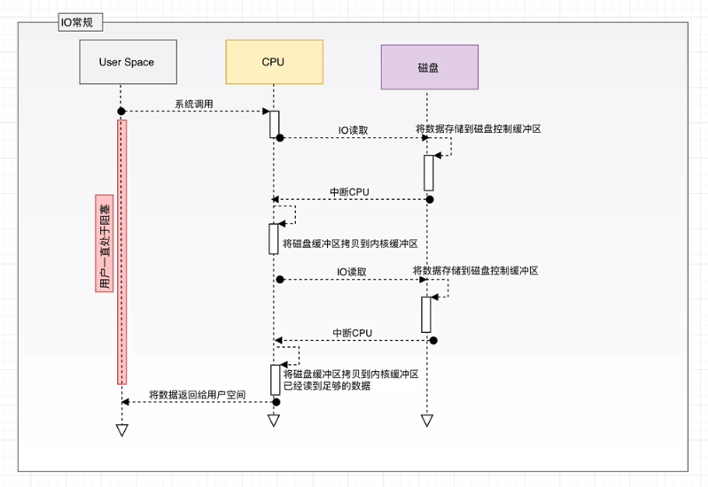
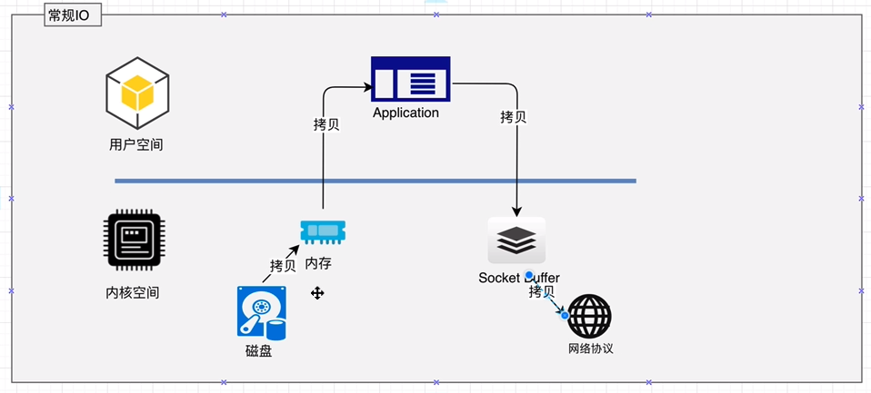
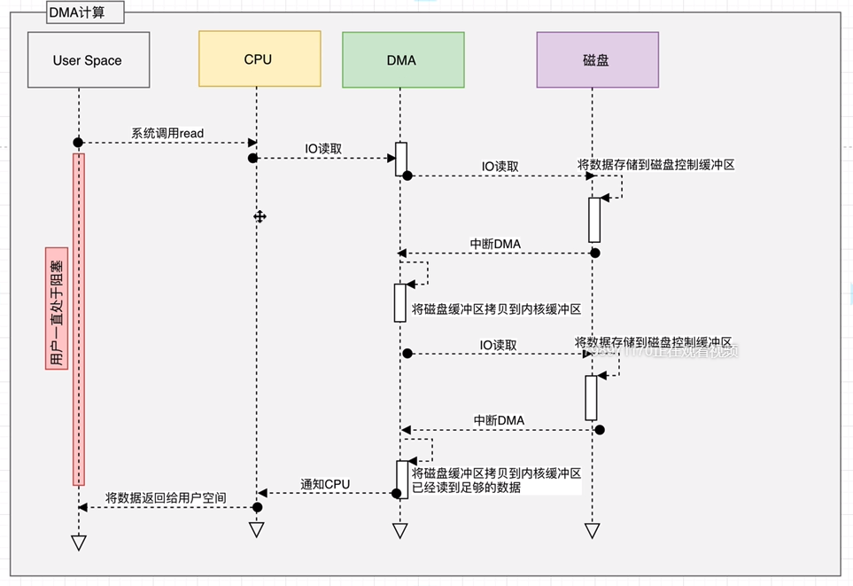

# Kafka

## Kafka介绍

​		Kafka是由Apache软件基金会开发的一个开源流处理平台，由Scala和Java编写。Kafka是一种高吞吐量的分布式发布订阅消息系统，它可以收集并处理用户在网站中的所有动作流数据以及物联网设备的采样信息。

​		该平台提供了消息的订阅与发布的消息队列，一般用作系统间**解耦**、**异步通信**、**削峰填谷**等作用。同时Kafka又提供了Kafka streaming插件包实现了实时在线流处理。相比较一些专业的流处理框架不同，Kafka Streaming计算是运行在应用端，具有简单、入门要求低、部署方便等优点。

> 当A需要调用B的时候，B在某些情况下可能存在不可用的情况，此时就会影响A业务的正常处理。所以此时A可以把需要B处理的消息推动Kafka中后，然后就立即返回（不会影响A业务本身），然后B通过Kafka获取要处理的消息进行处理。

## 消息队列的分类

### 至多一次

​		消息生产者将数据写入消息系统，然后由消费者负责去拉去消息服务器中的消息，一旦消息被确认消费之后 ，由消息服务器主动删除队列中的数据，这种消费方式一般只允许被一个消费者消费，并且消息队列中的数据不允许被重复消费。

### 没有限制

​		同上诉消费形式不同，生产者发不完数据以后，该消息可以被多个消费者同时消费，并且同一个消费者可以多次消费消息服务器中的同一个记录。主要是因为消息服务器一般可以长时间存储海量消息。

## Kakfa基本架构

### Topic，分区，副本基本概念

​		Kafka集群以Topic形式负责分类集群中的记录，每一个记录属于一个Topic。每个Topic底层都会对应一组分区的日志用于持久化Topic中的记录。同时在Kafka集群中，Topic的每一个日志的分区都一定会有1个Borker担当该分区的Leader，其他的Broker担当该分区的follower，Leader负责分区数据的读写操作，follower负责同步该分区的数据。这样如果分区的Leader宕机，该分区的其他follower会选取出新的leader继续负责该分区数据的读写。

**kafka中leader的选举使用Zookeeper进行分布式协调**

### 分区

​		每组日志分区是一个**有序**的不可变的的日志序列，分区中的每一条记录都被分配了唯一的序列编号称为offset（记录在分区中的位置），Kafka 集群会持久化所有发布到Topic中的记录信息，该记录的持久化时间是通过配置文件指定,默认是168小时。Kafka使用硬盘存储日志文件。**分区内部有序，外部无序**

> log.retention.hours=168
>
> 消息记录的表示形式：Record：Key / Value / Timestamp

### 消费者

​		在消费者消费Topic中数据的时候，每个消费者会维护本次消费对应分区的偏移量，消费者会在消费完一个批次的数据之后，会将本次消费的偏移量提交给Kafka集群，因此对于每个消费者而言可以随意的控制改消费者的偏移量。因此在Kafka中，消费者可以从一个topic分区中的任意位置读取队列数据，由于每个消费者控制了自己的消费的偏移量，因此多个消费者之间彼此相互独立。

​		消费者使用Consumer Group名称标记自己，并且发布到Topic的每条记录都会传递到每个订阅Consumer Group中的每一个消费者实例。如果所有Consumer实例都具有相同的Consumer Group，那么Topic中的记录会在该ConsumerGroup中的Consumer实例进行均分消费；如果所有Consumer实例具有不同的ConsumerGroup，则每条记录将广播到所有Consumer Group进程。

> 一般情况下，在同一个消费组内，消费者的数量不会大于分区的数量；如果消费者数量大于分区的个数，那么会有一些消费者不会任何消费，只有当正在消费的消费者出现故障时，这些空闲的消费者才会去消费。

### 顺序写入、MMAP、零拷贝

​		Kafka的特性之一就是高吞吐率，但是Kafka的消息是保存或缓存在磁盘上的，一般认为在磁盘上读写数据是会降低性能的，但是Kafka即使是普通的服务器，Kafka也可以轻松支持每秒百万级的写入请求，超过了大部分的消息中间件，这种特性也使得Kafka在日志处理等海量数据场景广泛应用。Kafka会把收到的消息都写入到硬盘中，防止丢失数据。为了优化写入速度Kafka采用了两个技术顺序写入和MMFile 。

#### 顺序写入、MMAP

​		因为硬盘是机械结构，每次读写都会寻址->写入，其中寻址是一个“机械动作”，它是最耗时的。所以硬盘最讨厌随机I/O，最喜欢顺序I/O。为了提高读写硬盘的速度，Kafka就是使用顺序I/O。这样省去了大量的内存开销以及节省了IO寻址的时间。但是单纯的使用顺序写入，Kafka的写入性能也不可能和内存进行对比，因此Kafka的数据并不是实时的写入硬盘中 。

​		Kafka充分利用了操作系统分页存储来使内存提高I/O效率。Memory Mapped Files(后面简称mmap)也称为内存映射文件，在64位操作系统中一般可以表示20G的数据文件，它的工作原理是直接利用操作系统的Page实现文件到物理内存的直接映射。完成MMP映射后，用户对内存的所有操作会被操作系统自动的刷新到磁盘上，极大地降低了IO使用率。

#### Zero拷贝

​		Kafka服务器在响应客户端读取的时候，底层使用ZeroCopy技术，直接将磁盘无需拷贝到用户空间，而是直接将数据通过内核空间传递输出，数据并没有抵达用户空间。

**传统IO操作**

1. 用户进程调用read等系统调用向操作系统发出IO请求，请求读取数据到自己的内存缓冲区中。自己进入阻塞状态。

2. 操作系统收到请求后，进一步将IO请求发送磁盘。

3. 磁盘驱动器收到内核的IO请求，把数据从磁盘读取到驱动器的缓冲中。此时不占用CPU。当驱动器的缓冲区被读满后，向内核发起中断信号告知自己缓冲区已满。

4. 内核收到中断，使用CPU时间将磁盘驱动器的缓存中的数据拷贝到内核缓冲区中。

5. 如果内核缓冲区的数据少于用户申请的读的数据，重复步骤3跟步骤4，直到内核缓冲区的数据足够多为止。

6. 将数据从内核缓冲区拷贝到用户缓冲区，同时从系统调用中返回。完成任务

   

   

**DMA读取**

1. 用户进程调用read等系统调用向操作系统发出IO请求，请求读取数据到自己的内存缓冲区中。自己进入阻塞状态。

2. 操作系统收到请求后，进一步将IO请求发送DMA。然后让CPU干别的活去。

3. DMA进一步将IO请求发送给磁盘。

4. 磁盘驱动器收到DMA的IO请求，把数据从磁盘读取到驱动器的缓冲中。当驱动器的缓冲区被读满后，向DMA发起中断信号告知自己缓冲区已满。

5. DMA收到磁盘驱动器的信号，将磁盘驱动器的缓存中的数据拷贝到内核缓冲区中。此时不占用CPU。这个时候只要内核缓冲区的数据少于用户申请的读的数据，内核就会一直重复步骤3跟步骤4，直到内核缓冲区的数据足够多为止。

6. 当DMA读取了足够多的数据，就会发送中断信号给CPU。

7. CPU收到DMA的信号，知道数据已经准备好，于是将数据从内核拷贝到用户空间，系统调用返回。

   

   

### Kafka使用分区存储的优点

1. 可以打破单机存储的容量，支持存储海量数据；分区数量越多，存储的记录就越多
2. 每个分区都有自己独立的 leader 担任记录的读和写。分区数越大，能够处理的写入并发也就越大，意味着能够极大的提升写入性能
3. 每个分区的 leader 可能分布在不同的物理机器上，间接的达到负载均衡的目的
4. 在同一个消费者组内，一个分区只能让一个消费者进行消费，增大分区数量，可以增大消费者的消费能力

### 消息进入分区的算法：默认第一种

1. hash：根据key值的hash除以Topic分区数：能够保证相同的key值肯定会落入同一分区，且能够使数据均匀的分散在不同的分区。
2. 轮训：
3. 随机：

### 数据丢失可能存在的情况

1. 内核不稳定，当应用系统通过MMAP把数据刚写进去，就断电了，还没来得及刷新到磁盘，会产生数据的丢失。
2. 

## Kafka的安装部署

