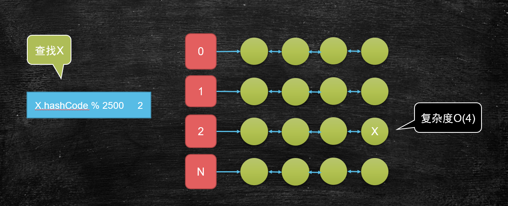
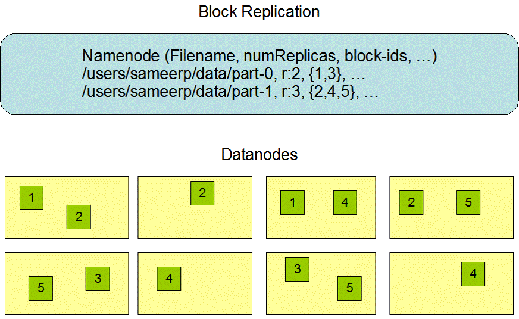

# 大数据启蒙

## 分治思想1：查找

### 需求

```
我有一万个元素（比如数字或单词）需要存储
```

### 如果查找某一个元素是否在这个集合当中，最简单的遍历方式复杂的是多少


### 如果查找某一个元素是否在这个集合当中，我期望复杂度是O(4)呢



## 分治思想的应用案例

1. Redis集群
2. ElasticSearch
3. Hbase
4. HADOOP生态无处不在！
5. ......

## 分治思想2：找重复的行

### 需求

```
有一个非常大的文本文件1T，里面有很多很多的行，只有两行一样，它们出现在未知的位置，需要查找到它们。
假设Io速度是500MB每秒
网络IO速度是100MB每秒
```

### 单机分治解决

1. 单机内存不可能放得下1T的文件，故需要对此文件进行拆解；
2. 读取文件，每读一行，求该行的 hashcode 然后%2000，可以把1T的数据分成2000份（每份大小500M），相同的行肯定在同一个文件中；
3. 依次遍历2000个文件，找到重复的行。

**用时分析：**

1. 1T文件读取一遍需要约30分钟
2. 然后再次遍历2000个小文件，假如重复的行在最后一个文件里，依然需要30分钟

### 集群解决

1. 读取文件，每读一行，求该行的 hashcode 然后%2000，可以把1T的数据分成2000份（每份大小500M），相同的行肯定在同一个文件中；
2. 把这2000个小文件分发到2000台机器上
3. 2000台机器拿到文件后一起进行计算

**用时分析：**

1. 1T文件读取一遍需要约30分钟
2. 2000个小文件（1T）分发到2000台机器上需要5个30分钟，也就是两个半小时
3. 2000台机器一起执行计算，用时1秒钟

### 分析

1. 此时集群的2000台机器还没有1台单机的处理速度快
2. 但是：如果考虑每天都有1T的数据产生呢？如果增量了一年，最后一天计算数据呢？
   1. 第一天的时候，单机需要用1个小时，集群需要用3个小时零1秒
   2. 第二天的时候，单机需要用2个小时，集群需要用3个小时零2秒（第一天的1T已经分发出去了，只需要分发当天增量的1T数据即可）
   3. 第三天的时候，单机需要3个小时，集群需要用3个小时零3秒（只需要分发当前增量的1T数据），近似已经追平了
   4. 第四天的时候，单机需要4个小时，集群需要用3个小时零4秒（只需要分发当前增量的1T数据），已经完胜了
   5. ......
   6. 第365天的时候，单机需要365个小时（近半个月），集群需要用3个小时零365秒，完胜。

## 结论

1. 分而治之
2. 并行计算
3. 计算向数据移动（计算找数据）
4. 数据本地化读取

# Hadoop

## HDFS

>  分布式文件系统那么多，为什么hadoop项目还要开发一个hdfs文件系统？
>
> 1. 分布式存储为了更好的分布式计算
> 2. 一个文件被分成多个相同大小的 block 块，便于同时读取不同的 block 块（计算向数据移动），增加并行度
> 3. 
> 4. 

### 存储模型

1. 文件线性按字节切割成块(block)，具有offset，id
2. 文件与文件的block大小可以不一样
3. 一个文件除最后一个block，其他block大小一致
4. block的大小依据硬件的I/O特性调整
5. block被分散存放在集群的节点中，具有location（位置定位信息）
6. Block具有副本(replication)，没有主从概念，副本不能出现在同一个节点
7. 副本是满足可靠性和性能的关键
8. 文件上传可以指定block大小和副本数，上传后只能修改副本数
9. 一次写入多次读取，不支持修改
10. 支持追加数据




### 架构设计

1. HDFS是一个主从(Master/Slaves)架构
2. 由一个NameNode和一些DataNode组成
3. 面向文件包含：文件数据(data)和文件元数据(metadata)
4. NameNode负责存储和管理文件元数据，并维护了一个层次型的文件目录树
5. DataNode负责存储文件数据(block块)，并提供block的读写
6. DataNode与NameNode维持心跳，并汇报自己持有的block信息
7. Client和NameNode交互文件元数据和DataNode交互文件block数据


### 角色功能

#### NameNode

1. 完全基于内存存储文件元数据、目录结构、文件block的映射
2. 需要持久化方案保证数据可靠性
3. 提供副本放置策略

#### DataNode

1. 基于本地磁盘存储block(文件的形式)
2. 并保存block的校验和数据保证block的可靠性
3. 与NameNode保持心跳，汇报block列表状态

### 数据持久化的几种实现方式

#### 日志

1. 日志文件记录实时发生的增删改操作
2. 完成性比较好
3. 加载恢复数据慢，占用很大空间

#### 镜像

1. 间隔（一段时间），内存全量数据基于某一时刻做的向磁盘的溢写
2. 如果时间间隔很短的情况下，IO就会很频繁，如果内存数据量大的话，也会很慢

### 元数据持久化

1. 任何对文件系统元数据产生修改的操作，Namenode都会使用一种称为EditLog的事务日志记录下来
2. 使用FsImage存储内存所有的元数据状态
3. 使用本地磁盘保存EditLog和FsImage
4. EditLog具有完整性，数据丢失少，但恢复速度慢，并有体积膨胀风险
5. FsImage具有恢复速度快，体积与内存数据相当，但不能实时保存，数据丢失多
6. NameNode使用了FsImage+EditLog整合的方案：
   - 滚动将增量的EditLog更新到FsImage，以保证更近时点的FsImage和更小的EditLog体积

### 安全模式

1. HDFS搭建时会格式化，格式化操作会产生一个空的FsImage
2. 当Namenode启动时，它从硬盘中读取Editlog和FsImage
3. 将所有Editlog中的事务作用在内存中的FsImage上
4. 并将这个新版本的FsImage从内存中保存到本地磁盘上
5. 然后删除旧的Editlog，因为这个旧的Editlog的事务都已经作用在FsImage上了
6. Namenode启动后会进入一个称为安全模式的特殊状态。
7. 处于安全模式的Namenode是不会进行数据块的复制的。
8. Namenode从所有的 Datanode接收心跳信号和块状态报告。
9. 每当Namenode检测确认某个数据块的副本数目达到这个最小值，那么该数据块就会被认为是副本安全(safely replicated)的。
10. 在一定百分比（这个参数可配置）的数据块被Namenode检测确认是安全之后（加上一个额外的30秒等待时间），Namenode将退出安全模式状态。
11. 接下来它会确定还有哪些数据块的副本没有达到指定数目，并将这些数据块复制到其他Datanode上。

### HDFS中的SNN


## MapReduce

## Yarn