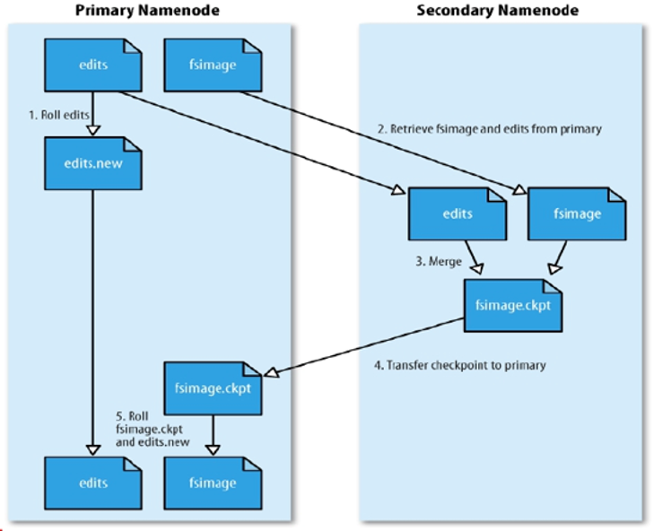
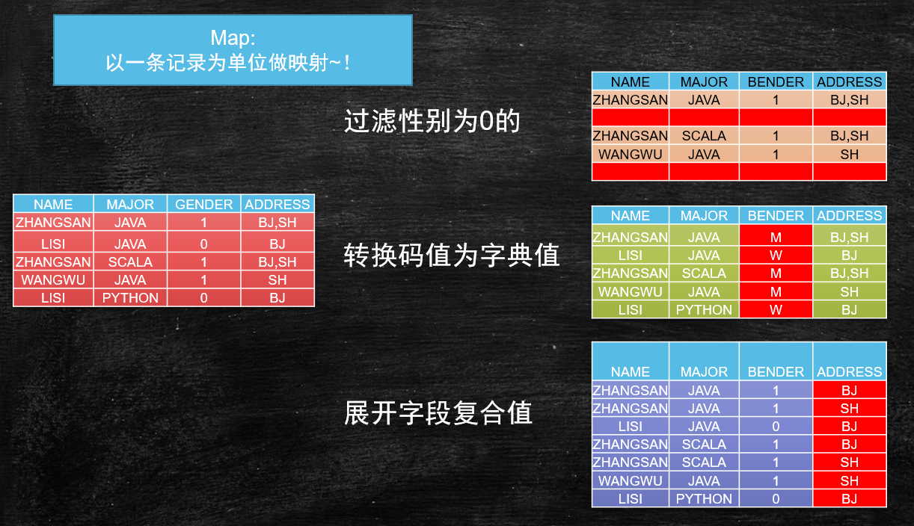
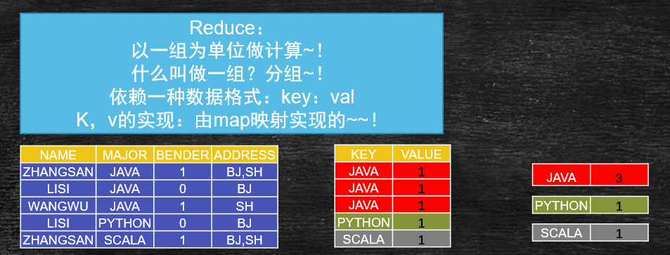
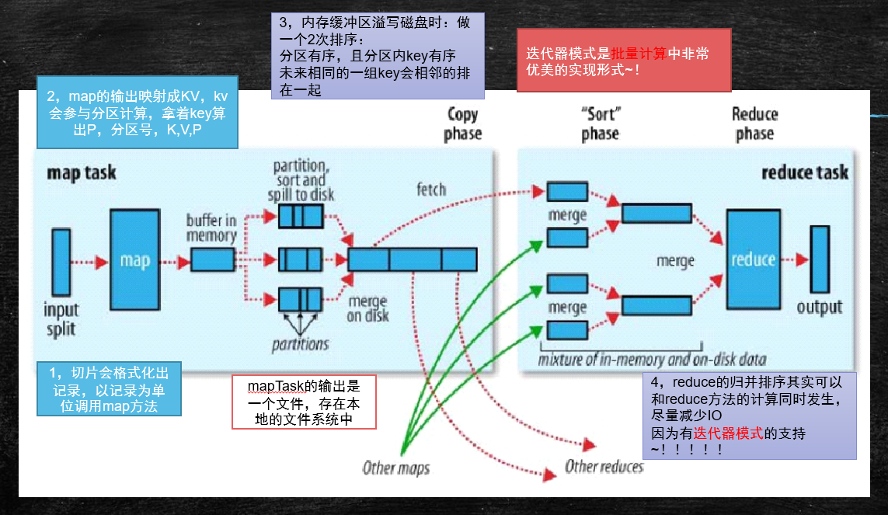
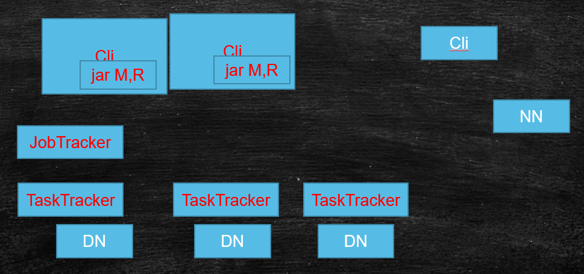
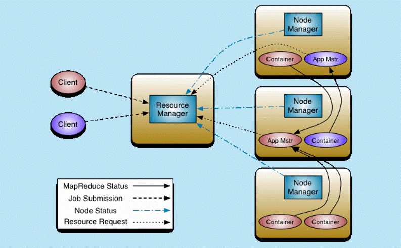
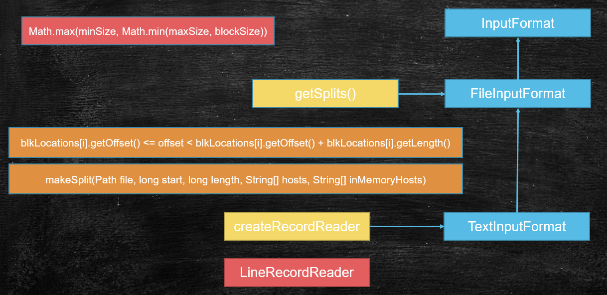

# 大数据启蒙

## 分治思想1：查找

### 需求

```
我有一万个元素（比如数字或单词）需要存储
```

### 如果查找某一个元素是否在这个集合当中，最简单的遍历方式复杂的是多少


### 如果查找某一个元素是否在这个集合当中，我期望复杂度是O(4)呢


## 分治思想的应用案例

1. Redis集群
2. ElasticSearch
3. Hbase
4. HADOOP生态无处不在！
5. ......

## 分治思想2：找重复的行

### 需求

```
有一个非常大的文本文件1T，里面有很多很多的行，只有两行一样，它们出现在未知的位置，需要查找到它们。
假设Io速度是500MB每秒
网络IO速度是100MB每秒
```

### 单机分治解决

1. 单机内存不可能放得下1T的文件，故需要对此文件进行拆解；
2. 读取文件，每读一行，求该行的 hashcode 然后%2000，可以把1T的数据分成2000份（每份大小500M），相同的行肯定在同一个文件中；
3. 依次遍历2000个文件，找到重复的行。

**用时分析：**

1. 1T文件读取一遍需要约30分钟
2. 然后再次遍历2000个小文件，假如重复的行在最后一个文件里，依然需要30分钟

### 集群解决

1. 读取文件，每读一行，求该行的 hashcode 然后%2000，可以把1T的数据分成2000份（每份大小500M），相同的行肯定在同一个文件中；
2. 把这2000个小文件分发到2000台机器上
3. 2000台机器拿到文件后一起进行计算

**用时分析：**

1. 1T文件读取一遍需要约30分钟
2. 2000个小文件（1T）分发到2000台机器上需要5个30分钟，也就是两个半小时
3. 2000台机器一起执行计算，用时1秒钟

### 分析

1. 此时集群的2000台机器还没有1台单机的处理速度快
2. 但是：如果考虑每天都有1T的数据产生呢？如果增量了一年，最后一天计算数据呢？
   1. 第一天的时候，单机需要用1个小时，集群需要用3个小时零1秒
   2. 第二天的时候，单机需要用2个小时，集群需要用3个小时零2秒（第一天的1T已经分发出去了，只需要分发当天增量的1T数据即可）
   3. 第三天的时候，单机需要3个小时，集群需要用3个小时零3秒（只需要分发当前增量的1T数据），近似已经追平了
   4. 第四天的时候，单机需要4个小时，集群需要用3个小时零4秒（只需要分发当前增量的1T数据），已经完胜了
   5. ......
   6. 第365天的时候，单机需要365个小时（近半个月），集群需要用3个小时零365秒，完胜。

## 结论

1. 分而治之
2. 并行计算
3. 计算向数据移动（计算找数据）
4. 数据本地化读取

# Hadoop

## HDFS

>  **分布式文件系统那么多，为什么hadoop项目还要开发一个hdfs文件系统？**
>
>  1. **分布式存储为了更好的分布式计算**
>  2. **一个文件被分成多个相同大小的 block 块，便于同时读取不同的 block 块（计算向数据移动），增加并行度**
>  3. **数据的可靠性有保障**
>  4. **Hdfs支持client给出文件的offset自定义连接哪些block的DN，自定义获取数据**
>  5. **支持新增，追加，删除，查询，唯独不支持更新**

### 存储模型

1. 文件线性按字节切割成块(block)，具有offset，id
2. 文件与文件的block大小可以不一样
3. 一个文件除最后一个block，其他block大小一致
4. block的大小依据硬件的I/O特性调整
5. block被分散存放在集群的节点中，具有location（位置定位信息）
6. Block具有副本(replication)，没有主从概念，副本不能出现在同一个节点
7. 副本是满足可靠性和性能的关键
8. 文件上传可以指定block大小和副本数，上传后只能修改副本数
9. 一次写入多次读取，不支持修改
10. 支持追加数据


### 架构设计

1. HDFS是一个主从(Master/Slaves)架构
2. 由一个NameNode和一些DataNode组成
3. 面向文件包含：文件数据(data)和文件元数据(metadata)
4. NameNode负责存储和管理文件元数据，并维护了一个层次型的文件目录树
5. DataNode负责存储文件数据(block块)，并提供block的读写
6. DataNode与NameNode维持心跳，并汇报自己持有的block信息
7. Client和NameNode交互文件元数据和DataNode交互文件block数据


### 角色功能

#### NameNode

1. 完全基于内存存储文件元数据、目录结构、文件block的映射
2. 需要持久化方案保证数据可靠性
3. 提供副本放置策略

#### DataNode

1. 基于本地磁盘存储block(文件的形式)
2. 并保存block的校验和数据保证block的可靠性
3. 与NameNode保持心跳，汇报block列表状态

### 数据持久化的几种实现方式

#### 日志

1. 日志文件记录实时发生的增删改操作
2. 完成性比较好
3. 加载恢复数据慢，占用很大空间

#### 镜像

1. 间隔（一段时间），内存全量数据基于某一时刻做的向磁盘的溢写
2. 如果时间间隔很短的情况下，IO就会很频繁，如果内存数据量大的话，也会很慢
3. 因为是间隔的，容易丢失一部分数据

### 元数据持久化

> 数据持久化方式：日志（EditLog） + 镜像（FsImage）

1. 任何对文件系统元数据产生修改的操作，Namenode都会使用一种称为EditLog的事务日志记录下来
2. 使用FsImage存储内存所有的元数据状态
3. 使用本地磁盘保存EditLog和FsImage
4. EditLog具有完整性，数据丢失少，但恢复速度慢，并有体积膨胀风险
5. FsImage具有恢复速度快，体积与内存数据相当，但不能实时保存，数据丢失多
6. **NameNode使用了FsImage+EditLog整合的方案：**
   - 滚动将增量的EditLog更新到FsImage，以保证更近时点的FsImage和更小的EditLog体积
7. **在持久化EditLog的时候，文件的属性信息会进行持久化，块的元数据不会进行持久化**。等待datanode来汇报。

> ```shell
> cd ./local/dfs/name/current
> # 观察 editlog的id是不是再fsimage的后边
> cd ./local/dfs/secondary/current
> # SNN 只需要从NN拷贝最后时点的FSimage和增量的Editlog
> cd ./local/dfs/data/current/BP-281147636-192.168.150.11-1560691854170/current/finalized/subdir0/subdir0
> # 检查data.txt被切割的块，他们数据什么样子
> ```

### 安全模式

1. HDFS搭建时会格式化，格式化操作会产生一个空的FsImage
2. 当Namenode启动时，它从硬盘中读取Editlog和FsImage
3. 将所有Editlog中的事务作用在内存中的FsImage上
4. 并将这个新版本的FsImage从内存中保存到本地磁盘上
5. 然后删除旧的Editlog，因为这个旧的Editlog的事务都已经作用在FsImage上了，所以此时的FsImage已经是最新的全量数据了
6. **Namenode启动后会进入一个称为安全模式的特殊状态。**
7. 处于安全模式的Namenode是不会进行数据块的复制的。
8. Namenode从所有的 Datanode接收心跳信号和块状态报告。
9. 每当Namenode检测确认某个数据块的副本数目达到这个最小值，那么该数据块就会被认为是副本安全(safely replicated)的。
10. **在一定百分比（这个参数可配置）的数据块被Namenode检测确认是安全之后**（如果有些datanode一直起不起来，加上一个额外的30秒等待时间），Namenode将退出安全模式状态。
11. **接下来它会确定还有哪些数据块的副本没有达到指定数目，并将这些数据块复制到其他Datanode上。**

### HDFS中的SNN

> SecondaryNameNode（SNN）

1. 在非Ha模式下，SNN一般是独立的节点，周期完成对NN的EditLog向FsImage合并，减少EditLog大小，减少NN启动时间
2. 根据配置文件设置的时间间隔fs.checkpoint.period  默认3600秒
3. 根据配置文件设置edits log大小 fs.checkpoint.size 规定edits文件的最大值默认是64MB



### Block的副本放置策略

> 1.x的时候，第二个副本和第一个副本在同一个机架，第三个副本才会出机架
>
> 2.x的时候，第二个副本就已经出机架了，第三个副本和第二个副本同一个机架，（第三个副本和第二个副本在同一机架，可以减少网络IO）

1. 第一个副本：放置在上传文件的DN；如果是集群外提交，则随机挑选一台磁盘不太满，CPU不太忙的节点。
2. 第二个副本：放置在于第一个副本不同的 机架的节点上。
3. 第三个副本：与第二个副本相同机架的节点。
4. 更多副本：随机节点。

### HDFS写流程


1. Client和NN连接创建文件元数据
2. NN判定元数据是否有效（是否已经存在，是否有权限）
3. NN触发副本放置策略，返回一个有序的DN列表
4. Client和DN建立Pipeline连接（小字节传输，支持最大力度的并行，类似流水线）
5. Client将块切分成packet（64KB），并使用chunk数据的字节（512B）+chucksum校验盒（4B）填充
6. Client将packet放入发送队列dataqueue中，并向第一个DN发送
7. 第一个DN收到packet后本地保存并发送给第二个DN
8. 第二个DN收到packet后本地保存并发送给第三个DN
9. 这一个过程中，上游节点同时发送下一个packet
10. **生活中类比工厂的流水线：结论：流式其实也是变种的并行计算**
11. Hdfs使用这种传输方式，副本数对于client是透明的
12. 当block传输完成，DN们各自向NN汇报，同时client继续传输下一个block
13. 所以，client的传输和block的汇报也是并行的

> 如果中间有datanode挂掉了，则直接跳过该datanode往后传输，等传输完成之后，datanode会给namenode汇报block信息，如果和副本数量不一致，则namenode会触发副本放置策略。

### HDFS读流程


1. 为了降低整体的带宽消耗和读取延时，HDFS会尽量让读取程序读取离它最近的副本。
2. 如果在读取程序的同一个机架上有一个副本，那么就读取该副本。
3. 如果一个HDFS集群跨越多个数据中心，那么客户端也将首先读本地数据中心的副本。
4. 语义：下载一个文件：
   1. Client和NN交互文件元数据获取fileBlockLocation
   2. NN会按距离策略排序返回
   3. Client尝试下载block并校验数据完整性
5. 语义：下载一个文件其实是获取文件的所有的block元数据，那么子集获取某些block应该成立
   1. Hdfs支持client给出文件的offset自定义连接哪些block的DN，自定义获取数据
   2. 这个是支持计算层的分治、并行计算的核心

### API

#### 环境权限

```
1）参考系统登录用户名；登陆用户名改为root
2）参考环境变量；HADOOP_USER_NAME=root
3）代码中给出；System.setProperty("HADOOP_USER_NAME", "root");
```

#### 初始化依赖环境

```java
private FileSystem fs = null;
public Configuration conf = new Configuration(true);

@Before
public void before() throws Exception {
    URI url = new URI("hdfs://mycluster");
    fs = FileSystem.get(url, conf, "root");
}
```

#### 创建hdfs目录

```java
@Test
public void mkdir() throws Exception {
    Path path = new Path("/user/root");
    if (fs.exists(path)) {
        fs.delete(path, true);
    }
    fs.mkdirs(path);
}
```

#### 上传文件

```java
@Test
public void upload() throws Exception {
    Path remoteFilePath = new Path("hdfs路径");
    if (fs.exists(remoteFilePath)) {
        fs.delete(remoteFilePath, true);
    }
    FileInputStream fileInputStream = null;
    BufferedInputStream bufferedInputStream = null;
    try {
        fileInputStream = new FileInputStream(new File("本地文件地址"));
        bufferedInputStream = new BufferedInputStream(fileInputStream);
        FSDataOutputStream outputStream = fs.create(remoteFilePath);

        IOUtils.copyBytes(bufferedInputStream, outputStream, conf, true);
    } catch (Exception e) {
        e.printStackTrace();
    } finally {
        if (bufferedInputStream != null) {
            bufferedInputStream.close();
        }
        if (fileInputStream != null) {
            fileInputStream.close();
        }
    }
}
```

#### 获取文件块信息

```java
@Test
public void getFileBlock() throws Exception {
    Path remoteFilePath = new Path("hdfs文件路径");
    FileStatus fileStatus = fs.getFileStatus(remoteFilePath);
    BlockLocation[] blockLocations = fs.getFileBlockLocations(fileStatus, 0, fileStatus.getLen());
    for (BlockLocation blockLocation : blockLocations) {
        System.out.println(blockLocation);
    }
}
```

## MapReduce

### Map映射



> 以上三种操作，在进行计算时，是以一条记录为单位，不会关心其他记录的，这种转换的过程就叫做映射 Map
>
> 1. 过滤
> 2. 转换
> 3. 一变多

### Reduce分组计算



> 以一组为单位的计算时，叫做分组，分组必须要有一个key值，也就是kv的实现。

### MapReduce

1. Map
   - 映射、变换、过滤
   - 1进N出
2. Reduce
   - 分解、缩小、归纳
   - 一组进N出
3. (KEY,VAL)
   - 键值对的键划分数据分组


### MapReduce详细的计算过程


> 数据以一条记录为单位经过Map方法映射成KV，相同的key为一组，这一组数据调用一次Reduce方法，在方法内迭代计算这一组的数据。

1. 一个 split（切片）对应一个Map任务

2. 一个文件在HDFS中会根据blockSize切成N多个块

3. 默认情况下，一个 split（切片）对应一个block块

   **加入 split（切片）的概念是为了和block块解耦，可以支持动态调整切片大小**

4. 所有的Map执行完成之后，才能进行Reduce环节执行（线性依赖关系）

5. 有几个Reduce，就可以按照key的hash模上几，拉取到不同的Reduce进程里（Reduce中组是不能再分的）

6. Map的并行度有split（切片）来决定，Reduce的并行度（默认一个）有人来决定

7. 一个Reduce执行的任务交一个分区

**比例关系：**

1. block > split
   - 1:1（默认）
   - N:1
   - 1:N（CPU密集型）
2. split > map
   - 1:1
3. map > reduce
   - N:1（默认）
   - N:N（人为指定多个Reduce，同一个组不能被打散到不同的 partition（分区，task任务，一个Reduce任务）里）
   - 1:1
   - 1:N（人为指定map为1个，多个reduce处理不同的组）
4. group(key) > partition
   - 1:1（一个组去到一个partition）
   - N:1（一个partition（task任务，Reduce任务）处理所有的组）
   - N:N

### MapReduce详细拆解过程

> <font color="red">**迭代器模式是批量计算中非常优美的实现形！！！**</font>



1. 切片会格式化出记录，以记录为单位调用map方法
2. map的输出映射成KV，kv会参与分区计算，拿着key算出P，分区号，K,V,P
3. 内存缓冲区溢写磁盘时：<font color="red">**做一个2次排序：分区有序，且分区内key有序**</font>；未来相同的一组key会相邻的排在一起
   - 如果此时不做排序，当执行Reduce时，每一个Reduce都要全量遍历该文件，增大磁盘IO
   - 当内存缓存区溢写磁盘时，进行一次排序（内存比磁盘快了10万倍，在内存中排序不影响性能，缓冲区有大小限制，不会特别大）
4. reduce的归并排序其实可以和reduce方法的计算同时发生，尽量减少IO。因为有迭代器模式的支持！！！

## 计算向数据移动

> HDFS肯定会暴露block块的位置
>
> 1. DataNode负责管理Block
> 2. TaskTracker一般会和DataNode部署在一起，主要负责任务的执行
>
> 最终计算向数据移动的实现：**代码在某一个节点被启动，通过cli上传，TaskTracker下载，并启动相应的任务**



### Client

1. 有执行逻辑（MR）
2. 会根据每次的计算数据，咨询NameNode获取元数据的Block信息（offset，locations），并计算split（切片），最终得到一个切片的清单（包含：split的偏移量，以及对应的map任务应该移动到哪些节点 locations ）
3. 生成计算程序未来运行时的相关配置文件
4. 未来的移动应该相对可靠：**client会将jar，split清单，配置文件，上传到HDFS的目录中，此时的副本默认数是10**
5. 调用JobTracker，通知要启动一个计算程序了，并且告诉文件放在了HDFS的哪些地方

### JobTracker

**作用**

1. 资源管理
2. 任务调度

**存在的问题**

1. 单点故障

2. 压力过大

3. 集成了资源管理和任务调度，两者耦合

   **未来新的计算框架不能复用资源管理**

   - 重复造轮子
   - 因为各自实现资源管理，但是他们不熟在同一批硬件上，因为隔离，所以不能感知对方的使用，会造成资源争抢

**执行流程：**

1. 从HDFS中取回split清单
2. 根据自己收到的TaskTracker汇报的资源，最终确定每一个split对应的map应该去到哪一个节点，得到一个确定的清单
3. 未来TaskTracker在做心跳的时候，会取回分配给自己的任务信息

### TaskTracker

1. 任务管理
2. 资源汇报

**执行流程：**

1. 在心跳取回任务信息
2. 从HDFS中下载jar和相关配置文件到本地
3. 最终启动任务描述中的Map/Reduce

## Yarn：资源管理

### 架构图

> 1. MR-cli （切片清单 / 配置 / jar / 上传到HDFS）
> 2. 访问RM申请AppMaster
> 3. RM选择一台不忙的节点通知NM启动一个Container，在里面反射生成一个MRAppMaster
> 4. 启动MRAppMaster，从HDFS上下载切片清单，向RM申请资源
> 5. RM根据自己掌握的资源情况得到一个确定的清单，通知NM来启动container
> 6. container启动后会反向注册到已经启动的MRAppMaster进程
> 7. MRAppMaster（更像曾经的JobTracker阉割版(不带资源管理)）最终会将任务Task发送给container（消息）
> 8. container会反射相应的Task类为对象，调用方法执行，其结果就是执行我们的业务逻辑代码
> 9. 计算框架都有Task失败重试的机制。



> **结论：**
>
> 1. 单点故障
>    - 曾经是全局的，JobTracker如果挂了，整个计算层没有了调度
>    - yarn：每一个app都有一个自己的AppMaster调度，AppMaster支持失败重试
> 2. 压力过大
>    - yarn中每个计算程序自由AppMaster，每个AppMaster只负责自己计算程序的任务调度，AppMaster是在不同的节点中启动的，默认有了负载的光环
> 3. 集成了资源管理和任务调度，两者耦合
>    - 因为yarn只是资源管理，不负责具体的任务调度；只要计算框架继承了yarn的AppMaster，大家都可以使用一个统一视图的资源层。

### 模型

#### ResourceManager

> ResourceManager支持HA模式

**作用：**

1. 与客户端进行交互，处理来自于客户端的请求，如查询应用的运行情况等。
2. 启动和管理各个应用的ApplicationMaster，并且为ApplicationMaster申请第一个Container用于启动和在它运行失败时将它重新启动。
3. 管理NodeManager，接收来自NodeManager的资源和节点健康情况汇报，并向NodeManager下达管理资源命令，例如kill掉某个container。
4. 资源管理和调度，接收来自ApplicationMaster的资源申请，并且为其进行分配。这个是它的最重要的职能。

#### NodeManager

**作用：**

1. NodeManager通过**ResourceTrackerProtocol**协议向RM注册，汇报节点的健康状态以及Container的运行状态，并领取RM下发的命令例如重新初始化Container，清理Container等；在这个协议中NodeManager主动向RM发请求，RM响应NodeManager的请求。
2. 应用程序的ApplicationMaster通过**ContainerManagementProtocol**协议与NodeManager通信发起针对Container的命令操作，例如：启动，杀死Container，获取Container的运行状态等；在该协议中ApplicationMaster主动向NodeManager发送请求，NodeManager接收到请求做出响应。

#### ApplicationMaster

> ApplicationMaster实际上是特定计算框架的一个实例，每种计算框架都有自己独特的ApplicationMaster，负责与ResourceManager协商资源，并和NodeManager协同来执行和监控Container。MapReduce只是可以运行在YARN上一种计算框架。

**作用：**

1. 初始化向ResourceManager报告自己的活跃信息的进程
2. 计算应用程序的的资源需求。
   - 静态资源：在任务提交时就能确定，并且在AM运行时不再变化的资源，比如MapReduce程序中的Map的数量
   - 动态资源： AM在运行时确定要请求数量的资源是动态资源。
3. 将需求转换为YARN调度器可以理解的ResourceRequest，与调度器协商申请资源
4. 与NodeManager协同合作使用分配的Container
5. 跟踪正在运行的Container状态，监控它的运行。
6. 对Container或者节点失败的情况进行处理，在必要的情况下重新申请资源。

#### container

> 可以让JVM进程在上面运行；被NodeManager监控资源使用情况，如果发现有超额，NodeManager直接把该进程 kill 掉；使用 cgroup 内核级技术，在启动JVM进程时，由Kernel 约束死使用的资源。

1. 是集群中单个节点上的一组资源（内存，CPU，归属于哪个NM），由NM监控，由RM调度
2. 接收ApplicationMaster的任务启动命令
3. 主动拉取HDFS上的jar和相关的配置，作为任务运行环境

### 总结

1. 1.x 中 JobTracker、TaskTracker是常服务。
2. 2.x 只有没有了这些服务；相对的，MR的cli、【调度】、【任务】，这些都是临时的服务了。

## Client源码分析

> ```
> 没有计算发生
> 很重要：支撑了计算向数据移动和计算的并行度
> 1，Checking the input and output specifications of the job.
> 2，Computing the InputSplits for the job.  // split  ->并行度和计算向数据移动就可以实现了
> 3，Setup the requisite accounting information for the DistributedCache of the job, if necessary.
> 4，Copying the job's jar and configuration to the map-reduce system directory on the distributed file-system.
> 5，Submitting the job to the JobTracker and optionally monitoring it's status
> MR框架默认的输入格式化类： TextInputFormat < FileInputFormat < InputFormat
>                   						getSplits()
>    minSize = 1
>    maxSize = Long.Max
>    blockSize = file
>    splitSize = Math.max(minSize, Math.min(maxSize, blockSize));  //默认split大小等于block大小
>       切片split是一个窗口机制：（调大split改小，调小split改大）
>          如果我想得到一个比block大的split：
>    if ((blkLocations[i].getOffset() <= offset < blkLocations[i].getOffset() + blkLocations[i].getLength()))
>    split：解耦 存储层和计算层
>       1，file
>       2，offset
>       3，length
>       4，hosts    //支撑的计算向数据移动
> ```



### 默认输入格式化类

```java
// 输入格式化类，默认为TextInputFormat.class
// 可以通过以下几种方式进行干预
// 1. job.setInputFormatClass(TextInputFormat.class);
return (Class<? extends InputFormat<?,?>>) 
      conf.getClass(INPUT_FORMAT_CLASS_ATTR, TextInputFormat.class);
```

### 计算切片

```java
/** 
  * Generate the list of files and make them into FileSplits.
  * @param job the job context
  * @throws IOException
  */
public List<InputSplit> getSplits(JobContext job) throws IOException {
    StopWatch sw = new StopWatch().start();
    // 默认值：1，
    // 可以通过以下几种方式进行干预
    // 1. TextInputFormat.setMinInputSplitSize(job, 111);
    // 2. conf.set(FileInputFormat.SPLIT_MINSIZE, "111");
    // 3. 也可以通过运行主方法时外部传参
    long minSize = Math.max(getFormatMinSplitSize(), getMinSplitSize(job));
    // 默认值：Long.MAX_VALUE
    // 可以通过以下几种方式进行干预
    // 1. TextInputFormat.setMaxInputSplitSize(job, 111);
    // 2. conf.set(FileInputFormat.SPLIT_MAXSIZE, "111");
    // 3. 也可以通过运行主方法时外部传参
    long maxSize = getMaxSplitSize(job);

    // generate splits
    List<InputSplit> splits = new ArrayList<InputSplit>();
    // 获取当前job计算需要的所有文件的状态列表
    List<FileStatus> files = listStatus(job);
    for (FileStatus file: files) {
        Path path = file.getPath();
        long length = file.getLen();
        if (length != 0) {
            // 每一个文件所有的block块信息
            BlockLocation[] blkLocations;
            if (file instanceof LocatedFileStatus) {
                blkLocations = ((LocatedFileStatus) file).getBlockLocations();
            } else {
                FileSystem fs = path.getFileSystem(job.getConfiguration());
                blkLocations = fs.getFileBlockLocations(file, 0, length);
            }
            // 是否可以做切片，分布式文件可以做切片
            if (isSplitable(job, path)) {
                // 块文件大小
                long blockSize = file.getBlockSize();
                // 计算切片大小：splitSize = Math.max(minSize, Math.min(maxSize, blockSize));
                // minSize默认是1，maxSize默认事Long.MAX_VALUE
                // block只要有内容，blockSize肯定大于1，故默认 splitSize = blockSize
                // 切片 split 是一个窗口机制（调大split改小值，调小split改大值）
                // 如果我想得到一个比block大的split,
                // 人为干预 minSize 的大小，只要比 blockSize 大即可
                // 如果我想得到一个比block小的split,
                // 人为干预 maxSize 的大小，只要比 blockSize 小即可
                long splitSize = computeSplitSize(blockSize, minSize, maxSize);
                
                // 找到每一个切片对应的块的偏移量的算法
                // 切片最重要的四个属性：1.file;2.offset;3.length;4.hosts//支持计算向数据移动
// blkLocations[i].getOffset() <= offset < blkLocations[i].getOffset() + blkLocations[i].getLength()
                long bytesRemaining = length;
                while (((double) bytesRemaining)/splitSize > SPLIT_SLOP) {
                    int blkIndex = getBlockIndex(blkLocations, length-bytesRemaining);
                    splits.add(makeSplit(path, length-bytesRemaining, splitSize,
                                         blkLocations[blkIndex].getHosts(),
                                         blkLocations[blkIndex].getCachedHosts()));
                    bytesRemaining -= splitSize;
                }
                // 处理最后一个block块
                if (bytesRemaining != 0) {
                    int blkIndex = getBlockIndex(blkLocations, length-bytesRemaining);
                    splits.add(makeSplit(path, length-bytesRemaining, bytesRemaining,
                                         blkLocations[blkIndex].getHosts(),
                                         blkLocations[blkIndex].getCachedHosts()));
                }
// 经过上面的算法实例demo
// 文件大小：100
// 块大小：　10
// 切片大小：15
// offset,splitSize,	blockIndex
// 0,15					0
// 15,15				1
// 30,15				3
// 45,15				4
// 60,15				6
// 75,15				7
// 90,10,				9
            } else { // not splitable
                splits.add(makeSplit(path, 0, length, blkLocations[0].getHosts(),
                                     blkLocations[0].getCachedHosts()));
            }
        } else { 
            //Create empty hosts array for zero length files
            splits.add(makeSplit(path, 0, length, new String[0]));
        }
    }
    // Save the number of input files for metrics/loadgen
    job.getConfiguration().setLong(NUM_INPUT_FILES, files.size());
    sw.stop();
    if (LOG.isDebugEnabled()) {
        LOG.debug("Total # of splits generated by getSplits: " + splits.size()
                  + ", TimeTaken: " + sw.now(TimeUnit.MILLISECONDS));
    }
    return splits;
}
```

### 上传切片清单和配置

```java
List<InputSplit> splits = input.getSplits(job);
T[] array = (T[]) splits.toArray(new InputSplit[splits.size()]);

// sort the splits into order based on size, so that the biggest
// go first
Arrays.sort(array, new SplitComparator());
// 切片清单和配置写入hdfs
JobSplitWriter.createSplitFiles(jobSubmitDir, conf, 
                                jobSubmitDir.getFileSystem(conf), array);
```

## MapTask源码分析

> ```
> input ->  map  -> output
> input:(split+format)  通用的知识，未来的spark底层也是
> 	来自于我们的输入格式化类给我们实际返回的记录读取器对象
> 		TextInputFormat->LineRecordreader
> 			split: file , offset , length
> 			init():
> 				in = fs.open(file).seek(offset)
> 				除了第一个切片对应的map，之后的map都在init环节，
> 				从切片包含的数据中，让出第一行，并把切片的起始更新为切片的第二行。
> 				换言之，前一个map会多读取一行，来弥补hdfs把数据切割的问题~！
> 			nextKeyValue():
> 				1，读取数据中的一条记录对key，value赋值
> 				2，返回布尔值
> 			getCurrentKey():
> 			getCurrentValue():
> 
> output：
> NewOutputCollector
> 	partitioner
> 	collector
> 		MapOutputBuffer:
> 		*：
> 		map输出的KV会序列化成字节数组，算出P，最中是3元组：K,V,P
> 		buffer是使用的环形缓冲区：
> 		1，本质还是线性字节数组
> 		2，赤道，两端方向放KV,索引
> 		3，索引：是固定宽度：16B：4个int
> 			a)P
> 			b)KS
> 			c)VS
> 			d)VL
> 		5,如果数据填充到阈值：80%，启动线程：
> 			快速排序80%数据，同时map输出的线程向剩余的空间写
> 			快速排序的过程：是比较key排序，但是移动的是索引
> 		6，最终，溢写时只要按照排序的索引，卸下的文件中的数据就是有序的
> 			注意：排序是二次排序（索引里有P，排序先比较索引的P决定顺序，然后在比较相同P中的Key的顺序）
> 				分区有序  ： 最后reduce拉取是按照分区的
> 				分区内key有序： 因为reduce计算是按分组计算，分组的语义（相同的key排在了一起）
> 		7，调优：combiner
> 			1，其实就是一个map里的reduce
> 				按组统计
> 			2，发生在哪个时间点：
> 				a)内存溢写数据之前排序之后
> 					溢写的io变少~！
> 				b)最终map输出结束，过程中，buffer溢写出多个小文件（内部有序）
> 					minSpillsForCombine = 3
> 					map最终会把溢写出来的小文件合并成一个大文件：
> 						避免小文件的碎片化对未来reduce拉取数据造成的随机读写
> 					也会触发combine
> 			3，combine注意
> 				必须幂等
> 				例子：
> 					1，求和计算
> 					1，平均数计算
> 						80：数值和，个数和
> 		init():
> 			spillper = 0.8
> 			sortmb = 100M
> 			sorter = QuickSort
> 			comparator = job.getOutputKeyComparator();
> 				1，优先取用户覆盖的自定义排序比较器
> 				2，保底，取key这个类型自身的比较器
> 			combiner ？reduce
> 				minSpillsForCombine = 3
> 
> 			SpillThread
> 				sortAndSpill()
> 					if (combinerRunner == null)
> ```

### Map主要流程：MapTask.run();

```java
try {
    input.initialize(split, mapperContext);
    // 调用map的run方法
    mapper.run(mapperContext);
    // 计算完成
    mapPhase.complete();
    // 执行排序
    setPhase(TaskStatus.Phase.SORT);
    // 状态更新
    statusUpdate(umbilical);
    // 关闭输入流
    input.close();
    input = null;
    // 关闭输出流
    output.close(mapperContext);
    output = null;
} finally {
    closeQuietly(input);
    closeQuietly(output, mapperContext);
}
```

### 前置参数组装：MapTask.runNewMapper();

```java
// make a task context so we can get the classes
// 构造一个任务的上下文对象，方便在后续的处理逻辑中拿到相关的配置
org.apache.hadoop.mapreduce.TaskAttemptContext taskContext =
    new org.apache.hadoop.mapreduce.task.TaskAttemptContextImpl(job, 
                                                                getTaskID(),
                                                                reporter);
// make a mapper
// 根据指定的 MapperClass 类反射出对象
org.apache.hadoop.mapreduce.Mapper<INKEY,INVALUE,OUTKEY,OUTVALUE> mapper =
    (org.apache.hadoop.mapreduce.Mapper<INKEY,INVALUE,OUTKEY,OUTVALUE>)
    ReflectionUtils.newInstance(taskContext.getMapperClass(), job);
// make the input format
// 根据指定的或者默认的输入格式化类，反射出具体的输入对象
org.apache.hadoop.mapreduce.InputFormat<INKEY,INVALUE> inputFormat =
    (org.apache.hadoop.mapreduce.InputFormat<INKEY,INVALUE>)
    ReflectionUtils.newInstance(taskContext.getInputFormatClass(), job);
// rebuild the input split
// 根据当前map获取要读取文件块的切片（此时计算已经移动到对应的节点上了）
org.apache.hadoop.mapreduce.InputSplit split = null;
split = getSplitDetails(new Path(splitIndex.getSplitLocation()),
                        splitIndex.getStartOffset());
LOG.info("Processing split: " + split);
// 构造一个记录读取器：把切片和输入格式化类传了进去，就意味着，这个类可以进行制定偏移位置的数据读取了
org.apache.hadoop.mapreduce.RecordReader<INKEY,INVALUE> input =
    new NewTrackingRecordReader<INKEY,INVALUE>
    (split, inputFormat, reporter, taskContext);

job.setBoolean(JobContext.SKIP_RECORDS, isSkipping());
org.apache.hadoop.mapreduce.RecordWriter output = null;

// get an output object
// 构造输出格式化类
if (job.getNumReduceTasks() == 0) {
    output = 
        new NewDirectOutputCollector(taskContext, job, umbilical, reporter);
} else {
    // 引用！！！Map输出的处理：创建分区器！！！
    output = new NewOutputCollector(taskContext, job, umbilical, reporter);
}
// 包装 MapContext 的上下文对象
org.apache.hadoop.mapreduce.MapContext<INKEY, INVALUE, OUTKEY, OUTVALUE> 
    mapContext = 
    new MapContextImpl<INKEY, INVALUE, OUTKEY, OUTVALUE>(job, getTaskID(), 
                                                         input, output, 
                                                         committer, 
                                                         reporter, split);
// 再包装 Mapper 的上下文对象
org.apache.hadoop.mapreduce.Mapper<INKEY,INVALUE,OUTKEY,OUTVALUE>.Context 
    mapperContext = 
    new WrappedMapper<INKEY, INVALUE, OUTKEY, OUTVALUE>().getMapContext(
    mapContext);
```

### Map的run方法

```java
/**
  * Expert users can override this method for more complete control over the
  * execution of the Mapper.
  * @param context
  * @throws IOException
  */
public void run(Context context) throws IOException, InterruptedException {
    setup(context);
    try {
        // 这个context里面包装了很多层对象，最重要的是包装了 记录读取器以及切片
        while (context.nextKeyValue()) {
            map(context.getCurrentKey(), context.getCurrentValue(), context);
        }
    } finally {
        cleanup(context);
    }
}
```

### RecordReader初始化对于切割字符串的处理

```java
public void initialize(InputSplit genericSplit,
                       TaskAttemptContext context) throws IOException {
    // 先拿到切片
    FileSplit split = (FileSplit) genericSplit;
    Configuration job = context.getConfiguration();
    this.maxLineLength = job.getInt(MAX_LINE_LENGTH, Integer.MAX_VALUE);
    // 拿到切片的起始位置（也就是offset）
    start = split.getStart();
    // 计算切片的终止位置
    end = start + split.getLength();
    final Path file = split.getPath();

    // open the file and seek to the start of the split（打开文件系统，并seek到切片的起始位置）
    // 拿到分布式文件系统的文件对象
    final FileSystem fs = file.getFileSystem(job);
    // 打开要读取的文件（面向文件的输入流）
    fileIn = fs.open(file);

    CompressionCodec codec = new CompressionCodecFactory(job).getCodec(file);
    if (null!=codec) {
        isCompressedInput = true;
        decompressor = CodecPool.getDecompressor(codec);
        if (codec instanceof SplittableCompressionCodec) {
            final SplitCompressionInputStream cIn =
                ((SplittableCompressionCodec)codec).createInputStream(
                fileIn, decompressor, start, end,
                SplittableCompressionCodec.READ_MODE.BYBLOCK);
            in = new CompressedSplitLineReader(cIn, job,
                                               this.recordDelimiterBytes);
            start = cIn.getAdjustedStart();
            end = cIn.getAdjustedEnd();
            filePosition = cIn;
        } else {
            if (start != 0) {
                // So we have a split that is only part of a file stored using
                // a Compression codec that cannot be split.
                throw new IOException("Cannot seek in " +
                                      codec.getClass().getSimpleName() + " compressed stream");
            }
            in = new SplitLineReader(codec.createInputStream(fileIn,
                                                             decompressor), job, this.recordDelimiterBytes);
            filePosition = fileIn;
        }
    } else {
        // seek到自己要读的切片的起始位置
        fileIn.seek(start);
        in = new UncompressedSplitLineReader(
            fileIn, job, this.recordDelimiterBytes, split.getLength());
        filePosition = fileIn;
    }
    // If this is not the first split, we always throw away first record
    // because we always (except the last split) read one extra line in
    // next() method.
    if (start != 0) {
        // 非第一个block块，读取第一行数据丢弃，更改偏移量的起始（从第二行开始）
        // 意味着每一个map都会读取下一个block块的第一行数据
        // 或多或少都会有一部分数据移动的过程，但这个数据不是全量，只是一部分，总的来说要比单机快很多
        start += in.readLine(new Text(), 0, maxBytesToConsume(start));
    }
    this.pos = start;
}
```

### RecordReader的nextKeyValue方法

```java
public boolean nextKeyValue() throws IOException {
    if (key == null) {
        // map任务第一次进来，key为空，创建一个LongWritable对象，（）
        key = new LongWritable();
    }
    // 设置起始偏移量
    key.set(pos);
    if (value == null) {
        value = new Text();
    }
    int newSize = 0;
    // We always read one extra line, which lies outside the upper
    // split limit i.e. (end - 1)
    while (getFilePosition() <= end || in.needAdditionalRecordAfterSplit()) {
        if (pos == 0) {
            newSize = skipUtfByteOrderMark();
        } else {
            // 读出一行，value的引用指向了行记录，
            newSize = in.readLine(value, maxLineLength, maxBytesToConsume(pos));
            // 更改起始位置偏移量，因为这一行已经读过了
            pos += newSize;
        }

        if ((newSize == 0) || (newSize < maxLineLength)) {
            break;
        }

        // line too long. try again
        LOG.info("Skipped line of size " + newSize + " at pos " + 
                 (pos - newSize));
    }
    // 只要能够拿到行大小（newSize），就返回true，同时给key，value进行赋值
    if (newSize == 0) {
        key = null;
        value = null;
        return false;
    } else {
        return true;
    }
}

@Override
public LongWritable getCurrentKey() {
    return key;
}

@Override
public Text getCurrentValue() {
    return value;
}
```

### Map输出的处理：创建分区器

```java
NewOutputCollector(org.apache.hadoop.mapreduce.JobContext jobContext,
                   JobConf job,
                   TaskUmbilicalProtocol umbilical,
                   TaskReporter reporter
                  ) throws IOException, ClassNotFoundException {
    // 构造 MapOutputBuffer 对象
    // Class<?>[] collectorClasses = job.getClasses(
  	// 			JobContext.MAP_OUTPUT_COLLECTOR_CLASS_ATTR, MapOutputBuffer.class);
    collector = createSortingCollector(job, reporter);
    // 有多少个reduce任务，就有多少个分区
    partitions = jobContext.getNumReduceTasks();
    if (partitions > 1) {
        // 创建多分区的分区器，默认：Partitioner.class
        // 可通过job.setPartitionerClass(clc.class);进行干预；
        partitioner = (org.apache.hadoop.mapreduce.Partitioner<K,V>)
            ReflectionUtils.newInstance(jobContext.getPartitionerClass(), job);
    } else {
        // 创建单分区的分区器为0
        partitioner = new org.apache.hadoop.mapreduce.Partitioner<K,V>() {
            @Override
            public int getPartition(K key, V value, int numPartitions) {
                return partitions - 1;
            }
        };
    }
}
// 获取分区器对象
public Class<? extends Partitioner<?,?>> getPartitionerClass() 
    throws ClassNotFoundException {
    // 默认分区器：HashPartitioner
    return (Class<? extends Partitioner<?,?>>) 
        conf.getClass(PARTITIONER_CLASS_ATTR, HashPartitioner.class);
}

public class HashPartitioner<K, V> extends Partitioner<K, V> {
    /** Use {@link Object#hashCode()} to partition. */
    public int getPartition(K key, V value,
                            int numReduceTasks) {
        // HashPartitioner分区器：
        // 计算分区个数：key.hashCode() & Integer.MAX_VALUE得到一个非负的整数 模上 reduce 任务的个数
        return (key.hashCode() & Integer.MAX_VALUE) % numReduceTasks;
    }

}
```

### Map输出的缓冲区初始化：MapOutputBuffer.init

```java
public void init(MapOutputCollector.Context context
				) throws IOException, ClassNotFoundException {
  job = context.getJobConf();
  reporter = context.getReporter();
  mapTask = context.getMapTask();
  mapOutputFile = mapTask.getMapOutputFile();
  sortPhase = mapTask.getSortPhase();
  spilledRecordsCounter = reporter.getCounter(TaskCounter.SPILLED_RECORDS);
  partitions = job.getNumReduceTasks();
  rfs = ((LocalFileSystem)FileSystem.getLocal(job)).getRaw();

  //sanity checks
  // 溢写的阈值，默认0.8
  final float spillper =
	job.getFloat(JobContext.MAP_SORT_SPILL_PERCENT, (float)0.8);
  // 缓冲区总大小，默认100M
  final int sortmb = job.getInt(JobContext.IO_SORT_MB, 100);
  // 内存缓存
  indexCacheMemoryLimit = job.getInt(JobContext.INDEX_CACHE_MEMORY_LIMIT,
									 INDEX_CACHE_MEMORY_LIMIT_DEFAULT);
  if (spillper > (float)1.0 || spillper <= (float)0.0) {
	throw new IOException("Invalid \"" + JobContext.MAP_SORT_SPILL_PERCENT +
		"\": " + spillper);
  }
  if ((sortmb & 0x7FF) != sortmb) {
	throw new IOException(
		"Invalid \"" + JobContext.IO_SORT_MB + "\": " + sortmb);
  }
  // 排序器，默认快排：QuickSort.class
  sorter = ReflectionUtils.newInstance(job.getClass("map.sort.class",
		QuickSort.class, IndexedSorter.class), job);
  // buffers and accounting
  int maxMemUsage = sortmb << 20;
  maxMemUsage -= maxMemUsage % METASIZE;
  kvbuffer = new byte[maxMemUsage];
  bufvoid = kvbuffer.length;
  kvmeta = ByteBuffer.wrap(kvbuffer)
	 .order(ByteOrder.nativeOrder())
	 .asIntBuffer();
  setEquator(0);
  bufstart = bufend = bufindex = equator;
  kvstart = kvend = kvindex;

  maxRec = kvmeta.capacity() / NMETA;
  softLimit = (int)(kvbuffer.length * spillper);
  bufferRemaining = softLimit;
  LOG.info(JobContext.IO_SORT_MB + ": " + sortmb);
  LOG.info("soft limit at " + softLimit);
  LOG.info("bufstart = " + bufstart + "; bufvoid = " + bufvoid);
  LOG.info("kvstart = " + kvstart + "; length = " + maxRec);

  // k/v serialization
  // 获取比较器，默认：Map输出的Key类型自身的比较器
  comparator = job.getOutputKeyComparator();
  // 获取map输出的key的类型
  keyClass = (Class<K>)job.getMapOutputKeyClass();
  // 获取map输出的value的类型
  valClass = (Class<V>)job.getMapOutputValueClass();
  // 序列化key、value进行输出
  serializationFactory = new SerializationFactory(job);
  keySerializer = serializationFactory.getSerializer(keyClass);
  keySerializer.open(bb);
  valSerializer = serializationFactory.getSerializer(valClass);
  valSerializer.open(bb);

  // output counters
  mapOutputByteCounter = reporter.getCounter(TaskCounter.MAP_OUTPUT_BYTES);
  mapOutputRecordCounter =
	reporter.getCounter(TaskCounter.MAP_OUTPUT_RECORDS);
  fileOutputByteCounter = reporter
	  .getCounter(TaskCounter.MAP_OUTPUT_MATERIALIZED_BYTES);

  // compression
  if (job.getCompressMapOutput()) {
	Class<? extends CompressionCodec> codecClass =
	  job.getMapOutputCompressorClass(DefaultCodec.class);
	codec = ReflectionUtils.newInstance(codecClass, job);
  } else {
	codec = null;
  }

  // combiner 优化器（也是一个比例问题（优化前和优化后的记录条数比），达到一定的比例，才会进行优化）
  // 对map进行自身数据的reduce处理，可以减少io传输
  final Counters.Counter combineInputCounter =
	reporter.getCounter(TaskCounter.COMBINE_INPUT_RECORDS);
  combinerRunner = CombinerRunner.create(job, getTaskID(), 
										 combineInputCounter,
										 reporter, null);
  if (combinerRunner != null) {
	final Counters.Counter combineOutputCounter =
	  reporter.getCounter(TaskCounter.COMBINE_OUTPUT_RECORDS);
	combineCollector= new CombineOutputCollector<K,V>(combineOutputCounter, reporter, job);
  } else {
	combineCollector = null;
  }
  spillInProgress = false;
  minSpillsForCombine = job.getInt(JobContext.MAP_COMBINE_MIN_SPILLS, 3);
  spillThread.setDaemon(true);
  spillThread.setName("SpillThread");
  spillLock.lock();
  try {
    // 溢写线程（排序，combiner、溢写）（combiner是在溢写的线程中执行的）
	spillThread.start();
	while (!spillThreadRunning) {
	  spillDone.await();
	}
  } catch (InterruptedException e) {
	throw new IOException("Spill thread failed to initialize", e);
  } finally {
	spillLock.unlock();
  }
  if (sortSpillException != null) {
	throw new IOException("Spill thread failed to initialize",
		sortSpillException);
  }
}
```

### Map输出的处理：SpillThread溢写线程

```java
// 溢写线程
protected class SpillThread extends Thread {
    @Override
    public void run() {
        spillLock.lock();
        spillThreadRunning = true;
        try {
            while (true) {
                spillDone.signal();
                while (!spillInProgress) {
                    spillReady.await();
                }
                try {
                    spillLock.unlock();
                    sortAndSpill();
                } catch (Throwable t) {
                    sortSpillException = t;
                } finally {
                    spillLock.lock();
                    if (bufend < bufstart) {
                        bufvoid = kvbuffer.length;
                    }
                    kvstart = kvend;
                    bufstart = bufend;
                    spillInProgress = false;
                }
            }
        } catch (InterruptedException e) {
            Thread.currentThread().interrupt();
        } finally {
            spillLock.unlock();
            spillThreadRunning = false;
        }
    }
}
```

```java
// 排序并溢写
private void sortAndSpill() throws IOException, ClassNotFoundException,
InterruptedException {
    //approximate the length of the output file to be the length of the
    //buffer + header lengths for the partitions
    final long size = distanceTo(bufstart, bufend, bufvoid) +
        partitions * APPROX_HEADER_LENGTH;
    FSDataOutputStream out = null;
    try {
        // create spill file
        final SpillRecord spillRec = new SpillRecord(partitions);
        final Path filename =
            mapOutputFile.getSpillFileForWrite(numSpills, size);
        out = rfs.create(filename);

        final int mstart = kvend / NMETA;
        final int mend = 1 + // kvend is a valid record
            (kvstart >= kvend
             ? kvstart
             : kvmeta.capacity() + kvstart) / NMETA;
        sorter.sort(MapOutputBuffer.this, mstart, mend, reporter);
        int spindex = mstart;
        final IndexRecord rec = new IndexRecord();
        final InMemValBytes value = new InMemValBytes();
        for (int i = 0; i < partitions; ++i) {
            IFile.Writer<K, V> writer = null;
            try {
                long segmentStart = out.getPos();
                FSDataOutputStream partitionOut = CryptoUtils.wrapIfNecessary(job, out);
                writer = new Writer<K, V>(job, partitionOut, keyClass, valClass, codec,
                                          spilledRecordsCounter);
                // 溢写过程中调用 combiner 优化器
                if (combinerRunner == null) {
                    // spill directly
                    DataInputBuffer key = new DataInputBuffer();
                    while (spindex < mend &&
                           kvmeta.get(offsetFor(spindex % maxRec) + PARTITION) == i) {
                        final int kvoff = offsetFor(spindex % maxRec);
                        int keystart = kvmeta.get(kvoff + KEYSTART);
                        int valstart = kvmeta.get(kvoff + VALSTART);
                        key.reset(kvbuffer, keystart, valstart - keystart);
                        getVBytesForOffset(kvoff, value);
                        writer.append(key, value);
                        ++spindex;
                    }
                } else {
                    int spstart = spindex;
                    while (spindex < mend &&
                           kvmeta.get(offsetFor(spindex % maxRec)
                                      + PARTITION) == i) {
                        ++spindex;
                    }
                    // Note: we would like to avoid the combiner if we've fewer
                    // than some threshold of records for a partition
                    if (spstart != spindex) {
                        combineCollector.setWriter(writer);
                        RawKeyValueIterator kvIter =
                            new MRResultIterator(spstart, spindex);
                        combinerRunner.combine(kvIter, combineCollector);
                    }
                }

                // close the writer
                writer.close();

                // record offsets
                rec.startOffset = segmentStart;
                rec.rawLength = writer.getRawLength() + CryptoUtils.cryptoPadding(job);
                rec.partLength = writer.getCompressedLength() + CryptoUtils.cryptoPadding(job);
                spillRec.putIndex(rec, i);

                writer = null;
            } finally {
                if (null != writer) writer.close();
            }
        }

        if (totalIndexCacheMemory >= indexCacheMemoryLimit) {
            // create spill index file
            Path indexFilename =
                mapOutputFile.getSpillIndexFileForWrite(numSpills, partitions
                                                        * MAP_OUTPUT_INDEX_RECORD_LENGTH);
            spillRec.writeToFile(indexFilename, job);
        } else {
            indexCacheList.add(spillRec);
            totalIndexCacheMemory +=
                spillRec.size() * MAP_OUTPUT_INDEX_RECORD_LENGTH;
        }
        LOG.info("Finished spill " + numSpills);
        ++numSpills;
    } finally {
        if (out != null) out.close();
    }
}
```

### Map输出的处理：context.write(key, value);

```java
// WrappedMapper 的 write方法
@Override
public void write(KEYOUT key, VALUEOUT value) throws IOException,
InterruptedException {
    mapContext.write(key, value);
}

// MapContextImpl 父类 TaskInputOutputContextImpl 的 write方法
/**
  * Generate an output key/value pair.
  */
public void write(KEYOUT key, VALUEOUT value
                 ) throws IOException, InterruptedException {
    output.write(key, value);
}
// NewOutputCollector 的 write方法
@Override
public void write(K key, V value) throws IOException, InterruptedException {
    // key value partition
    collector.collect(key, value,
                      partitioner.getPartition(key, value, partitions));
}
```

### Map输出的缓冲区：MapOutputBuffer

```java
/**
 * Serialize the key, value to intermediate storage.
 * When this method returns, kvindex must refer to sufficient unused
 * storage to store one METADATA.
 */
// key value partition
public synchronized void collect(K key, V value, final int partition
								 ) throws IOException {
  reporter.progress();
  if (key.getClass() != keyClass) {
	throw new IOException("Type mismatch in key from map: expected "
						  + keyClass.getName() + ", received "
						  + key.getClass().getName());
  }
  if (value.getClass() != valClass) {
	throw new IOException("Type mismatch in value from map: expected "
						  + valClass.getName() + ", received "
						  + value.getClass().getName());
  }
  if (partition < 0 || partition >= partitions) {
	throw new IOException("Illegal partition for " + key + " (" +
		partition + ")");
  }
  checkSpillException();
  bufferRemaining -= METASIZE;
  if (bufferRemaining <= 0) {
	// start spill if the thread is not running and the soft limit has been
	// reached
	spillLock.lock();
	try {
	  do {
		if (!spillInProgress) {
		  final int kvbidx = 4 * kvindex;
		  final int kvbend = 4 * kvend;
		  // serialized, unspilled bytes always lie between kvindex and
		  // bufindex, crossing the equator. Note that any void space
		  // created by a reset must be included in "used" bytes
		  final int bUsed = distanceTo(kvbidx, bufindex);
		  final boolean bufsoftlimit = bUsed >= softLimit;
		  if ((kvbend + METASIZE) % kvbuffer.length !=
			  equator - (equator % METASIZE)) {
			// spill finished, reclaim space
			resetSpill();
			bufferRemaining = Math.min(
				distanceTo(bufindex, kvbidx) - 2 * METASIZE,
				softLimit - bUsed) - METASIZE;
			continue;
		  } else if (bufsoftlimit && kvindex != kvend) {
			// spill records, if any collected; check latter, as it may
			// be possible for metadata alignment to hit spill pcnt
			startSpill();
			final int avgRec = (int)
			  (mapOutputByteCounter.getCounter() /
			  mapOutputRecordCounter.getCounter());
			// leave at least half the split buffer for serialization data
			// ensure that kvindex >= bufindex
			final int distkvi = distanceTo(bufindex, kvbidx);
			final int newPos = (bufindex +
			  Math.max(2 * METASIZE - 1,
					  Math.min(distkvi / 2,
							   distkvi / (METASIZE + avgRec) * METASIZE)))
			  % kvbuffer.length;
			setEquator(newPos);
			bufmark = bufindex = newPos;
			final int serBound = 4 * kvend;
			// bytes remaining before the lock must be held and limits
			// checked is the minimum of three arcs: the metadata space, the
			// serialization space, and the soft limit
			bufferRemaining = Math.min(
				// metadata max
				distanceTo(bufend, newPos),
				Math.min(
				  // serialization max
				  distanceTo(newPos, serBound),
				  // soft limit
				  softLimit)) - 2 * METASIZE;
		  }
		}
	  } while (false);
	} finally {
	  spillLock.unlock();
	}
  }

  try {
	// 序列化 key bytes into buffer
	int keystart = bufindex;
	keySerializer.serialize(key);
	if (bufindex < keystart) {
	  // wrapped the key; must make contiguous
	  bb.shiftBufferedKey();
	  keystart = 0;
	}
	// 序列化 value bytes into buffer
	final int valstart = bufindex;
	valSerializer.serialize(value);
	// It's possible for records to have zero length, i.e. the serializer
	// will perform no writes. To ensure that the boundary conditions are
	// checked and that the kvindex invariant is maintained, perform a
	// zero-length write into the buffer. The logic monitoring this could be
	// moved into collect, but this is cleaner and inexpensive. For now, it
	// is acceptable.
	bb.write(b0, 0, 0);

	// the record must be marked after the preceding write, as the metadata
	// for this record are not yet written
	int valend = bb.markRecord();

	mapOutputRecordCounter.increment(1);
	mapOutputByteCounter.increment(
		distanceTo(keystart, valend, bufvoid));

	// write accounting info
	kvmeta.put(kvindex + PARTITION, partition);
	kvmeta.put(kvindex + KEYSTART, keystart);
	kvmeta.put(kvindex + VALSTART, valstart);
	kvmeta.put(kvindex + VALLEN, distanceTo(valstart, valend));
	// advance kvindex
	kvindex = (kvindex - NMETA + kvmeta.capacity()) % kvmeta.capacity();
  } catch (MapBufferTooSmallException e) {
	LOG.info("Record too large for in-memory buffer: " + e.getMessage());
	spillSingleRecord(key, value, partition);
	mapOutputRecordCounter.increment(1);
	return;
  }
}
```


## ReduceTask源码分析


## MapReduce的Java实现

### WordCount

#### Map

```java
package cn.tiankafei.bigdata.hadoop;

import org.apache.hadoop.io.IntWritable;
import org.apache.hadoop.io.Text;
import org.apache.hadoop.mapreduce.Mapper;

import java.io.IOException;
import java.util.StringTokenizer;

/**
 * @author tiankafei
 * @since 1.0
 **/
public class HadoopMapper extends Mapper<Object, Text, Text, IntWritable> {
    //hadoop框架中，它是一个分布式  数据 ：序列化、反序列化
    //hadoop有自己一套可以序列化、反序列化
    //或者自己开发类型必须：实现序列化，反序列化接口，实现比较器接口
    //排序 -》  比较  这个世界有2种顺序：  8  11，    字典序、数值顺序

    // value 会被序列化，所以放在外面，可以减少对象的创建，减少gc的发生
    private final static IntWritable one = new IntWritable(1);
    // key 会被序列化，所以放在外面，可以减少对象的创建，减少gc的发生
    private Text word = new Text();

    /**
     * 对key进行分组
     * @param key           是每一行字符串自己第一个字节面向源文件的偏移量
     * @param value         每一行的字符串
     * @param context       上下文对象
     * @throws IOException
     * @throws InterruptedException
     */
    @Override
    protected void map(Object key, Text value, Context context) throws IOException, InterruptedException {
        StringTokenizer stringTokenizer = new StringTokenizer(value.toString());
        while (stringTokenizer.hasMoreTokens()) {
            word.set(stringTokenizer.nextToken());
            context.write(word, one);
        }
    }

}
```

#### Reduce

```java
package cn.tiankafei.bigdata.hadoop;

import org.apache.hadoop.io.IntWritable;
import org.apache.hadoop.io.Text;
import org.apache.hadoop.mapreduce.Reducer;

import java.io.IOException;

/**
 * @author tiankafei
 * @since 1.0
 **/
public class HadoopReduce extends Reducer<Text, IntWritable, Text, IntWritable> {

    private IntWritable result = new IntWritable();

    /**
     * 相同的key为一组 ，这一组数据调用一次reduce
     * @param key          map阶段的key值
     * @param values       map阶段的value值
     * @param context      上下文对象
     * @throws IOException
     * @throws InterruptedException
     */
    @Override
    protected void reduce(Text key, Iterable<IntWritable> values, Context context) throws IOException, InterruptedException {
        int sum = 0;
        for (IntWritable intWritable : values) {
            sum += intWritable.get();
        }
        result.set(sum);
        context.write(key, result);
    }

}

```

#### 打成jar包上传到集群环境上

```java
package cn.tiankafei.bigdata.hadoop;

import org.apache.hadoop.conf.Configuration;
import org.apache.hadoop.fs.Path;
import org.apache.hadoop.io.IntWritable;
import org.apache.hadoop.io.Text;
import org.apache.hadoop.mapreduce.Job;
import org.apache.hadoop.mapreduce.lib.input.TextInputFormat;
import org.apache.hadoop.mapreduce.lib.output.TextOutputFormat;

/**
 * 打成jar包上传到集群环境上，在集群上通过 hadoop -jar 运行
 * @author tiankafei
 * @since 1.0
 **/
public class HadoopWordCountJar {

    public static void main(String[] args) throws Exception {
        Configuration conf = new Configuration(true);
        Job job = Job.getInstance(conf);
        job.setJarByClass(HadoopWordCountJar.class);
        // 指定job的名称
        job.setJobName("tiankafei-wordcount");
        // 指定输入文件的路径
        Path inFile = new Path("/data/wc/input");
        TextInputFormat.addInputPath(job, inFile);
        // 指定输出文件的路径
        Path outFile = new Path("/data/wc/output");
        if (outFile.getFileSystem(conf).exists(outFile)) {
            outFile.getFileSystem(conf).delete(outFile, true);
        }
        TextOutputFormat.setOutputPath(job, outFile);

        // 指定Map处理类
        job.setMapperClass(HadoopMapper.class);
        // 指定map的输出key类型
        job.setMapOutputKeyClass(Text.class);
        // 指定map的输出value类型
        job.setMapOutputValueClass(IntWritable.class);

        // 指定reduce处理类
        job.setReducerClass(HadoopReduce.class);

        job.waitForCompletion(true);
    }

}
```

#### 客户端在windows上执行，map,reduce在集群环境上运行

```java
package cn.tiankafei.bigdata.hadoop;

import org.apache.hadoop.conf.Configuration;
import org.apache.hadoop.fs.Path;
import org.apache.hadoop.io.IntWritable;
import org.apache.hadoop.io.Text;
import org.apache.hadoop.mapreduce.Job;
import org.apache.hadoop.mapreduce.lib.input.TextInputFormat;
import org.apache.hadoop.mapreduce.lib.output.TextOutputFormat;

/**
 * 客户端在windows上执行，map,reduce在集群环境上运行
 * @author tiankafei
 * @since 1.0
 **/
public class HadoopWordCountCluster {

    public static void main(String[] args) throws Exception {
        Configuration conf = new Configuration(true);
        System.setProperty("HADOOP_USER_NAME", "root");
        // 让框架知道在windows上执行，需要设置为true
        conf.set("mapreduce.app-submission.cross-platform", "true");

        Job job = Job.getInstance(conf);
        // 把本地jar包上传到hadoop上
        job.setJar("E:\\gits\\tiankafei\\tiankafei-code-learn\\scala-project\\target\\scala-project-1.0-SNAPSHOT-jar-with-dependencies.jar");
        job.setJarByClass(HadoopWordCountCluster.class);
        // 指定job的名称
        job.setJobName("tiankafei-wordcount");
        // 指定输入文件的路径
        Path inFile = new Path("/data/wc/input");
        TextInputFormat.addInputPath(job, inFile);
        // 指定输出文件的路径
        Path outFile = new Path("/data/wc/output");
        if (outFile.getFileSystem(conf).exists(outFile)) {
            outFile.getFileSystem(conf).delete(outFile, true);
        }
        TextOutputFormat.setOutputPath(job, outFile);

        // 指定Map处理类
        job.setMapperClass(HadoopMapper.class);
        // 指定map的输出key类型
        job.setMapOutputKeyClass(Text.class);
        // 指定map的输出value类型
        job.setMapOutputValueClass(IntWritable.class);

        // 指定reduce处理类
        job.setReducerClass(HadoopReduce.class);

        job.waitForCompletion(true);
    }

}
```

#### 完全本地执行

```java
package cn.tiankafei.bigdata.hadoop;

import org.apache.hadoop.conf.Configuration;
import org.apache.hadoop.fs.Path;
import org.apache.hadoop.io.IntWritable;
import org.apache.hadoop.io.Text;
import org.apache.hadoop.mapreduce.Job;
import org.apache.hadoop.mapreduce.lib.input.TextInputFormat;
import org.apache.hadoop.mapreduce.lib.output.TextOutputFormat;

/**
 * 客户端在windows上执行，map,reduce也在windows上运行
 * 需要配置本地hadoop环境变量，且hadoop的bin目录需要有winutils.exe这个文件
 *
 * @author tiankafei
 * @since 1.0
 **/
public class HadoopWordCountLocal {

    public static void main(String[] args) throws Exception {
        Configuration conf = new Configuration(true);
        System.setProperty("HADOOP_USER_NAME", "root");
        // 让框架知道在windows上执行，需要设置为true
        conf.set("mapreduce.app-submission.cross-platform", "true");
        // 让框架在本地运行
        conf.set("mapreduce.framework.name", "local");

        Job job = Job.getInstance(conf);
        job.setJarByClass(HadoopWordCountLocal.class);
        // 指定job的名称
        job.setJobName("tiankafei-wordcount");
        // 指定输入文件的路径
        Path inFile = new Path("/data/wc/input");
        TextInputFormat.addInputPath(job, inFile);
        // 指定输出文件的路径
        Path outFile = new Path("/data/wc/output");
        if (outFile.getFileSystem(conf).exists(outFile)) {
            outFile.getFileSystem(conf).delete(outFile, true);
        }
        TextOutputFormat.setOutputPath(job, outFile);

        // 指定Map处理类
        job.setMapperClass(HadoopMapper.class);
        // 指定map的输出key类型
        job.setMapOutputKeyClass(Text.class);
        // 指定map的输出value类型
        job.setMapOutputValueClass(IntWritable.class);

        // 指定reduce处理类
        job.setReducerClass(HadoopReduce.class);

        job.waitForCompletion(true);
    }

}
```

### TopN


### 大数据思维模式


