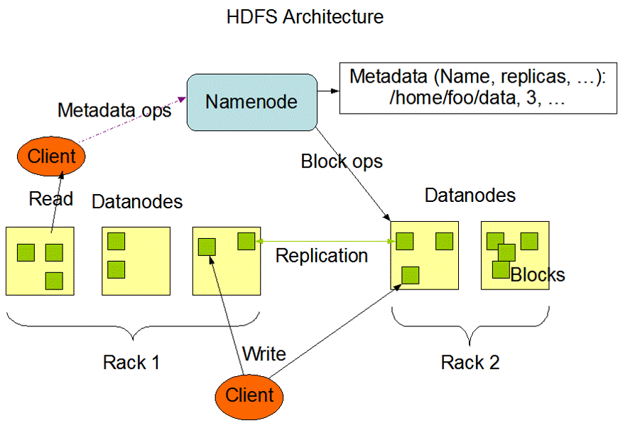
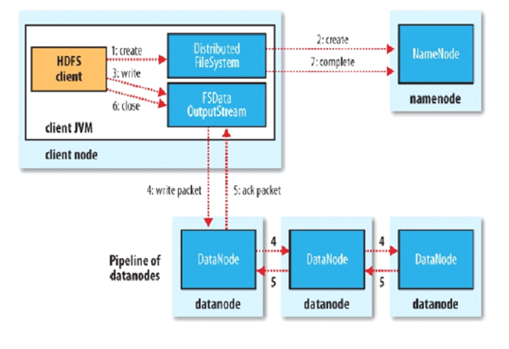
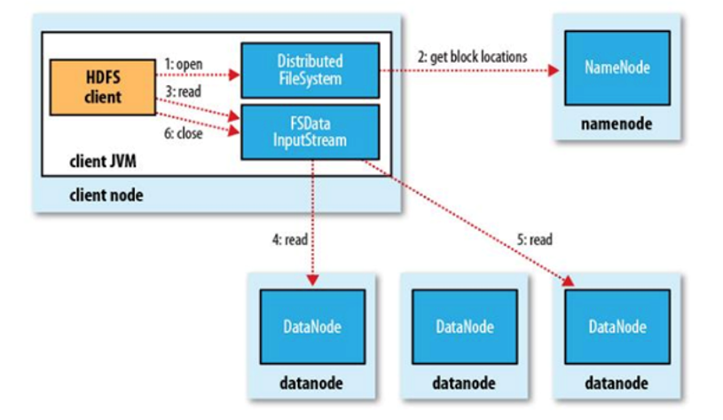
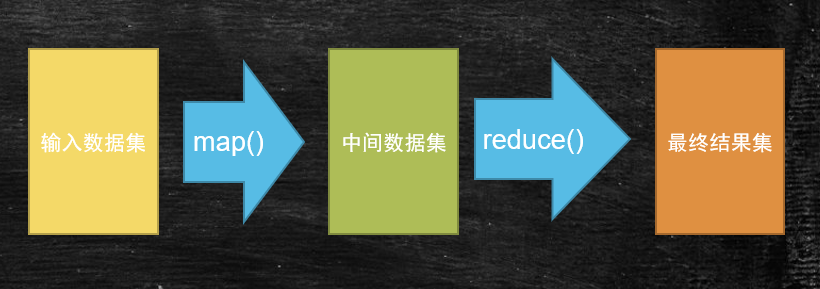
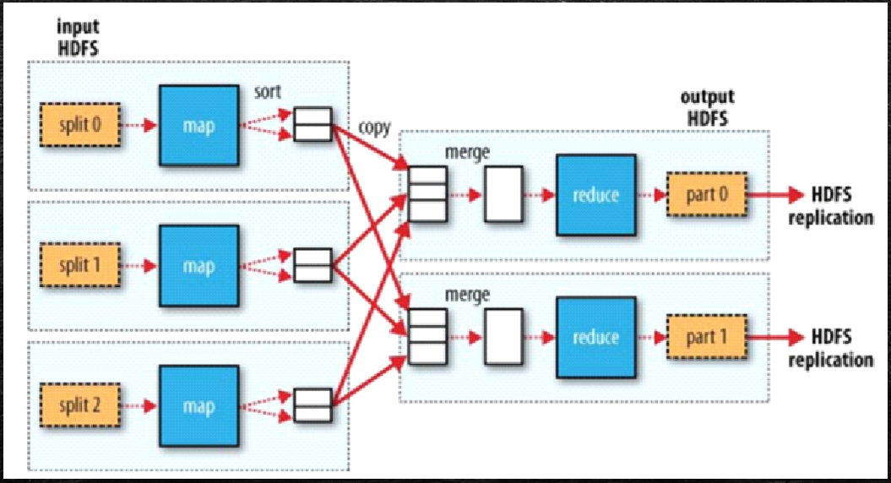

# 大数据启蒙

## 分治思想1：查找

### 需求

```
我有一万个元素（比如数字或单词）需要存储
```

### 如果查找某一个元素是否在这个集合当中，最简单的遍历方式复杂的是多少


### 如果查找某一个元素是否在这个集合当中，我期望复杂度是O(4)呢


## 分治思想的应用案例

1. Redis集群
2. ElasticSearch
3. Hbase
4. HADOOP生态无处不在！
5. ......

## 分治思想2：找重复的行

### 需求

```
有一个非常大的文本文件1T，里面有很多很多的行，只有两行一样，它们出现在未知的位置，需要查找到它们。
假设Io速度是500MB每秒
网络IO速度是100MB每秒
```

### 单机分治解决

1. 单机内存不可能放得下1T的文件，故需要对此文件进行拆解；
2. 读取文件，每读一行，求该行的 hashcode 然后%2000，可以把1T的数据分成2000份（每份大小500M），相同的行肯定在同一个文件中；
3. 依次遍历2000个文件，找到重复的行。

**用时分析：**

1. 1T文件读取一遍需要约30分钟
2. 然后再次遍历2000个小文件，假如重复的行在最后一个文件里，依然需要30分钟

### 集群解决

1. 读取文件，每读一行，求该行的 hashcode 然后%2000，可以把1T的数据分成2000份（每份大小500M），相同的行肯定在同一个文件中；
2. 把这2000个小文件分发到2000台机器上
3. 2000台机器拿到文件后一起进行计算

**用时分析：**

1. 1T文件读取一遍需要约30分钟
2. 2000个小文件（1T）分发到2000台机器上需要5个30分钟，也就是两个半小时
3. 2000台机器一起执行计算，用时1秒钟

### 分析

1. 此时集群的2000台机器还没有1台单机的处理速度快
2. 但是：如果考虑每天都有1T的数据产生呢？如果增量了一年，最后一天计算数据呢？
   1. 第一天的时候，单机需要用1个小时，集群需要用3个小时零1秒
   2. 第二天的时候，单机需要用2个小时，集群需要用3个小时零2秒（第一天的1T已经分发出去了，只需要分发当天增量的1T数据即可）
   3. 第三天的时候，单机需要3个小时，集群需要用3个小时零3秒（只需要分发当前增量的1T数据），近似已经追平了
   4. 第四天的时候，单机需要4个小时，集群需要用3个小时零4秒（只需要分发当前增量的1T数据），已经完胜了
   5. ......
   6. 第365天的时候，单机需要365个小时（近半个月），集群需要用3个小时零365秒，完胜。

## 结论

1. 分而治之
2. 并行计算
3. 计算向数据移动（计算找数据）
4. 数据本地化读取

# Hadoop

## HDFS

>  **分布式文件系统那么多，为什么hadoop项目还要开发一个hdfs文件系统？**
>
>  1. **分布式存储为了更好的分布式计算**
>  2. **一个文件被分成多个相同大小的 block 块，便于同时读取不同的 block 块（计算向数据移动），增加并行度**
>  3. **数据的可靠性有保障**
>  4. **Hdfs支持client给出文件的offset自定义连接哪些block的DN，自定义获取数据**
>  5. **支持新增，追加，删除，查询，唯独不支持更新**

### 存储模型

1. 文件线性按字节切割成块(block)，具有offset，id
2. 文件与文件的block大小可以不一样
3. 一个文件除最后一个block，其他block大小一致
4. block的大小依据硬件的I/O特性调整
5. block被分散存放在集群的节点中，具有location（位置定位信息）
6. Block具有副本(replication)，没有主从概念，副本不能出现在同一个节点
7. 副本是满足可靠性和性能的关键
8. 文件上传可以指定block大小和副本数，上传后只能修改副本数
9. 一次写入多次读取，不支持修改
10. 支持追加数据


### 架构设计

1. HDFS是一个主从(Master/Slaves)架构
2. 由一个NameNode和一些DataNode组成
3. 面向文件包含：文件数据(data)和文件元数据(metadata)
4. NameNode负责存储和管理文件元数据，并维护了一个层次型的文件目录树
5. DataNode负责存储文件数据(block块)，并提供block的读写
6. DataNode与NameNode维持心跳，并汇报自己持有的block信息
7. Client和NameNode交互文件元数据和DataNode交互文件block数据



### 角色功能

#### NameNode

1. 完全基于内存存储文件元数据、目录结构、文件block的映射
2. 需要持久化方案保证数据可靠性
3. 提供副本放置策略

#### DataNode

1. 基于本地磁盘存储block(文件的形式)
2. 并保存block的校验和数据保证block的可靠性
3. 与NameNode保持心跳，汇报block列表状态

### 数据持久化的几种实现方式

#### 日志

1. 日志文件记录实时发生的增删改操作
2. 完成性比较好
3. 加载恢复数据慢，占用很大空间

#### 镜像

1. 间隔（一段时间），内存全量数据基于某一时刻做的向磁盘的溢写
2. 如果时间间隔很短的情况下，IO就会很频繁，如果内存数据量大的话，也会很慢
3. 因为是间隔的，容易丢失一部分数据

### 元数据持久化

> 数据持久化方式：日志（EditLog） + 镜像（FsImage）

1. 任何对文件系统元数据产生修改的操作，Namenode都会使用一种称为EditLog的事务日志记录下来
2. 使用FsImage存储内存所有的元数据状态
3. 使用本地磁盘保存EditLog和FsImage
4. EditLog具有完整性，数据丢失少，但恢复速度慢，并有体积膨胀风险
5. FsImage具有恢复速度快，体积与内存数据相当，但不能实时保存，数据丢失多
6. **NameNode使用了FsImage+EditLog整合的方案：**
   - 滚动将增量的EditLog更新到FsImage，以保证更近时点的FsImage和更小的EditLog体积
7. **在持久化EditLog的时候，文件的属性信息会进行持久化，块的元数据不会进行持久化**。等待datanode来汇报。

> ```shell
> cd ./local/dfs/name/current
> # 观察 editlog的id是不是再fsimage的后边
> cd ./local/dfs/secondary/current
> # SNN 只需要从NN拷贝最后时点的FSimage和增量的Editlog
> cd ./local/dfs/data/current/BP-281147636-192.168.150.11-1560691854170/current/finalized/subdir0/subdir0
> # 检查data.txt被切割的块，他们数据什么样子
> ```

### 安全模式

1. HDFS搭建时会格式化，格式化操作会产生一个空的FsImage
2. 当Namenode启动时，它从硬盘中读取Editlog和FsImage
3. 将所有Editlog中的事务作用在内存中的FsImage上
4. 并将这个新版本的FsImage从内存中保存到本地磁盘上
5. 然后删除旧的Editlog，因为这个旧的Editlog的事务都已经作用在FsImage上了，所以此时的FsImage已经是最新的全量数据了
6. **Namenode启动后会进入一个称为安全模式的特殊状态。**
7. 处于安全模式的Namenode是不会进行数据块的复制的。
8. Namenode从所有的 Datanode接收心跳信号和块状态报告。
9. 每当Namenode检测确认某个数据块的副本数目达到这个最小值，那么该数据块就会被认为是副本安全(safely replicated)的。
10. **在一定百分比（这个参数可配置）的数据块被Namenode检测确认是安全之后**（如果有些datanode一直起不起来，加上一个额外的30秒等待时间），Namenode将退出安全模式状态。
11. **接下来它会确定还有哪些数据块的副本没有达到指定数目，并将这些数据块复制到其他Datanode上。**

### HDFS中的SNN

> SecondaryNameNode（SNN）

1. 在非Ha模式下，SNN一般是独立的节点，周期完成对NN的EditLog向FsImage合并，减少EditLog大小，减少NN启动时间
2. 根据配置文件设置的时间间隔fs.checkpoint.period  默认3600秒
3. 根据配置文件设置edits log大小 fs.checkpoint.size 规定edits文件的最大值默认是64MB


### Block的副本放置策略

> 1.x的时候，第二个副本和第一个副本在同一个机架，第三个副本才会出机架
>
> 2.x的时候，第二个副本就已经出机架了，第三个副本和第二个副本同一个机架，（第三个副本和第二个副本在同一机架，可以减少网络IO）

1. 第一个副本：放置在上传文件的DN；如果是集群外提交，则随机挑选一台磁盘不太满，CPU不太忙的节点。
2. 第二个副本：放置在于第一个副本不同的 机架的节点上。
3. 第三个副本：与第二个副本相同机架的节点。
4. 更多副本：随机节点。

### HDFS写流程



1. Client和NN连接创建文件元数据
2. NN判定元数据是否有效（是否已经存在，是否有权限）
3. NN触发副本放置策略，返回一个有序的DN列表
4. Client和DN建立Pipeline连接（小字节传输，支持最大力度的并行，类似流水线）
5. Client将块切分成packet（64KB），并使用chunk数据的字节（512B）+chucksum校验盒（4B）填充
6. Client将packet放入发送队列dataqueue中，并向第一个DN发送
7. 第一个DN收到packet后本地保存并发送给第二个DN
8. 第二个DN收到packet后本地保存并发送给第三个DN
9. 这一个过程中，上游节点同时发送下一个packet
10. **生活中类比工厂的流水线：结论：流式其实也是变种的并行计算**
11. Hdfs使用这种传输方式，副本数对于client是透明的
12. 当block传输完成，DN们各自向NN汇报，同时client继续传输下一个block
13. 所以，client的传输和block的汇报也是并行的

> 如果中间有datanode挂掉了，则直接跳过该datanode往后传输，等传输完成之后，datanode会给namenode汇报block信息，如果和副本数量不一致，则namenode会触发副本放置策略。

### HDFS读流程



1. 为了降低整体的带宽消耗和读取延时，HDFS会尽量让读取程序读取离它最近的副本。
2. 如果在读取程序的同一个机架上有一个副本，那么就读取该副本。
3. 如果一个HDFS集群跨越多个数据中心，那么客户端也将首先读本地数据中心的副本。
4. 语义：下载一个文件：
   1. Client和NN交互文件元数据获取fileBlockLocation
   2. NN会按距离策略排序返回
   3. Client尝试下载block并校验数据完整性
5. 语义：下载一个文件其实是获取文件的所有的block元数据，那么子集获取某些block应该成立
   1. Hdfs支持client给出文件的offset自定义连接哪些block的DN，自定义获取数据
   2. 这个是支持计算层的分治、并行计算的核心

### API

#### 环境权限

```
1）参考系统登录用户名；登陆用户名改为root
2）参考环境变量；HADOOP_USER_NAME=root
3）代码中给出；System.setProperty("HADOOP_USER_NAME", "root");
```

#### 初始化依赖环境

```java
private FileSystem fs = null;
public Configuration conf = new Configuration(true);

@Before
public void before() throws Exception {
    URI url = new URI("hdfs://mycluster");
    fs = FileSystem.get(url, conf, "root");
}
```

#### 创建hdfs目录

```java
@Test
public void mkdir() throws Exception {
    Path path = new Path("/user/root");
    if (fs.exists(path)) {
        fs.delete(path, true);
    }
    fs.mkdirs(path);
}
```

#### 上传文件

```java
@Test
public void upload() throws Exception {
    Path remoteFilePath = new Path("hdfs路径");
    if (fs.exists(remoteFilePath)) {
        fs.delete(remoteFilePath, true);
    }
    FileInputStream fileInputStream = null;
    BufferedInputStream bufferedInputStream = null;
    try {
        fileInputStream = new FileInputStream(new File("本地文件地址"));
        bufferedInputStream = new BufferedInputStream(fileInputStream);
        FSDataOutputStream outputStream = fs.create(remoteFilePath);

        IOUtils.copyBytes(bufferedInputStream, outputStream, conf, true);
    } catch (Exception e) {
        e.printStackTrace();
    } finally {
        if (bufferedInputStream != null) {
            bufferedInputStream.close();
        }
        if (fileInputStream != null) {
            fileInputStream.close();
        }
    }
}
```

#### 获取文件块信息

```java
@Test
public void getFileBlock() throws Exception {
    Path remoteFilePath = new Path("hdfs文件路径");
    FileStatus fileStatus = fs.getFileStatus(remoteFilePath);
    BlockLocation[] blockLocations = fs.getFileBlockLocations(fileStatus, 0, fileStatus.getLen());
    for (BlockLocation blockLocation : blockLocations) {
        System.out.println(blockLocation);
    }
}
```

## MapReduce

### Map映射


> 以上三种操作，在进行计算时，是以一条记录为单位，不会关心其他记录的，这种转换的过程就叫做映射 Map
>
> 1. 过滤
> 2. 转换
> 3. 一变多

### Reduce分组计算


> 以一组为单位的计算时，叫做分组，分组必须要有一个key值，也就是kv的实现。

### MapReduce

1. Map
   - 映射、变换、过滤
   - 1进N出
2. Reduce
   - 分解、缩小、归纳
   - 一组进N出
3. (KEY,VAL)
   - 键值对的键划分数据分组



### MapReduce详细的计算过程



> 数据以一条记录为单位经过Map方法映射成KV，相同的key为一组，这一组数据调用一次Reduce方法，在方法内迭代计算这一组的数据。

1. 一个 split（切片）对应一个Map任务

2. 一个文件在HDFS中会根据blockSize切成N多个块

3. 默认情况下，一个 split（切片）对应一个block块

   **加入 split（切片）的概念是为了和block块解耦，可以支持动态调整切片大小**

4. 所有的Map执行完成之后，才能进行Reduce环节执行（线性依赖关系）

5. 有几个Reduce，就可以按照key的hash模上几，拉取到不同的Reduce进程里（Reduce中组是不能再分的）

6. Map的并行度有split（切片）来决定，Reduce的并行度（默认一个）有人来决定

7. 一个Reduce执行的任务交一个分区

**比例关系：**

1. block > split
   - 1:1（默认）
   - N:1
   - 1:N（CPU密集型）
2. split > map
   - 1:1
3. map > reduce
   - N:1（默认）
   - N:N（人为指定多个Reduce，同一个组不能被打散到不同的 partition（分区，task任务，一个Reduce任务）里）
   - 1:1
   - 1:N（人为指定map为1个，多个reduce处理不同的组）
4. group(key) > partition
   - 1:1（一个组去到一个partition）
   - N:1（一个partition（task任务，Reduce任务）处理所有的组）
   - N:N

### MapReduce详细拆解过程

> <font color="red">**迭代器模式是批量计算中非常优美的实现形！！！**</font>


1. 切片会格式化出记录，以记录为单位调用map方法
2. map的输出映射成KV，kv会参与分区计算，拿着key算出P，分区号，K,V,P
3. 内存缓冲区溢写磁盘时：<font color="red">**做一个2次排序：分区有序，且分区内key有序**</font>；未来相同的一组key会相邻的排在一起
   - 如果此时不做排序，当执行Reduce时，每一个Reduce都要全量遍历该文件，增大磁盘IO
   - 当内存缓存区溢写磁盘时，进行一次排序（内存比磁盘快了10万倍，在内存中排序不影响性能，缓冲区有大小限制，不会特别大）
4. reduce的归并排序其实可以和reduce方法的计算同时发生，尽量减少IO。因为有迭代器模式的支持！！！


## Yarn