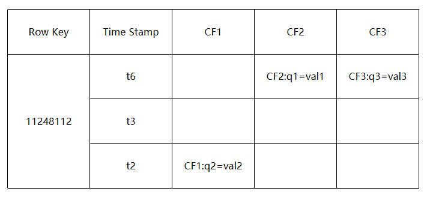

# HBase学习笔记

## HBase简介

> ​	Use Apache HBase™ when you need random, realtime read/write access to your Big Data. This project's goal is the hosting of very large tables -- billions of rows X millions of columns -- atop clusters of commodity hardware. Apache HBase is an open-source, distributed, versioned, non-relational database modeled after Google's Bigtable: A Distributed Storage System for Structured Data by Chang et al. Just as Bigtable leverages the distributed data storage provided by the Google File System, Apache HBase provides Bigtable-like capabilities on top of Hadoop and HDFS.

​		HBase的全称是Hadoop Database,是一个高可靠性，高性能、面向列、可伸缩、实时读写的分布式数据库。利用Hadoop HDFS作为其文件存储系统，利用Hadoop MapReduce来处理HBase中的海量数据，利用Zookeeper作为其分布式协同服务。主要用来存储非结构化和半结构化数据的松散数据（列存NoSQL数据库）。

## HBase数据模型

### rowkey

1. 决定一行数据，每行记录的唯一标识
2. 按照字典序排序
3. RowKey只能存储64K的字节数据

### Column Family & Qualifier

1. HBase表中的每个列都归属于某个列族，列族必须作为表模式(schema)定义的一部分预先给出。如 create ‘test’, ‘course’；
2. 列名以列族作为前缀，每个“列族”都可以有多个列成员(column)；如course:math, course:english, 新的列族成员（列）可以随后按需、动态加入；
3. 权限控制、存储以及调优都是在列族层面进行的；
4. HBase把同一列族里面的数据存储在同一目录下，由几个文件保存。

### TimeStamp时间戳

1. 在HBase每个cell存储单元对同一份数据有多个版本，根据唯一的时间戳来区分每个版本之间的差异，不同版本的数据按照时间倒序排序，最新的数据版本排在最前面。
2. 时间戳的类型是 64位整型。
3. 时间戳可以由HBase(在数据写入时自动)赋值，此时间戳是精确到毫秒的当前系统时间。
4. 时间戳也可以由客户显式赋值，如果应用程序要避免数据版本冲突，就必须自己生成具有唯一性的时间戳。

### Cell

1. 由行和列的坐标交叉决定；
2. 单元格是有版本的；
3. 单元格的内容是未解析的字节数组；

> 由{row key， column( =<family> +<qualifier>)， version} 唯一确定的单元。
>
> cell中的数据是没有类型的，全部是字节数组形式存贮。

## HBase架构

### 角色介绍

#### Client

1. 包含访问HBase的接口并维护cache（元数据存储地址）来加快对HBase的访问。

#### Zookeeper

1. 保证任何时候，集群中只有一个活跃master
2. 存储所有region的寻址入口
3. 实时监控region server的上线和下线信息，并实时通知master
4. 存储HBase的schema和table元数据

#### Master

1. 为region server分配region
2. 负责region server的负载均衡
3. 发现失效的region server并重新分配其上的region
4. 管理用户对table的增删改操作

#### RegionServer

1. region server维护region，处理对这些region的IO请求
2. region server负责切分在运行过程中变得过大的region
3. 维护Hlog的flush磁盘

### regionserver组件介绍

#### region

1. HBase自动把表水平划分成多个区域(region)，每个region会保存一个表里某段连续的数据
2. 每个表一开始只有一个region，随着数据不断插入表，region不断增大，当增大到一个阈值的时候，region就会等分会两个新的region（裂变）
3. 当table中的行不断增多，就会有越来越多的region。这样一张完整的表被保存在多个Regionserver 上。

#### Memstore与storefile

1. 一个region由多个store组成，一个store对应一个CF（列族）
2. store包括位于内存中的memstore和位于磁盘的storefile写操作先写入memstore，当memstore中的数据达到某个阈值，hregionserver会启动flashcache进程写入storefile，每次写入形成单独的一个storefile
3. 当storefile文件的数量增长到一定阈值后，系统会进行合并（minor、major ），在合并过程中会进行版本合并和删除工作（majar），形成更大的storefile
4. 当一个region所有storefile的大小和数量超过一定阈值后，会把当前的region分割为两个，并由hmaster分配到相应的regionserver服务器，实现负载均衡
5. 客户端检索数据，先在memstore找，找不到去blockcache，找不到再找storefile

### 注意问题

1. HRegion是HBase中分布式存储和负载均衡的最小单元。最小单元就表示不同的HRegion可以分布在不同的 HRegion server上。
2. HRegion由一个或者多个Store组成，每个store保存一个columns family。
3. 每个Strore又由一个memStore和0至多个StoreFile组成。如图：StoreFile以HFile格式保存在HDFS上。

## HBase读写流程

### 读流程

1. 客户端从zookeeper中获取meta表所在的regionserver节点信息（元数据存储地址）

   **`hbase:meta` 表是存储在 ZooKeeper 中的，故不会存储大量的元数据信息**

2. 客户端访问meta表所在的regionserver节点，获取到region所在的regionserver信息

   **根据`hbase:meta`获取详细的元数据信息**

3. 客户端访问具体的region所在的regionserver，找到对应的region及store

   **拿到具体的元数据信息，下一步开始读数据了**

4. 首先从memstore中读取数据，如果读取到了那么直接将数据返回，如果没有，则去blockcache读取数据

5. 如果blockcache中读取到数据，则直接返回数据给客户端，如果读取不到，则遍历storefile文件，查找数据

6. 如果从storefile中读取不到数据，则返回客户端为空，如果读取到数据，那么需要将数据先缓存到blockcache中（方便下一次读取），然后再将数据返回给客户端。

7. blockcache是内存空间，如果缓存的数据比较多，满了之后会采用LRU策略，将比较老的数据进行删除。

### 写流程

1. 客户端从zookeeper中获取meta表所在的regionserver节点信息（元数据存储地址）

   **`hbase:meta` 表是存储在 ZooKeeper 中的，故不会存储大量的元数据信息**

2. 客户端访问meta表所在的regionserver节点，获取到region所在的regionserver信息

   **需要根据`hbase:meta`获取详细的元数据信息**

3. 客户端访问具体的region所在的regionserver，找到对应的region及store

   **拿到具体的元数据信息，下一步开始写入**

4. 开始写数据，写数据的时候会先向hlog中写一份数据（方便memstore中数据丢失后能够根据hlog恢复数据，向hlog中写数据的时候也是优先写入内存，后台会有一个线程定期（每隔1秒）异步刷写数据到hdfs，如果hlog的数据也写入失败，那么数据就会发生丢失）

5. hlog写数据完成之后，会先将数据写入到memstore，memstore默认大小是64M，当memstore满了之后会进行统一的溢写操作，将memstore中的数据持久化到hdfs中

6. 频繁的溢写会导致产生很多的小文件，因此会进行文件的合并，文件在合并的时候有两种方式，minor和major，minor表示小范围文件的合并，major表示将所有的storefile文件都合并成一个，具体详细的过程，后续会讲解。

