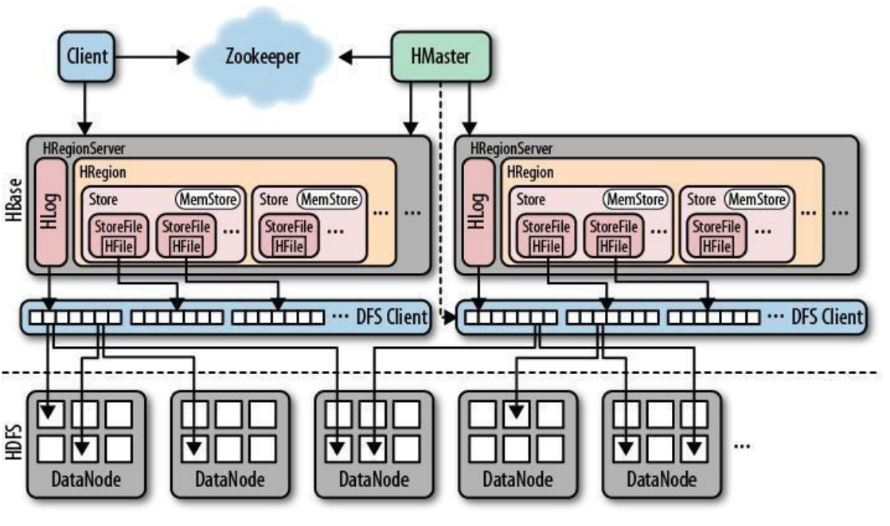

# HBase学习笔记

## HBase简介

> ​	Use Apache HBase™ when you need random, realtime read/write access to your Big Data. This project's goal is the hosting of very large tables -- billions of rows X millions of columns -- atop clusters of commodity hardware. Apache HBase is an open-source, distributed, versioned, non-relational database modeled after Google's Bigtable: A Distributed Storage System for Structured Data by Chang et al. Just as Bigtable leverages the distributed data storage provided by the Google File System, Apache HBase provides Bigtable-like capabilities on top of Hadoop and HDFS.

​		HBase的全称是Hadoop Database,是一个高可靠性，高性能、面向列、可伸缩、实时读写的分布式数据库。利用Hadoop HDFS作为其文件存储系统，利用Hadoop MapReduce来处理HBase中的海量数据，利用Zookeeper作为其分布式协同服务。主要用来存储非结构化和半结构化数据的松散数据（列存NoSQL数据库）。

## HBase数据模型


### rowkey

1. 决定一行数据，每行记录的唯一标识
2. 按照字典序排序
3. RowKey只能存储64K的字节数据

### Column Family & Qualifier

1. HBase表中的每个列都归属于某个列族，列族必须作为表模式(schema)定义的一部分预先给出。如 create ‘test’, ‘course’；
2. 列名以列族作为前缀，每个“列族”都可以有多个列成员(column)；如course:math, course:english, 新的列族成员（列）可以随后按需、动态加入；
3. 权限控制、存储以及调优都是在列族层面进行的；
4. HBase把同一列族里面的数据存储在同一目录下，由几个文件保存。

### TimeStamp时间戳

1. 在HBase每个cell存储单元对同一份数据有多个版本，根据唯一的时间戳来区分每个版本之间的差异，不同版本的数据按照时间倒序排序，最新的数据版本排在最前面。
2. 时间戳的类型是 64位整型。
3. 时间戳可以由HBase(在数据写入时自动)赋值，此时间戳是精确到毫秒的当前系统时间。
4. 时间戳也可以由客户显式赋值，如果应用程序要避免数据版本冲突，就必须自己生成具有唯一性的时间戳。

### Cell

1. 由行和列的坐标交叉决定；
2. 单元格是有版本的；
3. 单元格的内容是未解析的字节数组；

> 由{row key， column( =<family> +<qualifier>)， version} 唯一确定的单元。
>
> cell中的数据是没有类型的，全部是字节数组形式存贮。

## HBase架构



### 角色介绍

#### Client

1. 包含访问HBase的接口并维护cache（元数据存储地址）来加快对HBase的访问。

#### Zookeeper

1. 保证任何时候，集群中只有一个活跃master
2. 存储所有region的寻址入口
3. 实时监控region server的上线和下线信息，并实时通知master
4. 存储HBase的schema和table元数据

#### Master

1. 为region server分配region
2. 负责region server的负载均衡
3. 发现失效的region server并重新分配其上的region
4. 管理用户对table的增删改操作

#### RegionServer

1. region server维护region，处理对这些region的IO请求
2. region server负责切分在运行过程中变得过大的region
3. 维护Hlog的flush磁盘

### regionserver组件介绍

#### region

1. HBase自动把表水平划分成多个区域(region)，每个region会保存一个表里某段连续的数据
2. 每个表一开始只有一个region，随着数据不断插入表，region不断增大，当增大到一个阈值的时候，region就会等分会两个新的region（裂变）
3. 当table中的行不断增多，就会有越来越多的region。这样一张完整的表被保存在多个Regionserver 上。

#### Memstore与storefile

1. 一个region由多个store组成，一个store对应一个CF（列族）
2. store包括位于内存中的memstore和位于磁盘的storefile写操作先写入memstore，当memstore中的数据达到某个阈值，hregionserver会启动flashcache进程写入storefile，每次写入形成单独的一个storefile
3. 当storefile文件的数量增长到一定阈值后，系统会进行合并（minor、major ），在合并过程中会进行版本合并和删除工作（majar），形成更大的storefile
4. 当一个region所有storefile的大小和数量超过一定阈值后，会把当前的region分割为两个，并由hmaster分配到相应的regionserver服务器，实现负载均衡
5. 客户端检索数据，先在memstore找，找不到去blockcache，找不到再找storefile

### 注意问题

1. HRegion是HBase中分布式存储和负载均衡的最小单元。最小单元就表示不同的HRegion可以分布在不同的 HRegion server上。
2. HRegion由一个或者多个Store组成，每个store保存一个columns family。
3. 每个Strore又由一个memStore和0至多个StoreFile组成。如图：StoreFile以HFile格式保存在HDFS上。


## HBase读写流程

### 读流程

1. 客户端从zookeeper中获取meta表所在的regionserver节点信息（元数据存储地址）

   **`hbase:meta` 表是存储在 ZooKeeper 中的，故不会存储大量的元数据信息**

2. 客户端访问meta表所在的regionserver节点，获取到region所在的regionserver信息

   **根据`hbase:meta`获取详细的元数据信息**

3. 客户端访问具体的region所在的regionserver，找到对应的region及store

   **拿到具体的元数据信息，下一步开始读数据了**

4. 首先从memstore中读取数据，如果读取到了那么直接将数据返回，如果没有，则去blockcache读取数据

5. 如果blockcache中读取到数据，则直接返回数据给客户端，如果读取不到，则遍历storefile文件，查找数据

6. 如果从storefile中读取不到数据，则返回客户端为空，如果读取到数据，那么需要将数据先缓存到blockcache中（方便下一次读取），然后再将数据返回给客户端。

7. blockcache是内存空间，如果缓存的数据比较多，满了之后会采用LRU策略，将比较老的数据进行删除。

### 写流程

1. 客户端从zookeeper中获取meta表所在的regionserver节点信息（元数据存储地址）

   **`hbase:meta` 表是存储在 ZooKeeper 中的，故不会存储大量的元数据信息**

2. 客户端访问meta表所在的regionserver节点，获取到region所在的regionserver信息

   **需要根据`hbase:meta`获取详细的元数据信息**

3. 客户端访问具体的region所在的regionserver，找到对应的region及store

   **拿到具体的元数据信息，下一步开始写入**

4. 开始写数据，写数据的时候会先向hlog中写一份数据（方便memstore中数据丢失后能够根据hlog恢复数据，向hlog中写数据的时候也是优先写入内存，后台会有一个线程定期（每隔1秒）异步刷写数据到hdfs，如果hlog的数据也写入失败，那么数据就会发生丢失）

5. hlog写数据完成之后，会先将数据写入到memstore，memstore默认大小是64M，当memstore满了之后会进行统一的溢写操作，将memstore中的数据持久化到hdfs中

6. 频繁的溢写会导致产生很多的小文件，因此会进行文件的合并，文件在合并的时候有两种方式，minor和major，minor表示小范围文件的合并，major表示将所有的storefile文件都合并成一个，具体详细的过程，后续会讲解。

## HBase基本操作

### 通用命令

```java
//展示regionserver的task列表
processlist
//展示集群的状态
status
//table命令的帮助手册
table_help
//显示hbase的版本
version
//展示当前hbase的用户
whoami
```

### namespace操作（相当于数据库的概念）

```java
//创建命名空间
create_namespace 'my_ns'
//修改命名空间的属性
alter_namespace 'my_ns', {METHOD => 'set', 'PROPERTY_NAME' => 'PROPERTY_VALUE'}
//删除命名空间
drop_namespace 'my_ns'

//获取命名空间的描述信息
describe_namespace 'hbase'
//展示所有的命名空间
list_namespace
//展示某个命名空间下的所有表
list_namespace_tables 'hbase'
//扫描表的全部数据
scan 'hbase:meta'
```

### DDL操作

```java
//修改表的属性
alter 't1', NAME => 'f1', VERSIONS => 5
//创建表
create 'test', 'cf'
//查看表描述，只会展示列族的详细信息
describe 'test'
//禁用表
disable 'test'
//禁用所有表
disable_all
//删除表
drop 'test'
//删除所有表
drop_all
//启用表
enable 'test'
//启用所有表
enable_all
//判断表是否存在
exists 'test'
//获取表
get_table 'test'
//判断表是否被禁用
is_disabled 'test'
//判断表是否被启用
is_enabled 'test'
//展示所有表
list
//展示表占用的region
list_regions 'test'
//定位某个rowkey所在的行在哪一个region
locate_region 'test'
//展示所有的过滤器
show_filters
```

### dml操作

```java
//向表中的某一个列插入值
put 'test', 'key1', 'cf:name', 'zhangsan'
put 'test', 'key1', 'cf:age', '13'
put 'test', 'key2', 'cf:name', 'lisi'
put 'test', 'key2', 'cf:age', '12'
put 'test', 'key2', 'cf:sex', 'man'
put 'test', 'key3', 'cf:name', 'wagnwu'
put 'test', 'key3', 'cf:age', '10'
//扫描表的全部数据
scan 'test'
//统计表的记录条数，默认一千条输出一次
count 'test'
//获取表的一行记录
get 'test', 'key1'
//删除表的某一个值
delete 'test', 'key2', 'cf:sex'
//向表中追加一个具体的值
append 'test', 'key1', 'cf:name', '111'
//删除指定行的所有元素值
deleteall 'test', 'key3'
//清空表的所有数据
truncate 'test'
//获取表的切片
get_splits 'test'
// 手动落磁盘命令
flush 'test'

// 查看hbase文件内容命令
hbase hfile -p -f /hbase/data/default/test/cdf8d76af8eaef52133fb6c95d28fe60/cf/ba154563be134c52a75586f204b3dc68
```

## HBase Java API

### 初始化系统环境

```java
Configuration conf = null;
Connection conn = null;
//表的管理对象
Admin admin = null;
Table table = null;
//创建表的对象
TableName tableName = TableName.valueOf("phone");
@Before
public void init() throws IOException {
    //创建配置文件对象
    conf = HBaseConfiguration.create();
    //加载zookeeper的配置
    conf.set("hbase.zookeeper.quorum","bigdata01,bigdata02,bigdata03,bigdata04");
    //获取连接
    conn = ConnectionFactory.createConnection(conf);
    //获取对象
    admin = conn.getAdmin();
    //获取数据操作对象
    table = conn.getTable(tableName);
}
```

### 创建表

```java
@Test
public void createTable() throws IOException {
    //定义表描述对象
    TableDescriptorBuilder tableDescriptorBuilder = TableDescriptorBuilder.newBuilder(tableName);
    //定义列族描述对象
    ColumnFamilyDescriptorBuilder columnFamilyDescriptorBuilder = ColumnFamilyDescriptorBuilder.newBuilder("cf".getBytes());
    //添加列族信息给表
    tableDescriptorBuilder.setColumnFamily(columnFamilyDescriptorBuilder.build());
    if(admin.tableExists(tableName)){
        //禁用表
        admin.disableTable(tableName);
        admin.deleteTable(tableName);
    }
    //创建表
    admin.createTable(tableDescriptorBuilder.build());
}
```

### 插入数据

```java
@Test
public void insert() throws IOException {
    Put put = new Put(Bytes.toBytes("2222"));
    put.addColumn(Bytes.toBytes("cf"),Bytes.toBytes("name"),Bytes.toBytes("lisi"));
    put.addColumn(Bytes.toBytes("cf"),Bytes.toBytes("age"),Bytes.toBytes("341"));
    put.addColumn(Bytes.toBytes("cf"),Bytes.toBytes("sex"),Bytes.toBytes("women"));
    table.put(put);
}
```

### 通过get获取数据

```java
/**
 * 通过get获取数据
 * @throws IOException
 */
@Test
public void get() throws IOException {
	Get get = new Get(Bytes.toBytes("1111"));
	//在服务端做数据过滤，挑选出符合需求的列
	get.addColumn(Bytes.toBytes("cf"),Bytes.toBytes("name"));
	get.addColumn(Bytes.toBytes("cf"),Bytes.toBytes("age"));
	get.addColumn(Bytes.toBytes("cf"),Bytes.toBytes("sex"));
	Result result = table.get(get);
	Cell cell1 = result.getColumnLatestCell(Bytes.toBytes("cf"),Bytes.toBytes("name"));
	Cell cell2 = result.getColumnLatestCell(Bytes.toBytes("cf"),Bytes.toBytes("age"));
	Cell cell3 = result.getColumnLatestCell(Bytes.toBytes("cf"),Bytes.toBytes("sex"));
	String name = Bytes.toString(CellUtil.cloneValue(cell1));
	String age = Bytes.toString(CellUtil.cloneValue(cell2));
	String sex = Bytes.toString(CellUtil.cloneValue(cell3));
	System.out.println(name);
	System.out.println(age);
	System.out.println(sex);
}
```

### 获取表中所有的记录

```java
/**
 * 获取表中所有的记录
 */
@Test
public void scan() throws IOException {
	Scan scan = new Scan();
//        scan.withStartRow();
//        scan.withStopRow();
	ResultScanner rss = table.getScanner(scan);
	for (Result rs: rss) {
		Cell cell1 = rs.getColumnLatestCell(Bytes.toBytes("cf"),Bytes.toBytes("name"));
		Cell cell2 = rs.getColumnLatestCell(Bytes.toBytes("cf"),Bytes.toBytes("age"));
		Cell cell3 = rs.getColumnLatestCell(Bytes.toBytes("cf"),Bytes.toBytes("sex"));
		String name = Bytes.toString(CellUtil.cloneValue(cell1));
		String age = Bytes.toString(CellUtil.cloneValue(cell2));
		String sex = Bytes.toString(CellUtil.cloneValue(cell3));
		System.out.println(name);
		System.out.println(age);
		System.out.println(sex);
	}
}
```

### 假设有10个用户，每个用户一年产生10000条记录

```java
SimpleDateFormat sdf = new SimpleDateFormat("yyyyMMddHHmmss");
Random random = new Random();
private String getDate(String s) {
	return s+String.format("%02d%02d%02d%02d%02d",random.nextInt(12)+1,random.nextInt(31),random.nextInt(24),random.nextInt(60),random.nextInt(60));
}
public String getNumber(String str){
	return str+String.format("%08d",random.nextInt(99999999));
}
/**
 * 假设有10个用户，每个用户一年产生10000条记录
 */
@Test
public void insertMangData() throws Exception {
	for(int i = 0;i<10;i++){
		List<Put> puts = new ArrayList<>();
		String phoneNumber = getNumber("158");
		for(int j = 0 ;j<10000;j++){
			String dnum = getNumber("177");
			String length = String.valueOf(random.nextInt(100));
			String date = getDate("2019");
			String type = String.valueOf(random.nextInt(2));
			//rowkey
			String rowkey = phoneNumber+"_"+(Long.MAX_VALUE-sdf.parse(date).getTime());
			Put put = new Put(Bytes.toBytes(rowkey));
			put.addColumn(Bytes.toBytes("cf"),Bytes.toBytes("dnum"),Bytes.toBytes(dnum));
			put.addColumn(Bytes.toBytes("cf"),Bytes.toBytes("length"),Bytes.toBytes(length));
			put.addColumn(Bytes.toBytes("cf"),Bytes.toBytes("date"),Bytes.toBytes(date));
			put.addColumn(Bytes.toBytes("cf"),Bytes.toBytes("type"),Bytes.toBytes(type));
			puts.add(put);
		}
		table.put(puts);
	}
}
```

### 查询某一个用户3月份的通话记录

```java
/**
 * 查询某一个用户3月份的通话记录
 */
@Test
public void scanByCondition() throws Exception {
	Scan scan = new Scan();
	String startRow = "15883348450_"+(Long.MAX_VALUE-sdf.parse("20190331000000").getTime());
	String stopRow = "15883348450_"+(Long.MAX_VALUE-sdf.parse("20190301000000").getTime());
	scan.withStartRow(Bytes.toBytes(startRow));
	scan.withStopRow(Bytes.toBytes(stopRow));
	ResultScanner rss = table.getScanner(scan);
	for (Result rs:rss) {
		System.out.print(Bytes.toString(CellUtil.cloneValue(rs.getColumnLatestCell(Bytes.toBytes("cf"),Bytes.toBytes("dnum")))));
		System.out.print("--"+Bytes.toString(CellUtil.cloneValue(rs.getColumnLatestCell(Bytes.toBytes("cf"),Bytes.toBytes("type")))));
		System.out.print("--"+Bytes.toString(CellUtil.cloneValue(rs.getColumnLatestCell(Bytes.toBytes("cf"),Bytes.toBytes("length")))));
		System.out.println("--"+Bytes.toString(CellUtil.cloneValue(rs.getColumnLatestCell(Bytes.toBytes("cf"),Bytes.toBytes("date")))));
	}
}
```

### 查询某个用户所有的主叫电话（type=1）

```java
/**
 * 查询某个用户所有的主叫电话（type=1）
 *  某个用户
 *  type=1
 *
 */
@Test
public void getType() throws IOException {
	Scan scan = new Scan();
	//创建过滤器集合
	FilterList filters = new FilterList(FilterList.Operator.MUST_PASS_ALL);
	//创建过滤器
	SingleColumnValueFilter filter1 = new SingleColumnValueFilter(Bytes.toBytes("cf"),Bytes.toBytes("type"),CompareOperator.EQUAL,Bytes.toBytes("1"));
	filters.addFilter(filter1);
	//前缀过滤器
	PrefixFilter filter2 = new PrefixFilter(Bytes.toBytes("15883348450"));
	filters.addFilter(filter2);
	scan.setFilter(filters);
	ResultScanner rss = table.getScanner(scan);
	for (Result rs:rss) {
		System.out.print(Bytes.toString(CellUtil.cloneValue(rs.getColumnLatestCell(Bytes.toBytes("cf"),Bytes.toBytes("dnum")))));
		System.out.print("--"+Bytes.toString(CellUtil.cloneValue(rs.getColumnLatestCell(Bytes.toBytes("cf"),Bytes.toBytes("type")))));
		System.out.print("--"+Bytes.toString(CellUtil.cloneValue(rs.getColumnLatestCell(Bytes.toBytes("cf"),Bytes.toBytes("length")))));
		System.out.println("--"+Bytes.toString(CellUtil.cloneValue(rs.getColumnLatestCell(Bytes.toBytes("cf"),Bytes.toBytes("date")))));
	}
}
```

### 使用ProtoBuf插入

```java
@Test
public void insertByProtoBuf() throws ParseException, IOException {
    List<Put> puts = new ArrayList<>();
    for(int i = 0;i<10;i++){
        String phoneNumber = getNumber("158");
        for(int j = 0 ;j<10000;j++){
            String dnum = getNumber("177");
            String length = String.valueOf(random.nextInt(100));
            String date = getDate("2019");
            String type = String.valueOf(random.nextInt(2));
            //rowkey
            String rowkey = phoneNumber+"_"+(Long.MAX_VALUE-sdf.parse(date).getTime());

            Phone.PhoneDetail.Builder builder = Phone.PhoneDetail.newBuilder();
            builder.setDate(date);
            builder.setDnum(dnum);
            builder.setLength(length);
            builder.setType(type);
            Put put = new Put(Bytes.toBytes(rowkey));
            put.addColumn(Bytes.toBytes("cf"),Bytes.toBytes("phone"),builder.build().toByteArray());
            puts.add(put);
        }
    }
    table.put(puts);
}
```

### 获取protoBuf存储的数据

```java
@Test
public void getByProtoBuf() throws IOException {
    Get get = new Get("15899309685_9223370490668224807".getBytes());
    Result rs = table.get(get);
    byte[] b = CellUtil.cloneValue(rs.getColumnLatestCell(Bytes.toBytes("cf"),Bytes.toBytes("phone")));
    Phone.PhoneDetail phoneDetail = Phone.PhoneDetail.parseFrom(b);
    System.out.println(phoneDetail);
}
```


