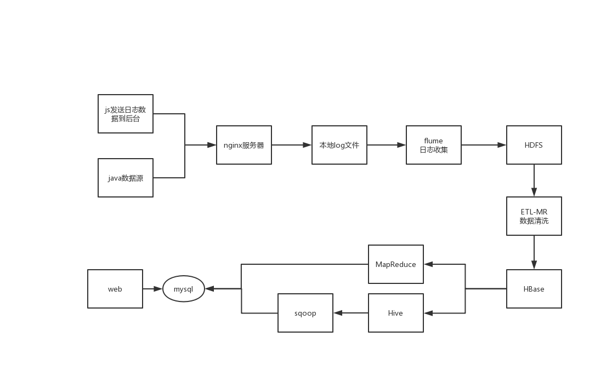

# 大数据项目-日志收集分析

## 日志收集架构流程图



## Nginx配置

### Nginx安装之前的准备

```shell
yum install gcc openssl-devel pcre-devel zlib-devel -y
```

### Nginx 安装

```shell
./configure 
make && make install

# 默认安装目录
/usr/local/nginx
```

### 配置Nginx为系统服务

```shell
cd /etc/rc.d/init.d/
vim nginx
```

```sh
#!/bin/sh
#
# nginx - this script starts and stops the nginx daemon
#
# chkconfig:   - 85 15 
# description:  Nginx is an HTTP(S) server, HTTP(S) reverse \
#               proxy and IMAP/POP3 proxy server
# processname: nginx
# config:      /etc/nginx/nginx.conf
# config:      /etc/sysconfig/nginx
# pidfile:     /var/run/nginx.pid
 
# Source function library.
. /etc/rc.d/init.d/functions
 
# Source networking configuration.
. /etc/sysconfig/network
 
# Check that networking is up.
[ "$NETWORKING" = "no" ] && exit 0
 
nginx="/usr/local/nginx/sbin/nginx"
prog=$(basename $nginx)
 
NGINX_CONF_FILE="/usr/local/nginx/conf/nginx.conf"
 
[ -f /etc/sysconfig/nginx ] && . /etc/sysconfig/nginx
 
lockfile=/var/lock/subsys/nginx
 
make_dirs() {
   # make required directories
   user=`nginx -V 2>&1 | grep "configure arguments:" | sed 's/[^*]*--user=\([^ ]*\).*/\1/g' -`
   options=`$nginx -V 2>&1 | grep 'configure arguments:'`
   for opt in $options; do
       if [ `echo $opt | grep '.*-temp-path'` ]; then
           value=`echo $opt | cut -d "=" -f 2`
           if [ ! -d "$value" ]; then
               # echo "creating" $value
               mkdir -p $value && chown -R $user $value
           fi
       fi
   done
}
 
start() {
    [ -x $nginx ] || exit 5
    [ -f $NGINX_CONF_FILE ] || exit 6
    make_dirs
    echo -n $"Starting $prog: "
    daemon $nginx -c $NGINX_CONF_FILE
    retval=$?
    echo
    [ $retval -eq 0 ] && touch $lockfile
    return $retval
}
 
stop() {
    echo -n $"Stopping $prog: "
    killproc $prog -QUIT
    retval=$?
    echo
    [ $retval -eq 0 ] && rm -f $lockfile
    return $retval
}
 
restart() {
    configtest || return $?
    stop
    sleep 1
    start
}
 
reload() {
    configtest || return $?
    echo -n $"Reloading $prog: "
    killproc $nginx -HUP
    RETVAL=$?
    echo
}
 
force_reload() {
    restart
}
 
configtest() {
  $nginx -t -c $NGINX_CONF_FILE
}
 
rh_status() {
    status $prog
}
 
rh_status_q() {
    rh_status >/dev/null 2>&1
}
 
case "$1" in
    start)
        rh_status_q && exit 0
        $1
        ;;
    stop)
        rh_status_q || exit 0
        $1
        ;;
    restart|configtest)
        $1
        ;;
    reload)
        rh_status_q || exit 7
        $1
        ;;
    force-reload)
        force_reload
        ;;
    status)
        rh_status
        ;;
    condrestart|try-restart)
        rh_status_q || exit 0
            ;;
    *)
        echo $"Usage: $0 {start|stop|status|restart|condrestart|try-restart|reload|force-reload|configtest}"
        exit 2
esac
```

```shell
# 修改nginx文件的执行权限
chmod +x nginx
```

### 添加到系统服务

```shell
# 添加该文件到系统服务中去
chkconfig --add nginx
# 查看是否添加成功
chkconfig --list nginx
```

### 启动，停止，重新装载

```shell
service nginx start|stop
```

### 配置日志输出格式

```nginx
log_format my_format '$remote_addr^A$msec^A$http_host^A$request_uri';
```

### location配置

```nginx
location = /log.gif {
    default_type image/gif;
    access_log /opt/data/access.log my_format;
}
```

## Flume日志收集

### Flume 配置

```properties
# example.conf: A single-node Flume configuration

# Name the components on this agent
a1.sources = r1
a1.sinks = k1
a1.channels = c1

# Describe/configure the source
a1.sources.r1.type = exec
a1.sources.r1.command = tail -F /opt/data/access.log

# Describe the sink
a1.sinks.k1.type = hdfs
a1.sinks.k1.hdfs.path = /project/%Y%m%d
a1.sinks.k1.hdfs.filePrefix = log-
a1.sinks.k1.hdfs.rollInterval = 0
a1.sinks.k1.hdfs.rollSize = 10240
a1.sinks.k1.hdfs.rollCount = 0
a1.sinks.k1.hdfs.idleTimeout = 30
a1.sinks.k1.hdfs.fileType = DataStream
a1.sinks.k1.hdfs.callTimeout = 60000
a1.sinks.k1.hdfs.useLocalTimeStamp = true

# Use a channel which buffers events in memory
a1.channels.c1.type = memory
a1.channels.c1.capacity = 1000
a1.channels.c1.transactionCapacity = 100

# Bind the source and sink to the channel
a1.sources.r1.channels = c1
a1.sinks.k1.channel = c1
```

### 启动Flumne

```shell
flume-ng agent --conf-file project --name a1 -Dflume.root.logger=INFO,console
```

## MR执行日志数据的清洗存储到HBase

