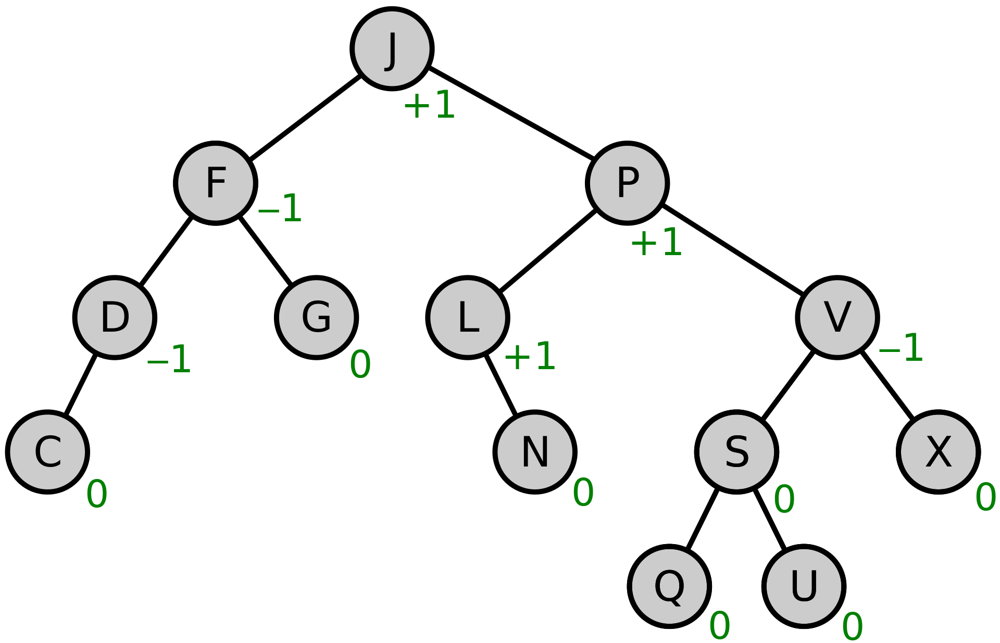
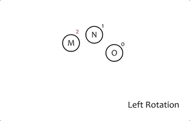

# 数据结构

## BST树（二叉搜索树）

### 特征

1. 每个节点最多有两个子节点
2. 每个节点都包含一个Compareable的键
3. 每个节点的值都大于左子树任意节点的值
4. 每个节点的值都小于右子树任意节点的值
5. 所有节点的值都各不相等
6. 二叉搜索树可以是一颗空树

### Java代码实现

```java
/**
 * @author chenpeng
 * @date 2019/5/14
 */
public class BinarySearchTree<K extends Comparable<K>> {

    /**
     * 插入节点
     *
     * @param node 二叉树
     * @return 新的二叉树
     */
    public Node<K> put(Node<K> node, K key) {
        if (node == null) {
            return new Node<K>(key);
        }

        int cmp = key.compareTo(node.key);
        if (cmp < 0) {
            node.left = put(node.left, key);
        } else if (cmp > 0) {
            node.right = put(node.right, key);
        } else {
            throw new IllegalArgumentException("repeat data can not add in bst");
        }
        node.count = size(node.left) + size(node.right) + 1;
        return node;
    }

    /**
     * 二叉树搜索
     *
     * @param node 二叉树
     * @param key  要搜索的值
     * @return 匹配节点，null表示未查询到
     */
    public Node<K> get(Node<K> node, K key) {
        if (node == null) {
            return null;
        }
        int cmp = key.compareTo(node.key);
        if (cmp < 0) {
            return get(node.left, key);
        } else if (cmp > 0) {
            return get(node.right, key);
        }
        return node;
    }

    /**
     * 获取指定节点的子节点总数
     *
     * @param node 给定节点
     * @return 节点总数
     */
    public int size(Node<K> node) {
        if (node == null) {
            return 0;
        }
        return node.count;
    }

    /**
     * 找到最小节点
     *
     * @param node 给定二叉树
     * @return 最小节点
     */
    public Node<K> min(Node<K> node) {
        if (node == null) {
            return null;
        }
        if (node.left == null) {
            return node;
        }
        return min(node.left);
    }

    /**
     * 删除指定树的最小节点
     *
     * @param node 给定节点
     * @return 删除节点后的二叉树
     */
    public Node<K> deleteMin(Node<K> node) {
        if (node == null) {
            return null;
        }
        if (node.left == null) {
            return node.right;
        }
        node.left = deleteMin(node.left);
        node.count = size(node.left) + size(node.right) + 1;
        return node;
    }

    /**
     * 删除操作(假设n是要被删除的节点)
     * 1. n.left==null，删除了 n 节点，n.right就是根节点
     * 2. n.rigt==null, 删除了 n 节点， n.left就是根节点
     * 3. n.left!=null && n.right!=null ,那么就取 n.right 的最小节点替代被删除的节点，整个树的有序性依然能够保持
     *
     * @param node 给定节点
     * @param key  要删除的key
     * @return 删除后的节点
     */
    public Node<K> delete(Node<K> node, K key) {
        if (node == null) {
            return null;
        }
        int cmp = key.compareTo(node.key);
        if (cmp < 0) {
            node.left = delete(node.left, key);
        } else if (cmp > 0) {
            node.right = delete(node.right, key);
        } else {
            if (node.left == null && node.right == null) {
                return null;
            }

            //左节点为空,直接取右节点作为新节点
            if (node.left == null) {
                return node.right;
            }

            //右节点为空,直接取左节点为新节点
            if (node.right == null) {
                return node.left;
            }

            Node<K> t = node;
            node = min(node.right);
            node.right = deleteMin(t.right);
            node.left = t.left;
        }

        node.count = size(node.left) + size(node.right) + 1;
        return node;
    }
}

class Node<K extends Comparable<?>> {
    K key;
    Node<K> left;
    Node<K> right;
    /**
     * 节点总量
     */
    int count;

    public Node(K key) {
        this.key = key;
        this.count = 1;
    }
}
```

## AVL树（平衡二叉树）

> AVL树，也称平衡二叉树，AVL是其发明者Adelson-Velsky and Landis的简写，AVL树属于树的一种，而它也是一个二叉搜索树，不同的是他通过一定机制能够保证二叉树的平衡，平衡的二叉搜索树的查询效率更高。

### 特征

1. AVL树是一种二叉搜索树，并且会在插入删除的时候通过旋转达到自平衡
2. AVL树拥有二叉搜索树的所有基本特点
3. AVL树的每个节点的左右子树的最大高度都不会超过1
4. 普通的二叉搜索树查询效率是O(h)，h表示二叉树的高度，极端情况下，可能会达到O(n),AVL树的自平衡可以保证其查询效率始终能达到O(Logn)

### AVL树的优势

​		普通的二叉搜索树的查询效率是O(h)，其中h表示二叉树的高度。但是在极端情况下，所有的节点都在树的一边，二叉树退化成了链表，此时二叉树的查询效率就变成了O(n)。AVL树则通过旋转,使得树的高度始终能保持在logn，在牺牲插入性能的条件下达到了提高查询效率的目的。

### 平衡因子

> 节点N的平衡因子可以通过下面的公式计算出来：BalanceFactory(N) = Height(N.right)-Height(N.left)（也就是左子树的高度-右子树的高度。）



绿色数字表示该节点的平衡因子，只有所有节点的平衡因子在 {-1,0,1} 内, 这棵树才是平衡的。

#### 判断树是否平衡

```java
/**
 * 节点是否平衡
 *
 * @param node 给定节点
 * @return true-平衡 false-不平衡
 */
public boolean isBalanced(Node<K> node) {
    if (node == null) {
        return true;
    }
    return Math.abs(height(node.left) - height(node.right)) <= 1 && isBalanced(node.left) && isBalanced(node.right);
}

/**
 * 计算节点高度
 *
 * @param node 给定节点
 * @return 节点高度
 */
public int height(Node<K> node) {
    if (node == null) {
        return 0;
    }
    return Math.max(height(node.left), height(node.right)) + 1;
}
```

### AVL树的旋转

1. 当插入和删除数据的时候，有可能会破坏树的平衡，这时AVL树会通过旋转的方式来维持整颗树的平衡。
2. 旋转只有两种: 左旋和右旋，像左右旋转和右左旋转都是在这个基础上做出来的。
3. 每次旋转都要重新计算节点高度，这是判断后续节点是否平衡的重要依据。

#### 左旋


```java
/**
 * 左旋转
 *
 * @param x 根节点
 * @return 旋转后的根节点
 */
public Node<K> leftRotation(Node<K> x) {
    Node<K> y = x.right;
    x.right = y.left;
    y.left = x;

    x.height = Math.max(height(x.left), height(x.right)) + 1;
    y.height = Math.max(height(y.left), height(y.right)) + 1;
    return y;
}
```

#### 右旋



```java
/**
 * 右旋转
 *
 * @param y 根节点
 * @return 旋转后的根节点
 */
public Node<K> rightRotation(Node<K> y) {
    Node<K> x = y.left;
    y.left = x.right;
    x.right = y;

    y.height = Math.max(height(y.left), height(y.right)) + 1;
    x.height = Math.max(height(x.left), height(x.right)) + 1;
    return x;
}
```


## 红黑树（特殊的平衡二叉树）

​		是一种自平衡二叉查找树，1972年由Rudolf Bayer发明，它与AVL树类似，都在插入和删除操作时能通过旋转保持二叉查找树的平衡，以便能获得高效的查找性能。它可以在O(logn)的时间内做查找，插入和删除等操作。红黑树是2-3-4树的一种等同，但有些红黑树设定只能左边是红树，这种情况就是2-3树的一种等同了。对于AVL树来说，红黑树牺牲了部分平衡性以换取插入\删除操作时少量的旋转操作，整体上来说性能要由于AVL。

### 特征

1. 每个结点是黑色或者红色
3. 根结点是黑色
4. 每个叶子结点（NIL）是黑色。 [注意：这里叶子结点，是指为空(NIL或NULL)的叶子结点！]
5. 如果一个结点是红色的，则它的子结点必须是黑色的。[从每个叶子到根的所有路径上不能有两个连续的红色节点]
6. 从任一节点到每个叶子的所有路径都包含相同数据的黑色节点。[确保没有一条路径会比其他路径长出俩倍，所以红黑树是相对接近平衡的二叉树的！]
6. 最长路径不超过最短路径的2倍

## B+树


### 特征


## LSM树


### 特征


## 二叉树的基本操作

1. 左旋：以某个结点作为支点(旋转结点)，其**右子结点**变为旋转结点的父结点，右子结点的**左**子结点变为旋转结点的**右子结点**，其左子结点保持不变。
2. 右旋：以某个结点作为支点(旋转结点)，其**左子结点**变为旋转结点的父结点，左子结点的**右**子结点变为旋转结点的**左子结点**，其右子结点保持不变。
3. 变色：结点的颜色由红变黑或由黑变红。